## herbeth1u-VNDB-Android
----
#### Metrics provided by Detekt
* Number of lines of code 6696
* Number of Kotlin files: 163
* Cyclomatic complexity: 997
* Cyclomatic complexity by thousands of lines: 274 

----
**18** features analyzed

*	<a href="#type_inference">Type Inference</a> 
*	<a href="#lambda">Lambda</a> 
*	<a href="#safe_call">Safe Call</a> 
*	<a href="#when_expr">When expression</a> 
*	<a href="#companion_object">Companion Object</a> 
*	<a href="#unsafe_call">Unsafe Call</a> 
*	<a href="#string_template">String Template</a> 
*	<a href="#func_with_default_value">Function with Default Value</a> 
*	<a href="#singleton">Singleton</a> 
*	<a href="#smart_cast">Smart Cast</a> 
*	<a href="#range_expr">Range Expression</a> 
*	<a href="#func_call_with_named_arg">Function call with Named Argument</a> 
*	<a href="#data_class">Data Class</a> 
*	<a href="#extension_function">Extension Function</a> 
*	<a href="#property_delegation">Property Delegation</a> 
*	<a href="#destructuring_declaration">Destructuring Declaration</a> 
*	<a href="#inline_func">Inline Function</a> 
*	<a href="#overloaded_op">Overloaded Operator</a> 

### <a name="type_inference">Type Inference</a>
----
#### Functions
* **Constant Rise - Linear:** 
    * **R_Squared:** 0.88335884
* **Sudden Rise Plateau - Logarithm:** 
    * **R_Squared:** 0.55442219

**Plots** :chart_with_upwards_trend:
-----

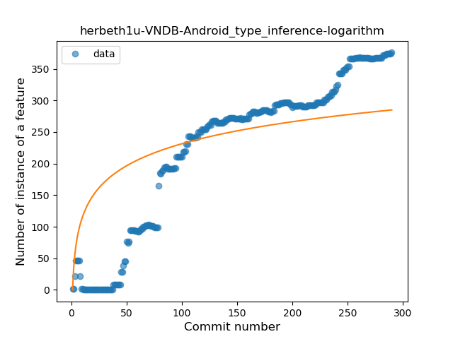
### <a name="lambda">Lambda</a>
----
#### Functions
* **Constant Rise - Linear:** 
    * **R_Squared:** 0.96978073
* **Sudden Rise Plateau - Logarithm:** 
    * **R_Squared:** 0.44613046

**Plots** :chart_with_upwards_trend:
-----

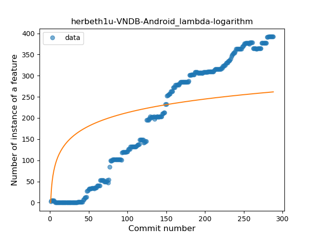
### <a name="safe_call">Safe Call</a>
----
#### Functions
* **Sudden Rise - Exponential:** 
    * **R_Squared:** 0.95091204
* **Constant Rise - Linear:** 
    * **R_Squared:** 0.91466858
* **Plateau Sudden Rise - Binary Sigmoid:** 
    * **R_Squared:** 0.61372462
* **Sudden Rise Plateau - Logarithm:** 
    * **R_Squared:** 0.43304746

**Plots** :chart_with_upwards_trend:
-----

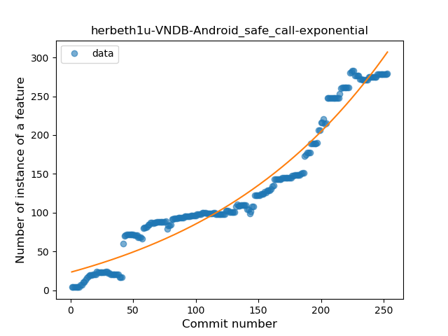
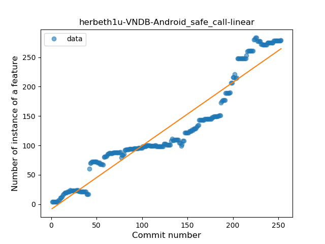
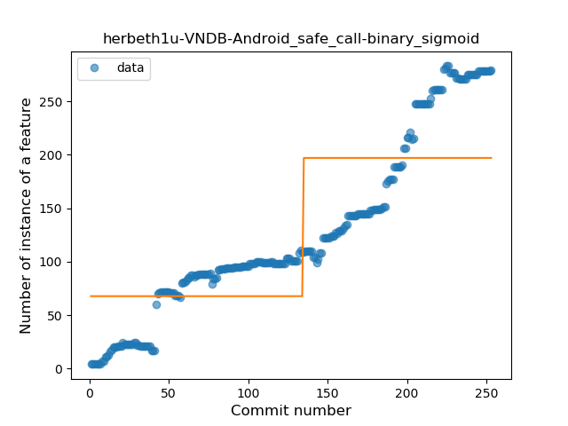

### <a name="when_expr">When expression</a>
----
#### Functions
* **Plateau Gradual Rise - Sigmoid:** 
    * **R_Squared:** 0.9411539
* **Constant Rise - Linear:** 
    * **R_Squared:** 0.84120295
* **Sudden Rise Plateau - Logarithm:** 
    * **R_Squared:** 0.54593074

**Plots** :chart_with_upwards_trend:
-----

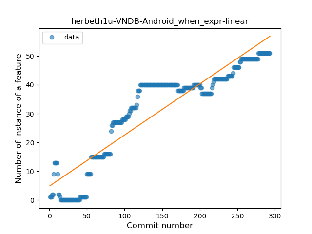
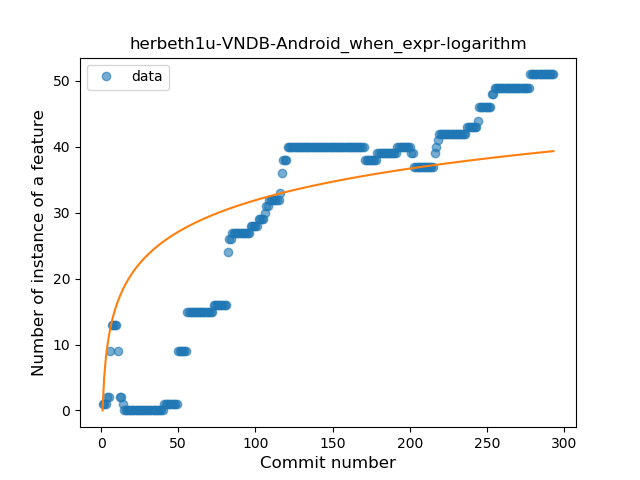
### <a name="companion_object">Companion Object</a>
----
#### Functions
* **Plateau Gradual Rise - Sigmoid:** 
    * **R_Squared:** 0.95206168
* **Constant Rise - Linear:** 
    * **R_Squared:** 0.6958261
* **Sudden Rise Plateau - Logarithm:** 
    * **R_Squared:** 0.57655843

**Plots** :chart_with_upwards_trend:
-----

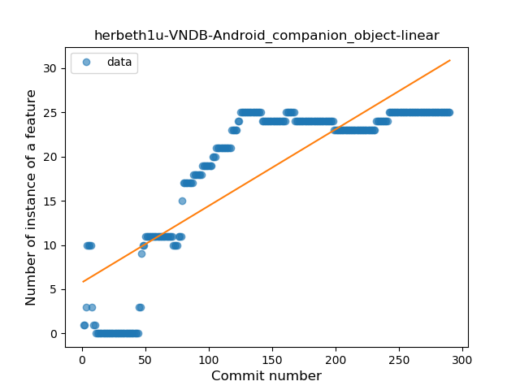
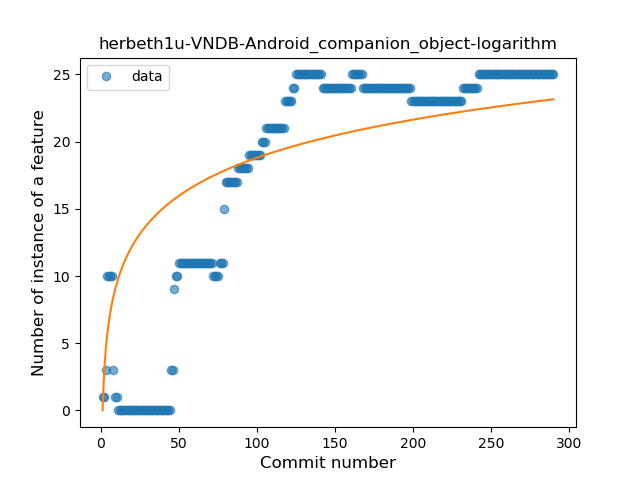
### <a name="unsafe_call">Unsafe Call</a>
----
#### Functions
* **Plateau Sudden Rise - Binary Sigmoid:** 
    * **R_Squared:** 0.27060187
* **Constant Decline - Linear:** 
    * **R_Squared:** 0.05582511
* **Sudden Rise Plateau - Logarithm:** 
    * **R_Squared:** 0.00461071

**Plots** :chart_with_upwards_trend:
-----

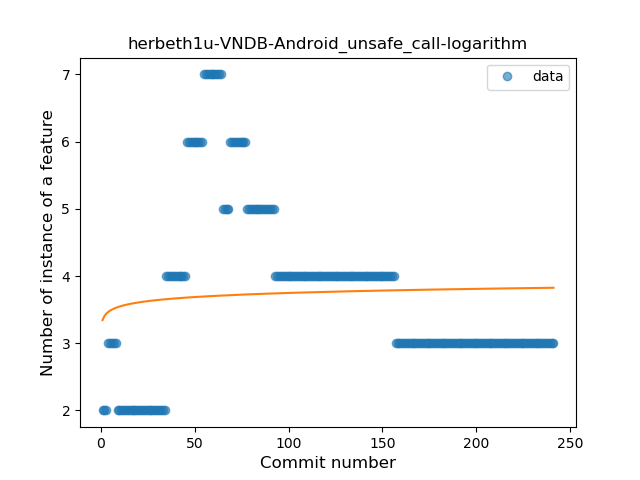
### <a name="string_template">String Template</a>
----
#### Functions
* **Sudden Rise Plateau - Logarithm:** 
    * **R_Squared:** 0.84976549
* **Constant Rise - Linear:** 
    * **R_Squared:** 0.65037022

**Plots** :chart_with_upwards_trend:
-----

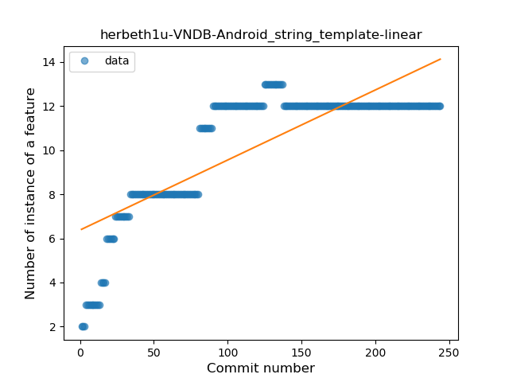
### <a name="func_with_default_value">Function with Default Value</a>
----
#### Functions
* **Constant Rise - Linear:** 
    * **R_Squared:** 0.89992982
* **Sudden Rise Plateau - Logarithm:** 
    * **R_Squared:** 0.54545283
* **Plateau Sudden Rise - Binary Sigmoid:** 
    * **R_Squared:** 0.40926687

**Plots** :chart_with_upwards_trend:
-----

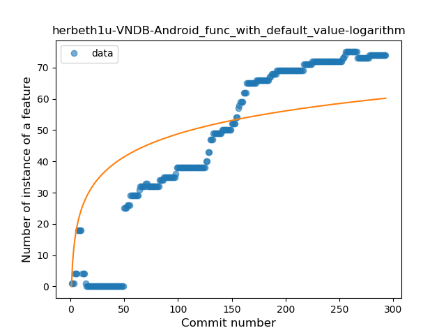
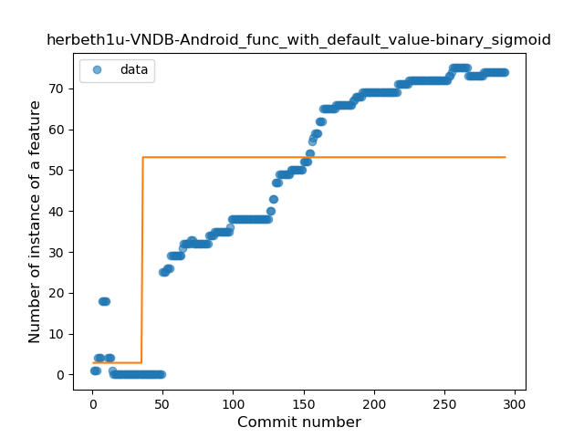
### <a name="singleton">Singleton</a>
----
#### Functions
* **Plateau Sudden Rise - Binary Sigmoid:** 
    * **R_Squared:** 0.55586598
* **Sudden Rise Plateau - Logarithm:** 
    * **R_Squared:** 0.52439247
* **Constant Rise - Linear:** 
    * **R_Squared:** 0.45742946

**Plots** :chart_with_upwards_trend:
-----

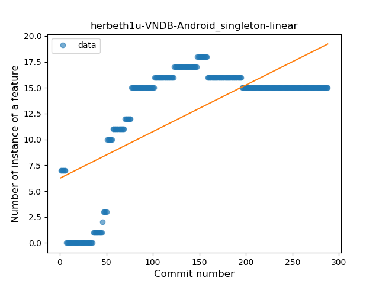
### <a name="smart_cast">Smart Cast</a>
----
#### Functions
* **Plateau Gradual Rise - Sigmoid:** 
    * **R_Squared:** 0.98626087
* **Constant Rise - Linear:** 
    * **R_Squared:** 0.70632566
* **Sudden Rise Plateau - Logarithm:** 
    * **R_Squared:** 0.35463755

**Plots** :chart_with_upwards_trend:
-----

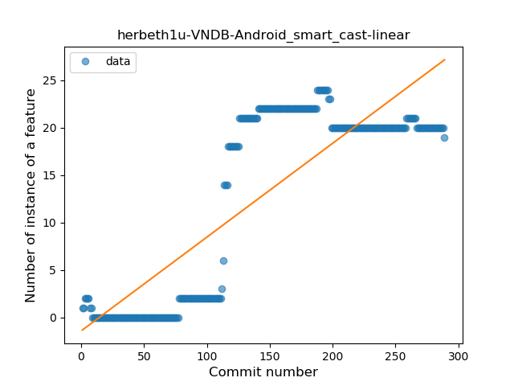
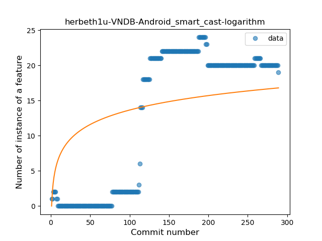
### <a name="range_expr">Range Expression</a>
----
#### Functions
* **Constant Rise - Linear:** 
    * **R_Squared:** 0.82028771
* **Sudden Rise Plateau - Logarithm:** 
    * **R_Squared:** 0.47270427
* **Plateau Sudden Rise - Binary Sigmoid:** 
    * **R_Squared:** 0.26351787

**Plots** :chart_with_upwards_trend:
-----

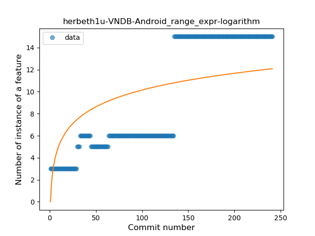
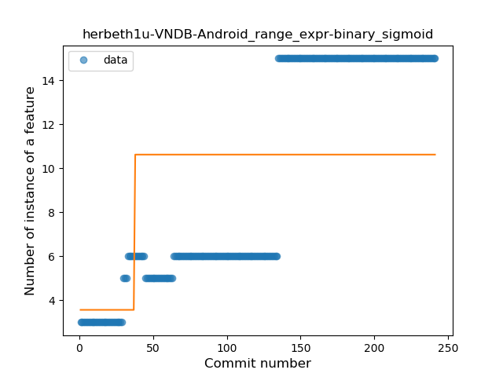
### <a name="func_call_with_named_arg">Function call with Named Argument</a>
----
#### Functions
* **Constant Rise - Linear:** 
    * **R_Squared:** 0.75326712
* **Sudden Rise - Exponential:** 
    * **R_Squared:** 0.76084728
* **Sudden Rise Plateau - Logarithm:** 
    * **R_Squared:** 0.50398389
* **Plateau Sudden Rise - Binary Sigmoid:** 
    * **R_Squared:** 0.27915064

**Plots** :chart_with_upwards_trend:
-----

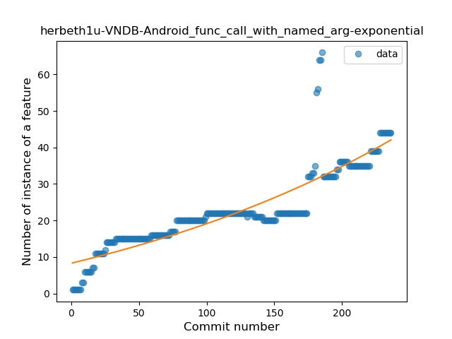
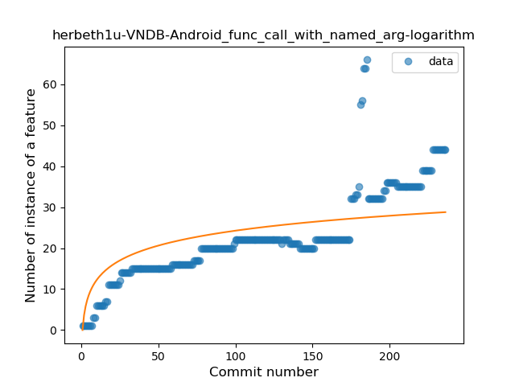
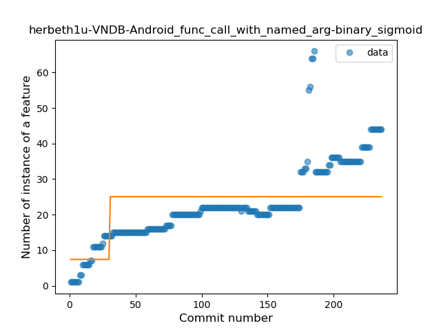
### <a name="data_class">Data Class</a>
----
#### Functions
* **Constant Rise - Linear:** 
    * **R_Squared:** 0.82690325
* **Sudden Rise Plateau - Logarithm:** 
    * **R_Squared:** 0.57877195

**Plots** :chart_with_upwards_trend:
-----

### <a name="extension_function">Extension Function</a>
----
#### Functions
* **Constant Rise - Linear:** 
    * **R_Squared:** 0.98727804
* **Sudden Rise Plateau - Logarithm:** 
    * **R_Squared:** 0.46614106
* **Plateau Sudden Rise - Binary Sigmoid:** 
    * **R_Squared:** 0.36487483

**Plots** :chart_with_upwards_trend:
-----

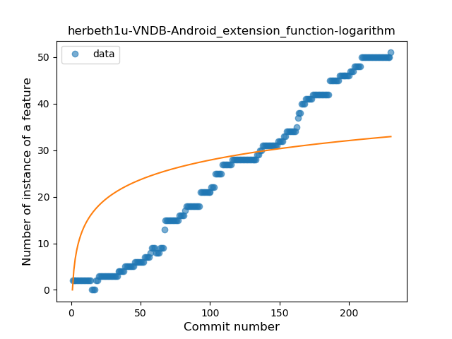
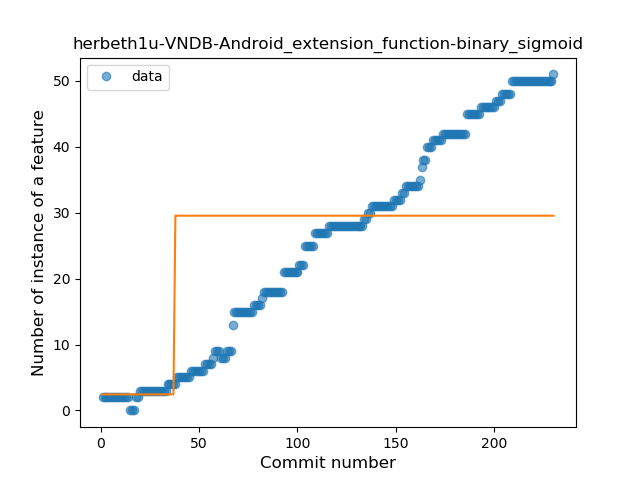
### <a name="property_delegation">Property Delegation</a>
----
#### Functions
* **Sudden Rise - Exponential:** 
    * **R_Squared:** 0.94716259
* **Constant Rise - Linear:** 
    * **R_Squared:** 0.88025396
* **Sudden Rise Plateau - Logarithm:** 
    * **R_Squared:** 0.54640451

**Plots** :chart_with_upwards_trend:
-----

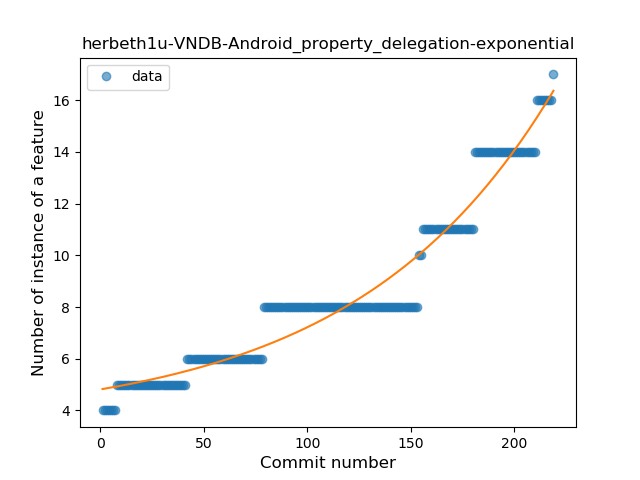
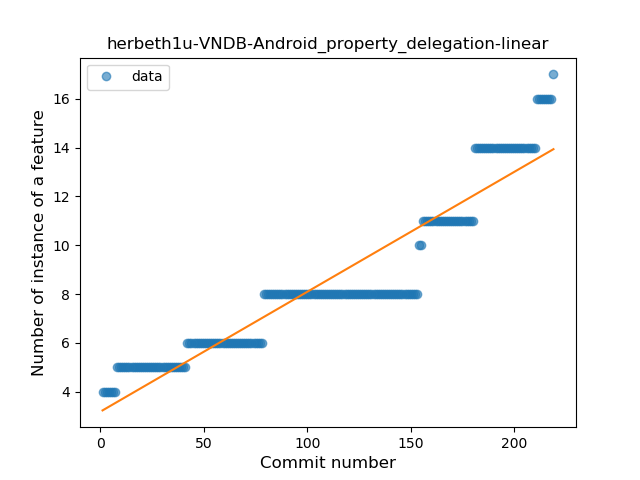
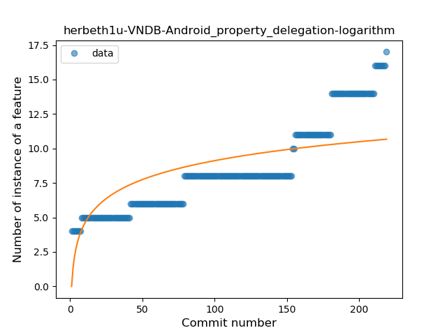
### <a name="destructuring_declaration">Destructuring Declaration</a>
----
#### Functions
* **Instability - Polinomial 3:** )
    * **R_Squared:** 0.81642582
* **Sudden Rise Plateau - Logarithm:** 
    * **R_Squared:** 0.79034212
* **Constant Rise - Linear:** 
    * **R_Squared:** 0.48365428

**Plots** :chart_with_upwards_trend:
-----

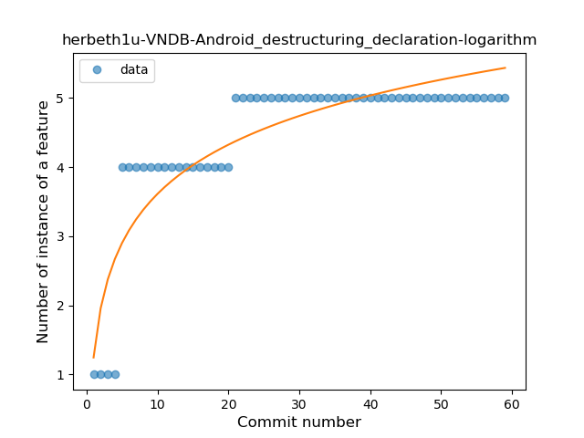
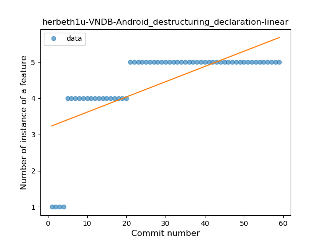
### <a name="inline_func">Inline Function</a>
----
#### Functions
* **Plateau Gradual Rise - Sigmoid:** 
    * **R_Squared:** 0.93157914
* **Constant Rise - Linear:** 
    * **R_Squared:** 0.64005776
* **Sudden Rise Plateau - Logarithm:** 
    * **R_Squared:** 0.37452613

**Plots** :chart_with_upwards_trend:
-----

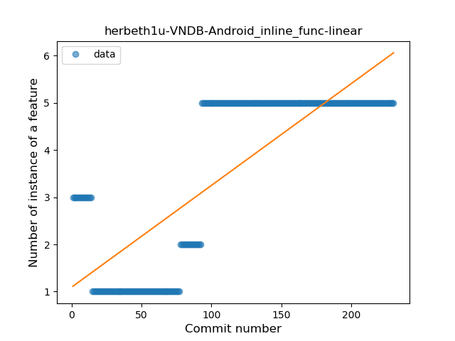
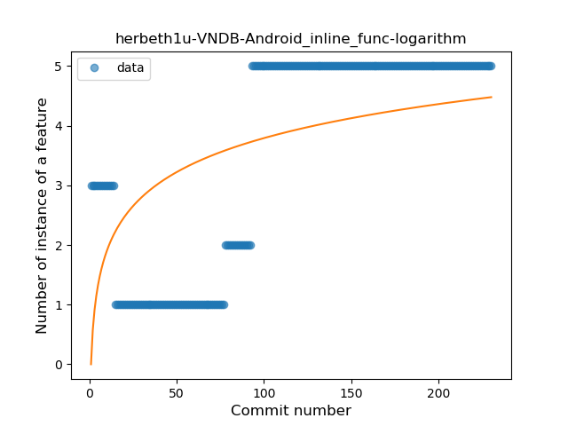
### <a name="overloaded_op">Overloaded Operator</a>
----
#### Functions
* **Sudden Rise Plateau - Logarithm:** 
    * **R_Squared:** 0.38646888
* **Constant Rise - Linear:** 
    * **R_Squared:** 0.35105918

**Plots** :chart_with_upwards_trend:
-----

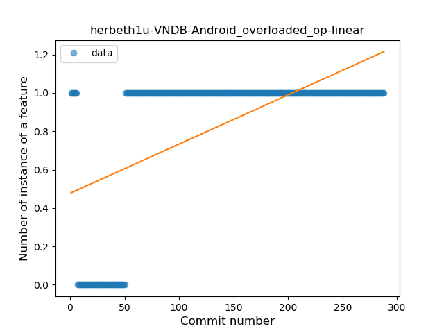
