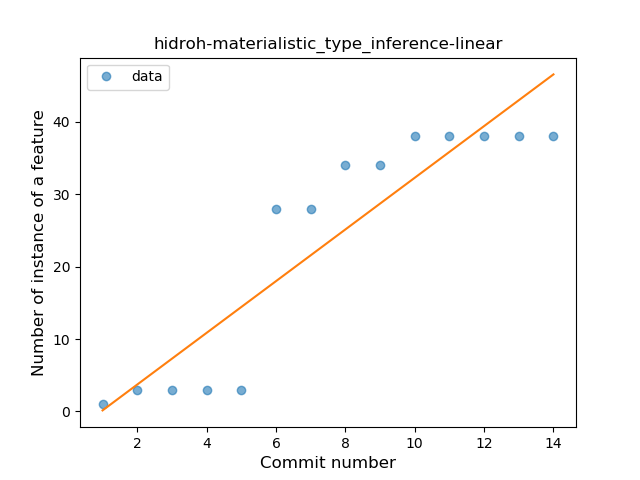
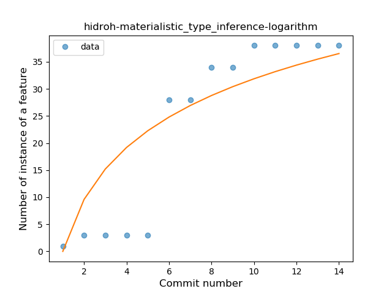
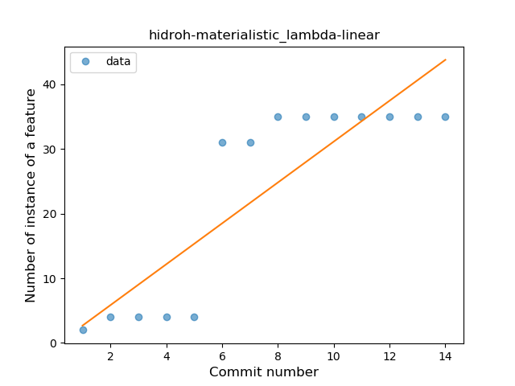
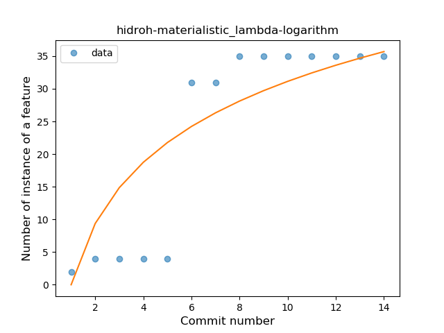
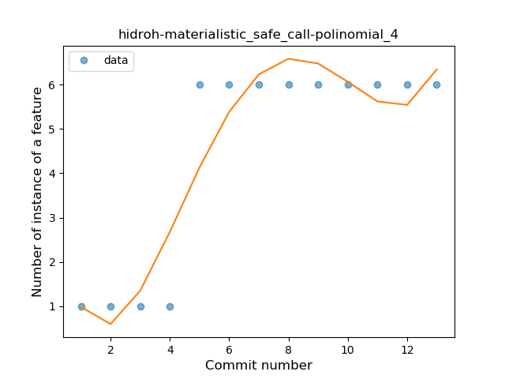
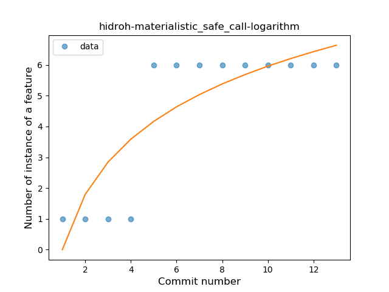
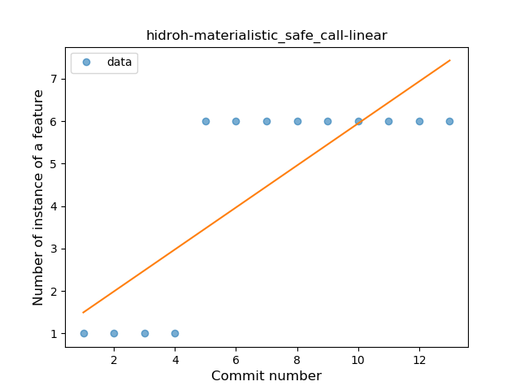
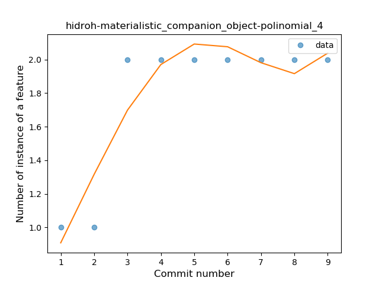
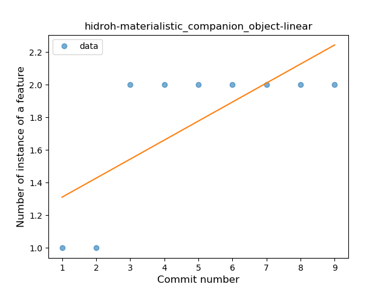
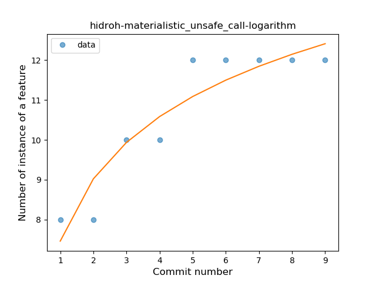

## hidroh-materialistic
----
#### Metrics provided by Detekt
* Number of lines of code 1411
* Number of Kotlin files: 16
* Cyclomatic complexity: 145
* Cyclomatic complexity by thousands of lines: 217 

----
**5** features analyzed

*	<a href="#type_inference">Type Inference</a> 
*	<a href="#lambda">Lambda</a> 
*	<a href="#safe_call">Safe Call</a> 
*	<a href="#companion_object">Companion Object</a> 
*	<a href="#unsafe_call">Unsafe Call</a> 

### <a name="type_inference">Type Inference</a>
----
#### Functions
* **Instability - Polinomial 4:** 
    * **R_Squared:** 0.94335054
* **Constant Rise - Linear:** 
    * **R_Squared:** 0.82926779
* **Sudden Rise Plateau - Logarithm:** 
    * **R_Squared:** 0.72545227

**Plots** :chart_with_upwards_trend:
-----

### <a name="lambda">Lambda</a>
----
#### Functions
* **Instability - Polinomial 4:** 
    * **R_Squared:** 0.91922584
* **Constant Rise - Linear:** 
    * **R_Squared:** 0.75130079
* **Sudden Rise Plateau - Logarithm:** 
    * **R_Squared:** 0.71827431

**Plots** :chart_with_upwards_trend:
-----

### <a name="safe_call">Safe Call</a>
----
#### Functions
* **Plateau Sudden Rise - Binary Sigmoid:** 
    * **R_Squared:** 1.0
* **Instability - Polinomial 4:** 
    * **R_Squared:** 0.88349885
* **Sudden Rise Plateau - Logarithm:** 
    * **R_Squared:** 0.72563011
* **Constant Rise - Linear:** 
    * **R_Squared:** 0.64285714

**Plots** :chart_with_upwards_trend:
-----

### <a name="companion_object">Companion Object</a>
----
#### Functions
* **Plateau Sudden Rise - Binary Sigmoid:** 
    * **R_Squared:** 1.0
* **Instability - Polinomial 4:** 
    * **R_Squared:** 0.85664336
* **Sudden Rise Plateau - Logarithm:** 
    * **R_Squared:** 0.71914264
* **Constant Rise - Linear:** 
    * **R_Squared:** 0.525

**Plots** :chart_with_upwards_trend:
-----

### <a name="unsafe_call">Unsafe Call</a>
----
#### Functions
* **Instability - Polinomial 4:** 
    * **R_Squared:** 0.95661746
* **Sudden Rise Plateau - Logarithm:** 
    * **R_Squared:** 0.87575104
* **Constant Rise - Linear:** 
    * **R_Squared:** 0.80277778

**Plots** :chart_with_upwards_trend:
-----

