## horse-amazin-my-stratum0-statuswidget
----
#### Metrics provided by Detekt
* Number of lines of code 1717
* Number of Kotlin files: 17
* Cyclomatic complexity: 289
* Cyclomatic complexity by thousands of lines: 293 

----
**9** features analyzed

*	<a href="#type_inference">Type Inference</a> 
*	<a href="#lambda">Lambda</a> 
*	<a href="#safe_call">Safe Call</a> 
*	<a href="#when_expr">When expression</a> 
*	<a href="#unsafe_call">Unsafe Call</a> 
*	<a href="#companion_object">Companion Object</a> 
*	<a href="#singleton">Singleton</a> 
*	<a href="#smart_cast">Smart Cast</a> 
*	<a href="#property_delegation">Property Delegation</a> 

### <a name="type_inference">Type Inference</a>
----
#### Functions
* **Constant Rise - Linear:** 
    * **R_Squared:** 0.79513322
* **Sudden Rise Plateau - Logarithm:** 
    * **R_Squared:** 0.77659348

**Plots** :chart_with_upwards_trend:
-----

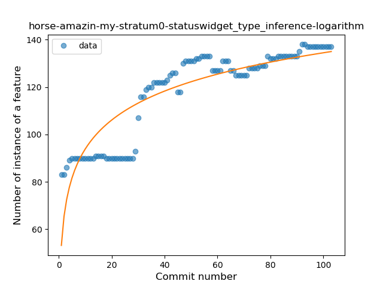
### <a name="lambda">Lambda</a>
----
#### Functions
* **Plateau Gradual Rise - Sigmoid:** 
    * **R_Squared:** 0.9201981
* **Constant Rise - Linear:** 
    * **R_Squared:** 0.8747569
* **Sudden Rise Plateau - Logarithm:** 
    * **R_Squared:** 0.56290849

**Plots** :chart_with_upwards_trend:
-----

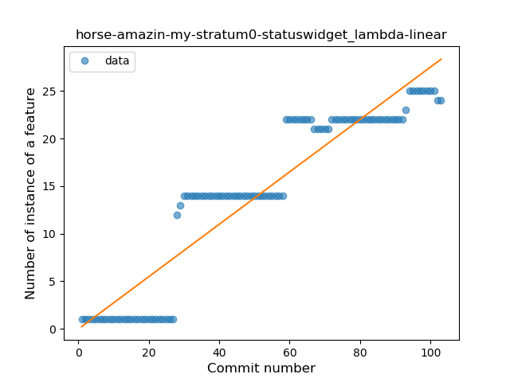
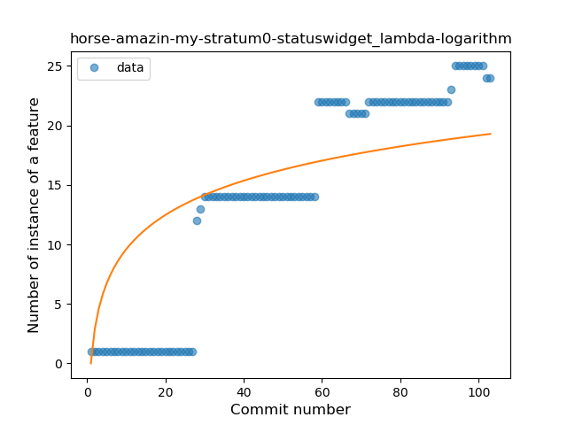
### <a name="safe_call">Safe Call</a>
----
#### Functions
* **Plateau Gradual Rise - Sigmoid:** 
    * **R_Squared:** 0.89492329
* **Sudden Rise Plateau - Logarithm:** 
    * **R_Squared:** 0.65504517
* **Constant Rise - Linear:** 
    * **R_Squared:** 0.55324758

**Plots** :chart_with_upwards_trend:
-----

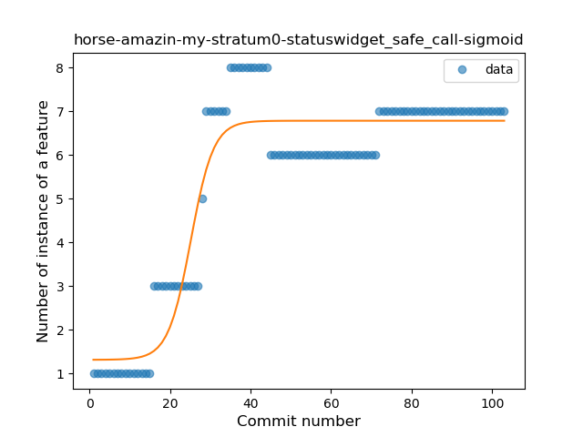
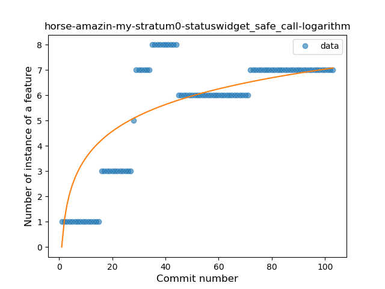
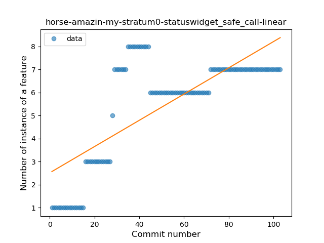
### <a name="when_expr">When expression</a>
----
#### Functions
* **Sudden Rise - Exponential:** 
    * **R_Squared:** 0.90892848
* **Constant Rise - Linear:** 
    * **R_Squared:** 0.88858378
* **Sudden Rise Plateau - Logarithm:** 
    * **R_Squared:** 0.62600272

**Plots** :chart_with_upwards_trend:
-----

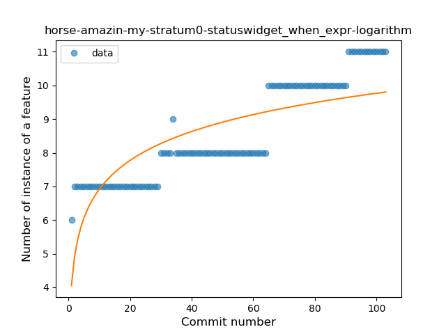
### <a name="unsafe_call">Unsafe Call</a>
----
#### Functions
* **Sudden Decline - Exponential:** 
    * **R_Squared:** 0.32517282
* **Constant Decline - Linear:** 
    * **R_Squared:** 0.24956896
* **Sudden Rise Plateau - Logarithm:** 
    * **R_Squared:** -0.0

**Plots** :chart_with_upwards_trend:
-----

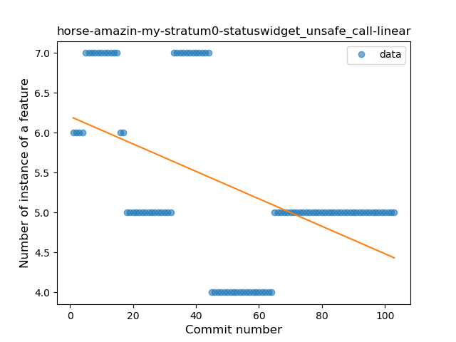
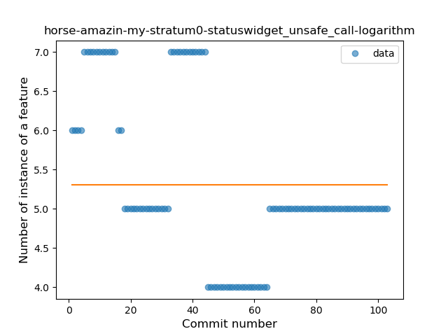
### <a name="companion_object">Companion Object</a>
----
#### Functions
* **Plateau Gradual Rise - Sigmoid:** 
    * **R_Squared:** 0.98275645
* **Constant Rise - Linear:** 
    * **R_Squared:** 0.91957636
* **Sudden Rise - Exponential:** 
    * **R_Squared:** 0.92239956
* **Sudden Rise Plateau - Logarithm:** 
    * **R_Squared:** 0.62968196

**Plots** :chart_with_upwards_trend:
-----

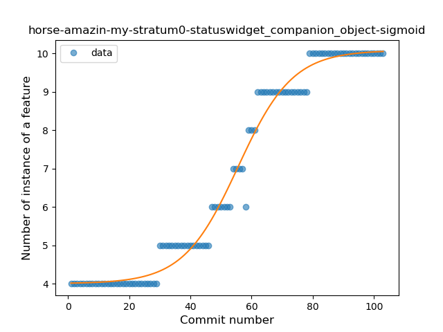
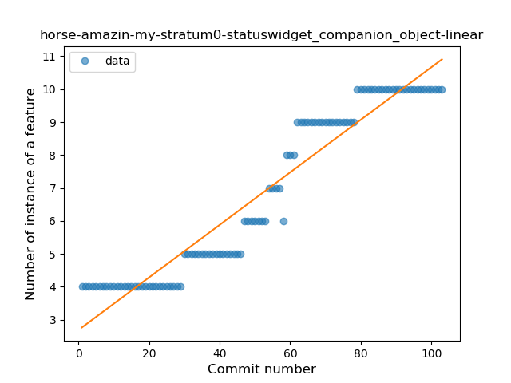
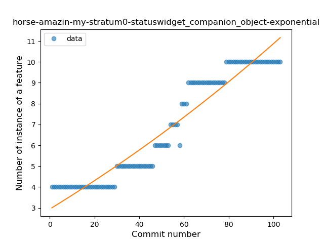
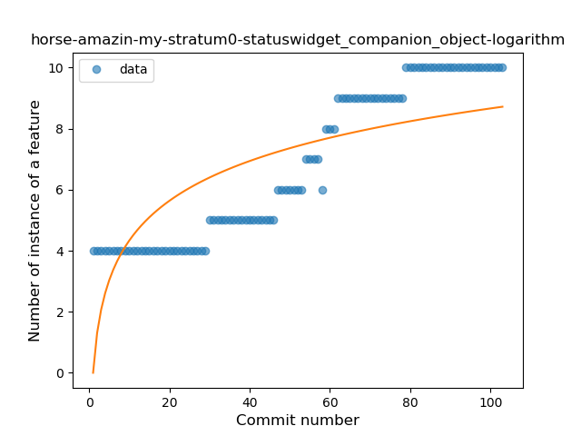
### <a name="singleton">Singleton</a>
----
#### Functions
* **Plateau Gradual Rise - Sigmoid:** 
    * **R_Squared:** 0.70351378
* **Sudden Rise Plateau - Logarithm:** 
    * **R_Squared:** 0.63717055
* **Constant Rise - Linear:** 
    * **R_Squared:** 0.47502192

**Plots** :chart_with_upwards_trend:
-----

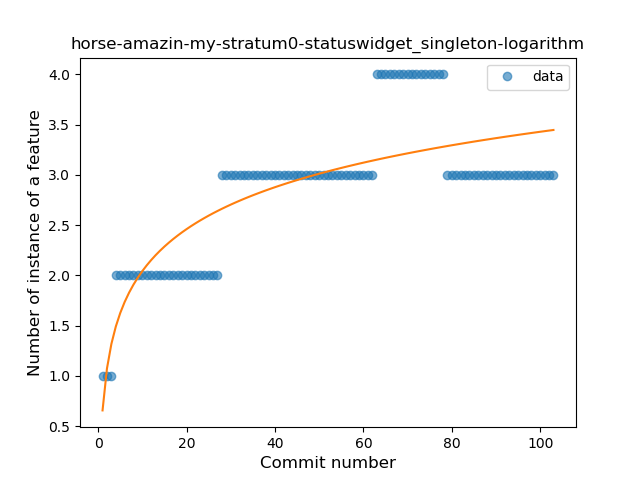
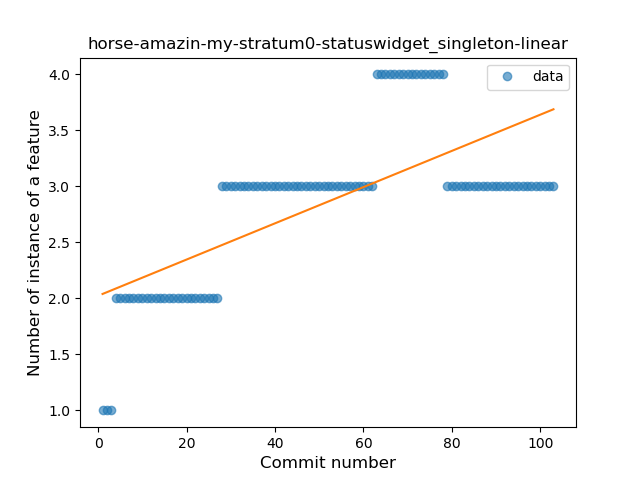
### <a name="smart_cast">Smart Cast</a>
----
#### Functions
* **Plateau Sudden Rise - Binary Sigmoid:** 
    * **R_Squared:** 1.0
* **Sudden Rise Plateau - Logarithm:** 
    * **R_Squared:** 0.45501275
* **Constant Rise - Linear:** 
    * **R_Squared:** 0.15540541

**Plots** :chart_with_upwards_trend:
-----

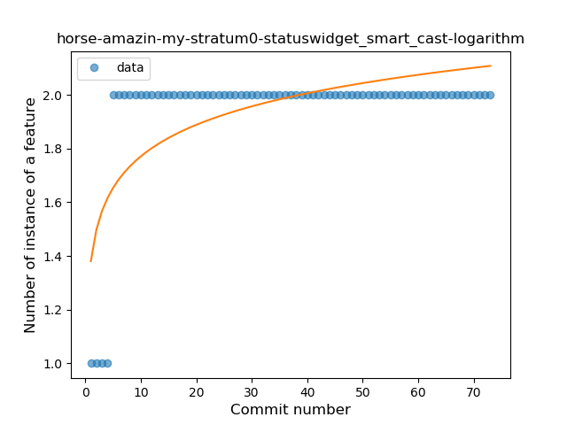
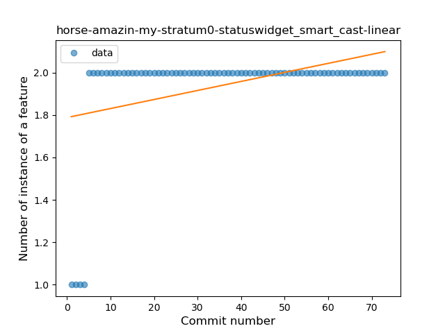
### <a name="property_delegation">Property Delegation</a>
----
#### Functions
* **Sudden Rise Plateau - Logarithm:** 
    * **R_Squared:** 0.84227247
* **Constant Rise - Linear:** 
    * **R_Squared:** 0.73787206

**Plots** :chart_with_upwards_trend:
-----

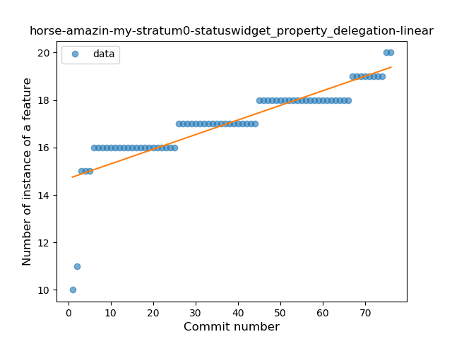
