## howard-e-just-quotes-kt
----
#### Metrics provided by Detekt
* Number of lines of code 1014
* Number of Kotlin files: 18
* Cyclomatic complexity: 101
* Cyclomatic complexity by thousands of lines: 232 

----
**6** features analyzed

*	<a href="#type_inference">Type Inference</a> 
*	<a href="#lambda">Lambda</a> 
*	<a href="#safe_call">Safe Call</a> 
*	<a href="#unsafe_call">Unsafe Call</a> 
*	<a href="#string_template">String Template</a> 
*	<a href="#range_expr">Range Expression</a> 

### <a name="type_inference">Type Inference</a>
----
#### Functions
* **Instability - Polinomial 4:** 
    * **R_Squared:** 0.67816232
* **Sudden Rise Plateau - Logarithm:** 
    * **R_Squared:** 0.30244377
* **Constant Rise - Linear:** 
    * **R_Squared:** 0.10681319

**Plots** :chart_with_upwards_trend:
-----

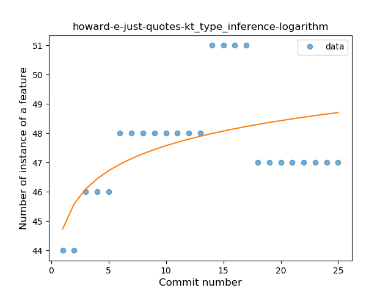
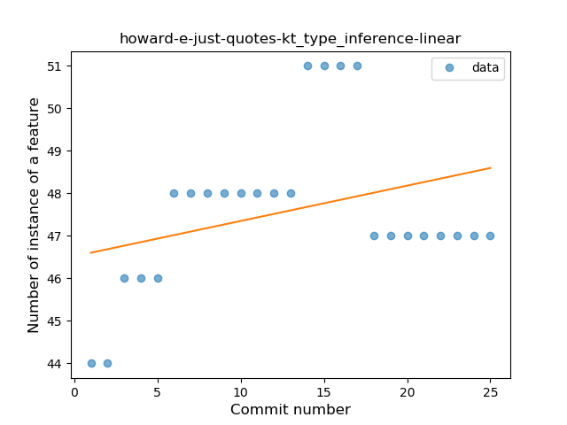
### <a name="lambda">Lambda</a>
----
#### Functions
* **Instability - Polinomial 3:** )
    * **R_Squared:** 0.82161498
* **Sudden Rise - Exponential:** 
    * **R_Squared:** 0.79346981
* **Constant Rise - Linear:** 
    * **R_Squared:** 0.40384615
* **Sudden Rise Plateau - Logarithm:** 
    * **R_Squared:** 0.19910356

**Plots** :chart_with_upwards_trend:
-----

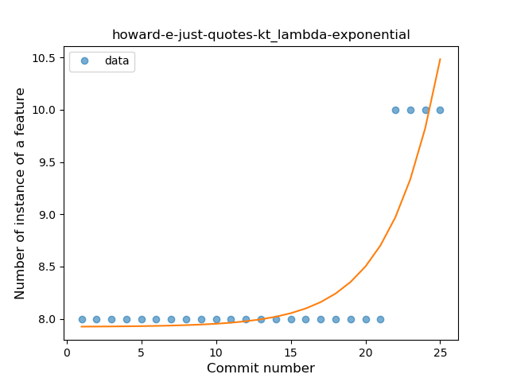
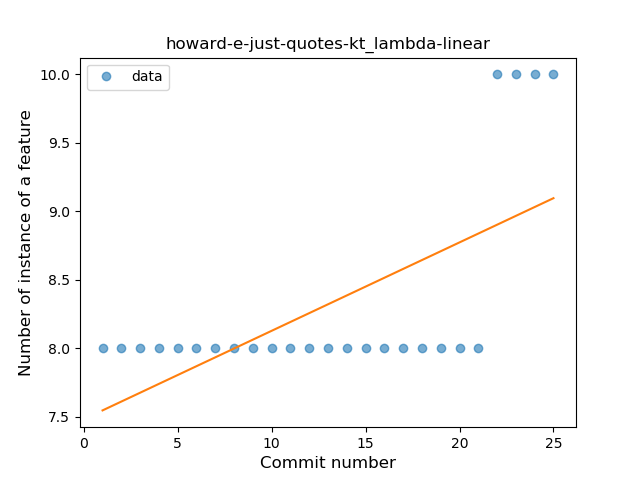
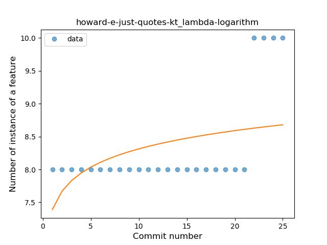
### <a name="safe_call">Safe Call</a>
----
#### Functions
* **Plateau Sudden Rise - Binary Sigmoid:** 
    * **R_Squared:** 1.0
* **Sudden Rise Plateau - Logarithm:** 
    * **R_Squared:** 0.70760764
* **Constant Rise - Linear:** 
    * **R_Squared:** 0.54807692

**Plots** :chart_with_upwards_trend:
-----

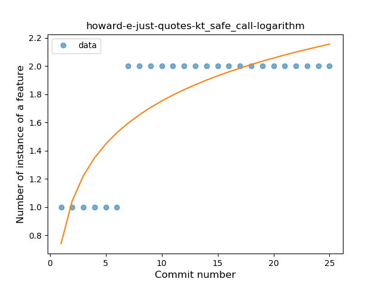
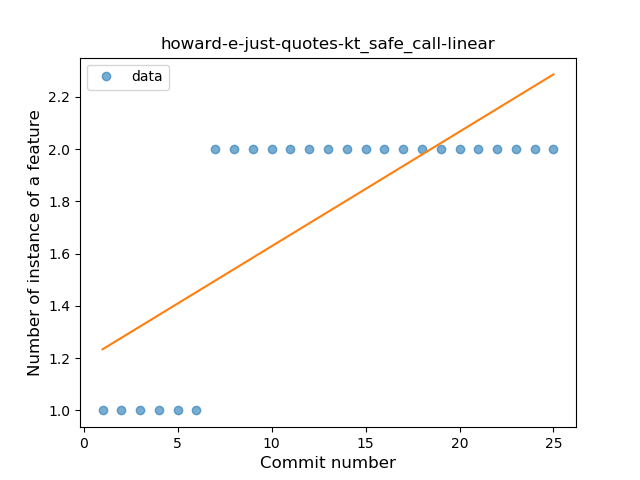
### <a name="unsafe_call">Unsafe Call</a>
----
#### Functions
* **Constant Rise - Linear:** 
    * **R_Squared:** 0.89054688
* **Sudden Rise - Exponential:** 
    * **R_Squared:** 0.89111587
* **Sudden Rise Plateau - Logarithm:** 
    * **R_Squared:** 0.81822368

**Plots** :chart_with_upwards_trend:
-----

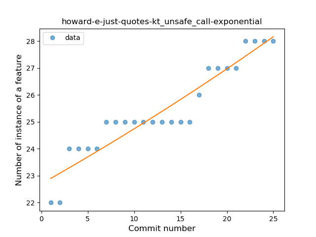
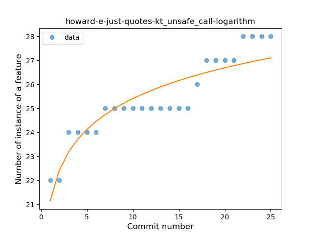
### <a name="string_template">String Template</a>
----
#### Functions
* **Plateau Gradual Rise - Sigmoid:** 
    * **R_Squared:** 0.94365549
* **Instability - Polinomial 3:** )
    * **R_Squared:** 0.91518268
* **Sudden Rise - Exponential:** 
    * **R_Squared:** 0.89162846
* **Constant Rise - Linear:** 
    * **R_Squared:** 0.59718776
* **Sudden Rise Plateau - Logarithm:** 
    * **R_Squared:** 0.32053636

**Plots** :chart_with_upwards_trend:
-----

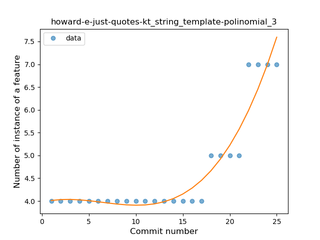
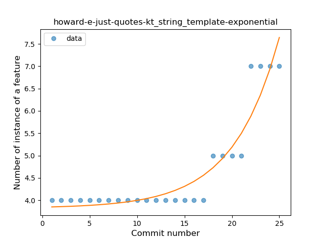
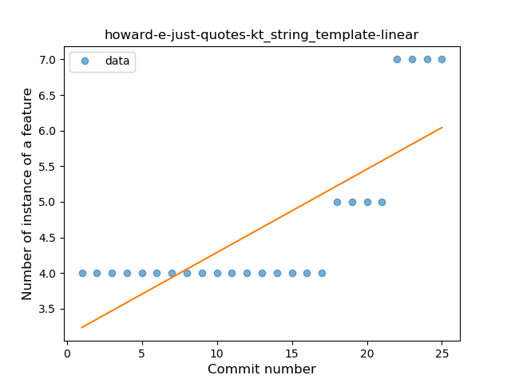
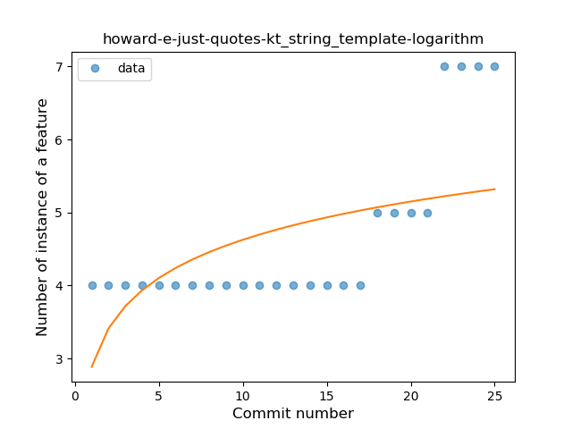
### <a name="range_expr">Range Expression</a>
----
#### Functions
* **Plateau Sudden Decline - Binary Sigmoid:** 
    * **R_Squared:** 1.0
* **Instability - Polinomial 4:** 
    * **R_Squared:** 0.87833007
* **Constant Decline - Linear:** 
    * **R_Squared:** 0.65384615
* **Sudden Rise Plateau - Logarithm:** 
    * **R_Squared:** -0.0

**Plots** :chart_with_upwards_trend:
-----

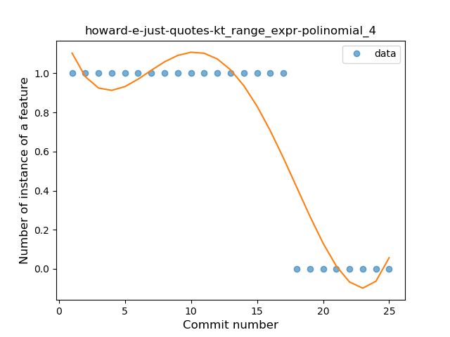
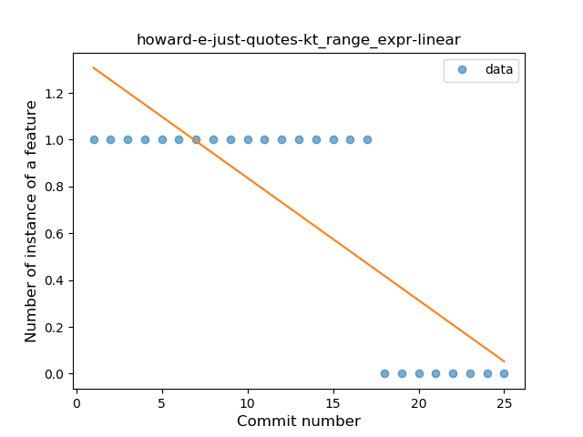
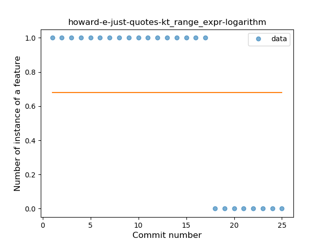
