## hsson-card-balance-app
----
#### Metrics provided by Detekt
* Number of lines of code 3088
* Number of Kotlin files: 39
* Cyclomatic complexity: 456
* Cyclomatic complexity by thousands of lines: 279 

----
**12** features analyzed

*	<a href="#type_inference">Type Inference</a> 
*	<a href="#lambda">Lambda</a> 
*	<a href="#safe_call">Safe Call</a> 
*	<a href="#when_expr">When expression</a> 
*	<a href="#companion_object">Companion Object</a> 
*	<a href="#unsafe_call">Unsafe Call</a> 
*	<a href="#string_template">String Template</a> 
*	<a href="#func_with_default_value">Function with Default Value</a> 
*	<a href="#singleton">Singleton</a> 
*	<a href="#smart_cast">Smart Cast</a> 
*	<a href="#range_expr">Range Expression</a> 
*	<a href="#func_call_with_named_arg">Function call with Named Argument</a> 

### <a name="type_inference">Type Inference</a>
----
#### Functions
* **Constant Rise - Linear:** 
    * **R_Squared:** 0.95043481
* **Sudden Rise Plateau - Logarithm:** 
    * **R_Squared:** 0.82426976
* **Plateau Sudden Rise - Binary Sigmoid:** 
    * **R_Squared:** 0.04728976

**Plots** :chart_with_upwards_trend:
-----

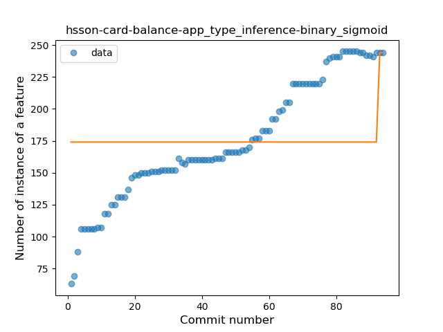
### <a name="lambda">Lambda</a>
----
#### Functions
* **Constant Rise - Linear:** 
    * **R_Squared:** 0.95870696
* **Sudden Rise Plateau - Logarithm:** 
    * **R_Squared:** 0.78584215

**Plots** :chart_with_upwards_trend:
-----

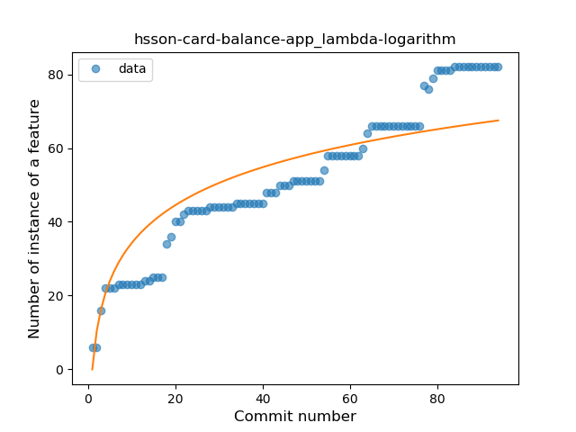
### <a name="safe_call">Safe Call</a>
----
#### Functions
* **Constant Rise - Linear:** 
    * **R_Squared:** 0.89380694
* **Sudden Rise Plateau - Logarithm:** 
    * **R_Squared:** 0.81457231
* **Plateau Gradual Rise - Sigmoid:** 
    * **R_Squared:** 0.70249381

**Plots** :chart_with_upwards_trend:
-----

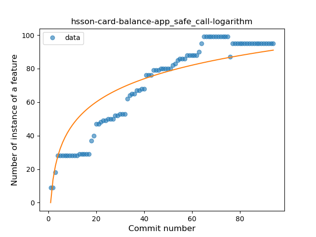
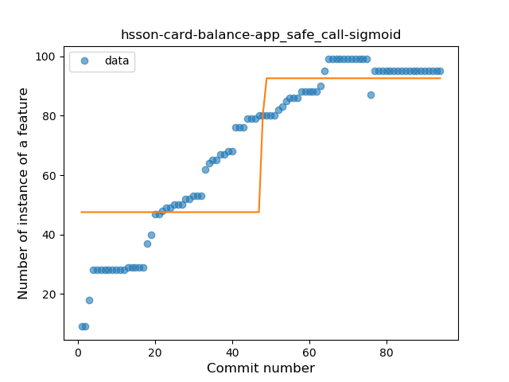
### <a name="when_expr">When expression</a>
----
#### Functions
* **Plateau Gradual Rise - Sigmoid:** 
    * **R_Squared:** 0.95322548
* **Constant Rise - Linear:** 
    * **R_Squared:** 0.84950713
* **Sudden Rise - Exponential:** 
    * **R_Squared:** 0.85067984
* **Sudden Rise Plateau - Logarithm:** 
    * **R_Squared:** 0.61101548

**Plots** :chart_with_upwards_trend:
-----

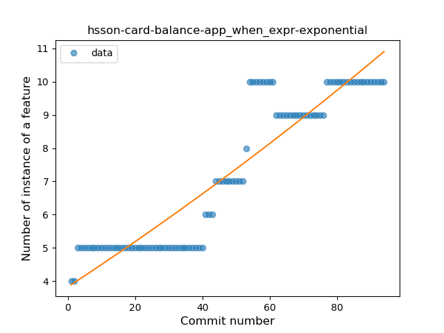
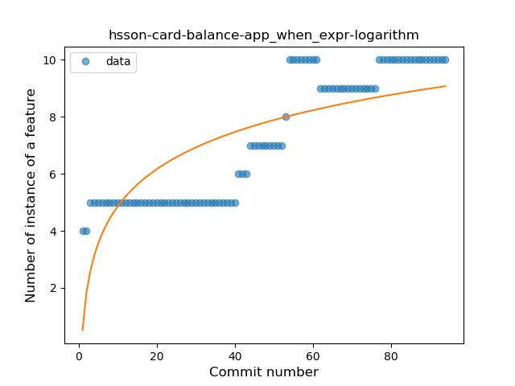
### <a name="companion_object">Companion Object</a>
----
#### Functions
* **Sudden Rise Plateau - Logarithm:** 
    * **R_Squared:** 0.91139288
* **Constant Rise - Linear:** 
    * **R_Squared:** 0.67719355

**Plots** :chart_with_upwards_trend:
-----

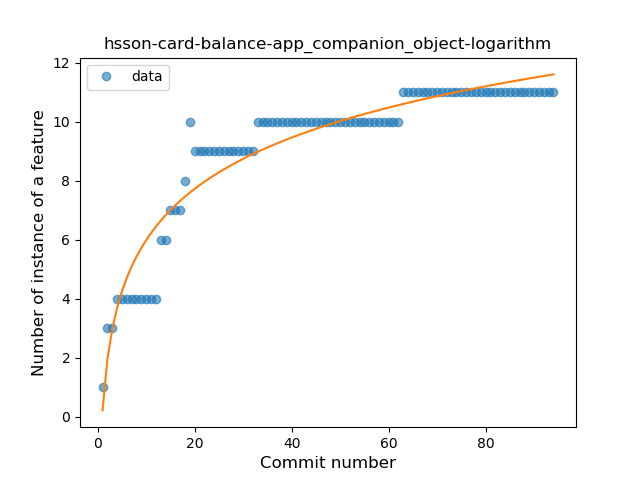
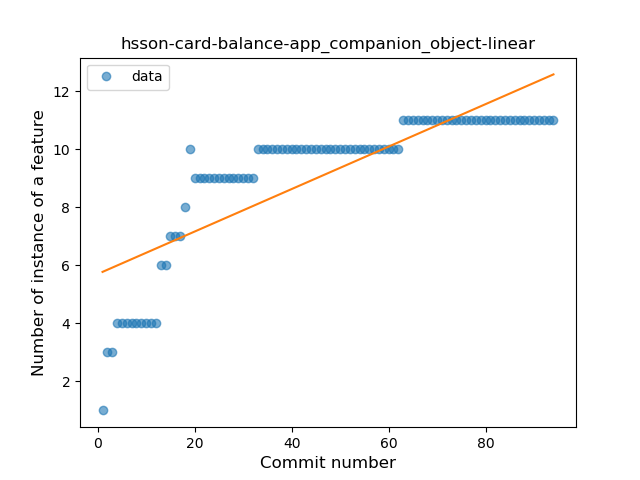
### <a name="unsafe_call">Unsafe Call</a>
----
#### Functions
* **Plateau Sudden Rise - Binary Sigmoid:** 
    * **R_Squared:** 1.0
* **Sudden Rise Plateau - Logarithm:** 
    * **R_Squared:** 0.34573168
* **Constant Rise - Linear:** 
    * **R_Squared:** 0.09269949

**Plots** :chart_with_upwards_trend:
-----

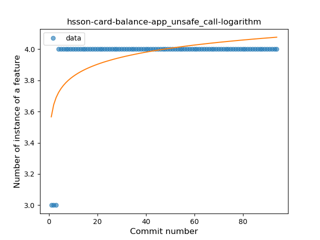
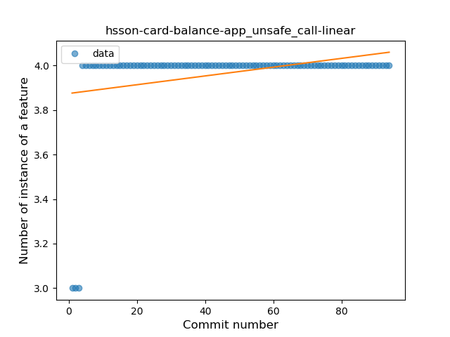
### <a name="string_template">String Template</a>
----
#### Functions
* **Sudden Rise - Exponential:** 
    * **R_Squared:** 0.82355784
* **Constant Rise - Linear:** 
    * **R_Squared:** 0.69445499
* **Sudden Rise Plateau - Logarithm:** 
    * **R_Squared:** 0.49952711

**Plots** :chart_with_upwards_trend:
-----

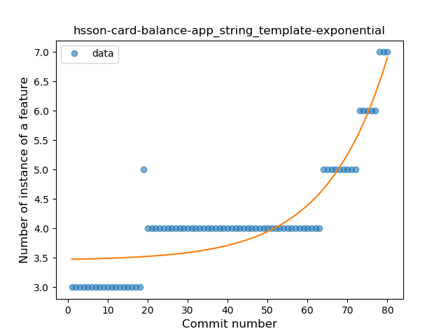
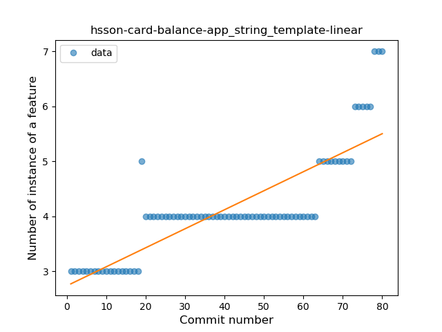
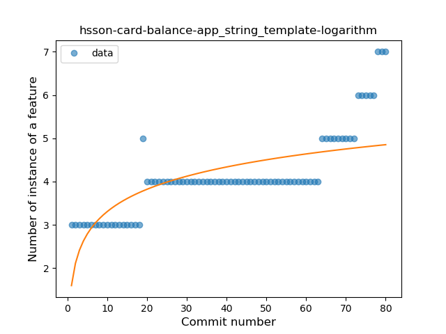
### <a name="func_with_default_value">Function with Default Value</a>
----
#### Functions
* **Plateau Gradual Rise - Sigmoid:** 
    * **R_Squared:** 0.98520726
* **Instability - Polinomial 3:** )
    * **R_Squared:** 0.94161808
* **Constant Rise - Linear:** 
    * **R_Squared:** 0.83612863
* **Sudden Rise - Exponential:** 
    * **R_Squared:** 0.8398821
* **Sudden Rise Plateau - Logarithm:** 
    * **R_Squared:** 0.44043868

**Plots** :chart_with_upwards_trend:
-----

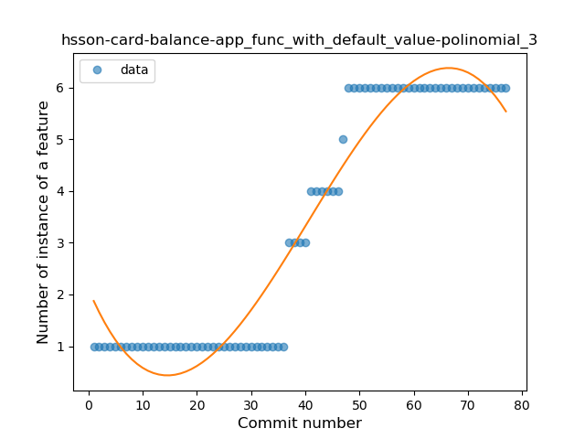

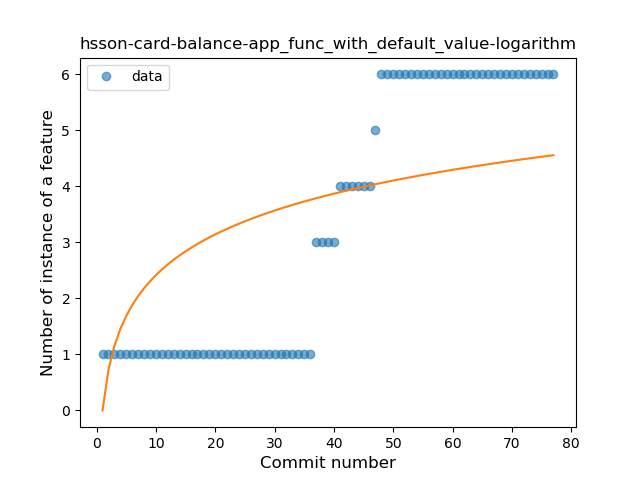
### <a name="singleton">Singleton</a>
----
#### Functions
* **Plateau Sudden Rise - Binary Sigmoid:** 
    * **R_Squared:** 1.0
* **Sudden Rise - Exponential:** 
    * **R_Squared:** 0.76354894
* **Constant Rise - Linear:** 
    * **R_Squared:** 0.62750424
* **Sudden Rise Plateau - Logarithm:** 
    * **R_Squared:** 0.32541476

**Plots** :chart_with_upwards_trend:
-----

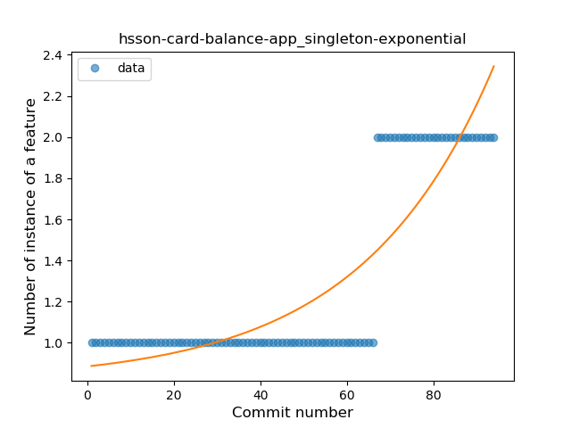
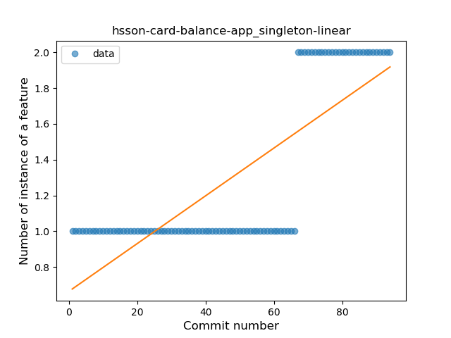
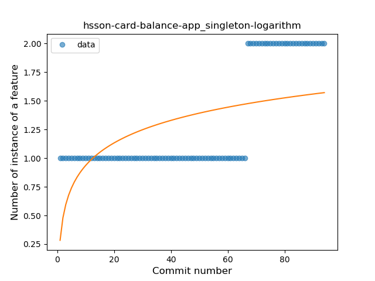
### <a name="smart_cast">Smart Cast</a>
----
#### Functions
* **Sudden Rise Plateau - Logarithm:** 
    * **R_Squared:** 0.6987177
* **Constant Rise - Linear:** 
    * **R_Squared:** 0.46110053

**Plots** :chart_with_upwards_trend:
-----

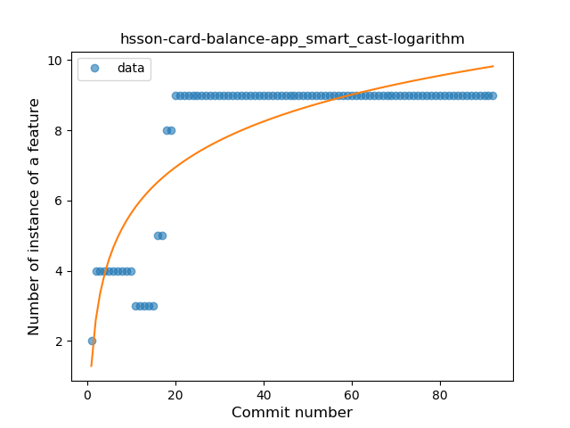
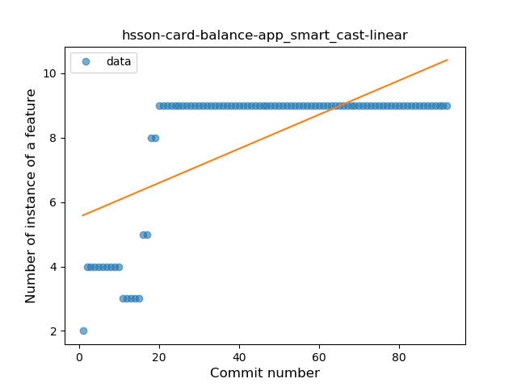
### <a name="range_expr">Range Expression</a>
----
#### Functions
* **Plateau Sudden Rise - Binary Sigmoid:** 
    * **R_Squared:** 1.0
* **Constant Rise - Linear:** 
    * **R_Squared:** 0.72209212
* **Sudden Rise Plateau - Logarithm:** 
    * **R_Squared:** 0.616148

**Plots** :chart_with_upwards_trend:
-----

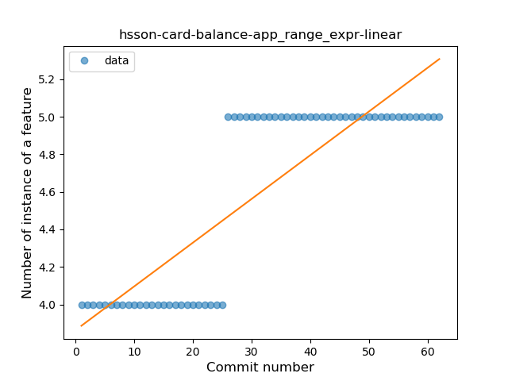

### <a name="func_call_with_named_arg">Function call with Named Argument</a>
----
#### Functions
* **Plateau Gradual Rise - Sigmoid:** 
    * **R_Squared:** 0.9732498
* **Sudden Rise - Exponential:** 
    * **R_Squared:** 0.87928014
* **Constant Rise - Linear:** 
    * **R_Squared:** 0.82456973
* **Sudden Rise Plateau - Logarithm:** 
    * **R_Squared:** 0.4028578

**Plots** :chart_with_upwards_trend:
-----

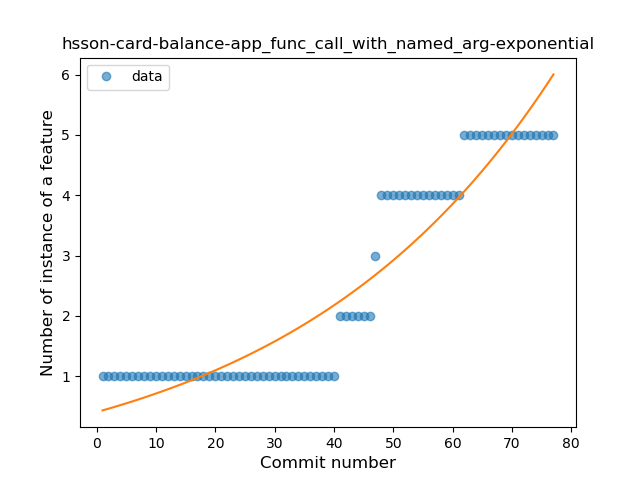
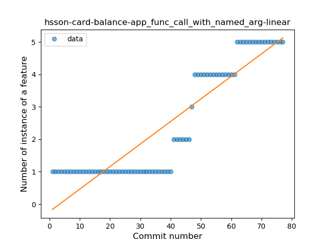
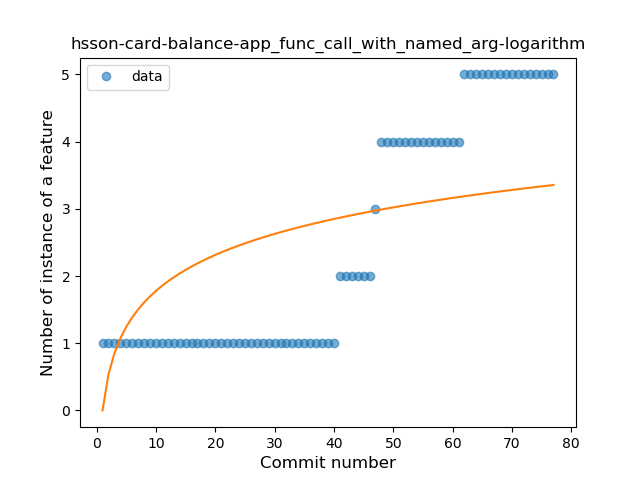
