## hyst329-OpenFool
----
#### Metrics provided by Detekt
* Number of lines of code 2607
* Number of Kotlin files: 16
* Cyclomatic complexity: 491
* Cyclomatic complexity by thousands of lines: 282 

----
**13** features analyzed

*	<a href="#type_inference">Type Inference</a> 
*	<a href="#lambda">Lambda</a> 
*	<a href="#safe_call">Safe Call</a> 
*	<a href="#when_expr">When expression</a> 
*	<a href="#companion_object">Companion Object</a> 
*	<a href="#unsafe_call">Unsafe Call</a> 
*	<a href="#string_template">String Template</a> 
*	<a href="#func_with_default_value">Function with Default Value</a> 
*	<a href="#smart_cast">Smart Cast</a> 
*	<a href="#range_expr">Range Expression</a> 
*	<a href="#func_call_with_named_arg">Function call with Named Argument</a> 
*	<a href="#property_delegation">Property Delegation</a> 
*	<a href="#destructuring_declaration">Destructuring Declaration</a> 

### <a name="type_inference">Type Inference</a>
----
#### Functions
* **Instability - Polinomial 3:** )
    * **R_Squared:** 0.93902472
* **Sudden Rise - Exponential:** 
    * **R_Squared:** 0.91571701
* **Constant Rise - Linear:** 
    * **R_Squared:** 0.63323478
* **Sudden Rise Plateau - Logarithm:** 
    * **R_Squared:** 0.37199352

**Plots** :chart_with_upwards_trend:
-----

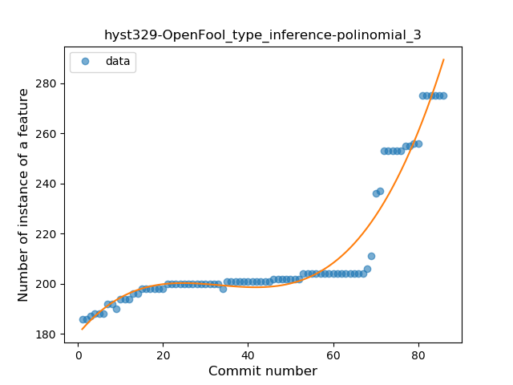
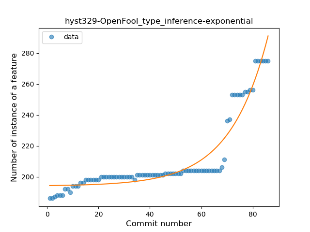
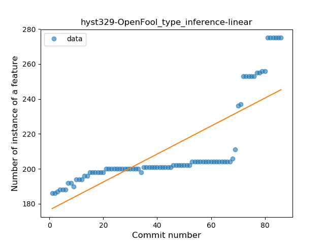
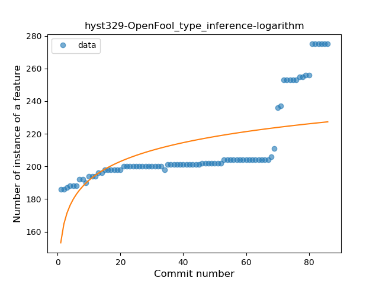
### <a name="lambda">Lambda</a>
----
#### Functions
* **Sudden Rise - Exponential:** 
    * **R_Squared:** 0.93218004
* **Constant Rise - Linear:** 
    * **R_Squared:** 0.69808533
* **Sudden Rise Plateau - Logarithm:** 
    * **R_Squared:** 0.33084415

**Plots** :chart_with_upwards_trend:
-----

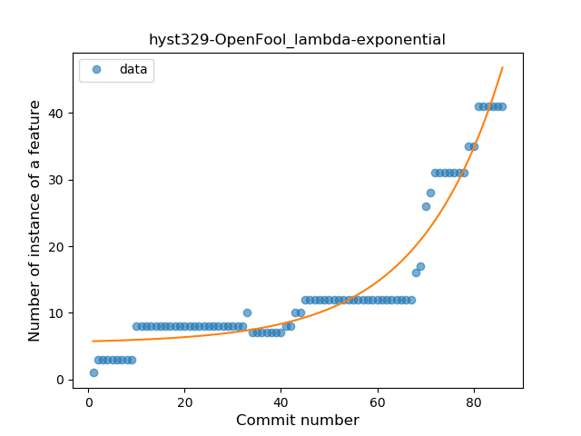
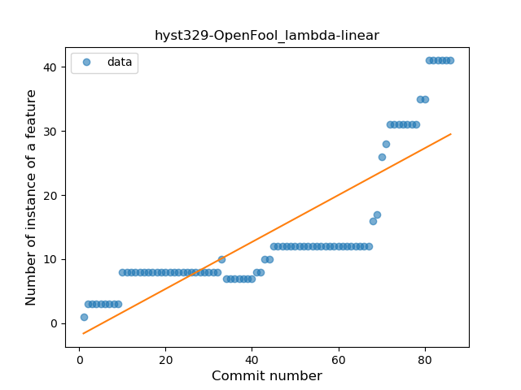
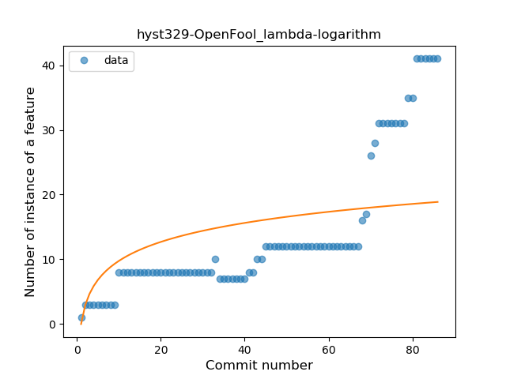
### <a name="safe_call">Safe Call</a>
----
#### Functions
* **Sudden Rise - Exponential:** 
    * **R_Squared:** 0.9387216
* **Instability - Polinomial 3:** )
    * **R_Squared:** 0.9156373
* **Constant Rise - Linear:** 
    * **R_Squared:** 0.4838743
* **Sudden Rise Plateau - Logarithm:** 
    * **R_Squared:** 0.24234011

**Plots** :chart_with_upwards_trend:
-----

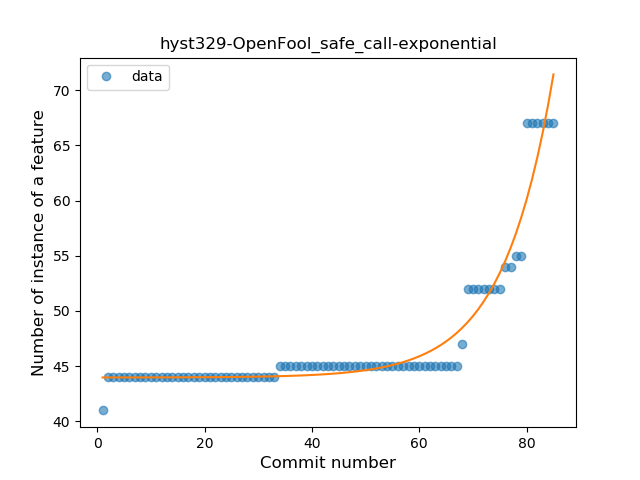
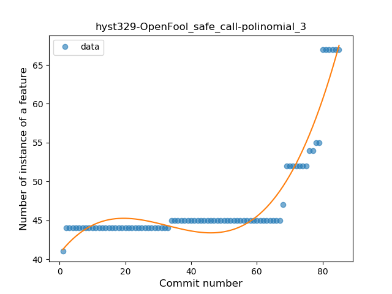
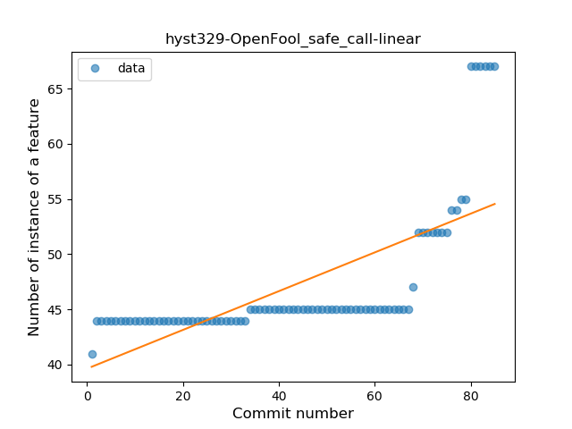
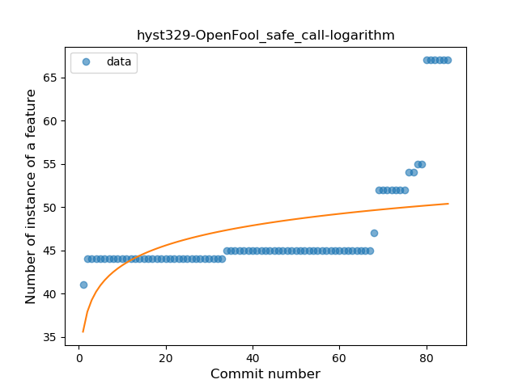
### <a name="when_expr">When expression</a>
----
#### Functions
* **Plateau Gradual Rise - Sigmoid:** 
    * **R_Squared:** 0.9745878
* **Sudden Rise - Exponential:** 
    * **R_Squared:** 0.92980648
* **Constant Rise - Linear:** 
    * **R_Squared:** 0.73721979
* **Sudden Rise Plateau - Logarithm:** 
    * **R_Squared:** 0.37946445

**Plots** :chart_with_upwards_trend:
-----

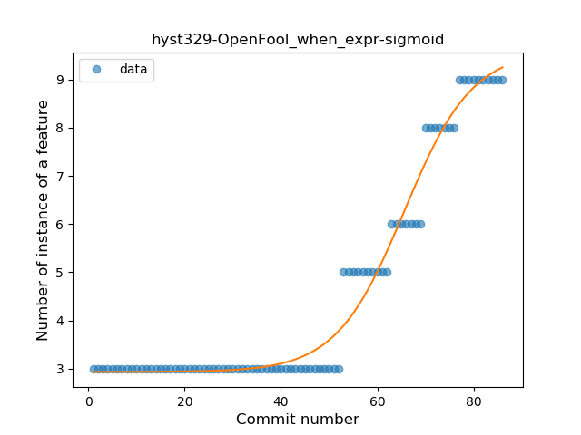
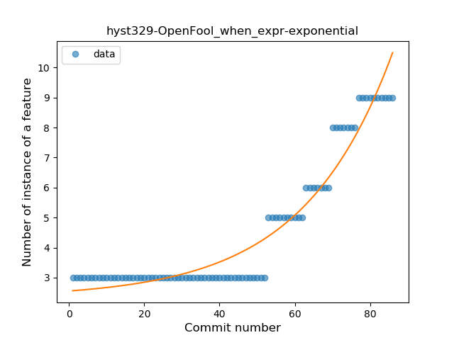
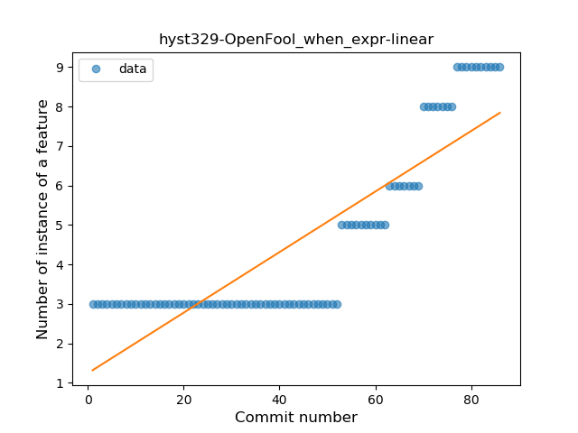

### <a name="companion_object">Companion Object</a>
----
#### Functions
* **Plateau Sudden Rise - Binary Sigmoid:** 
    * **R_Squared:** 1.0
* **Sudden Rise - Exponential:** 
    * **R_Squared:** 0.78358649
* **Constant Rise - Linear:** 
    * **R_Squared:** 0.43204868
* **Sudden Rise Plateau - Logarithm:** 
    * **R_Squared:** 0.19391446

**Plots** :chart_with_upwards_trend:
-----

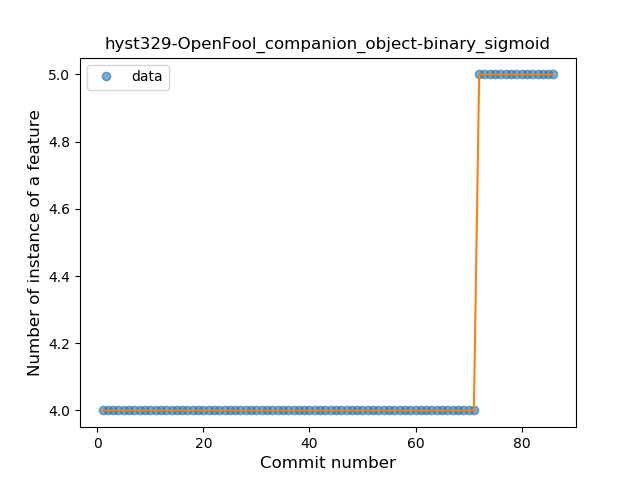
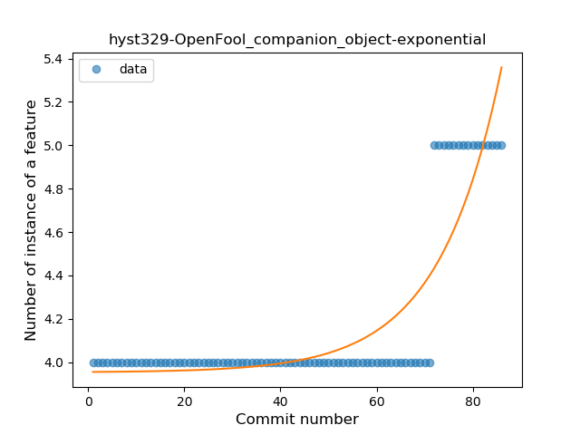
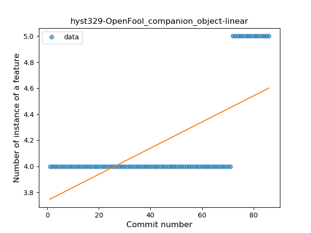
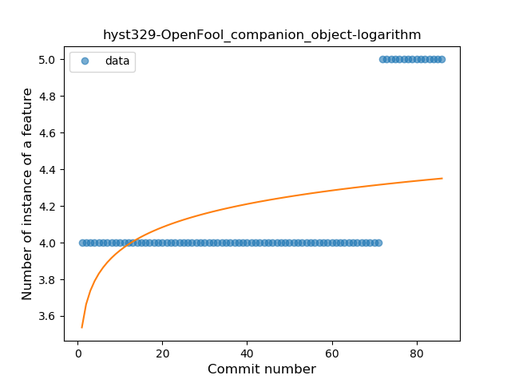
### <a name="unsafe_call">Unsafe Call</a>
----
#### Functions
* **Constant Decline - Linear:** 
    * **R_Squared:** 0.66456873
* **Sudden Rise - Exponential:** 
    * **R_Squared:** 0.0
* **Sudden Rise Plateau - Logarithm:** 
    * **R_Squared:** -0.0

**Plots** :chart_with_upwards_trend:
-----

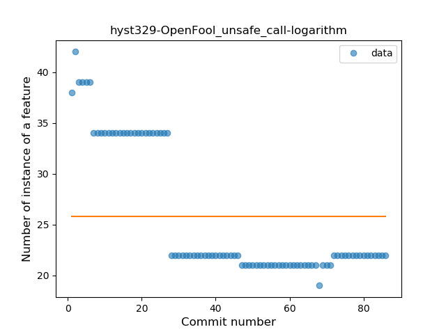
### <a name="string_template">String Template</a>
----
#### Functions
* **Instability - Polinomial 3:** )
    * **R_Squared:** 0.88903253
* **Sudden Rise - Exponential:** 
    * **R_Squared:** 0.8644752
* **Constant Rise - Linear:** 
    * **R_Squared:** 0.58864755
* **Sudden Rise Plateau - Logarithm:** 
    * **R_Squared:** 0.29387943

**Plots** :chart_with_upwards_trend:
-----

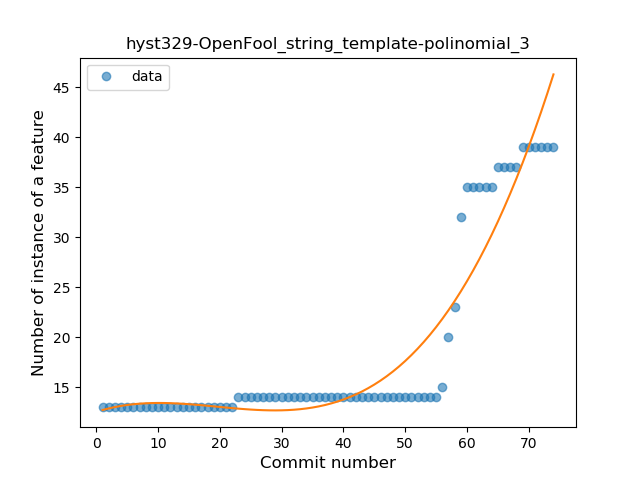
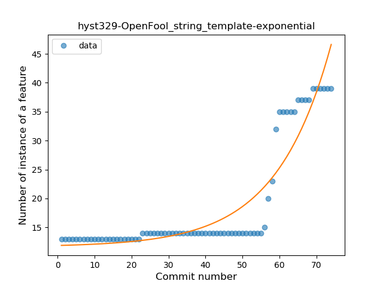
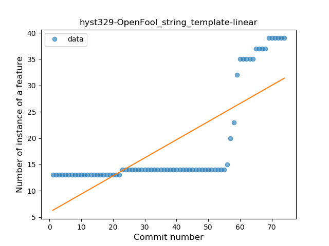
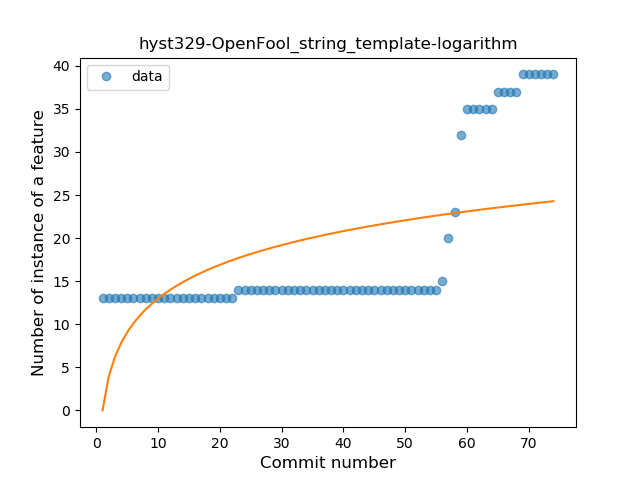
### <a name="func_with_default_value">Function with Default Value</a>
----
#### Functions
* **Constant Rise - Linear:** 
    * **R_Squared:** 0.8978418
* **Sudden Rise - Exponential:** 
    * **R_Squared:** 0.90709332
* **Sudden Rise Plateau - Logarithm:** 
    * **R_Squared:** 0.62781061

**Plots** :chart_with_upwards_trend:
-----

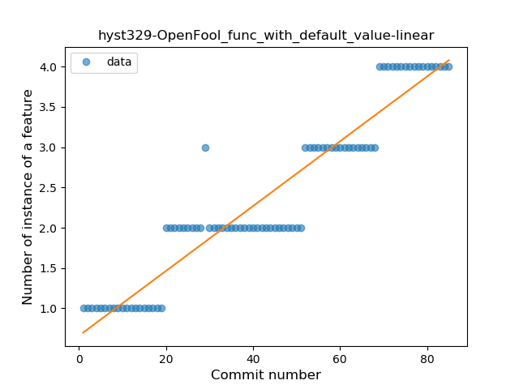
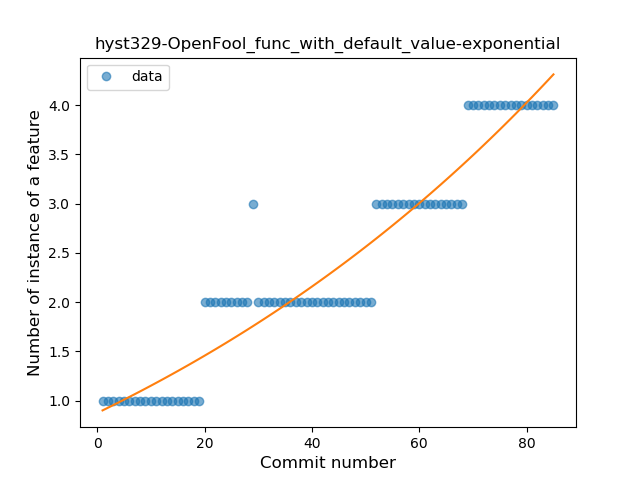

### <a name="smart_cast">Smart Cast</a>
----
#### Functions
* **Sudden Rise - Exponential:** 
    * **R_Squared:** 0.83794086
* **Constant Rise - Linear:** 
    * **R_Squared:** 0.48101765
* **Sudden Rise Plateau - Logarithm:** 
    * **R_Squared:** 0.21897323

**Plots** :chart_with_upwards_trend:
-----

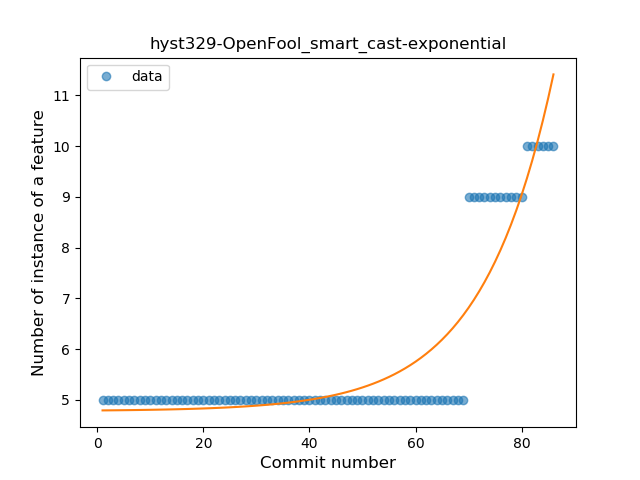
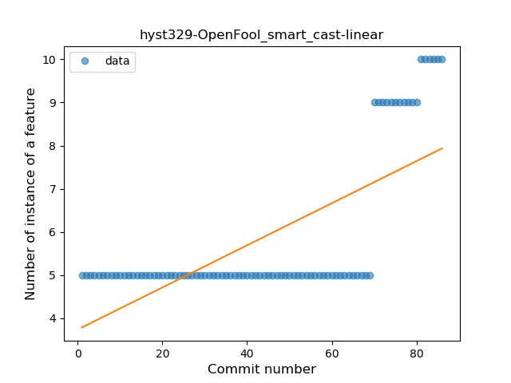
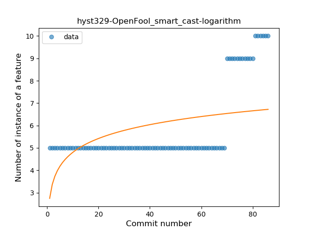
### <a name="range_expr">Range Expression</a>
----
#### Functions
* **Sudden Rise - Exponential:** 
    * **R_Squared:** 0.9302629
* **Constant Rise - Linear:** 
    * **R_Squared:** 0.74454783
* **Sudden Rise Plateau - Logarithm:** 
    * **R_Squared:** 0.4156523

**Plots** :chart_with_upwards_trend:
-----

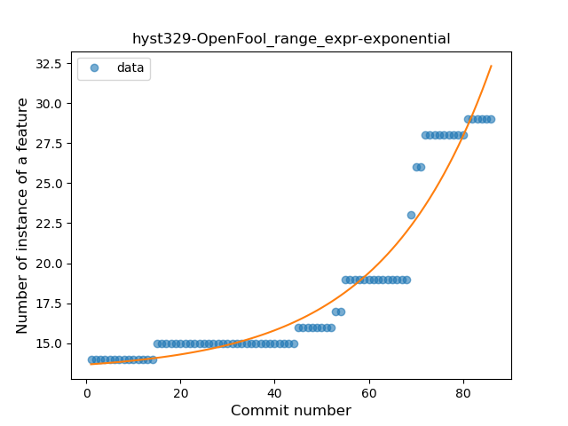
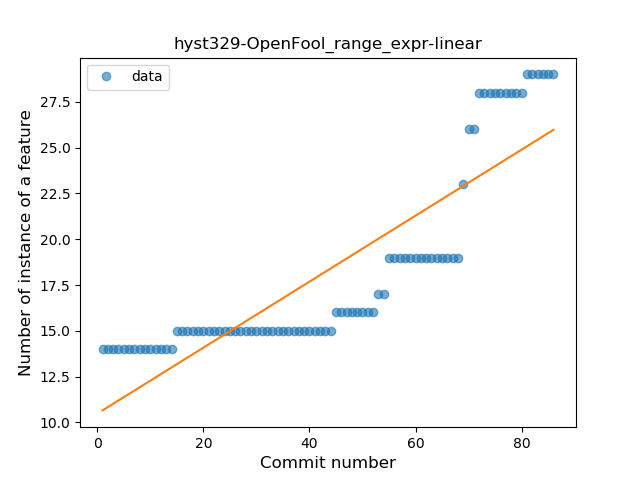
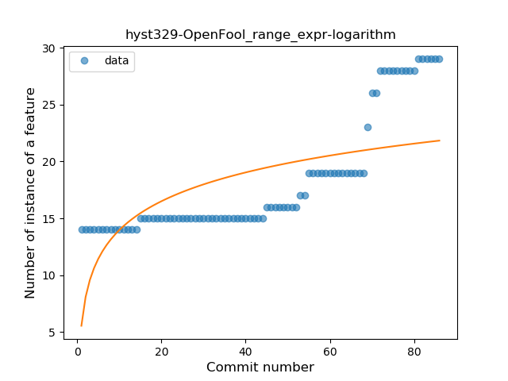
### <a name="func_call_with_named_arg">Function call with Named Argument</a>
----
#### Functions
* **Constant Rise - Linear:** 
    * **R_Squared:** 0.86097184
* **Sudden Rise Plateau - Logarithm:** 
    * **R_Squared:** 0.71215152

**Plots** :chart_with_upwards_trend:
-----

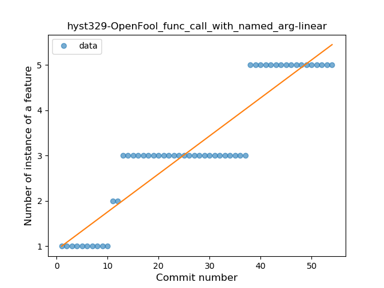
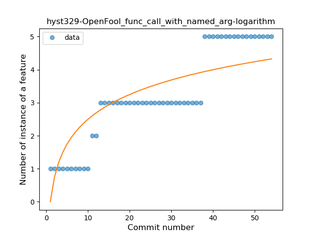
### <a name="property_delegation">Property Delegation</a>
----
#### Functions
* **Sudden Rise Plateau - Logarithm:** 
    * **R_Squared:** 0.65690517
* **Constant Rise - Linear:** 
    * **R_Squared:** 0.38870432

**Plots** :chart_with_upwards_trend:
-----

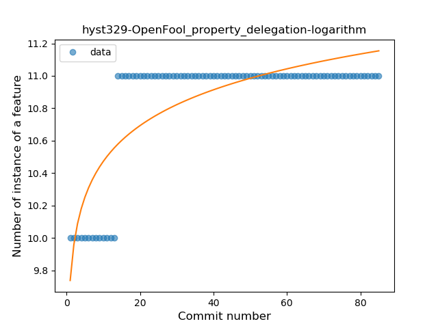
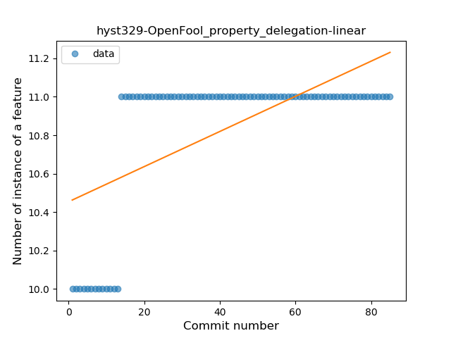
### <a name="destructuring_declaration">Destructuring Declaration</a>
----
#### Functions
* **Sudden Rise - Exponential:** 
    * **R_Squared:** 0.84992413
* **Constant Rise - Linear:** 
    * **R_Squared:** 0.81573774
* **Sudden Rise Plateau - Logarithm:** 
    * **R_Squared:** 0.62734102

**Plots** :chart_with_upwards_trend:
-----

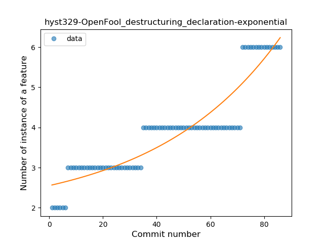
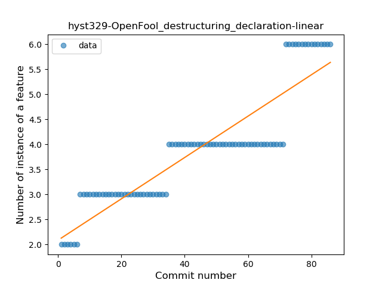
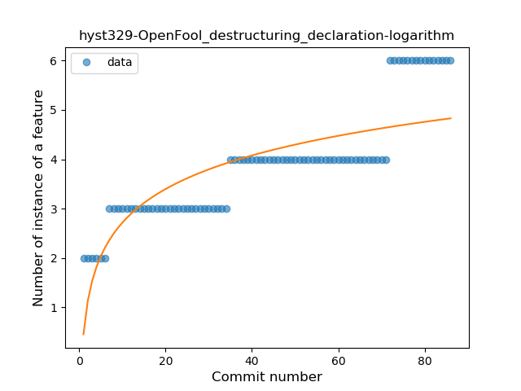
