## iPoli-iPoli-android
----
#### Metrics provided by Detekt
* Number of lines of code 98068
* Number of Kotlin files: 581
* Cyclomatic complexity: 10264
* Cyclomatic complexity by thousands of lines: 169 

----
**19** features analyzed

*	<a href="#type_inference">Type Inference</a> 
*	<a href="#lambda">Lambda</a> 
*	<a href="#safe_call">Safe Call</a> 
*	<a href="#when_expr">When expression</a> 
*	<a href="#companion_object">Companion Object</a> 
*	<a href="#unsafe_call">Unsafe Call</a> 
*	<a href="#string_template">String Template</a> 
*	<a href="#func_with_default_value">Function with Default Value</a> 
*	<a href="#singleton">Singleton</a> 
*	<a href="#smart_cast">Smart Cast</a> 
*	<a href="#range_expr">Range Expression</a> 
*	<a href="#func_call_with_named_arg">Function call with Named Argument</a> 
*	<a href="#data_class">Data Class</a> 
*	<a href="#extension_function">Extension Function</a> 
*	<a href="#property_delegation">Property Delegation</a> 
*	<a href="#destructuring_declaration">Destructuring Declaration</a> 
*	<a href="#inline_func">Inline Function</a> 
*	<a href="#overloaded_op">Overloaded Operator</a> 
*	<a href="#super_delegation">Super Delegation</a> 

### <a name="type_inference">Type Inference</a>
----
#### Functions
* **Sudden Rise - Exponential:** 
    * **R_Squared:** 0.99402818
* **Constant Rise - Linear:** 
    * **R_Squared:** 0.9351687
* **Sudden Rise Plateau - Logarithm:** 
    * **R_Squared:** 0.24343723

**Plots** :chart_with_upwards_trend:
-----

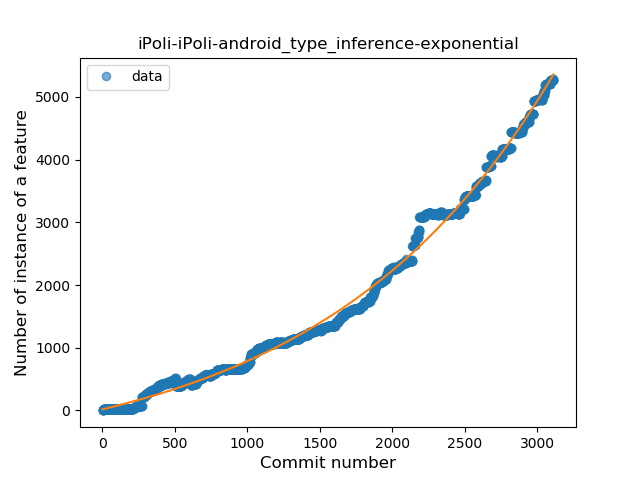
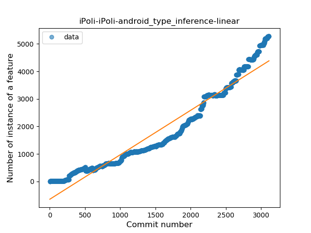
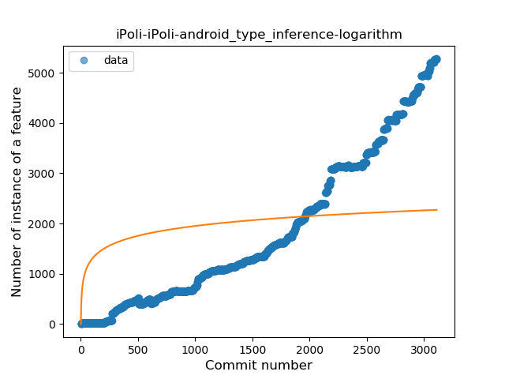
### <a name="lambda">Lambda</a>
----
#### Functions
* **Sudden Rise - Exponential:** 
    * **R_Squared:** 0.99449307
* **Constant Rise - Linear:** 
    * **R_Squared:** 0.8635659
* **Sudden Rise Plateau - Logarithm:** 
    * **R_Squared:** 0.18925612
* **Plateau Gradual Rise - Sigmoid:** 
    * **R_Squared:** 0.15207398

**Plots** :chart_with_upwards_trend:
-----

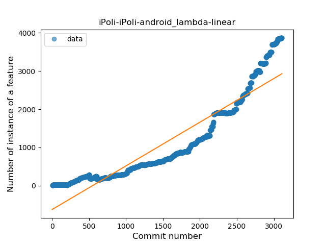
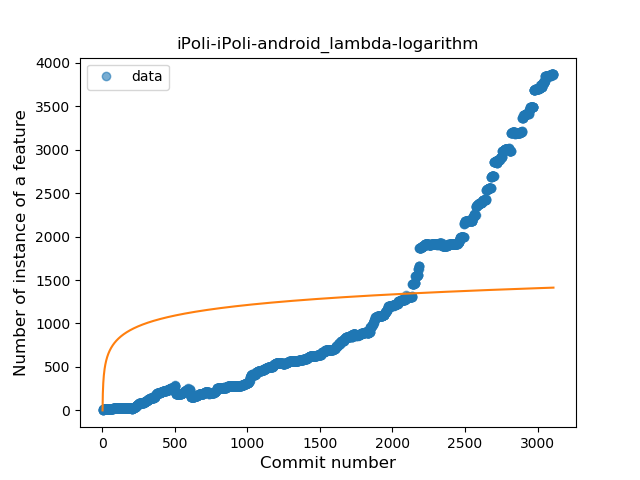
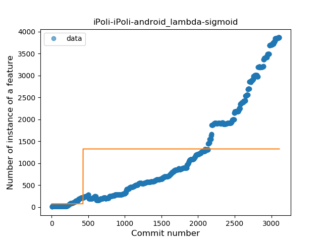
### <a name="safe_call">Safe Call</a>
----
#### Functions
* **Sudden Rise - Exponential:** 
    * **R_Squared:** 0.97864408
* **Constant Rise - Linear:** 
    * **R_Squared:** 0.77174316
* **Sudden Rise Plateau - Logarithm:** 
    * **R_Squared:** 0.1644488
* **Plateau Sudden Rise - Binary Sigmoid:** 
    * **R_Squared:** 0.09506387

**Plots** :chart_with_upwards_trend:
-----

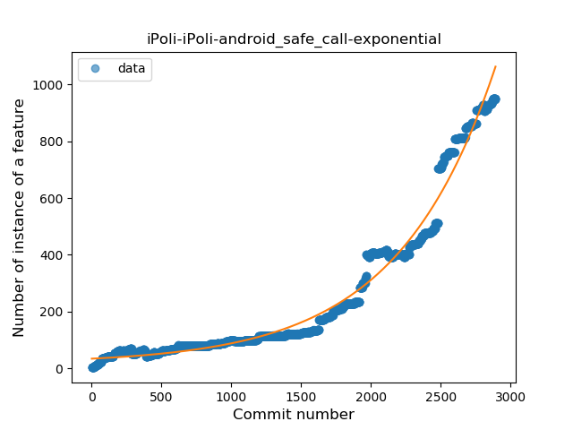
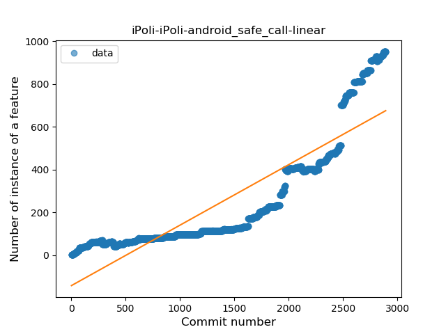
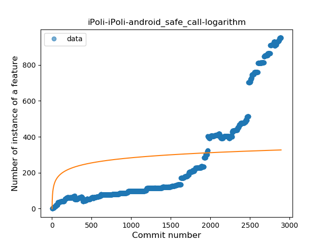
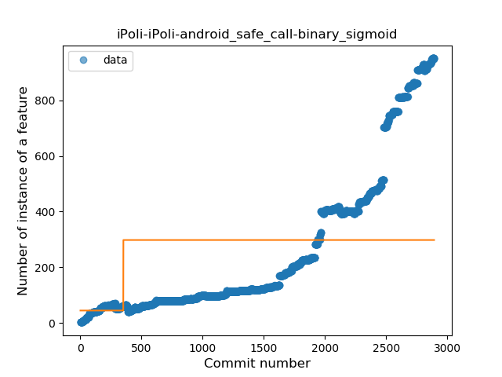
### <a name="when_expr">When expression</a>
----
#### Functions
* **Sudden Rise - Exponential:** 
    * **R_Squared:** 0.98673898
* **Constant Rise - Linear:** 
    * **R_Squared:** 0.86161638
* **Sudden Rise Plateau - Logarithm:** 
    * **R_Squared:** 0.17499684
* **Plateau Sudden Rise - Binary Sigmoid:** 
    * **R_Squared:** 0.04440866

**Plots** :chart_with_upwards_trend:
-----

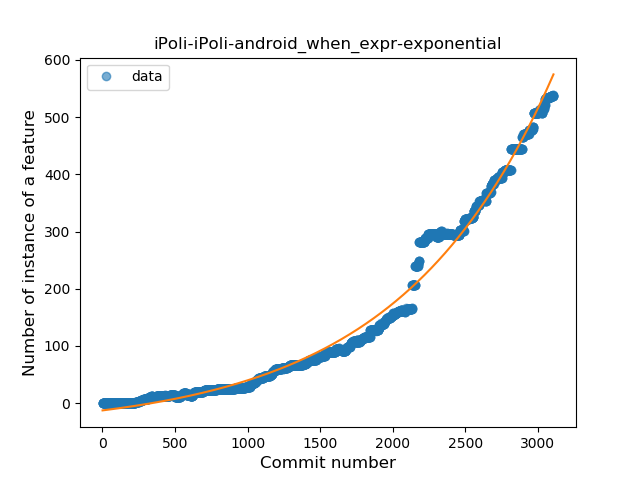
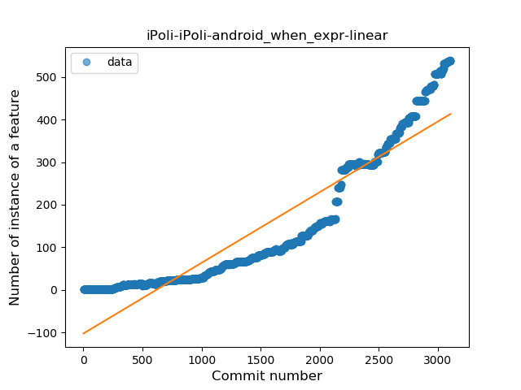
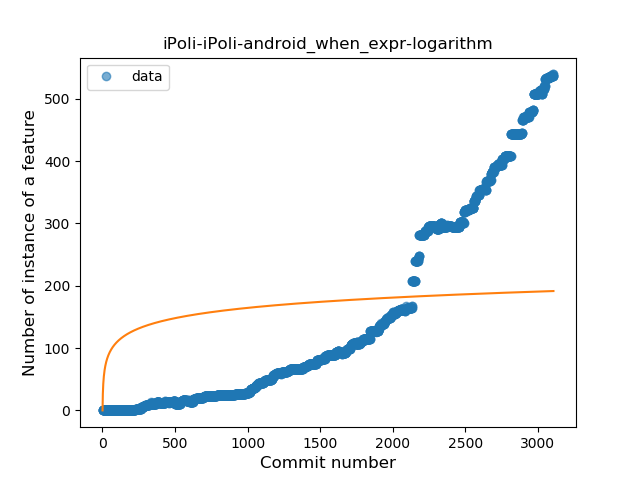
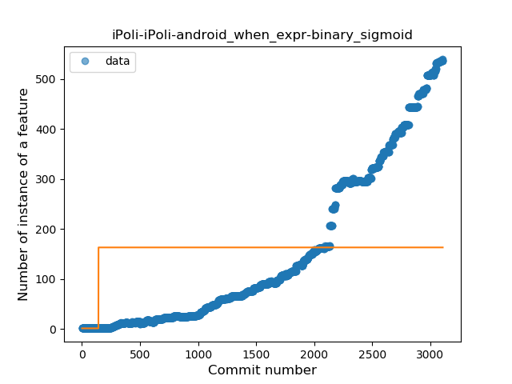
### <a name="companion_object">Companion Object</a>
----
#### Functions
* **Sudden Rise - Exponential:** 
    * **R_Squared:** 0.97190085
* **Plateau Gradual Rise - Sigmoid:** 
    * **R_Squared:** 0.97552635
* **Constant Rise - Linear:** 
    * **R_Squared:** 0.94901357
* **Sudden Rise Plateau - Logarithm:** 
    * **R_Squared:** 0.37040707

**Plots** :chart_with_upwards_trend:
-----

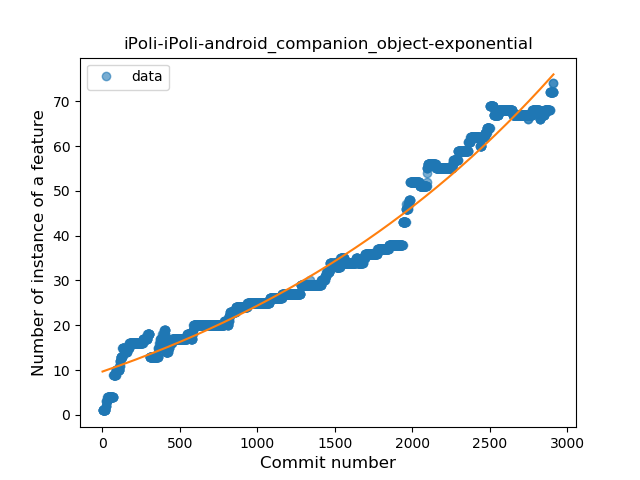

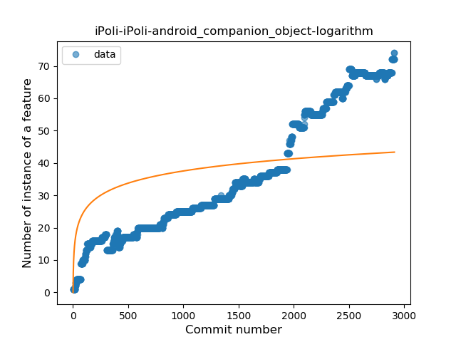
### <a name="unsafe_call">Unsafe Call</a>
----
#### Functions
* **Sudden Rise - Exponential:** 
    * **R_Squared:** 0.98615676
* **Constant Rise - Linear:** 
    * **R_Squared:** 0.80351986
* **Sudden Rise Plateau - Logarithm:** 
    * **R_Squared:** 0.18475692
* **Plateau Sudden Rise - Binary Sigmoid:** 
    * **R_Squared:** 0.0967522

**Plots** :chart_with_upwards_trend:
-----

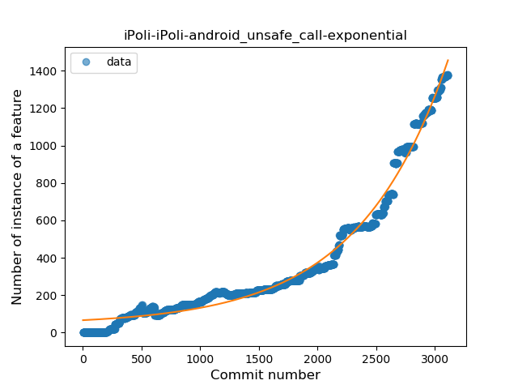
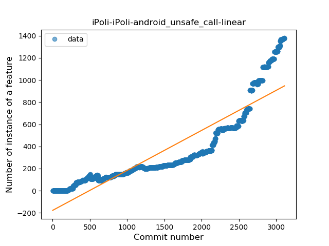

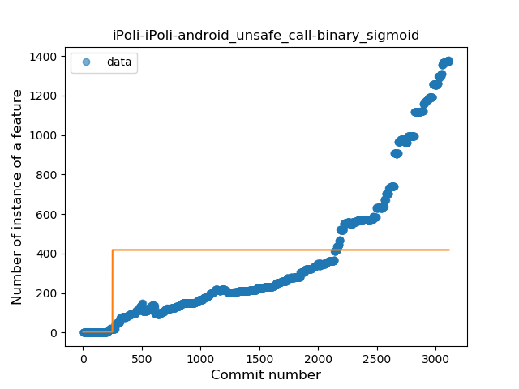
### <a name="string_template">String Template</a>
----
#### Functions
* **Sudden Rise - Exponential:** 
    * **R_Squared:** 0.99141284
* **Constant Rise - Linear:** 
    * **R_Squared:** 0.80109452
* **Sudden Rise Plateau - Logarithm:** 
    * **R_Squared:** 0.15484112
* **Plateau Sudden Rise - Binary Sigmoid:** 
    * **R_Squared:** 0.01648293

**Plots** :chart_with_upwards_trend:
-----

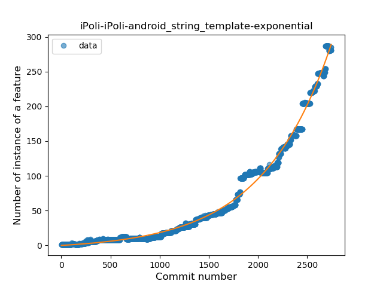

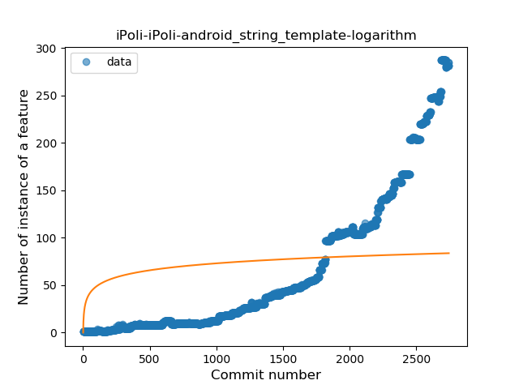

### <a name="func_with_default_value">Function with Default Value</a>
----
#### Functions
* **Sudden Rise - Exponential:** 
    * **R_Squared:** 0.99095397
* **Constant Rise - Linear:** 
    * **R_Squared:** 0.85337707
* **Sudden Rise Plateau - Logarithm:** 
    * **R_Squared:** 0.18710618
* **Plateau Sudden Rise - Binary Sigmoid:** 
    * **R_Squared:** 0.05519038

**Plots** :chart_with_upwards_trend:
-----

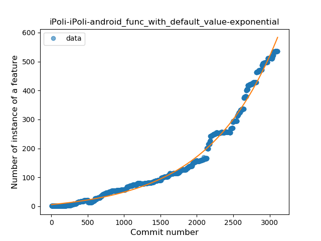
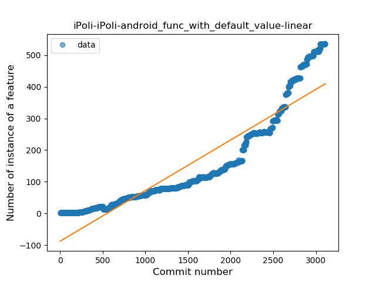
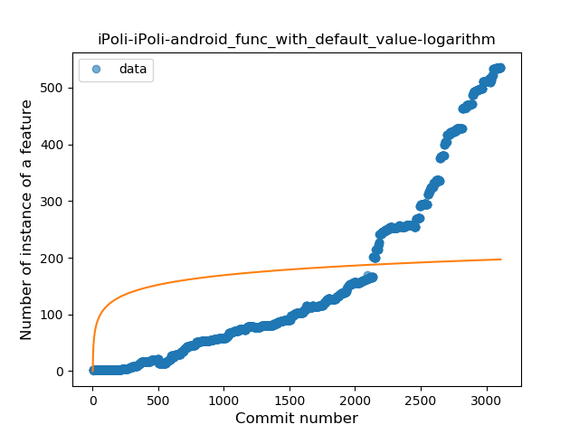
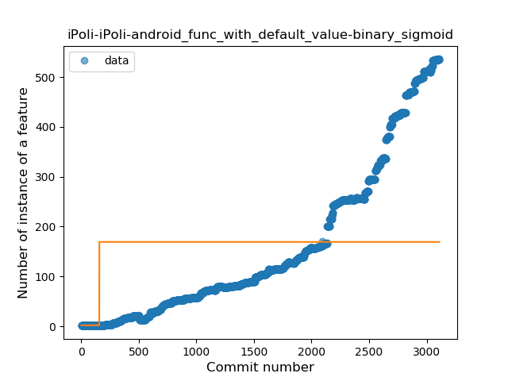
### <a name="singleton">Singleton</a>
----
#### Functions
* **Sudden Rise - Exponential:** 
    * **R_Squared:** 0.98368069
* **Constant Rise - Linear:** 
    * **R_Squared:** 0.89516695
* **Sudden Rise Plateau - Logarithm:** 
    * **R_Squared:** 0.21139314
* **Plateau Sudden Rise - Binary Sigmoid:** 
    * **R_Squared:** 0.06526287

**Plots** :chart_with_upwards_trend:
-----

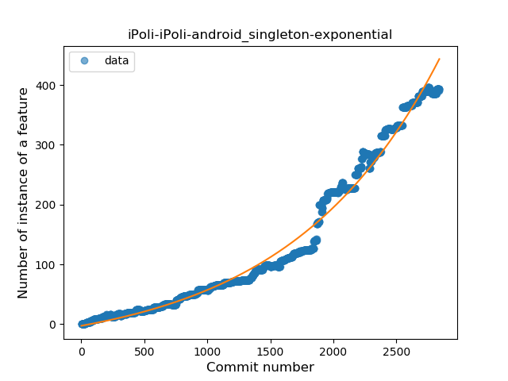
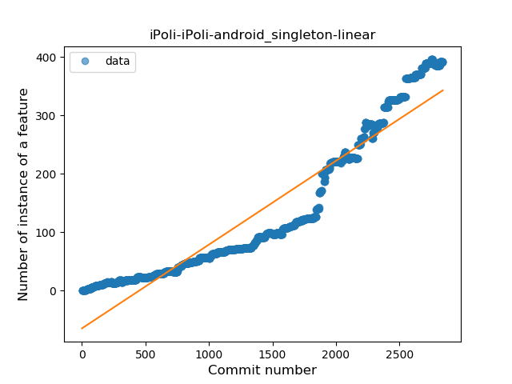

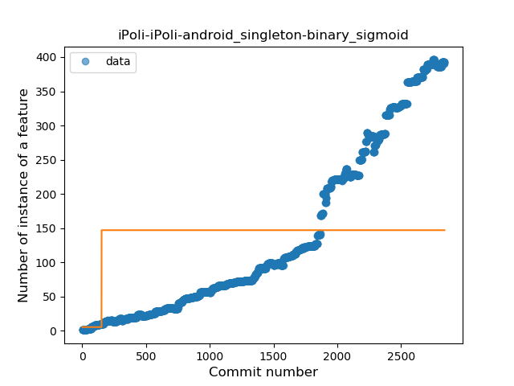
### <a name="smart_cast">Smart Cast</a>
----
#### Functions
* **Sudden Rise - Exponential:** 
    * **R_Squared:** 0.98326608
* **Constant Rise - Linear:** 
    * **R_Squared:** 0.82388494
* **Plateau Sudden Rise - Binary Sigmoid:** 
    * **R_Squared:** 0.61689795
* **Sudden Rise Plateau - Logarithm:** 
    * **R_Squared:** 0.15577196

**Plots** :chart_with_upwards_trend:
-----

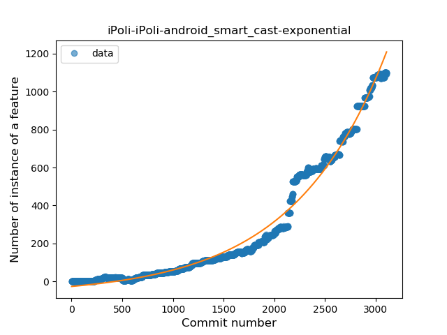
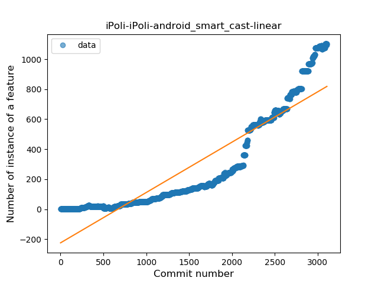

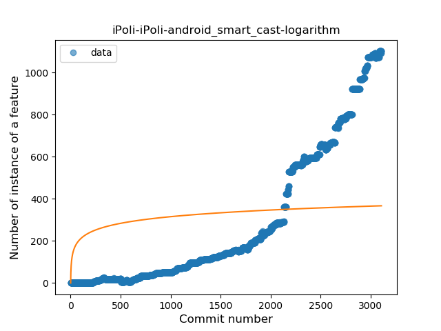
### <a name="range_expr">Range Expression</a>
----
#### Functions
* **Sudden Rise - Exponential:** 
    * **R_Squared:** 0.92775357
* **Constant Rise - Linear:** 
    * **R_Squared:** 0.83819258
* **Sudden Rise Plateau - Logarithm:** 
    * **R_Squared:** 0.23421192
* **Plateau Sudden Rise - Binary Sigmoid:** 
    * **R_Squared:** 0.00569678

**Plots** :chart_with_upwards_trend:
-----

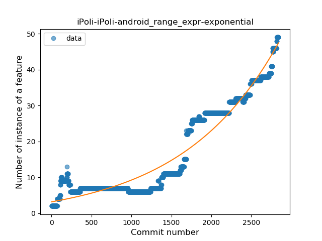
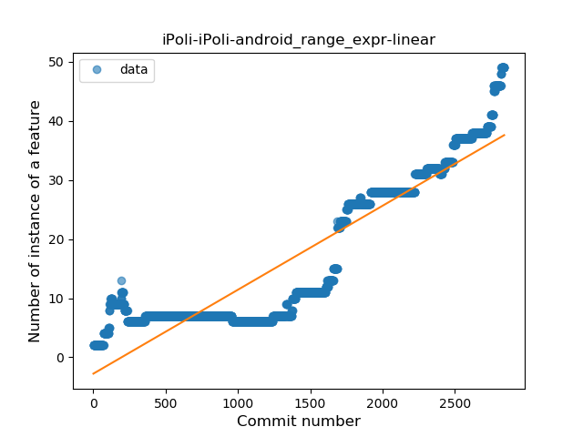
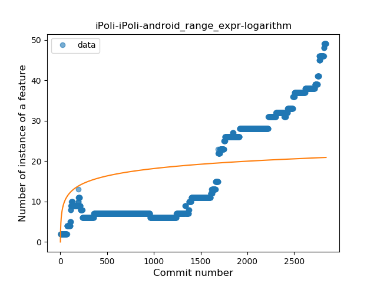
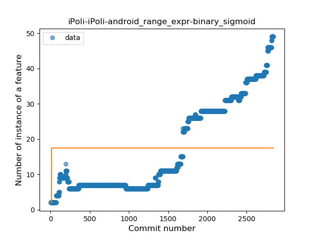
### <a name="func_call_with_named_arg">Function call with Named Argument</a>
----
#### Functions
* **Sudden Rise - Exponential:** 
    * **R_Squared:** 0.99449478
* **Constant Rise - Linear:** 
    * **R_Squared:** 0.87021139
* **Sudden Rise Plateau - Logarithm:** 
    * **R_Squared:** 0.18036294
* **Plateau Sudden Rise - Binary Sigmoid:** 
    * **R_Squared:** 0.04765986

**Plots** :chart_with_upwards_trend:
-----

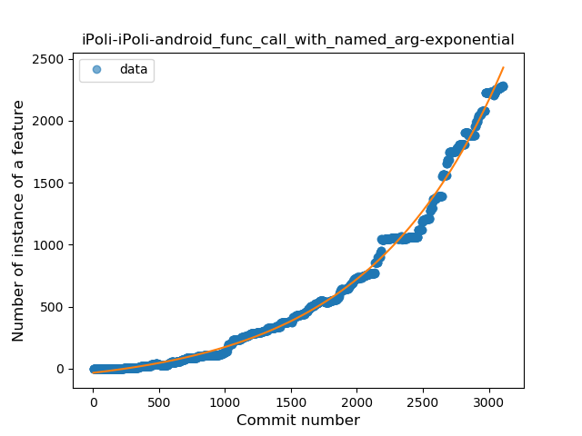
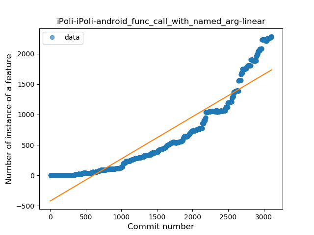

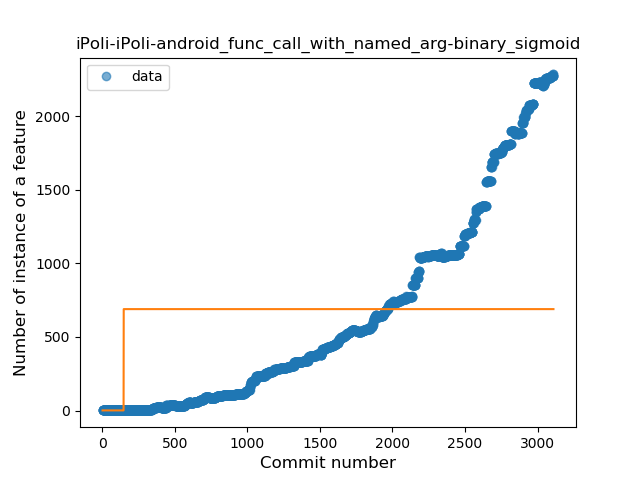
### <a name="data_class">Data Class</a>
----
#### Functions
* **Sudden Rise - Exponential:** 
    * **R_Squared:** 0.98870478
* **Constant Rise - Linear:** 
    * **R_Squared:** 0.87233745
* **Sudden Rise Plateau - Logarithm:** 
    * **R_Squared:** 0.18435564
* **Plateau Sudden Rise - Binary Sigmoid:** 
    * **R_Squared:** 0.118149

**Plots** :chart_with_upwards_trend:
-----

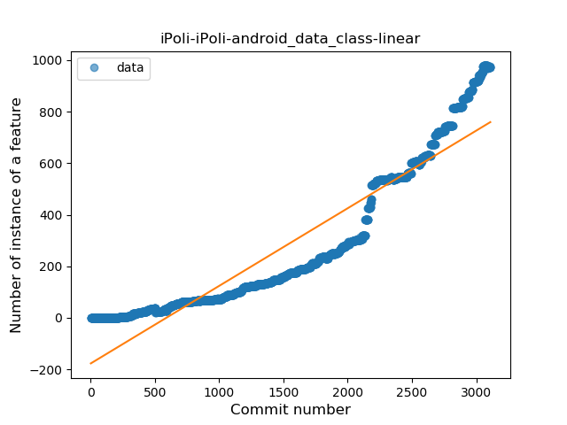
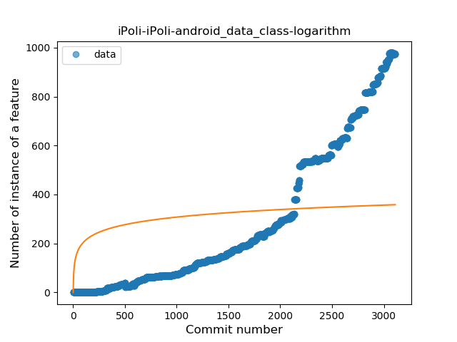
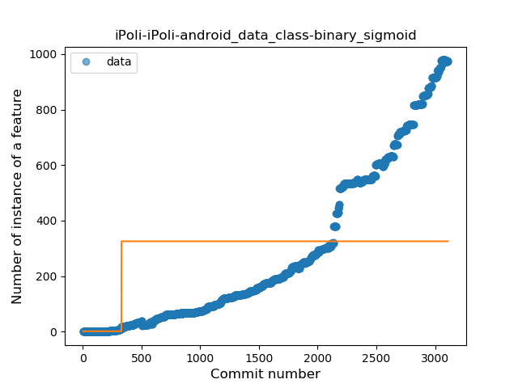
### <a name="extension_function">Extension Function</a>
----
#### Functions
* **Sudden Rise - Exponential:** 
    * **R_Squared:** 0.97656821
* **Constant Rise - Linear:** 
    * **R_Squared:** 0.93876636
* **Plateau Gradual Rise - Sigmoid:** 
    * **R_Squared:** 0.54295773
* **Sudden Rise Plateau - Logarithm:** 
    * **R_Squared:** 0.28444214

**Plots** :chart_with_upwards_trend:
-----

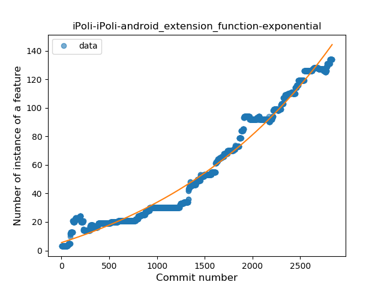
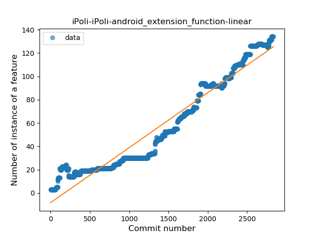
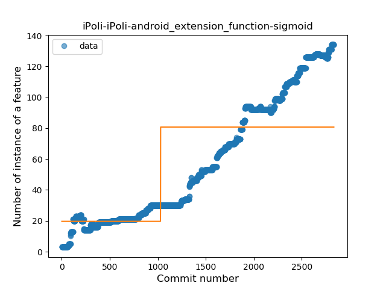
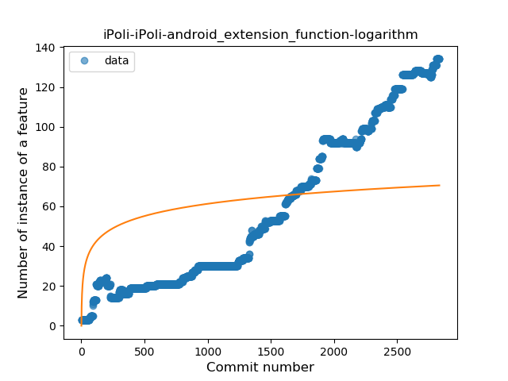
### <a name="property_delegation">Property Delegation</a>
----
#### Functions
* **Sudden Rise - Exponential:** 
    * **R_Squared:** 0.98467334
* **Constant Rise - Linear:** 
    * **R_Squared:** 0.90137243
* **Sudden Rise Plateau - Logarithm:** 
    * **R_Squared:** 0.23502489
* **Plateau Sudden Rise - Binary Sigmoid:** 
    * **R_Squared:** 0.1756131

**Plots** :chart_with_upwards_trend:
-----

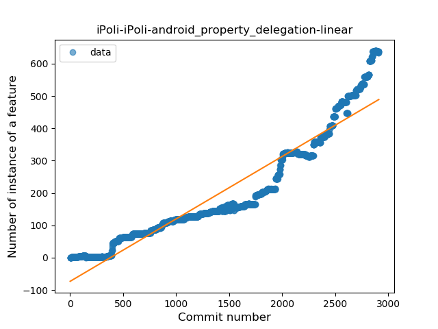
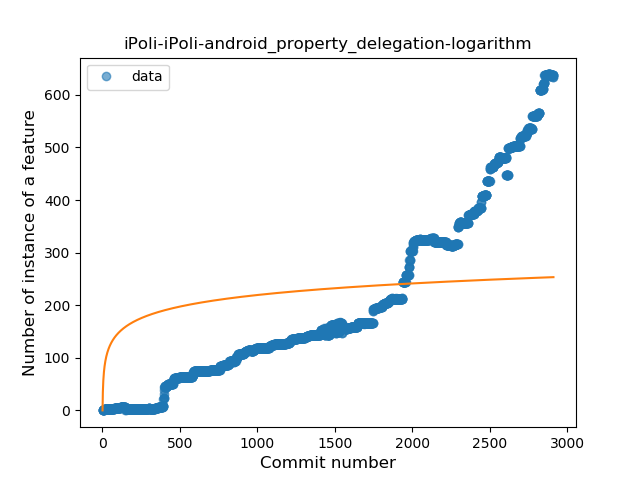
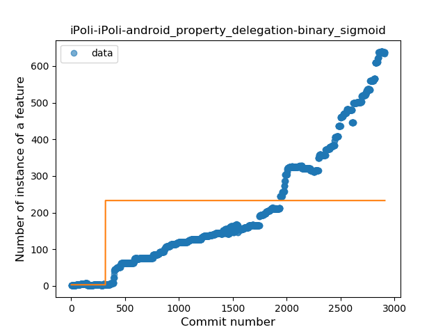
### <a name="destructuring_declaration">Destructuring Declaration</a>
----
#### Functions
* **Sudden Rise - Exponential:** 
    * **R_Squared:** 0.96757739
* **Constant Rise - Linear:** 
    * **R_Squared:** 0.81364422
* **Sudden Rise Plateau - Logarithm:** 
    * **R_Squared:** 0.23369775
* **Plateau Sudden Rise - Binary Sigmoid:** 
    * **R_Squared:** 0.00843629

**Plots** :chart_with_upwards_trend:
-----

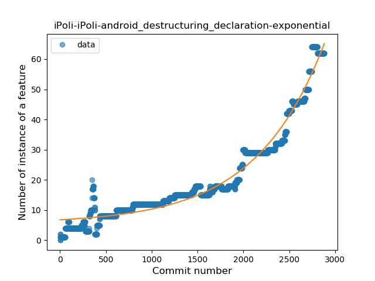
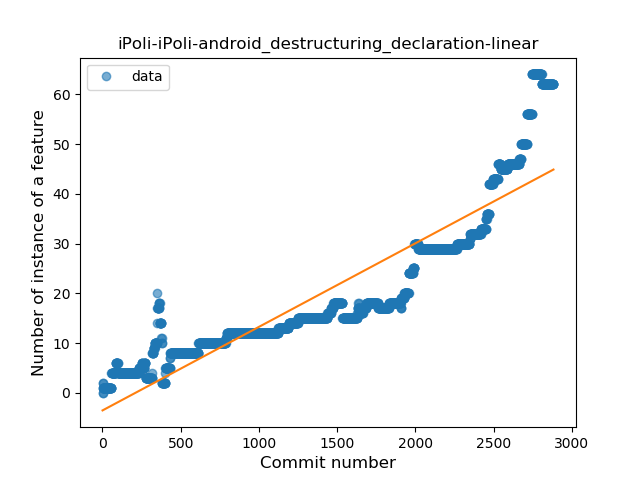

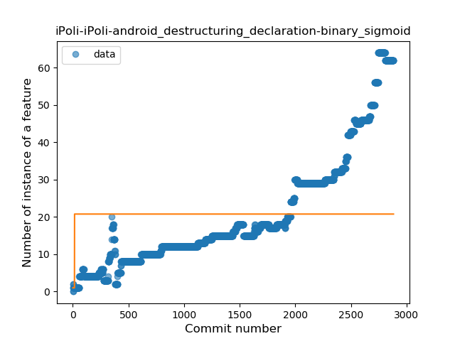
### <a name="inline_func">Inline Function</a>
----
#### Functions
* **Plateau Gradual Rise - Sigmoid:** 
    * **R_Squared:** 0.95964392
* **Sudden Rise - Exponential:** 
    * **R_Squared:** 0.93347497
* **Constant Rise - Linear:** 
    * **R_Squared:** 0.90667798
* **Sudden Rise Plateau - Logarithm:** 
    * **R_Squared:** 0.32847421

**Plots** :chart_with_upwards_trend:
-----

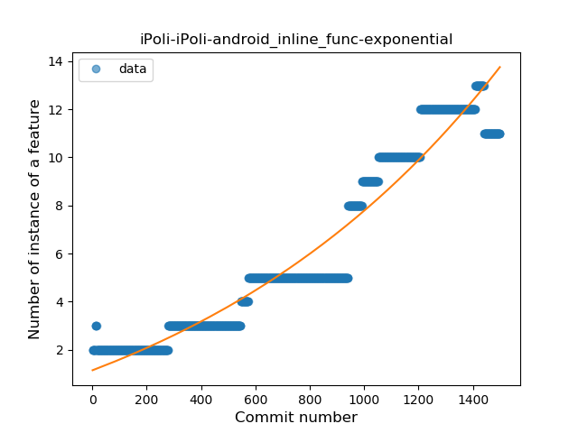
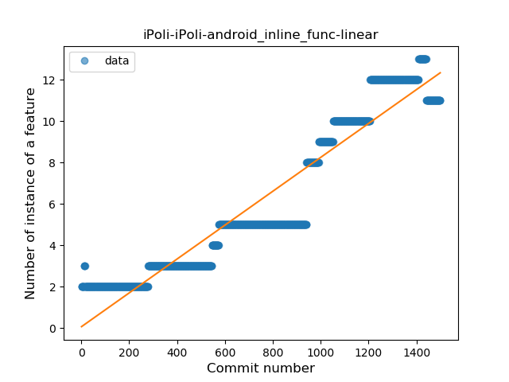
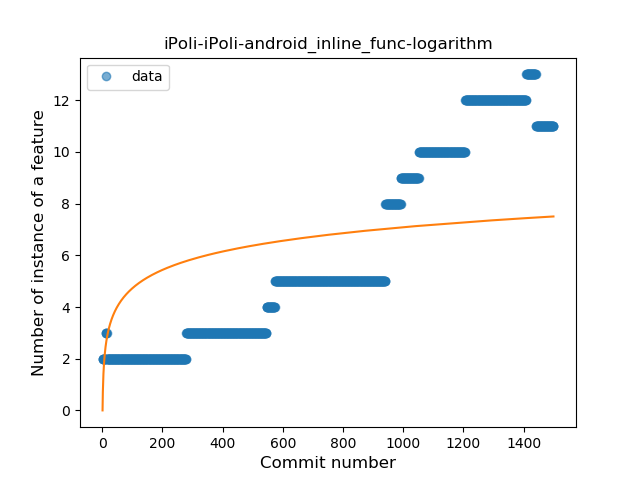
### <a name="overloaded_op">Overloaded Operator</a>
----
#### Functions
* **Constant Rise - Linear:** 
    * **R_Squared:** 0.81175519
* **Sudden Rise Plateau - Logarithm:** 
    * **R_Squared:** 0.33498468

**Plots** :chart_with_upwards_trend:
-----

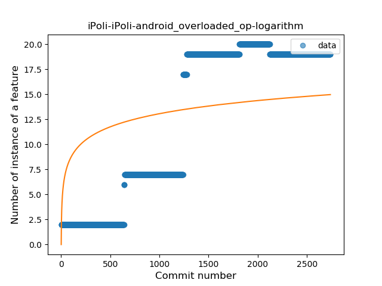
### <a name="super_delegation">Super Delegation</a>
----
#### Functions
* **Plateau Gradual Rise - Sigmoid:** 
    * **R_Squared:** 0.21439415
* **Constant Decline - Linear:** 
    * **R_Squared:** 0.13492527
* **Sudden Rise Plateau - Logarithm:** 
    * **R_Squared:** 0.00016837

**Plots** :chart_with_upwards_trend:
-----

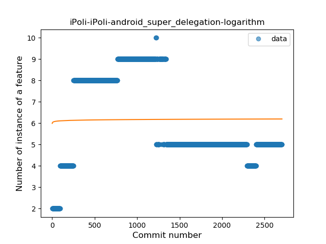
