## iSoron-uhabits
----
#### Metrics provided by Detekt
* Number of lines of code 5922
* Number of Kotlin files: 72
* Cyclomatic complexity: 639
* Cyclomatic complexity by thousands of lines: 243 

----
**8** features analyzed

*	<a href="#type_inference">Type Inference</a> 
*	<a href="#lambda">Lambda</a> 
*	<a href="#safe_call">Safe Call</a> 
*	<a href="#when_expr">When expression</a> 
*	<a href="#companion_object">Companion Object</a> 
*	<a href="#unsafe_call">Unsafe Call</a> 
*	<a href="#smart_cast">Smart Cast</a> 
*	<a href="#range_expr">Range Expression</a> 

### <a name="type_inference">Type Inference</a>
----
#### Functions
* **Sudden Rise Plateau - Logarithm:** 
    * **R_Squared:** 0.62048177
* **Constant Rise - Linear:** 
    * **R_Squared:** 0.5374439

**Plots** :chart_with_upwards_trend:
-----

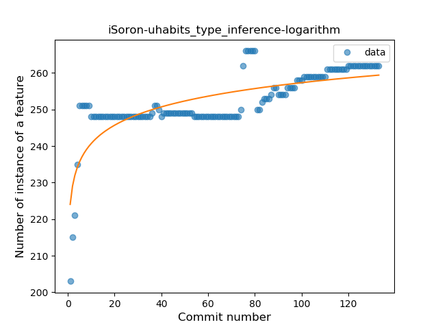
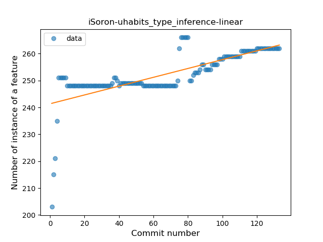
### <a name="lambda">Lambda</a>
----
#### Functions
* **Sudden Rise Plateau - Logarithm:** 
    * **R_Squared:** 0.67595512
* **Constant Rise - Linear:** 
    * **R_Squared:** 0.45509321

**Plots** :chart_with_upwards_trend:
-----

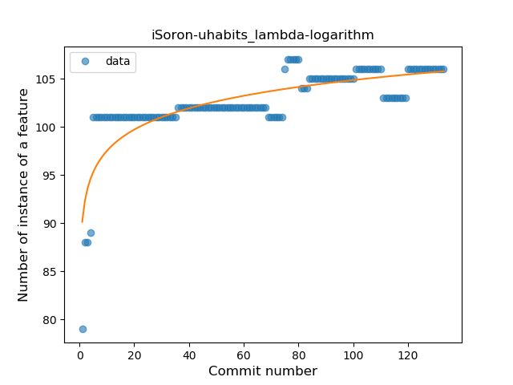
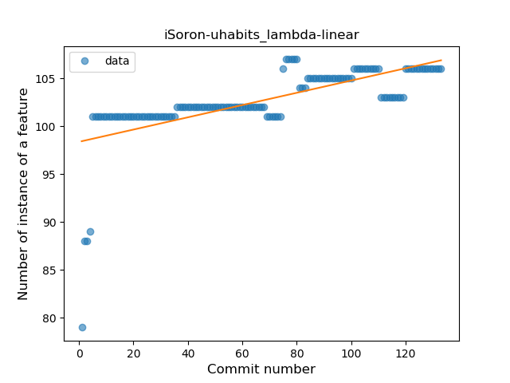
### <a name="safe_call">Safe Call</a>
----
#### Functions
* **Sudden Rise - Exponential:** 
    * **R_Squared:** 0.54458708
* **Constant Rise - Linear:** 
    * **R_Squared:** 0.45337677
* **Sudden Rise Plateau - Logarithm:** 
    * **R_Squared:** 0.3813781

**Plots** :chart_with_upwards_trend:
-----

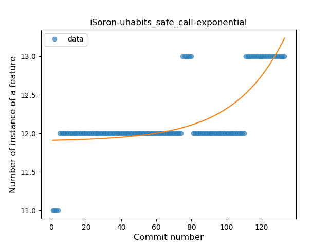
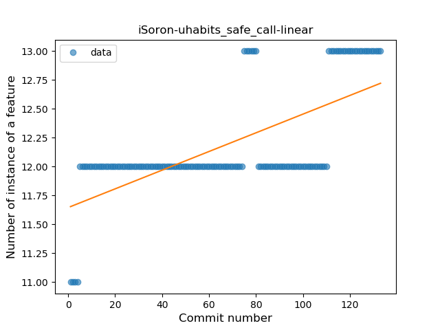

### <a name="when_expr">When expression</a>
----
#### Functions
* **Sudden Rise Plateau - Logarithm:** 
    * **R_Squared:** 0.45082321
* **Sudden Rise - Exponential:** 
    * **R_Squared:** 0.4396161
* **Constant Rise - Linear:** 
    * **R_Squared:** 0.40896568

**Plots** :chart_with_upwards_trend:
-----

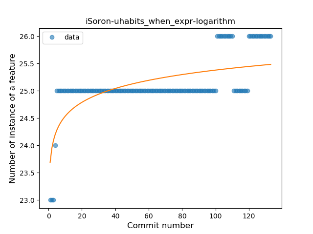
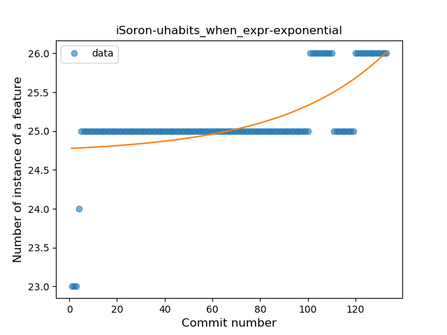
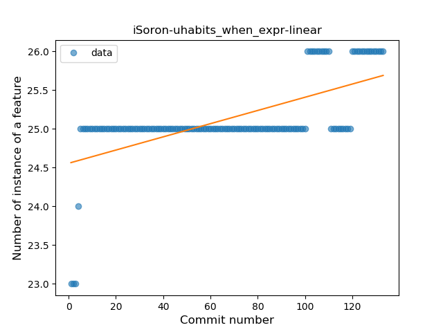
### <a name="companion_object">Companion Object</a>
----
#### Functions
* **Sudden Rise - Exponential:** 
    * **R_Squared:** 0.78281721
* **Constant Rise - Linear:** 
    * **R_Squared:** 0.43688976
* **Sudden Rise Plateau - Logarithm:** 
    * **R_Squared:** 0.19195516

**Plots** :chart_with_upwards_trend:
-----

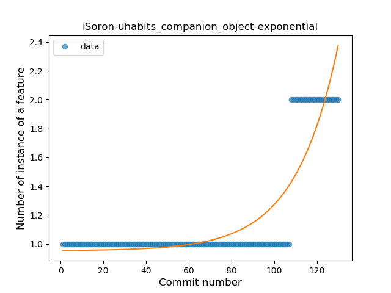
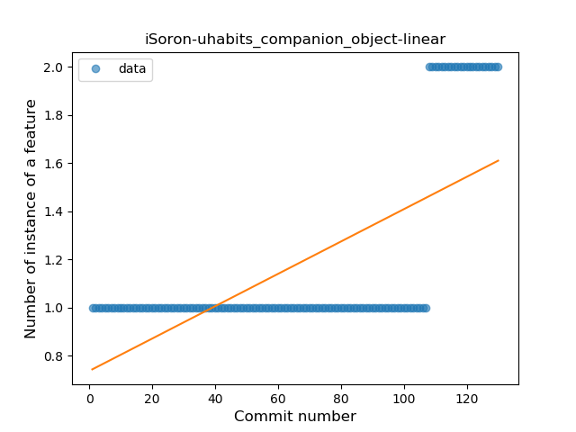
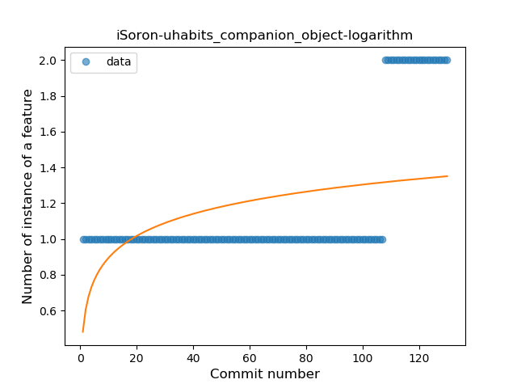
### <a name="unsafe_call">Unsafe Call</a>
----
#### Functions
* **Plateau Gradual Rise - Sigmoid:** 
    * **R_Squared:** 0.83035178
* **Sudden Rise - Exponential:** 
    * **R_Squared:** 0.7914928
* **Constant Rise - Linear:** 
    * **R_Squared:** 0.64770806
* **Sudden Rise Plateau - Logarithm:** 
    * **R_Squared:** 0.45218242

**Plots** :chart_with_upwards_trend:
-----

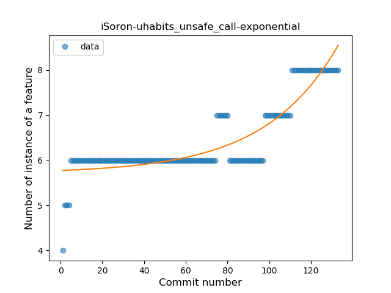
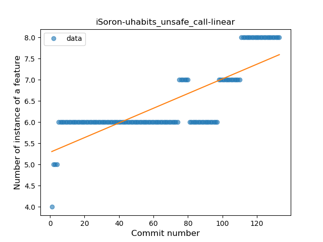
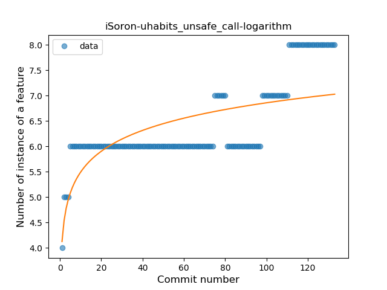
### <a name="smart_cast">Smart Cast</a>
----
#### Functions
* **Plateau Sudden Decline - Binary Sigmoid:** 
    * **R_Squared:** 1.0
* **Constant Decline - Linear:** 
    * **R_Squared:** 0.42910448
* **Sudden Rise Plateau - Logarithm:** 
    * **R_Squared:** -0.0

**Plots** :chart_with_upwards_trend:
-----

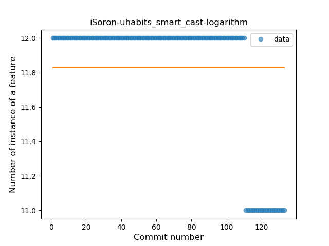
### <a name="range_expr">Range Expression</a>
----
#### Functions
* **Plateau Sudden Rise - Binary Sigmoid:** 
    * **R_Squared:** 0.68632075
* **Sudden Rise - Exponential:** 
    * **R_Squared:** 0.56177617
* **Constant Rise - Linear:** 
    * **R_Squared:** 0.40928292
* **Sudden Rise Plateau - Logarithm:** 
    * **R_Squared:** 0.199862

**Plots** :chart_with_upwards_trend:
-----

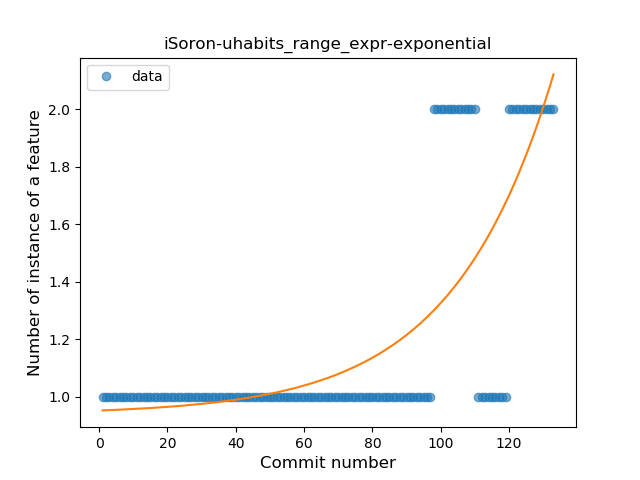
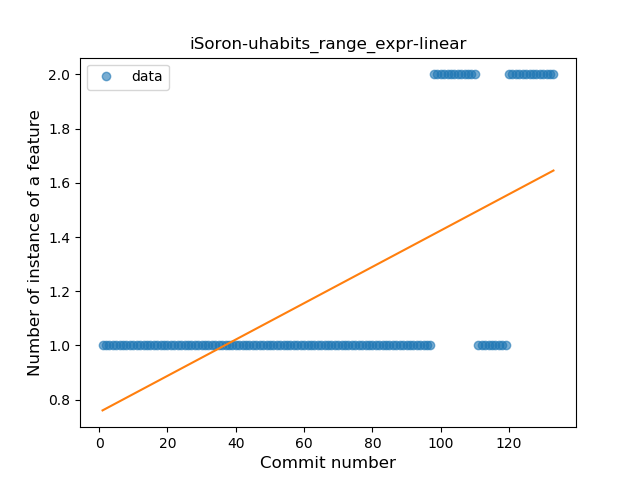
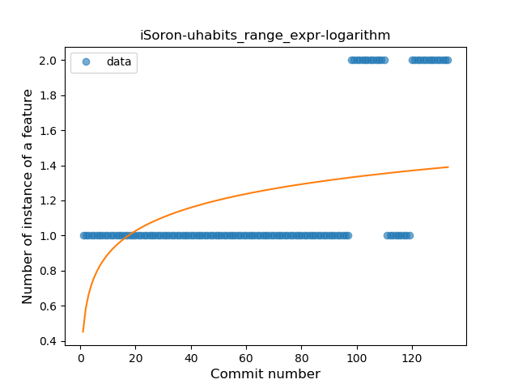
