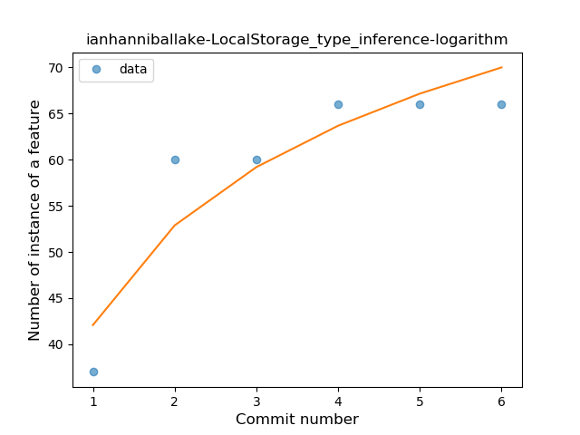
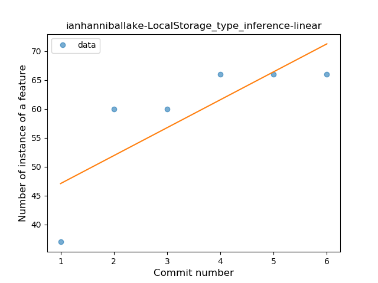
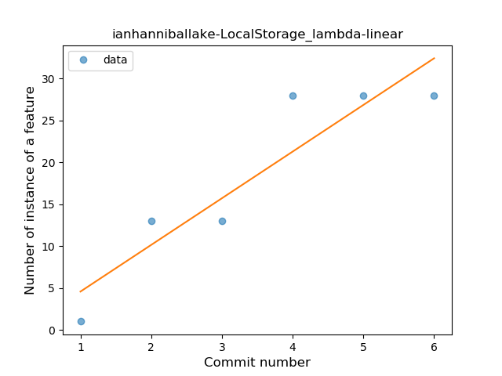
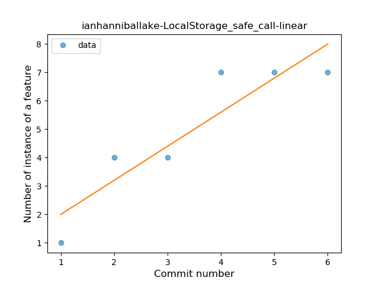
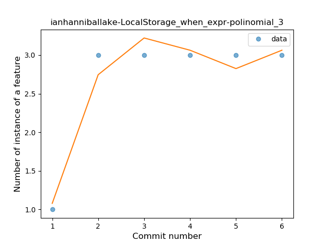
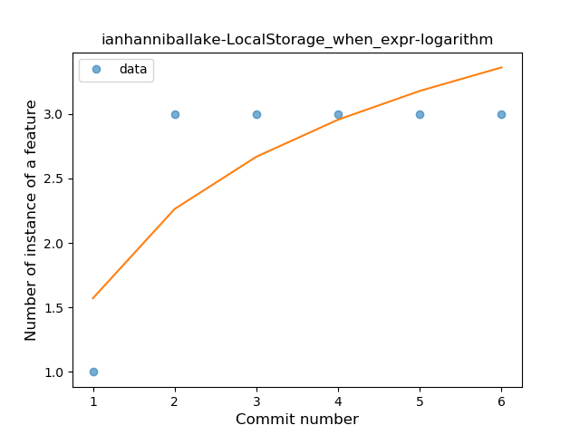
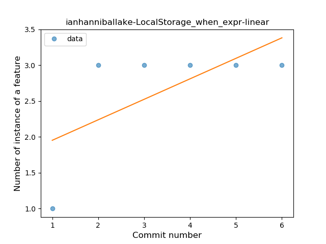
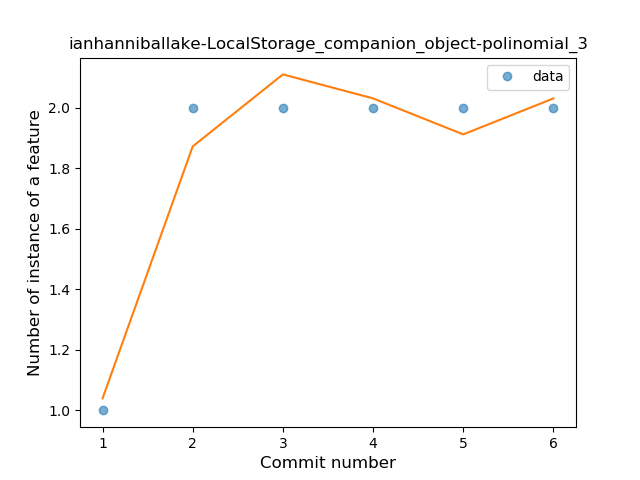
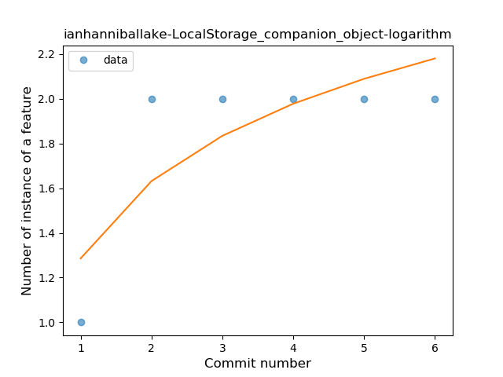
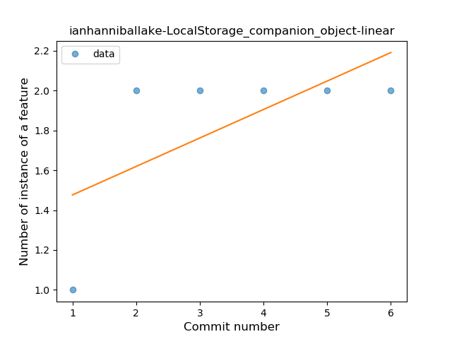

## ianhanniballake-LocalStorage
----
#### Metrics provided by Detekt
* Number of lines of code 738
* Number of Kotlin files: 4
* Cyclomatic complexity: 107
* Cyclomatic complexity by thousands of lines: 245 

----
**5** features analyzed

*	<a href="#type_inference">Type Inference</a> 
*	<a href="#lambda">Lambda</a> 
*	<a href="#safe_call">Safe Call</a> 
*	<a href="#when_expr">When expression</a> 
*	<a href="#companion_object">Companion Object</a> 

### <a name="type_inference">Type Inference</a>
----
#### Functions
* **Instability - Polinomial 3:** )
    * **R_Squared:** 0.94831759
* **Sudden Rise Plateau - Logarithm:** 
    * **R_Squared:** 0.84222378
* **Constant Rise - Linear:** 
    * **R_Squared:** 0.64474209

**Plots** :chart_with_upwards_trend:
-----

### <a name="lambda">Lambda</a>
----
#### Functions
* **Sudden Rise Plateau - Logarithm:** 
    * **R_Squared:** 0.90685137
* **Constant Rise - Linear:** 
    * **R_Squared:** 0.85210084

**Plots** :chart_with_upwards_trend:
-----

### <a name="safe_call">Safe Call</a>
----
#### Functions
* **Sudden Rise Plateau - Logarithm:** 
    * **R_Squared:** 0.91974604
* **Constant Rise - Linear:** 
    * **R_Squared:** 0.84

**Plots** :chart_with_upwards_trend:
-----

### <a name="when_expr">When expression</a>
----
#### Functions
* **Instability - Polinomial 4:** 
    * **R_Squared:** 0.9952381
* **Instability - Polinomial 3:** )
    * **R_Squared:** 0.95238095
* **Sudden Rise Plateau - Logarithm:** 
    * **R_Squared:** 0.65720643
* **Constant Rise - Linear:** 
    * **R_Squared:** 0.42857143

**Plots** :chart_with_upwards_trend:
-----

### <a name="companion_object">Companion Object</a>
----
#### Functions
* **Instability - Polinomial 4:** 
    * **R_Squared:** 0.9952381
* **Instability - Polinomial 3:** )
    * **R_Squared:** 0.95238095
* **Sudden Rise Plateau - Logarithm:** 
    * **R_Squared:** 0.65720643
* **Constant Rise - Linear:** 
    * **R_Squared:** 0.42857143

**Plots** :chart_with_upwards_trend:
-----

