## ids1024-lsdict-android
----
#### Metrics provided by Detekt
* Number of lines of code 209
* Number of Kotlin files: 5
* Cyclomatic complexity: 29
* Cyclomatic complexity by thousands of lines: 302 

----
**4** features analyzed

*	<a href="#type_inference">Type Inference</a> 
*	<a href="#lambda">Lambda</a> 
*	<a href="#when_expr">When expression</a> 
*	<a href="#string_template">String Template</a> 

### <a name="type_inference">Type Inference</a>
----
#### Functions
* **Sudden Rise Plateau - Logarithm:** 
    * **R_Squared:** 0.85085637
* **Constant Rise - Linear:** 
    * **R_Squared:** 0.70208968

**Plots** :chart_with_upwards_trend:
-----

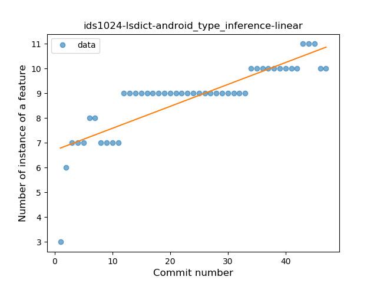
### <a name="lambda">Lambda</a>
----
#### Functions
* **Sudden Decline - Exponential:** 
    * **R_Squared:** 0.68682805
* **Plateau Gradual Decline - Sigmoid:** 
    * **R_Squared:** 0.69380851
* **Constant Decline - Linear:** 
    * **R_Squared:** 0.12952524
* **Sudden Rise Plateau - Logarithm:** 
    * **R_Squared:** -0.0

**Plots** :chart_with_upwards_trend:
-----

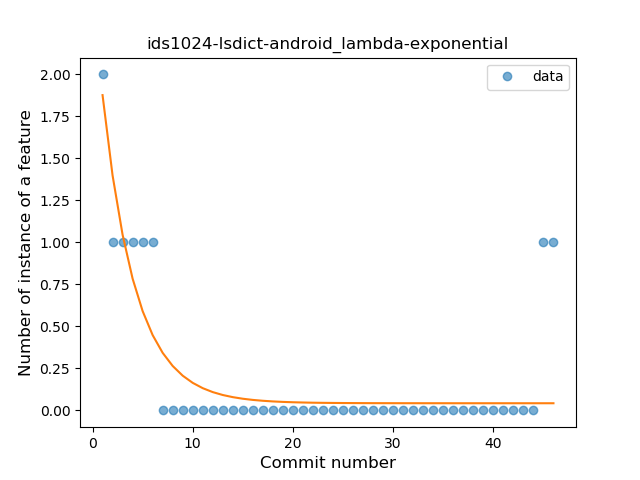
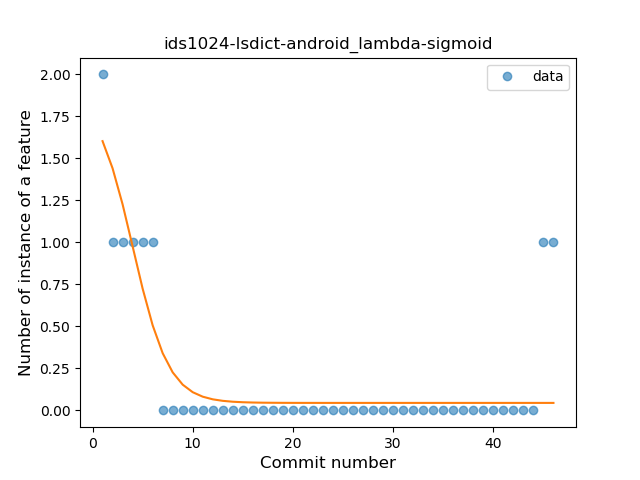
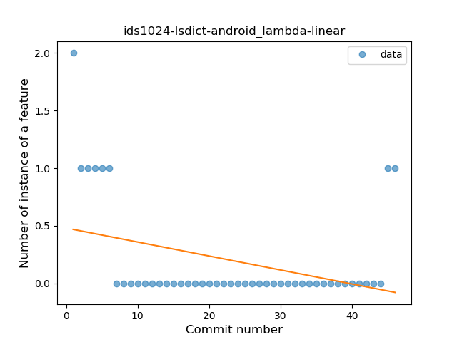
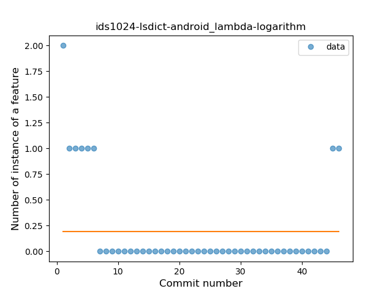
### <a name="when_expr">When expression</a>
----
#### Functions
* **Plateau Sudden Rise - Binary Sigmoid:** 
    * **R_Squared:** 1.0
* **Instability - Polinomial 4:** 
    * **R_Squared:** 0.85067873
* **Instability - Polinomial 3:** )
    * **R_Squared:** 0.83201357
* **Sudden Rise - Exponential:** 
    * **R_Squared:** 0.82181974
* **Constant Rise - Linear:** 
    * **R_Squared:** 0.36923077
* **Sudden Rise Plateau - Logarithm:** 
    * **R_Squared:** 0.19295912

**Plots** :chart_with_upwards_trend:
-----

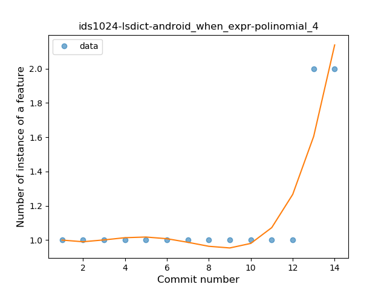
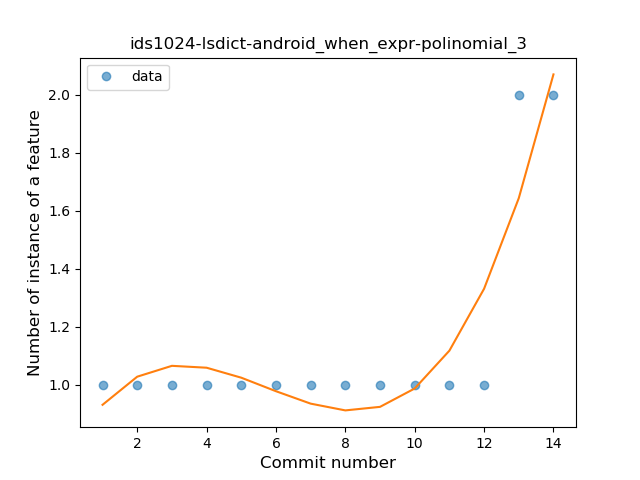
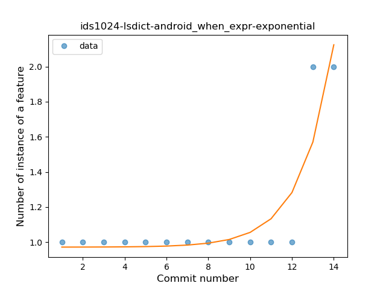
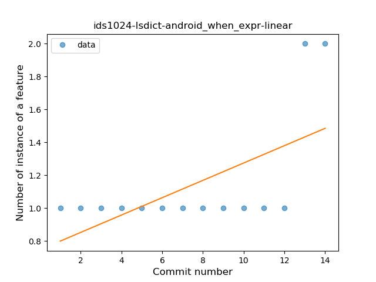
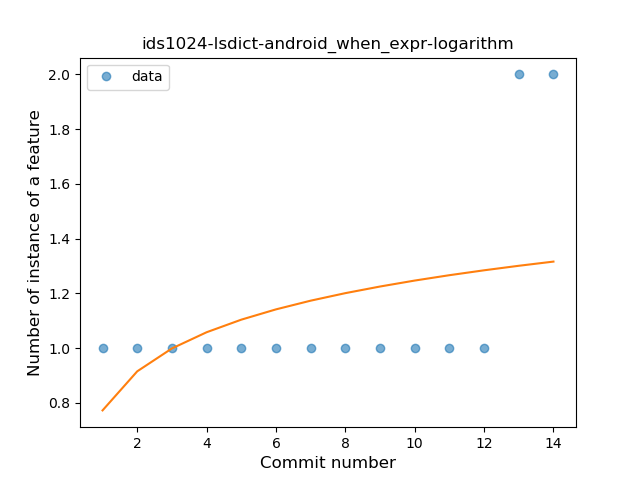
### <a name="string_template">String Template</a>
----
#### Functions
* **Instability - Polinomial 4:** 
    * **R_Squared:** 1.0
* **Instability - Polinomial 3:** )
    * **R_Squared:** 0.98214286
* **Constant Decline - Linear:** 
    * **R_Squared:** 0.5
* **Sudden Rise Plateau - Logarithm:** 
    * **R_Squared:** -0.0

**Plots** :chart_with_upwards_trend:
-----

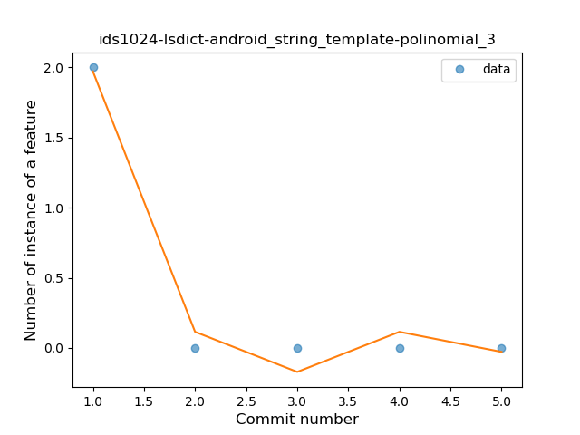
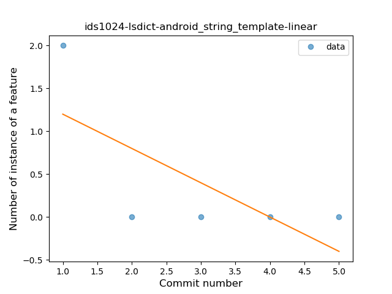
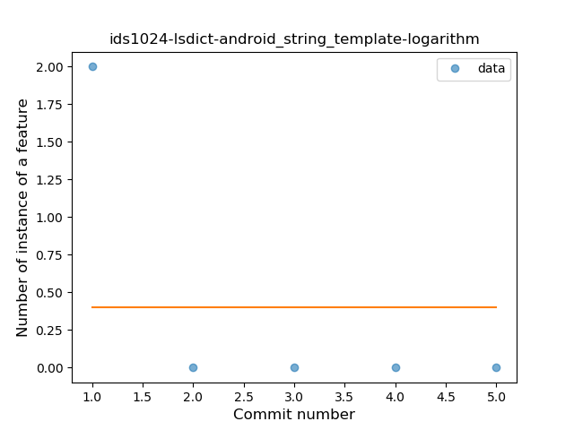
