## ids1024-whitakers-words-android
----
#### Metrics provided by Detekt
* Number of lines of code 551
* Number of Kotlin files: 7
* Cyclomatic complexity: 92
* Cyclomatic complexity by thousands of lines: 326 

----
**7** features analyzed

*	<a href="#type_inference">Type Inference</a> 
*	<a href="#lambda">Lambda</a> 
*	<a href="#safe_call">Safe Call</a> 
*	<a href="#when_expr">When expression</a> 
*	<a href="#unsafe_call">Unsafe Call</a> 
*	<a href="#string_template">String Template</a> 
*	<a href="#destructuring_declaration">Destructuring Declaration</a> 

### <a name="type_inference">Type Inference</a>
----
#### Functions
* **Sudden Rise Plateau - Logarithm:** 
    * **R_Squared:** 0.39218785
* **Constant Rise - Linear:** 
    * **R_Squared:** 0.21961956

**Plots** :chart_with_upwards_trend:
-----

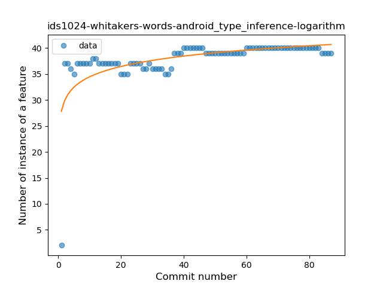
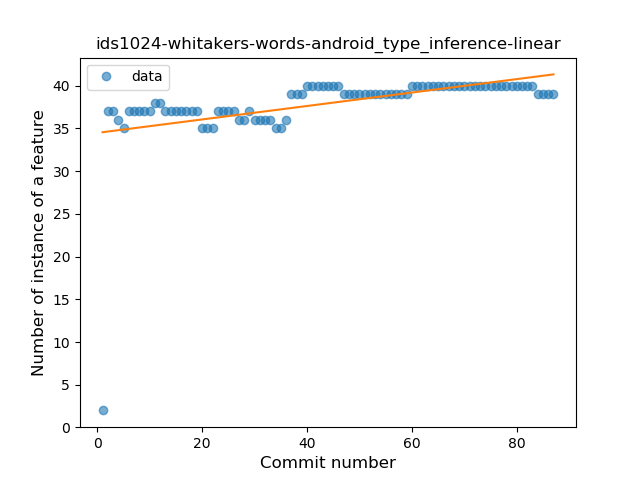
### <a name="lambda">Lambda</a>
----
#### Functions
* **Plateau Sudden Decline - Binary Sigmoid:** 
    * **R_Squared:** 0.04167286
* **Constant Decline - Linear:** 
    * **R_Squared:** 0.01515596
* **Sudden Rise Plateau - Logarithm:** 
    * **R_Squared:** -0.0

**Plots** :chart_with_upwards_trend:
-----

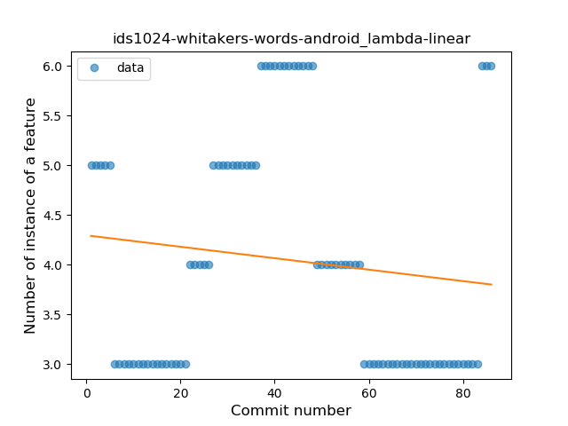
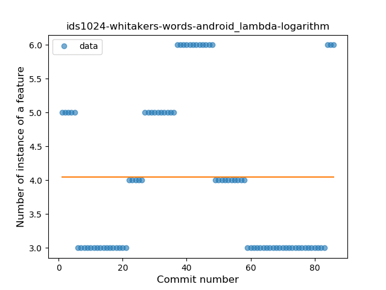
### <a name="safe_call">Safe Call</a>
----
#### Functions
* **Constant Decline - Linear:** 
    * **R_Squared:** 0.36234016
* **Sudden Rise Plateau - Logarithm:** 
    * **R_Squared:** 0.0

**Plots** :chart_with_upwards_trend:
-----

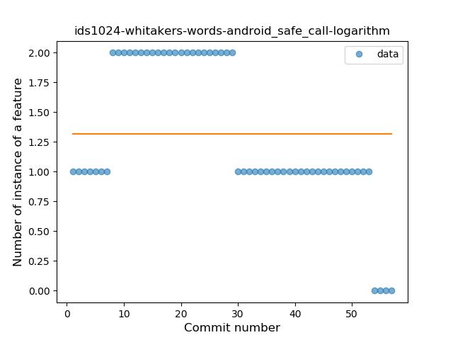
### <a name="when_expr">When expression</a>
----
#### Functions
* **Plateau Sudden Rise - Binary Sigmoid:** 
    * **R_Squared:** 1.0
* **Sudden Rise Plateau - Logarithm:** 
    * **R_Squared:** 0.68197542
* **Constant Rise - Linear:** 
    * **R_Squared:** 0.55375254

**Plots** :chart_with_upwards_trend:
-----

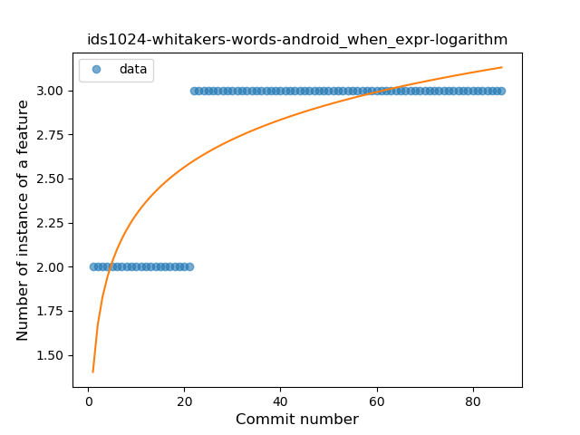
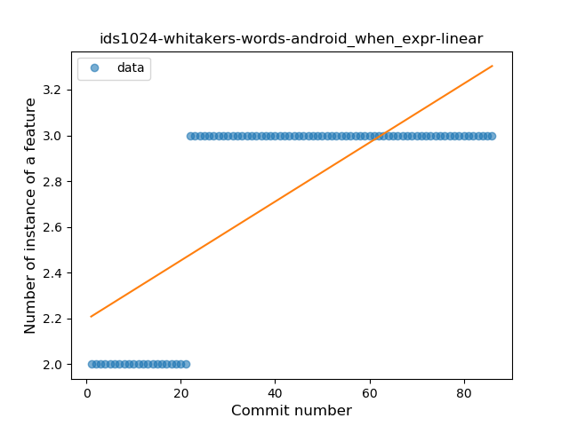
### <a name="unsafe_call">Unsafe Call</a>
----
#### Functions
* **Instability - Polinomial 3:** )
    * **R_Squared:** 0.4968856
* **Constant Rise - Linear:** 
    * **R_Squared:** 0.07540345
* **Sudden Rise - Exponential:** 
    * **R_Squared:** 0.07628658
* **Sudden Rise Plateau - Logarithm:** 
    * **R_Squared:** 0.00098667

**Plots** :chart_with_upwards_trend:
-----

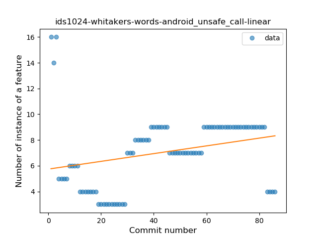
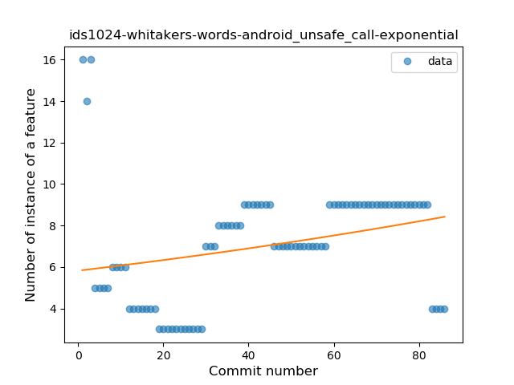
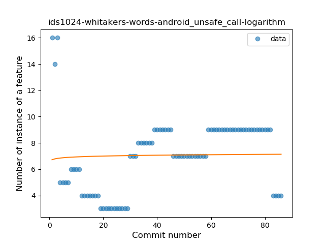
### <a name="string_template">String Template</a>
----
#### Functions
* **Plateau Gradual Rise - Sigmoid:** 
    * **R_Squared:** 0.96629968
* **Sudden Rise Plateau - Logarithm:** 
    * **R_Squared:** 0.75388822
* **Constant Rise - Linear:** 
    * **R_Squared:** 0.64436568

**Plots** :chart_with_upwards_trend:
-----

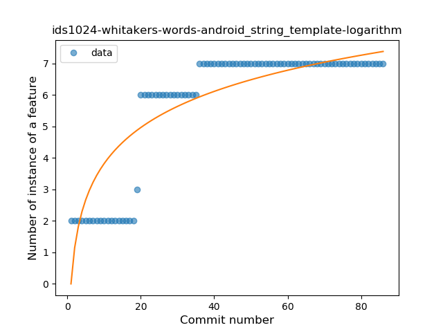
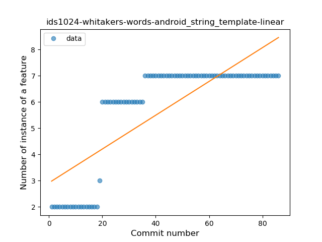
### <a name="destructuring_declaration">Destructuring Declaration</a>
----
#### Functions
* **Plateau Sudden Rise - Binary Sigmoid:** 
    * **R_Squared:** 1.0
* **Sudden Rise Plateau - Logarithm:** 
    * **R_Squared:** 0.45968083
* **Constant Rise - Linear:** 
    * **R_Squared:** 0.16615385

**Plots** :chart_with_upwards_trend:
-----

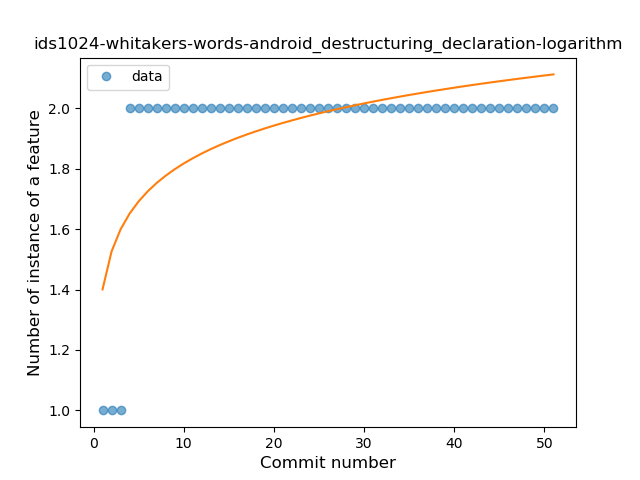
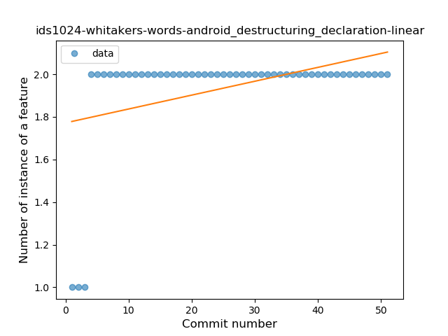
