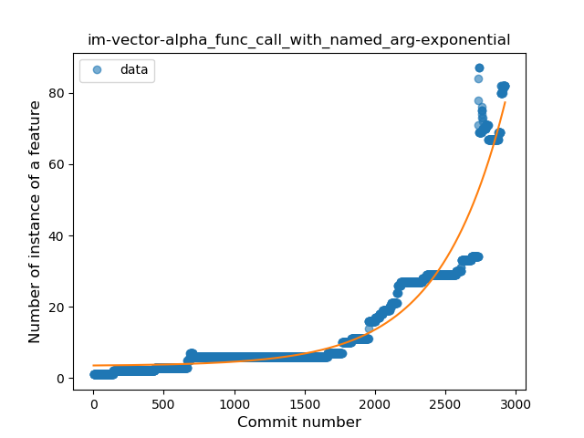

## im-vector-alpha
----
#### Metrics provided by Detekt
* Number of lines of code 30726
* Number of Kotlin files: 222
* Cyclomatic complexity: 3699
* Cyclomatic complexity by thousands of lines: 288 

----
**22** features analyzed

*	<a href="#type_inference">Type Inference</a> 
*	<a href="#lambda">Lambda</a> 
*	<a href="#safe_call">Safe Call</a> 
*	<a href="#when_expr">When expression</a> 
*	<a href="#unsafe_call">Unsafe Call</a> 
*	<a href="#companion_object">Companion Object</a> 
*	<a href="#string_template">String Template</a> 
*	<a href="#func_with_default_value">Function with Default Value</a> 
*	<a href="#singleton">Singleton</a> 
*	<a href="#range_expr">Range Expression</a> 
*	<a href="#smart_cast">Smart Cast</a> 
*	<a href="#data_class">Data Class</a> 
*	<a href="#func_call_with_named_arg">Function call with Named Argument</a> 
*	<a href="#extension_function">Extension Function</a> 
*	<a href="#property_delegation">Property Delegation</a> 
*	<a href="#destructuring_declaration">Destructuring Declaration</a> 
*	<a href="#inline_func">Inline Function</a> 
*	<a href="#overloaded_op">Overloaded Operator</a> 
*	<a href="#coroutine">Coroutine</a> 
*	<a href="#sealed_class">Sealed Class</a> 
*	<a href="#type_alias">Type Alias</a> 
*	<a href="#super_delegation">Super Delegation</a> 

### <a name="type_inference">Type Inference</a>
----
#### Functions
* **Constant Rise - Linear:** 
    * **R_Squared:** 0.93953855
* **Sudden Rise - Exponential:** 
    * **R_Squared:** 0.94903697
* **Sudden Rise Plateau - Logarithm:** 
    * **R_Squared:** 0.40917055
* **Plateau Sudden Rise - Binary Sigmoid:** 
    * **R_Squared:** 0.16194441

**Plots** :chart_with_upwards_trend:
-----

### <a name="lambda">Lambda</a>
----
#### Functions
* **Sudden Rise - Exponential:** 
    * **R_Squared:** 0.95848079
* **Constant Rise - Linear:** 
    * **R_Squared:** 0.92734654
* **Sudden Rise Plateau - Logarithm:** 
    * **R_Squared:** 0.3551249
* **Plateau Sudden Rise - Binary Sigmoid:** 
    * **R_Squared:** 0.22747447

**Plots** :chart_with_upwards_trend:
-----

### <a name="safe_call">Safe Call</a>
----
#### Functions
* **Sudden Rise - Exponential:** 
    * **R_Squared:** 0.96124476
* **Constant Rise - Linear:** 
    * **R_Squared:** 0.89045667
* **Sudden Rise Plateau - Logarithm:** 
    * **R_Squared:** 0.19911803
* **Plateau Sudden Rise - Binary Sigmoid:** 
    * **R_Squared:** 0.14073476

**Plots** :chart_with_upwards_trend:
-----

### <a name="when_expr">When expression</a>
----
#### Functions
* **Sudden Rise - Exponential:** 
    * **R_Squared:** 0.98223202
* **Constant Rise - Linear:** 
    * **R_Squared:** 0.91899808
* **Sudden Rise Plateau - Logarithm:** 
    * **R_Squared:** 0.2864546
* **Plateau Sudden Rise - Binary Sigmoid:** 
    * **R_Squared:** 0.04002269

**Plots** :chart_with_upwards_trend:
-----

### <a name="unsafe_call">Unsafe Call</a>
----
#### Functions
* **Constant Rise - Linear:** 
    * **R_Squared:** 0.76808153
* **Sudden Rise - Exponential:** 
    * **R_Squared:** 0.76841504
* **Sudden Rise Plateau - Logarithm:** 
    * **R_Squared:** 0.43976158
* **Plateau Sudden Rise - Binary Sigmoid:** 
    * **R_Squared:** 0.11538248

**Plots** :chart_with_upwards_trend:
-----

### <a name="companion_object">Companion Object</a>
----
#### Functions
* **Sudden Rise - Exponential:** 
    * **R_Squared:** 0.97690466
* **Constant Rise - Linear:** 
    * **R_Squared:** 0.91226161
* **Sudden Rise Plateau - Logarithm:** 
    * **R_Squared:** 0.26989824

**Plots** :chart_with_upwards_trend:
-----

### <a name="string_template">String Template</a>
----
#### Functions
* **Plateau Gradual Rise - Sigmoid:** 
    * **R_Squared:** 0.95528513
* **Sudden Rise - Exponential:** 
    * **R_Squared:** 0.93021903
* **Constant Rise - Linear:** 
    * **R_Squared:** 0.82473179
* **Sudden Rise Plateau - Logarithm:** 
    * **R_Squared:** 0.2913371

**Plots** :chart_with_upwards_trend:
-----

### <a name="func_with_default_value">Function with Default Value</a>
----
#### Functions
* **Sudden Rise - Exponential:** 
    * **R_Squared:** 0.97333805
* **Constant Rise - Linear:** 
    * **R_Squared:** 0.9008291
* **Sudden Rise Plateau - Logarithm:** 
    * **R_Squared:** 0.26799827

**Plots** :chart_with_upwards_trend:
-----

### <a name="singleton">Singleton</a>
----
#### Functions
* **Constant Rise - Linear:** 
    * **R_Squared:** 0.93910584
* **Sudden Rise Plateau - Logarithm:** 
    * **R_Squared:** 0.34400326
* **Plateau Sudden Rise - Binary Sigmoid:** 
    * **R_Squared:** 0.02805338

**Plots** :chart_with_upwards_trend:
-----

### <a name="range_expr">Range Expression</a>
----
#### Functions
* **Plateau Gradual Rise - Sigmoid:** 
    * **R_Squared:** 0.94567332
* **Sudden Rise - Exponential:** 
    * **R_Squared:** 0.906247
* **Constant Rise - Linear:** 
    * **R_Squared:** 0.74139681
* **Sudden Rise Plateau - Logarithm:** 
    * **R_Squared:** 0.31866503

**Plots** :chart_with_upwards_trend:
-----

### <a name="smart_cast">Smart Cast</a>
----
#### Functions
* **Sudden Rise - Exponential:** 
    * **R_Squared:** 0.95822449
* **Constant Rise - Linear:** 
    * **R_Squared:** 0.89132004
* **Sudden Rise Plateau - Logarithm:** 
    * **R_Squared:** 0.29422515

**Plots** :chart_with_upwards_trend:
-----

### <a name="data_class">Data Class</a>
----
#### Functions
* **Sudden Rise - Exponential:** 
    * **R_Squared:** 0.96510891
* **Constant Rise - Linear:** 
    * **R_Squared:** 0.86111336
* **Sudden Rise Plateau - Logarithm:** 
    * **R_Squared:** 0.35518796
* **Plateau Sudden Rise - Binary Sigmoid:** 
    * **R_Squared:** 0.01396468

**Plots** :chart_with_upwards_trend:
-----

### <a name="func_call_with_named_arg">Function call with Named Argument</a>
----
#### Functions
* **Sudden Rise - Exponential:** 
    * **R_Squared:** 0.93138707
* **Constant Rise - Linear:** 
    * **R_Squared:** 0.64026809
* **Sudden Rise Plateau - Logarithm:** 
    * **R_Squared:** 0.12610237

**Plots** :chart_with_upwards_trend:
-----

### <a name="extension_function">Extension Function</a>
----
#### Functions
* **Sudden Rise - Exponential:** 
    * **R_Squared:** 0.95999829
* **Plateau Gradual Rise - Sigmoid:** 
    * **R_Squared:** 0.96737481
* **Constant Rise - Linear:** 
    * **R_Squared:** 0.92638215
* **Sudden Rise Plateau - Logarithm:** 
    * **R_Squared:** 0.32068766

**Plots** :chart_with_upwards_trend:
-----

### <a name="property_delegation">Property Delegation</a>
----
#### Functions
* **Constant Rise - Linear:** 
    * **R_Squared:** 0.71897295
* **Sudden Rise Plateau - Logarithm:** 
    * **R_Squared:** 0.63280405
* **Plateau Sudden Rise - Binary Sigmoid:** 
    * **R_Squared:** 0.03796779

**Plots** :chart_with_upwards_trend:
-----

### <a name="destructuring_declaration">Destructuring Declaration</a>
----
#### Functions
* **Constant Rise - Linear:** 
    * **R_Squared:** 0.85113526
* **Sudden Rise Plateau - Logarithm:** 
    * **R_Squared:** 0.42793456

**Plots** :chart_with_upwards_trend:
-----

### <a name="inline_func">Inline Function</a>
----
#### Functions
* **Plateau Sudden Rise - Binary Sigmoid:** 
    * **R_Squared:** 1.0
* **Sudden Rise Plateau - Logarithm:** 
    * **R_Squared:** 0.38161494
* **Constant Rise - Linear:** 
    * **R_Squared:** 0.09129645

**Plots** :chart_with_upwards_trend:
-----

### <a name="overloaded_op">Overloaded Operator</a>
----
#### Functions
* **Plateau Sudden Rise - Binary Sigmoid:** 
    * **R_Squared:** 1.0
* **Sudden Rise - Exponential:** 
    * **R_Squared:** 0.7913988
* **Constant Rise - Linear:** 
    * **R_Squared:** 0.3376051
* **Sudden Rise Plateau - Logarithm:** 
    * **R_Squared:** 0.13056977

**Plots** :chart_with_upwards_trend:
-----

### <a name="coroutine">Coroutine</a>
----
#### Functions
* **Constant Rise - Linear:** 
    * **R_Squared:** 0.00618409
* **Sudden Rise - Exponential:** 
    * **R_Squared:** 0.00653409
* **Sudden Rise Plateau - Logarithm:** 
    * **R_Squared:** 0.00346843

**Plots** :chart_with_upwards_trend:
-----

### <a name="sealed_class">Sealed Class</a>
----
#### Functions
* **Constant Rise - Linear:** 
    * **R_Squared:** 0.89229208
* **Sudden Rise Plateau - Logarithm:** 
    * **R_Squared:** 0.55437989

**Plots** :chart_with_upwards_trend:
-----

### <a name="type_alias">Type Alias</a>
----
#### Functions
* **Plateau Sudden Rise - Binary Sigmoid:** 
    * **R_Squared:** 1.0
* **Sudden Rise Plateau - Logarithm:** 
    * **R_Squared:** 0.39668695
* **Constant Rise - Linear:** 
    * **R_Squared:** 0.09657153

**Plots** :chart_with_upwards_trend:
-----

### <a name="super_delegation">Super Delegation</a>
----
#### Functions
* **Sudden Rise Plateau - Logarithm:** 
    * **R_Squared:** 0.41294738
* **Constant Rise - Linear:** 
    * **R_Squared:** 0.10511024

**Plots** :chart_with_upwards_trend:
-----

