## impalex-knockonports
----
#### Metrics provided by Detekt
* Number of lines of code 3577
* Number of Kotlin files: 36
* Cyclomatic complexity: 458
* Cyclomatic complexity by thousands of lines: 275 

----
**15** features analyzed

*	<a href="#type_inference">Type Inference</a> 
*	<a href="#lambda">Lambda</a> 
*	<a href="#safe_call">Safe Call</a> 
*	<a href="#when_expr">When expression</a> 
*	<a href="#companion_object">Companion Object</a> 
*	<a href="#unsafe_call">Unsafe Call</a> 
*	<a href="#string_template">String Template</a> 
*	<a href="#func_with_default_value">Function with Default Value</a> 
*	<a href="#smart_cast">Smart Cast</a> 
*	<a href="#range_expr">Range Expression</a> 
*	<a href="#func_call_with_named_arg">Function call with Named Argument</a> 
*	<a href="#data_class">Data Class</a> 
*	<a href="#extension_function">Extension Function</a> 
*	<a href="#property_delegation">Property Delegation</a> 
*	<a href="#inline_func">Inline Function</a> 

### <a name="type_inference">Type Inference</a>
----
#### Functions
* **Instability - Polinomial 4:** 
    * **R_Squared:** 0.93886394
* **Constant Rise - Linear:** 
    * **R_Squared:** 0.81570657
* **Sudden Rise - Exponential:** 
    * **R_Squared:** 0.81644352
* **Sudden Rise Plateau - Logarithm:** 
    * **R_Squared:** 0.76930317

**Plots** :chart_with_upwards_trend:
-----

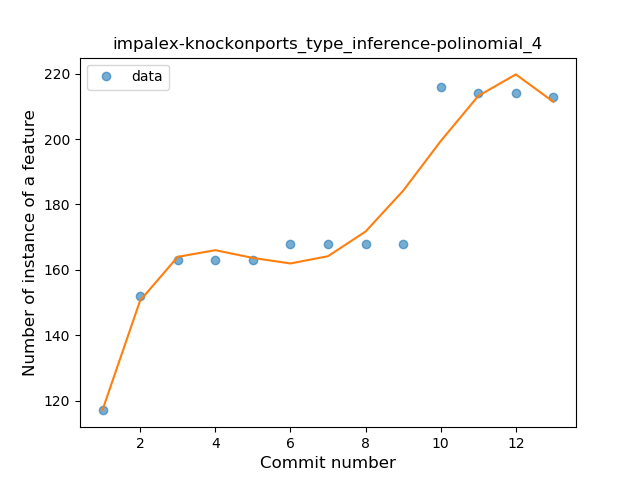
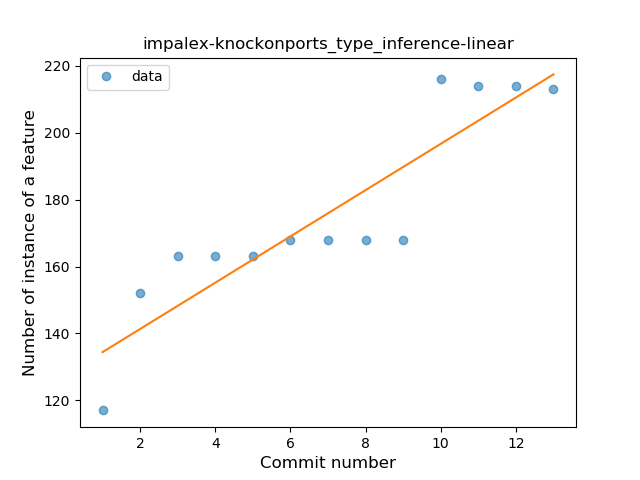
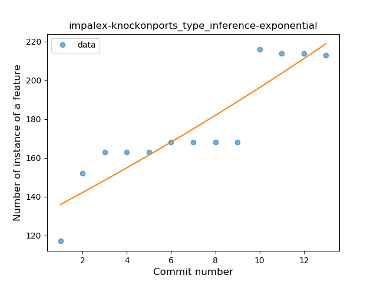
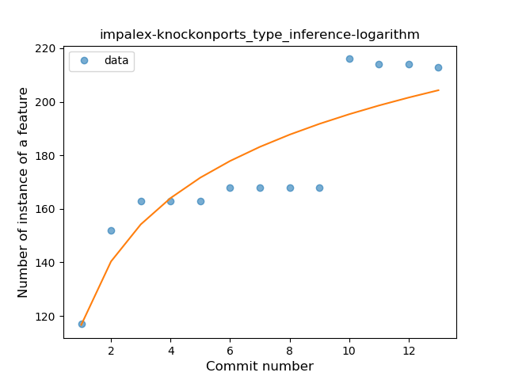
### <a name="lambda">Lambda</a>
----
#### Functions
* **Instability - Polinomial 4:** 
    * **R_Squared:** 0.90451399
* **Sudden Rise - Exponential:** 
    * **R_Squared:** 0.8432166
* **Constant Rise - Linear:** 
    * **R_Squared:** 0.76003051
* **Sudden Rise Plateau - Logarithm:** 
    * **R_Squared:** 0.54680147

**Plots** :chart_with_upwards_trend:
-----

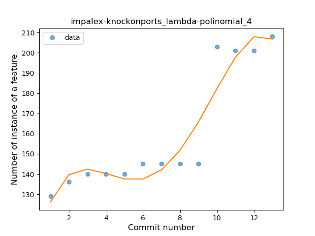
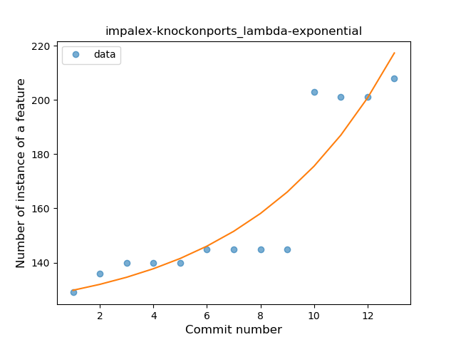
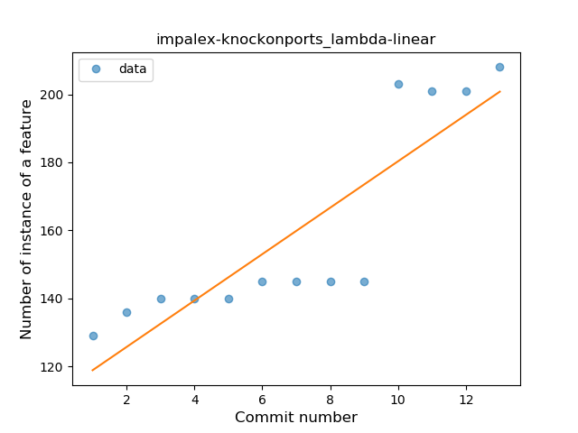
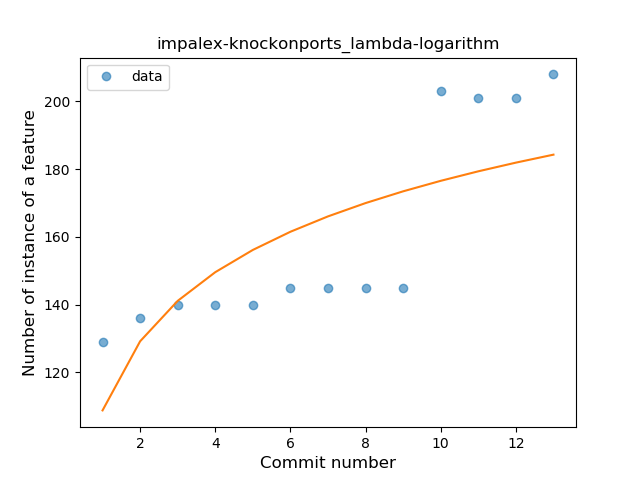
### <a name="safe_call">Safe Call</a>
----
#### Functions
* **Instability - Polinomial 4:** 
    * **R_Squared:** 0.92526894
* **Sudden Rise Plateau - Logarithm:** 
    * **R_Squared:** 0.56379918
* **Constant Rise - Linear:** 
    * **R_Squared:** 0.39861074

**Plots** :chart_with_upwards_trend:
-----

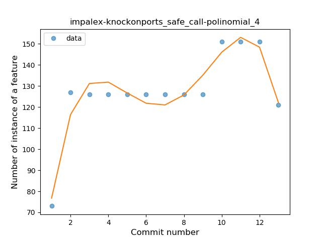
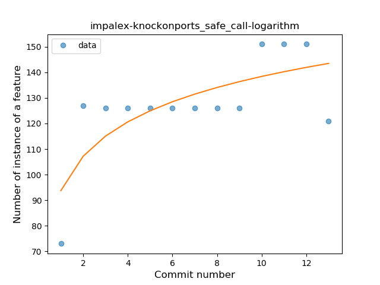
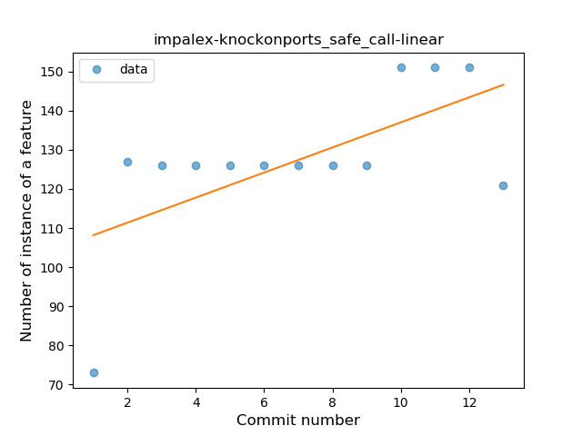
### <a name="when_expr">When expression</a>
----
#### Functions
* **Instability - Polinomial 4:** 
    * **R_Squared:** 0.84142111
* **Sudden Rise - Exponential:** 
    * **R_Squared:** 0.78080278
* **Constant Rise - Linear:** 
    * **R_Squared:** 0.69483046
* **Sudden Rise Plateau - Logarithm:** 
    * **R_Squared:** 0.46850737

**Plots** :chart_with_upwards_trend:
-----

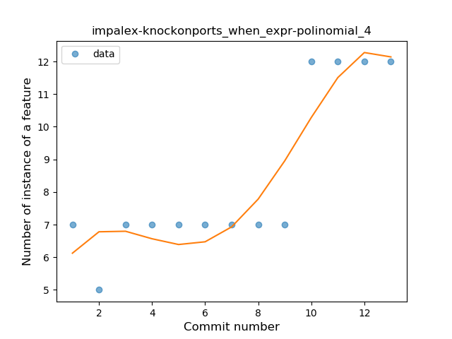
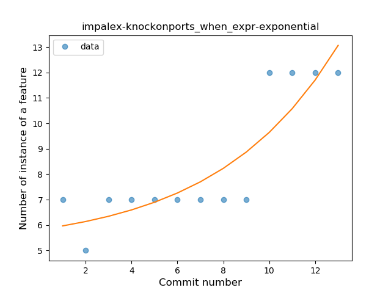
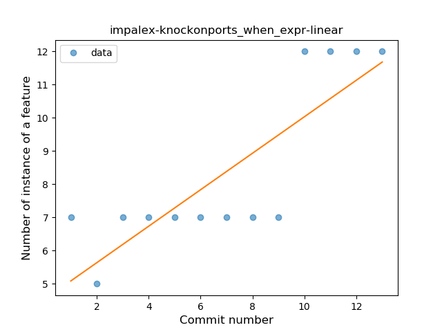
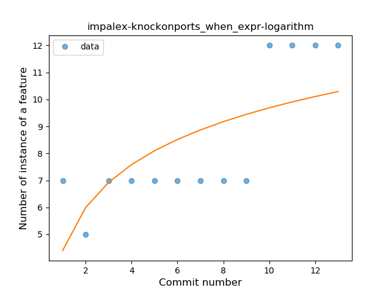
### <a name="companion_object">Companion Object</a>
----
#### Functions
* **Plateau Sudden Rise - Binary Sigmoid:** 
    * **R_Squared:** 0.97921663
* **Instability - Polinomial 4:** 
    * **R_Squared:** 0.86349896
* **Sudden Rise - Exponential:** 
    * **R_Squared:** 0.72457966
* **Constant Rise - Linear:** 
    * **R_Squared:** 0.55960946
* **Sudden Rise Plateau - Logarithm:** 
    * **R_Squared:** 0.30076727

**Plots** :chart_with_upwards_trend:
-----

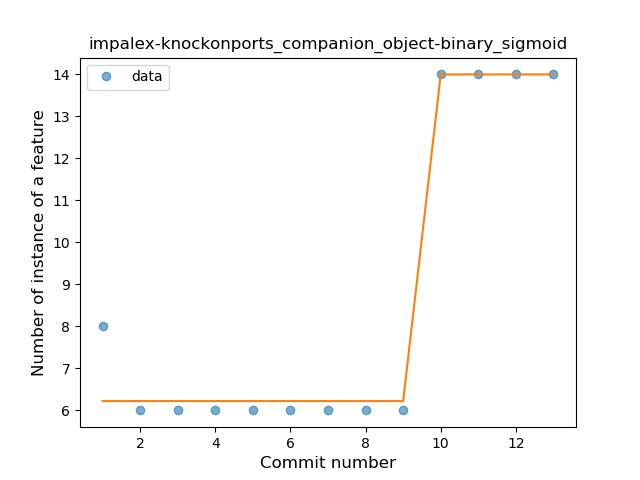
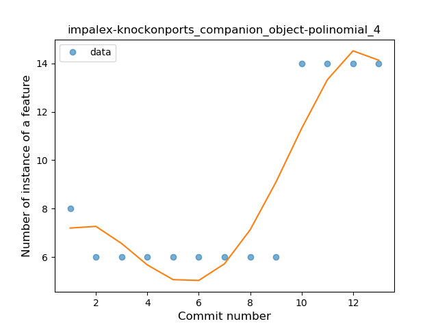
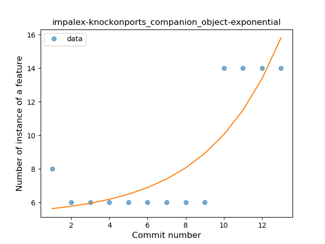
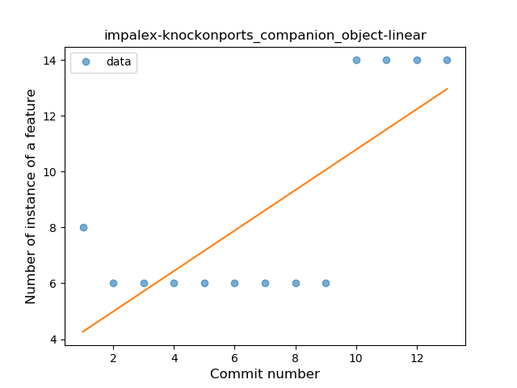
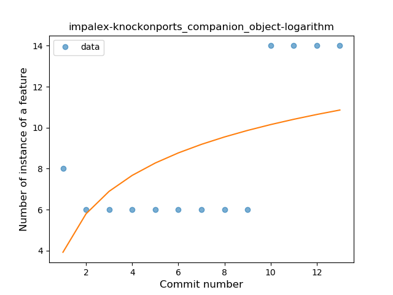
### <a name="unsafe_call">Unsafe Call</a>
----
#### Functions
* **Instability - Polinomial 4:** 
    * **R_Squared:** 0.91624519
* **Sudden Rise - Exponential:** 
    * **R_Squared:** 0.88041481
* **Constant Rise - Linear:** 
    * **R_Squared:** 0.71174725
* **Sudden Rise Plateau - Logarithm:** 
    * **R_Squared:** 0.49401749

**Plots** :chart_with_upwards_trend:
-----

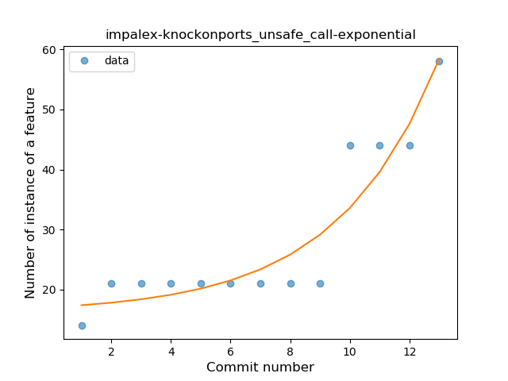
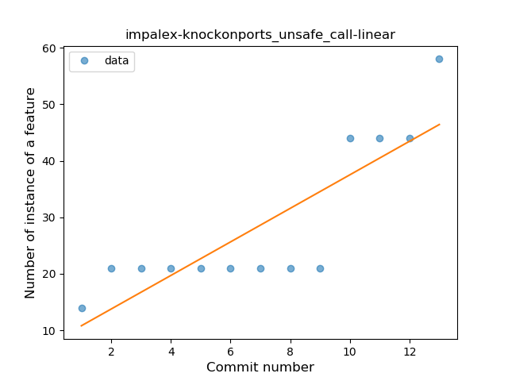
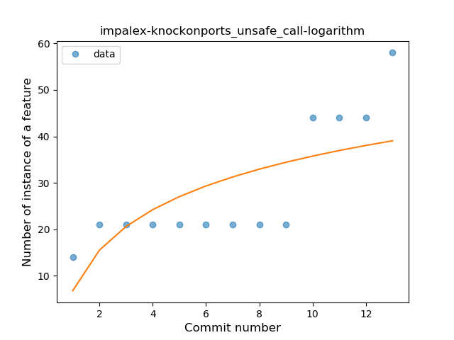
### <a name="string_template">String Template</a>
----
#### Functions
* **Instability - Polinomial 4:** 
    * **R_Squared:** 0.86349896
* **Sudden Rise - Exponential:** 
    * **R_Squared:** 0.72457966
* **Constant Rise - Linear:** 
    * **R_Squared:** 0.55960946
* **Sudden Rise Plateau - Logarithm:** 
    * **R_Squared:** 0.30076727

**Plots** :chart_with_upwards_trend:
-----

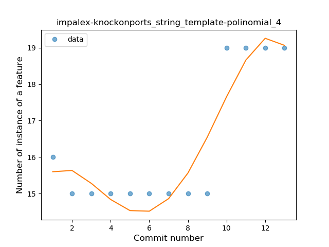
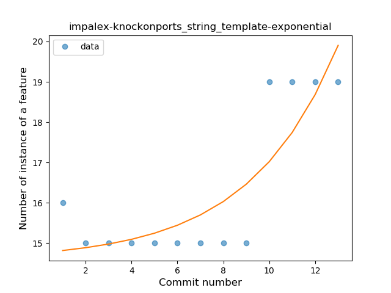
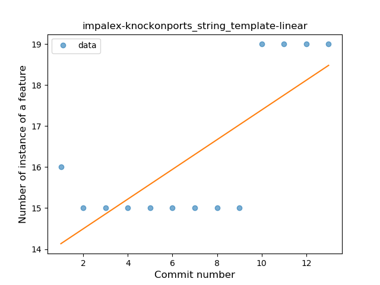
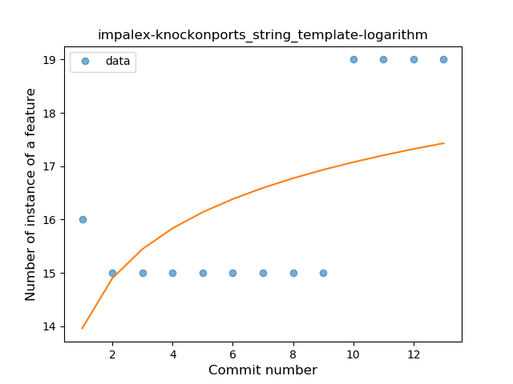
### <a name="func_with_default_value">Function with Default Value</a>
----
#### Functions
* **Instability - Polinomial 4:** 
    * **R_Squared:** 0.63383308
* **Instability - Polinomial 3:** )
    * **R_Squared:** 0.59902597
* **Constant Decline - Linear:** 
    * **R_Squared:** 0.36160714
* **Sudden Rise Plateau - Logarithm:** 
    * **R_Squared:** -0.0

**Plots** :chart_with_upwards_trend:
-----

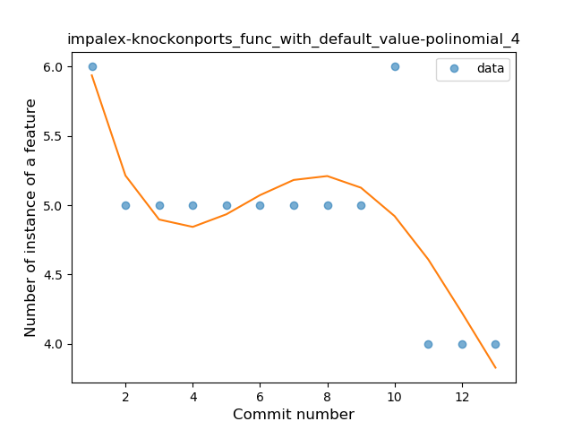
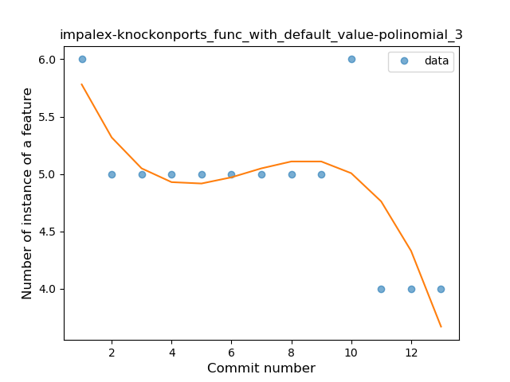
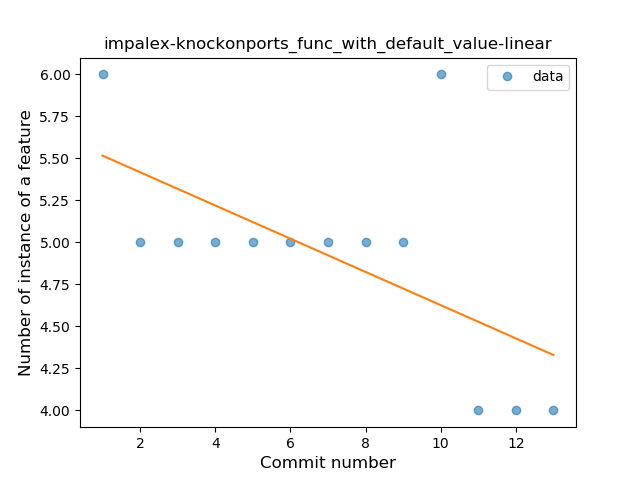
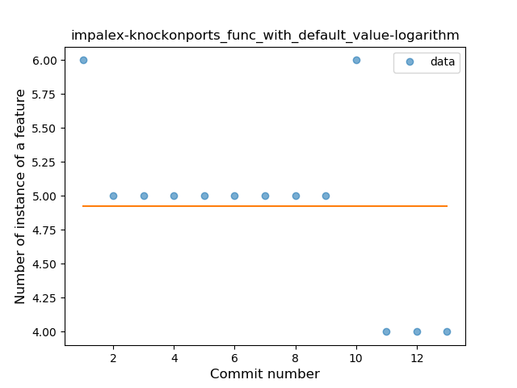
### <a name="smart_cast">Smart Cast</a>
----
#### Functions
* **Instability - Polinomial 4:** 
    * **R_Squared:** 0.90474599
* **Instability - Polinomial 3:** )
    * **R_Squared:** 0.80032468
* **Constant Decline - Linear:** 
    * **R_Squared:** 0.65625
* **Sudden Rise Plateau - Logarithm:** 
    * **R_Squared:** -0.0

**Plots** :chart_with_upwards_trend:
-----

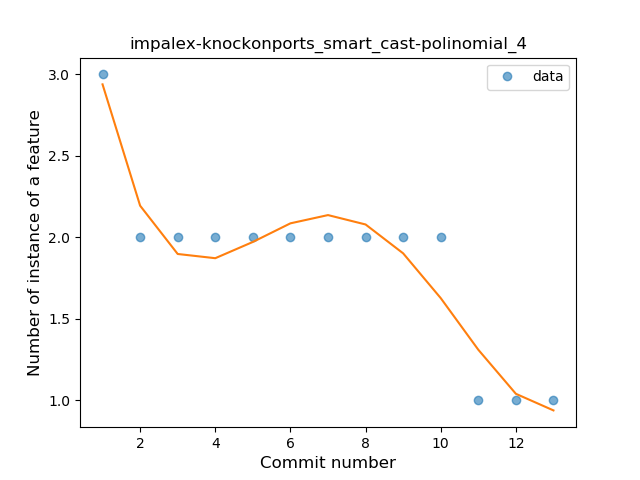
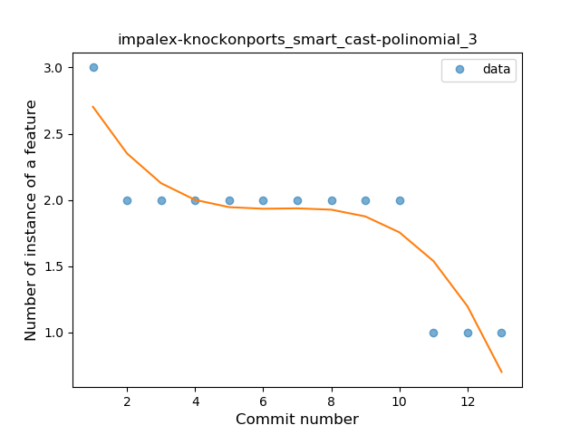
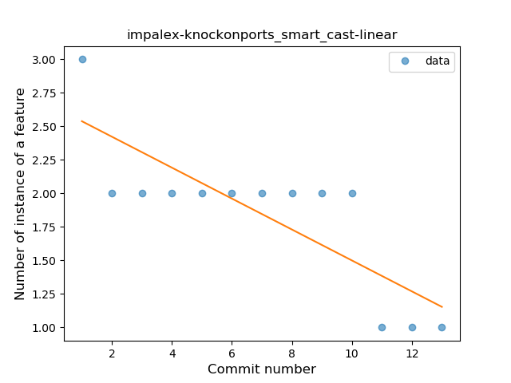
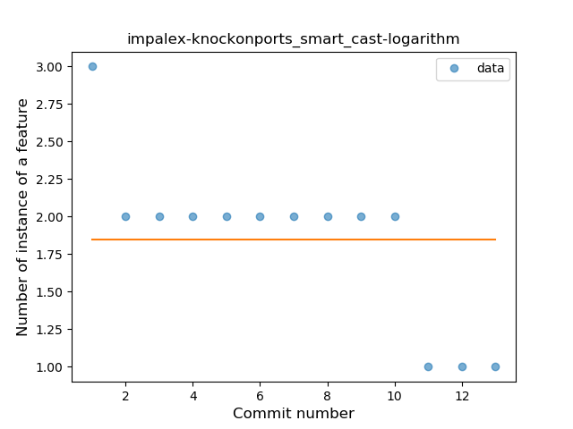
### <a name="range_expr">Range Expression</a>
----
#### Functions
* **Plateau Sudden Rise - Binary Sigmoid:** 
    * **R_Squared:** 1.0
* **Instability - Polinomial 4:** 
    * **R_Squared:** 0.88349885
* **Sudden Rise - Exponential:** 
    * **R_Squared:** 0.77050472
* **Constant Rise - Linear:** 
    * **R_Squared:** 0.64285714
* **Sudden Rise Plateau - Logarithm:** 
    * **R_Squared:** 0.40392419

**Plots** :chart_with_upwards_trend:
-----

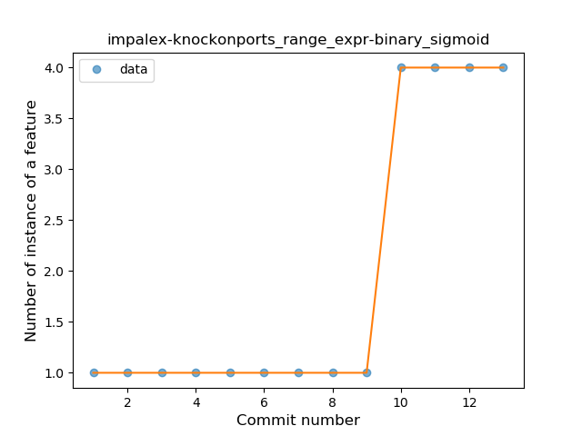

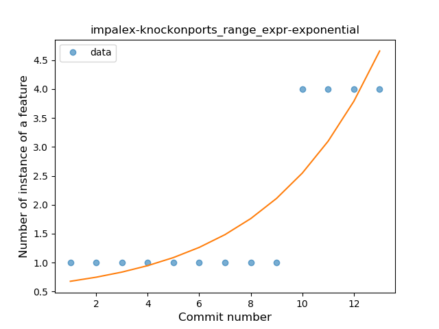
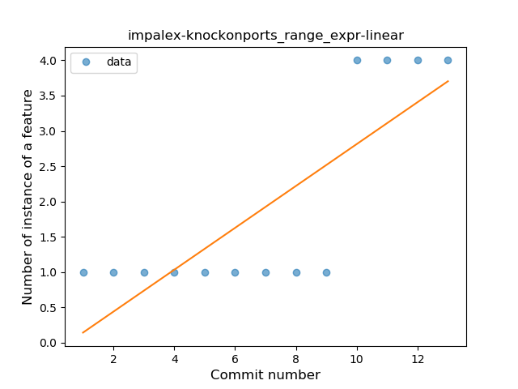
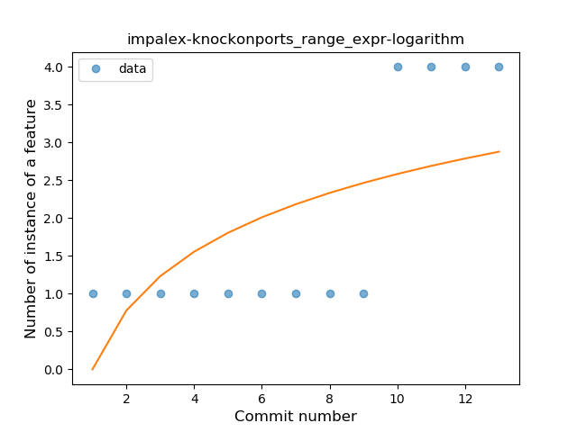
### <a name="func_call_with_named_arg">Function call with Named Argument</a>
----
#### Functions
* **Instability - Polinomial 4:** 
    * **R_Squared:** 0.86134454
* **Instability - Polinomial 3:** )
    * **R_Squared:** 0.70535714
* **Constant Decline - Linear:** 
    * **R_Squared:** 0.21428571
* **Sudden Rise Plateau - Logarithm:** 
    * **R_Squared:** -0.0

**Plots** :chart_with_upwards_trend:
-----

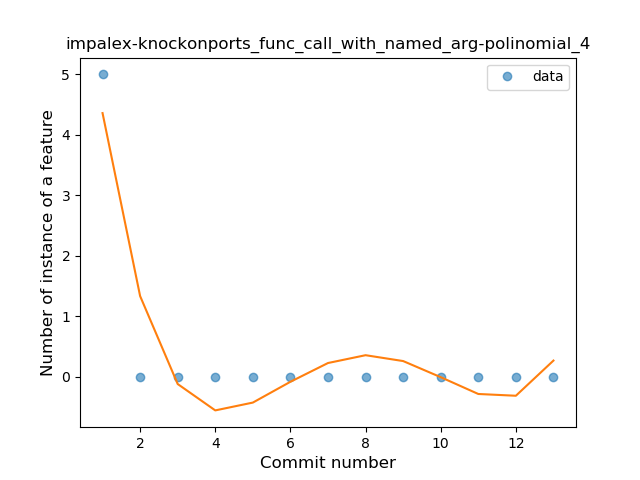
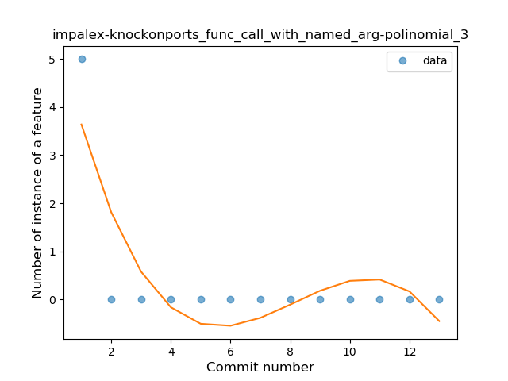
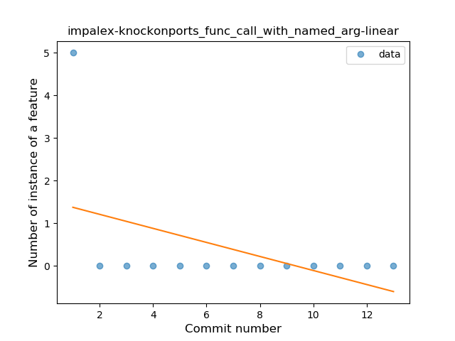
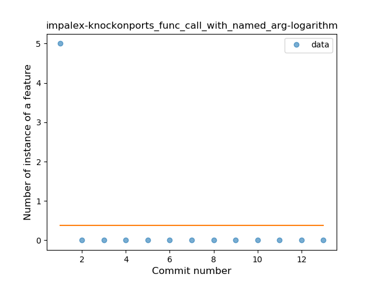
### <a name="data_class">Data Class</a>
----
#### Functions
* **Instability - Polinomial 4:** 
    * **R_Squared:** 0.88349885
* **Sudden Rise - Exponential:** 
    * **R_Squared:** 0.77050472
* **Constant Rise - Linear:** 
    * **R_Squared:** 0.64285714
* **Sudden Rise Plateau - Logarithm:** 
    * **R_Squared:** 0.40590383

**Plots** :chart_with_upwards_trend:
-----

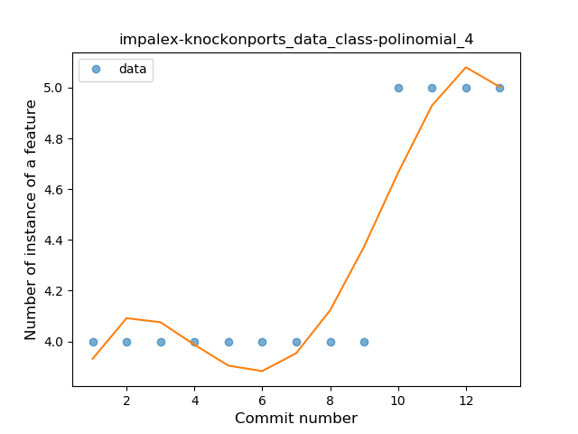
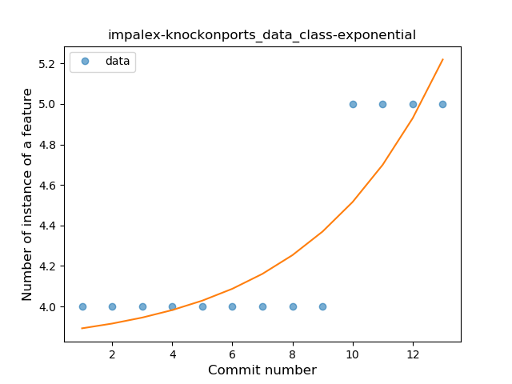
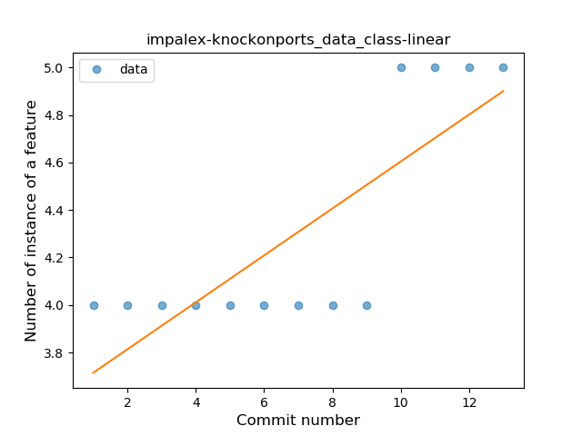
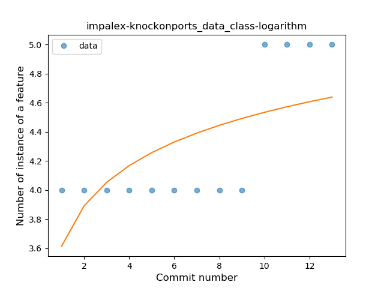
### <a name="extension_function">Extension Function</a>
----
#### Functions
* **Sudden Rise Plateau - Logarithm:** 
    * **R_Squared:** 0.0430861
* **Constant Decline - Linear:** 
    * **R_Squared:** 0.00310559

**Plots** :chart_with_upwards_trend:
-----

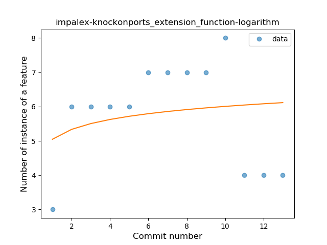
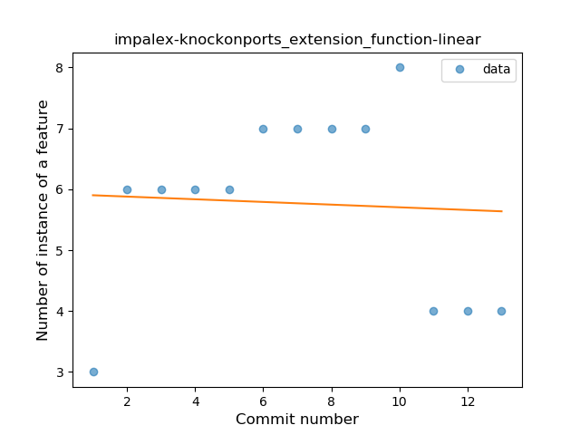
### <a name="property_delegation">Property Delegation</a>
----
#### Functions
* **Instability - Polinomial 4:** 
    * **R_Squared:** 0.91849353
* **Sudden Rise - Exponential:** 
    * **R_Squared:** 0.88815317
* **Constant Rise - Linear:** 
    * **R_Squared:** 0.7695345
* **Sudden Rise Plateau - Logarithm:** 
    * **R_Squared:** 0.51129569

**Plots** :chart_with_upwards_trend:
-----

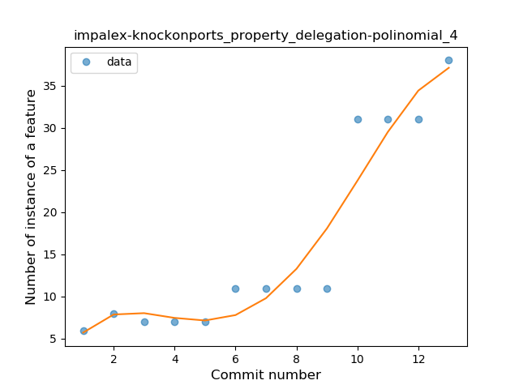
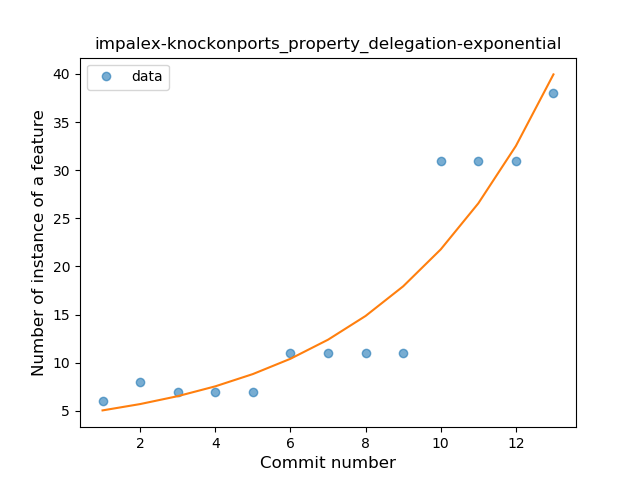
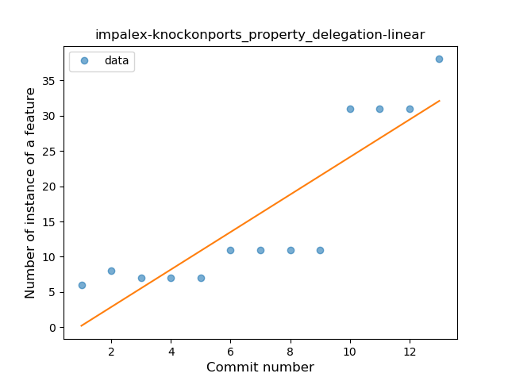
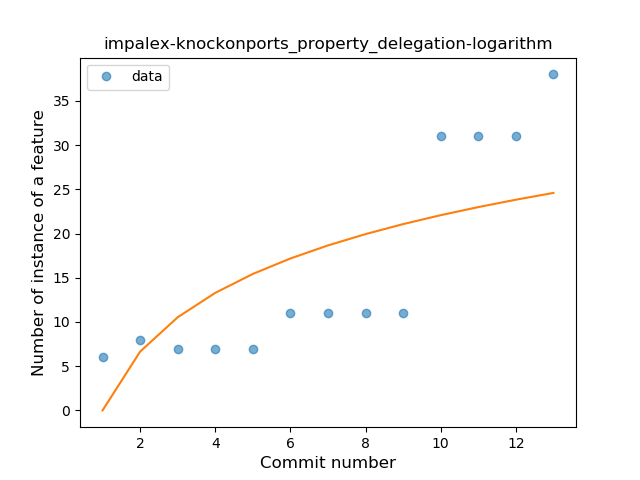
### <a name="inline_func">Inline Function</a>
----
#### Functions
* **Plateau Sudden Decline - Binary Sigmoid:** 
    * **R_Squared:** 0.95568182
* **Constant Decline - Linear:** 
    * **R_Squared:** 0.41152597
* **Sudden Rise Plateau - Logarithm:** 
    * **R_Squared:** -0.0

**Plots** :chart_with_upwards_trend:
-----

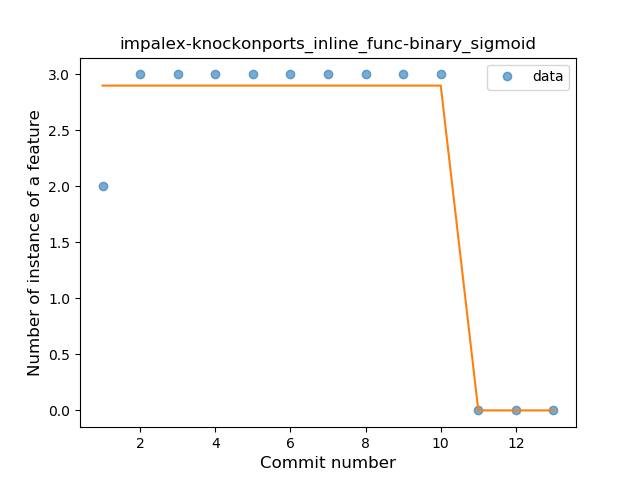
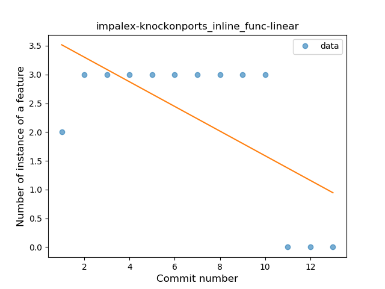
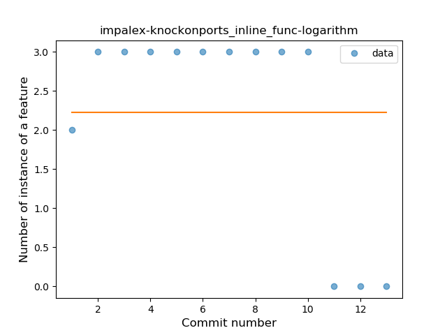
