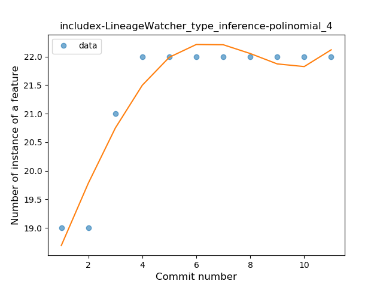
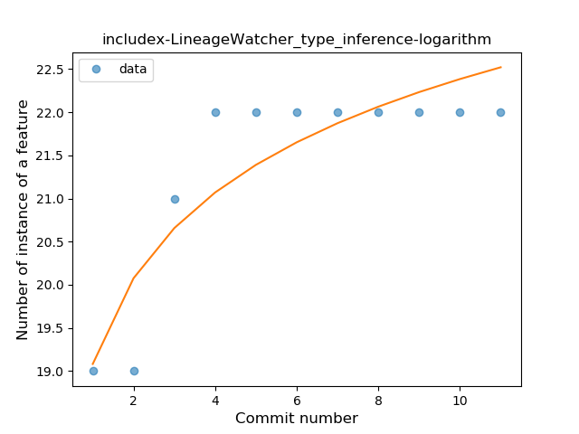
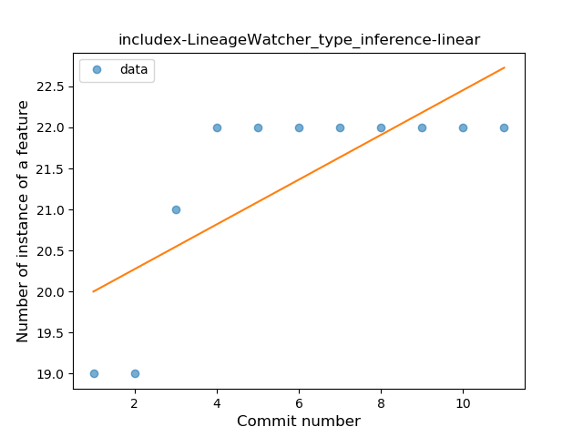
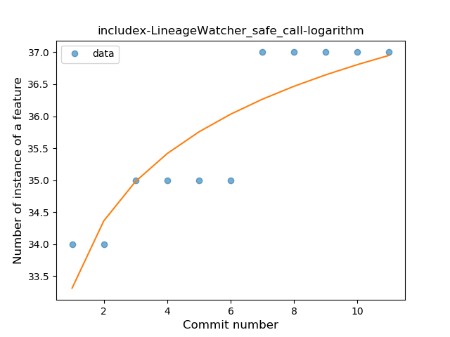

## includex-LineageWatcher
----
#### Metrics provided by Detekt
* Number of lines of code 480
* Number of Kotlin files: 7
* Cyclomatic complexity: 59
* Cyclomatic complexity by thousands of lines: 208 

----
**2** features analyzed

*	<a href="#type_inference">Type Inference</a> 
*	<a href="#safe_call">Safe Call</a> 

### <a name="type_inference">Type Inference</a>
----
#### Functions
* **Instability - Polinomial 3:** )
    * **R_Squared:** 0.91057692
* **Instability - Polinomial 4:** 
    * **R_Squared:** 0.91923077
* **Sudden Rise Plateau - Logarithm:** 
    * **R_Squared:** 0.78457341
* **Constant Rise - Linear:** 
    * **R_Squared:** 0.5625

**Plots** :chart_with_upwards_trend:
-----

### <a name="safe_call">Safe Call</a>
----
#### Functions
* **Constant Rise - Linear:** 
    * **R_Squared:** 0.85449438
* **Sudden Rise Plateau - Logarithm:** 
    * **R_Squared:** 0.78989591

**Plots** :chart_with_upwards_trend:
-----

