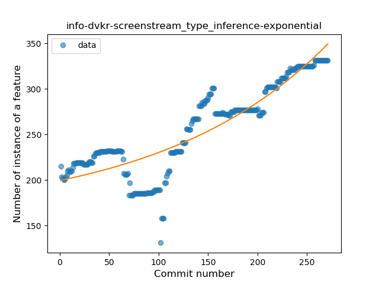
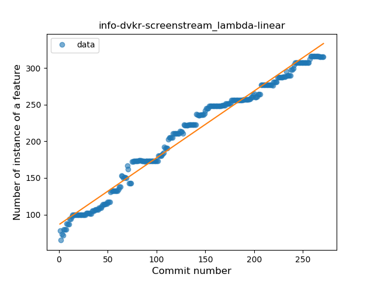
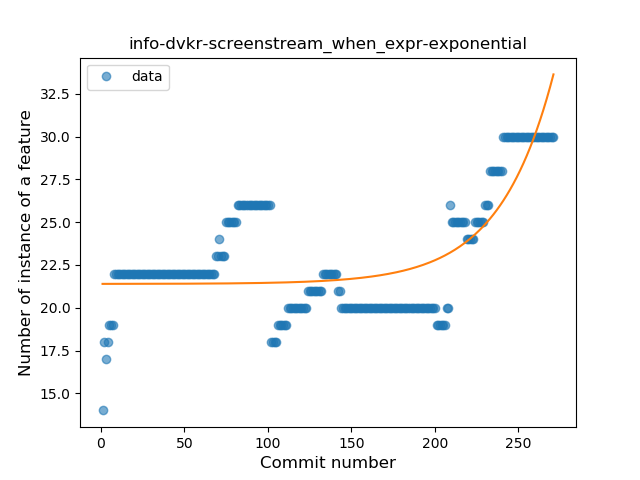
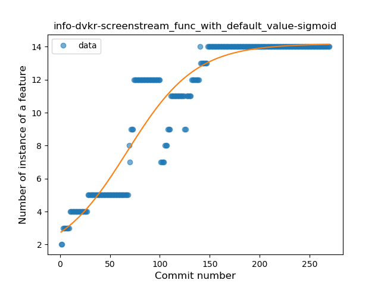
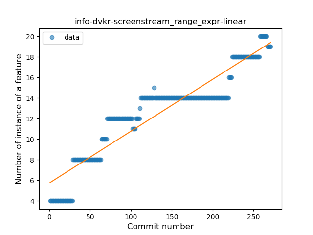
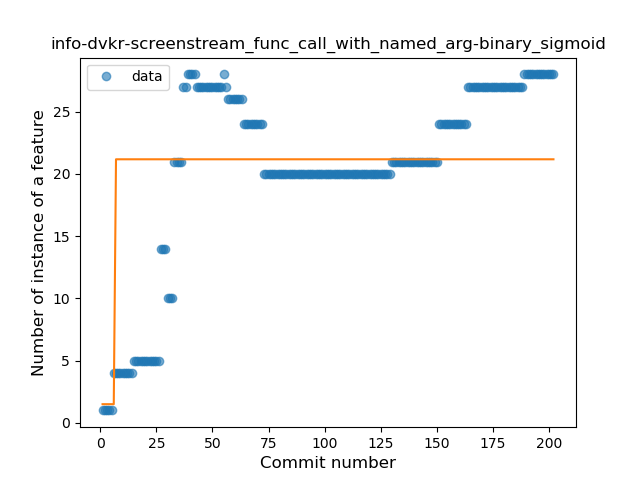
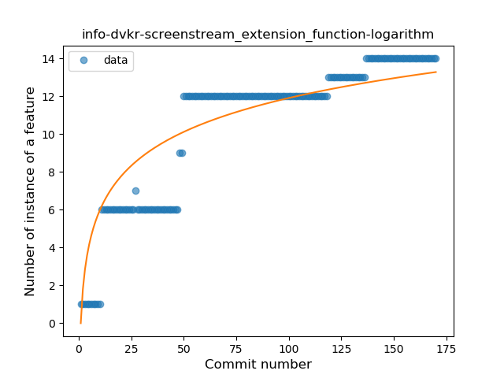
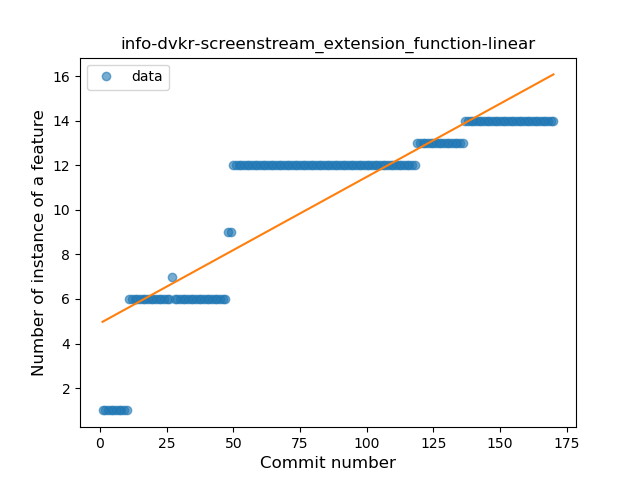
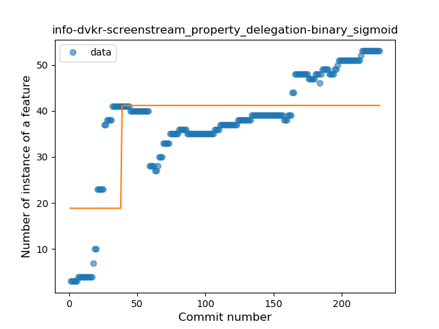

## info-dvkr-screenstream
----
#### Metrics provided by Detekt
* Number of lines of code 5807
* Number of Kotlin files: 60
* Cyclomatic complexity: 837
* Cyclomatic complexity by thousands of lines: 248 

----
**18** features analyzed

*	<a href="#type_inference">Type Inference</a> 
*	<a href="#lambda">Lambda</a> 
*	<a href="#safe_call">Safe Call</a> 
*	<a href="#when_expr">When expression</a> 
*	<a href="#unsafe_call">Unsafe Call</a> 
*	<a href="#companion_object">Companion Object</a> 
*	<a href="#string_template">String Template</a> 
*	<a href="#func_with_default_value">Function with Default Value</a> 
*	<a href="#singleton">Singleton</a> 
*	<a href="#range_expr">Range Expression</a> 
*	<a href="#smart_cast">Smart Cast</a> 
*	<a href="#data_class">Data Class</a> 
*	<a href="#func_call_with_named_arg">Function call with Named Argument</a> 
*	<a href="#extension_function">Extension Function</a> 
*	<a href="#property_delegation">Property Delegation</a> 
*	<a href="#destructuring_declaration">Destructuring Declaration</a> 
*	<a href="#coroutine">Coroutine</a> 
*	<a href="#sealed_class">Sealed Class</a> 

### <a name="type_inference">Type Inference</a>
----
#### Functions
* **Sudden Rise - Exponential:** 
    * **R_Squared:** 0.79113456
* **Constant Rise - Linear:** 
    * **R_Squared:** 0.75064794
* **Sudden Rise Plateau - Logarithm:** 
    * **R_Squared:** 0.44352493

**Plots** :chart_with_upwards_trend:
-----

### <a name="lambda">Lambda</a>
----
#### Functions
* **Constant Rise - Linear:** 
    * **R_Squared:** 0.97758347
* **Plateau Sudden Rise - Binary Sigmoid:** 
    * **R_Squared:** 0.76033353
* **Sudden Rise Plateau - Logarithm:** 
    * **R_Squared:** 0.7382445

**Plots** :chart_with_upwards_trend:
-----

### <a name="safe_call">Safe Call</a>
----
#### Functions
* **Plateau Sudden Decline - Binary Sigmoid:** 
    * **R_Squared:** 0.16481342
* **Constant Decline - Linear:** 
    * **R_Squared:** 0.12222062
* **Sudden Decline - Exponential:** 
    * **R_Squared:** 0.12354187
* **Sudden Rise Plateau - Logarithm:** 
    * **R_Squared:** -0.0

**Plots** :chart_with_upwards_trend:
-----

### <a name="when_expr">When expression</a>
----
#### Functions
* **Sudden Rise - Exponential:** 
    * **R_Squared:** 0.58220462
* **Constant Rise - Linear:** 
    * **R_Squared:** 0.22820357
* **Sudden Rise Plateau - Logarithm:** 
    * **R_Squared:** 0.13686353

**Plots** :chart_with_upwards_trend:
-----

### <a name="unsafe_call">Unsafe Call</a>
----
#### Functions
* **Constant Rise - Linear:** 
    * **R_Squared:** 0.2237382
* **Sudden Rise Plateau - Logarithm:** 
    * **R_Squared:** 0.12974052

**Plots** :chart_with_upwards_trend:
-----

### <a name="companion_object">Companion Object</a>
----
#### Functions
* **Constant Rise - Linear:** 
    * **R_Squared:** 0.60983346
* **Sudden Rise Plateau - Logarithm:** 
    * **R_Squared:** 0.51174733

**Plots** :chart_with_upwards_trend:
-----

### <a name="string_template">String Template</a>
----
#### Functions
* **Sudden Decline - Exponential:** 
    * **R_Squared:** 0.63920447
* **Plateau Sudden Decline - Binary Sigmoid:** 
    * **R_Squared:** 0.50048677
* **Constant Decline - Linear:** 
    * **R_Squared:** 0.46054083
* **Sudden Rise Plateau - Logarithm:** 
    * **R_Squared:** -0.0

**Plots** :chart_with_upwards_trend:
-----

### <a name="func_with_default_value">Function with Default Value</a>
----
#### Functions
* **Plateau Gradual Rise - Sigmoid:** 
    * **R_Squared:** 0.90063138
* **Constant Rise - Linear:** 
    * **R_Squared:** 0.77480389
* **Sudden Rise Plateau - Logarithm:** 
    * **R_Squared:** 0.68778265

**Plots** :chart_with_upwards_trend:
-----

### <a name="singleton">Singleton</a>
----
#### Functions
* **Plateau Gradual Rise - Sigmoid:** 
    * **R_Squared:** 0.91200675
* **Sudden Rise Plateau - Logarithm:** 
    * **R_Squared:** 0.73890587
* **Constant Rise - Linear:** 
    * **R_Squared:** 0.40648197

**Plots** :chart_with_upwards_trend:
-----

### <a name="range_expr">Range Expression</a>
----
#### Functions
* **Constant Rise - Linear:** 
    * **R_Squared:** 0.87325964
* **Sudden Rise Plateau - Logarithm:** 
    * **R_Squared:** 0.75302377

**Plots** :chart_with_upwards_trend:
-----

### <a name="smart_cast">Smart Cast</a>
----
#### Functions
* **Sudden Decline - Exponential:** 
    * **R_Squared:** 0.63866326
* **Constant Decline - Linear:** 
    * **R_Squared:** 0.58949245
* **Sudden Rise Plateau - Logarithm:** 
    * **R_Squared:** -0.0
* **Plateau Sudden Decline - Binary Sigmoid:** 
    * **R_Squared:** 0.00585316

**Plots** :chart_with_upwards_trend:
-----

### <a name="data_class">Data Class</a>
----
#### Functions
* **Sudden Decline - Exponential:** 
    * **R_Squared:** 0.58185601
* **Constant Decline - Linear:** 
    * **R_Squared:** 0.42818024
* **Sudden Rise Plateau - Logarithm:** 
    * **R_Squared:** -0.0

**Plots** :chart_with_upwards_trend:
-----

### <a name="func_call_with_named_arg">Function call with Named Argument</a>
----
#### Functions
* **Sudden Rise Plateau - Logarithm:** 
    * **R_Squared:** 0.59144537
* **Constant Rise - Linear:** 
    * **R_Squared:** 0.42598042
* **Plateau Sudden Rise - Binary Sigmoid:** 
    * **R_Squared:** 0.20587362

**Plots** :chart_with_upwards_trend:
-----

### <a name="extension_function">Extension Function</a>
----
#### Functions
* **Sudden Rise Plateau - Logarithm:** 
    * **R_Squared:** 0.7933225
* **Constant Rise - Linear:** 
    * **R_Squared:** 0.75703145
* **Plateau Sudden Rise - Binary Sigmoid:** 
    * **R_Squared:** 0.6338006

**Plots** :chart_with_upwards_trend:
-----

### <a name="property_delegation">Property Delegation</a>
----
#### Functions
* **Sudden Rise Plateau - Logarithm:** 
    * **R_Squared:** 0.70469195
* **Constant Rise - Linear:** 
    * **R_Squared:** 0.62784751
* **Plateau Sudden Rise - Binary Sigmoid:** 
    * **R_Squared:** 0.45565811

**Plots** :chart_with_upwards_trend:
-----

### <a name="destructuring_declaration">Destructuring Declaration</a>
----
#### Functions
* **Sudden Decline - Exponential:** 
    * **R_Squared:** 0.31878792
* **Constant Decline - Linear:** 
    * **R_Squared:** 0.29036552
* **Sudden Rise Plateau - Logarithm:** 
    * **R_Squared:** -0.0

**Plots** :chart_with_upwards_trend:
-----

### <a name="coroutine">Coroutine</a>
----
#### Functions
* **Sudden Decline - Exponential:** 
    * **R_Squared:** 0.66546619
* **Plateau Gradual Decline - Sigmoid:** 
    * **R_Squared:** 0.66938206
* **Constant Decline - Linear:** 
    * **R_Squared:** 0.51731627
* **Sudden Rise Plateau - Logarithm:** 
    * **R_Squared:** -0.0

**Plots** :chart_with_upwards_trend:
-----

### <a name="sealed_class">Sealed Class</a>
----
#### Functions
* **Sudden Rise - Exponential:** 
    * **R_Squared:** 0.46398996
* **Constant Rise - Linear:** 
    * **R_Squared:** 0.29859003
* **Sudden Rise Plateau - Logarithm:** 
    * **R_Squared:** 0.30743575

**Plots** :chart_with_upwards_trend:
-----

