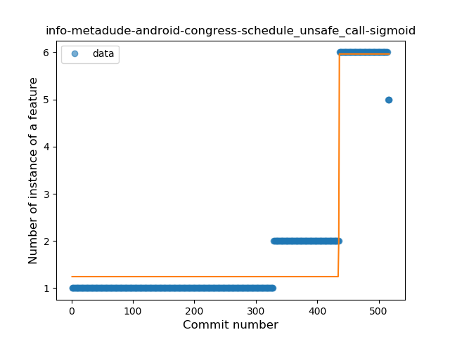
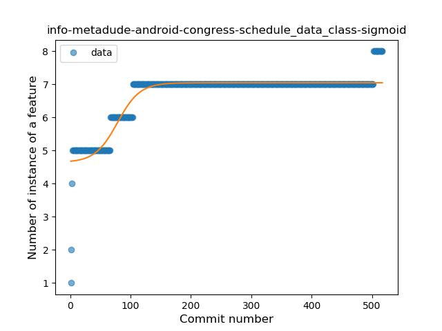
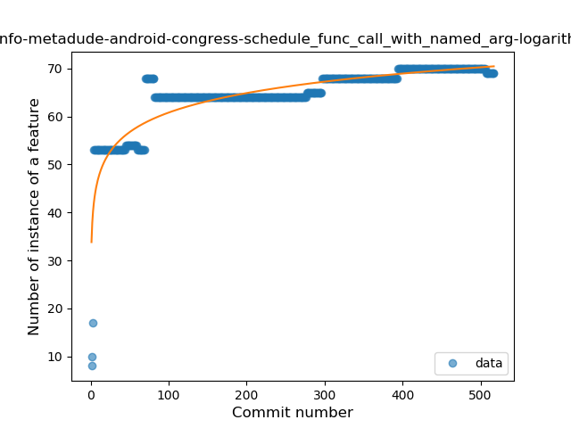
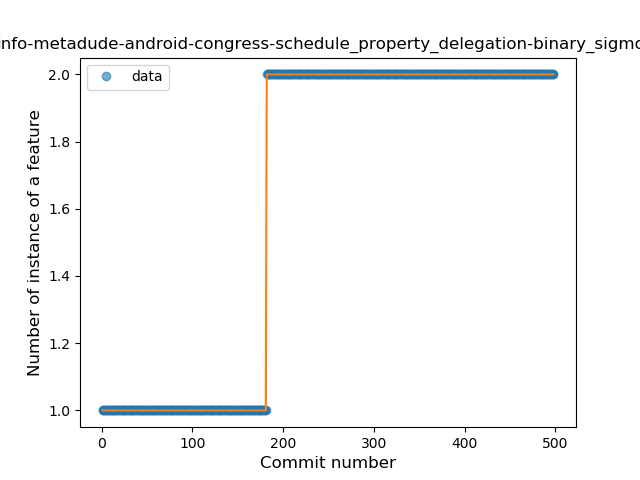

## info-metadude-android-congress-schedule
----
#### Metrics provided by Detekt
* Number of lines of code 4059
* Number of Kotlin files: 83
* Cyclomatic complexity: 459
* Cyclomatic complexity by thousands of lines: 195 

----
**14** features analyzed

*	<a href="#type_inference">Type Inference</a> 
*	<a href="#lambda">Lambda</a> 
*	<a href="#safe_call">Safe Call</a> 
*	<a href="#when_expr">When expression</a> 
*	<a href="#unsafe_call">Unsafe Call</a> 
*	<a href="#companion_object">Companion Object</a> 
*	<a href="#string_template">String Template</a> 
*	<a href="#func_with_default_value">Function with Default Value</a> 
*	<a href="#singleton">Singleton</a> 
*	<a href="#data_class">Data Class</a> 
*	<a href="#func_call_with_named_arg">Function call with Named Argument</a> 
*	<a href="#extension_function">Extension Function</a> 
*	<a href="#property_delegation">Property Delegation</a> 
*	<a href="#inline_func">Inline Function</a> 

### <a name="type_inference">Type Inference</a>
----
#### Functions
* **Constant Rise - Linear:** 
    * **R_Squared:** 0.90329878
* **Plateau Sudden Rise - Binary Sigmoid:** 
    * **R_Squared:** 0.71063156
* **Sudden Rise Plateau - Logarithm:** 
    * **R_Squared:** 0.62673197

**Plots** :chart_with_upwards_trend:
-----

### <a name="lambda">Lambda</a>
----
#### Functions
* **Plateau Gradual Rise - Sigmoid:** 
    * **R_Squared:** 0.95854787
* **Constant Rise - Linear:** 
    * **R_Squared:** 0.94067024
* **Sudden Rise Plateau - Logarithm:** 
    * **R_Squared:** 0.44264054

**Plots** :chart_with_upwards_trend:
-----

### <a name="safe_call">Safe Call</a>
----
#### Functions
* **Constant Rise - Linear:** 
    * **R_Squared:** 0.81489428
* **Sudden Rise Plateau - Logarithm:** 
    * **R_Squared:** 0.61239547

**Plots** :chart_with_upwards_trend:
-----

### <a name="when_expr">When expression</a>
----
#### Functions
* **Plateau Gradual Rise - Sigmoid:** 
    * **R_Squared:** 0.94939343
* **Constant Rise - Linear:** 
    * **R_Squared:** 0.72069771
* **Sudden Rise Plateau - Logarithm:** 
    * **R_Squared:** 0.55383867

**Plots** :chart_with_upwards_trend:
-----

### <a name="unsafe_call">Unsafe Call</a>
----
#### Functions
* **Plateau Gradual Rise - Sigmoid:** 
    * **R_Squared:** 0.94873271
* **Sudden Rise - Exponential:** 
    * **R_Squared:** 0.85742407
* **Constant Rise - Linear:** 
    * **R_Squared:** 0.55329559
* **Sudden Rise Plateau - Logarithm:** 
    * **R_Squared:** 0.16678286

**Plots** :chart_with_upwards_trend:
-----

### <a name="companion_object">Companion Object</a>
----
#### Functions
* **Constant Rise - Linear:** 
    * **R_Squared:** 0.86669388
* **Sudden Rise Plateau - Logarithm:** 
    * **R_Squared:** 0.63337662

**Plots** :chart_with_upwards_trend:
-----

### <a name="string_template">String Template</a>
----
#### Functions
* **Sudden Rise Plateau - Logarithm:** 
    * **R_Squared:** 0.89696257
* **Constant Rise - Linear:** 
    * **R_Squared:** 0.81449854

**Plots** :chart_with_upwards_trend:
-----

### <a name="func_with_default_value">Function with Default Value</a>
----
#### Functions
* **Constant Rise - Linear:** 
    * **R_Squared:** 0.75772773
* **Sudden Rise Plateau - Logarithm:** 
    * **R_Squared:** 0.6562246

**Plots** :chart_with_upwards_trend:
-----

### <a name="singleton">Singleton</a>
----
#### Functions
* **Constant Rise - Linear:** 
    * **R_Squared:** 0.84365044
* **Sudden Rise Plateau - Logarithm:** 
    * **R_Squared:** 0.72593029

**Plots** :chart_with_upwards_trend:
-----

### <a name="data_class">Data Class</a>
----
#### Functions
* **Plateau Gradual Rise - Sigmoid:** 
    * **R_Squared:** 0.86168127
* **Sudden Rise Plateau - Logarithm:** 
    * **R_Squared:** 0.77303156
* **Constant Rise - Linear:** 
    * **R_Squared:** 0.47453298

**Plots** :chart_with_upwards_trend:
-----

### <a name="func_call_with_named_arg">Function call with Named Argument</a>
----
#### Functions
* **Sudden Rise Plateau - Logarithm:** 
    * **R_Squared:** 0.77436463
* **Constant Rise - Linear:** 
    * **R_Squared:** 0.53645408

**Plots** :chart_with_upwards_trend:
-----

### <a name="extension_function">Extension Function</a>
----
#### Functions
* **Constant Rise - Linear:** 
    * **R_Squared:** 0.91801237
* **Sudden Rise Plateau - Logarithm:** 
    * **R_Squared:** 0.60299528
* **Plateau Sudden Rise - Binary Sigmoid:** 
    * **R_Squared:** 0.23806253

**Plots** :chart_with_upwards_trend:
-----

### <a name="property_delegation">Property Delegation</a>
----
#### Functions
* **Plateau Sudden Rise - Binary Sigmoid:** 
    * **R_Squared:** 1.0
* **Constant Rise - Linear:** 
    * **R_Squared:** 0.69406822
* **Sudden Rise Plateau - Logarithm:** 
    * **R_Squared:** 0.58270134

**Plots** :chart_with_upwards_trend:
-----

### <a name="inline_func">Inline Function</a>
----
#### Functions
* **Sudden Rise Plateau - Logarithm:** 
    * **R_Squared:** 0.10490176
* **Constant Rise - Linear:** 
    * **R_Squared:** 0.01530612

**Plots** :chart_with_upwards_trend:
-----

