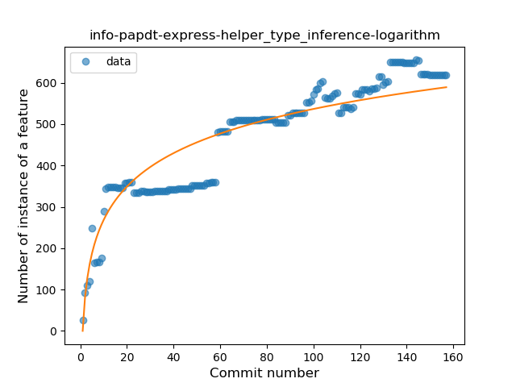
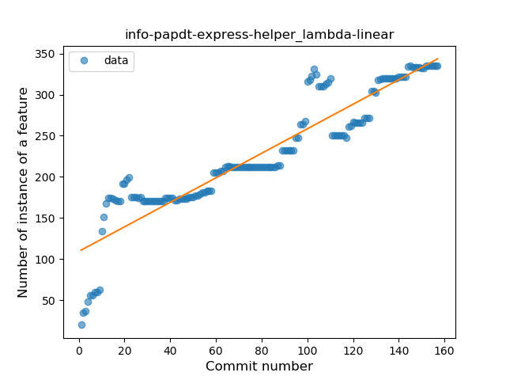
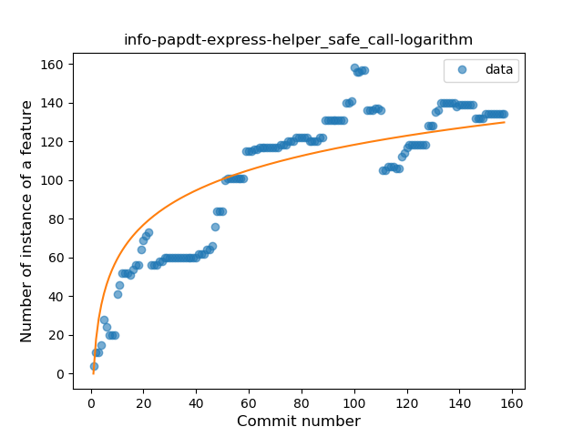
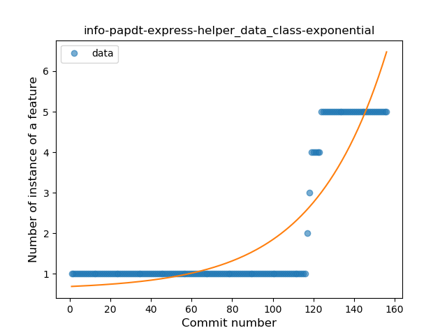
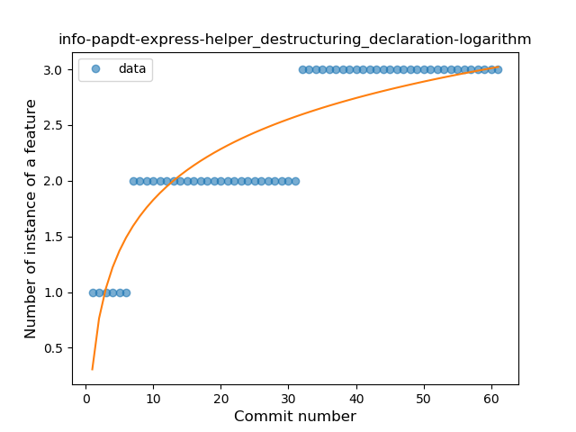
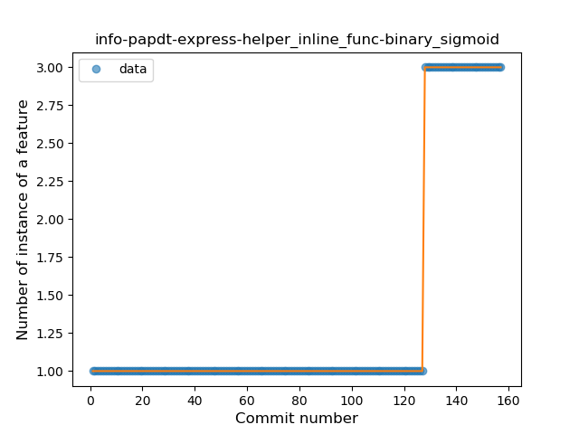
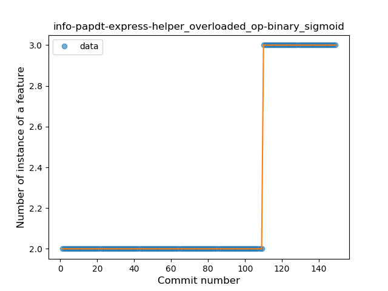
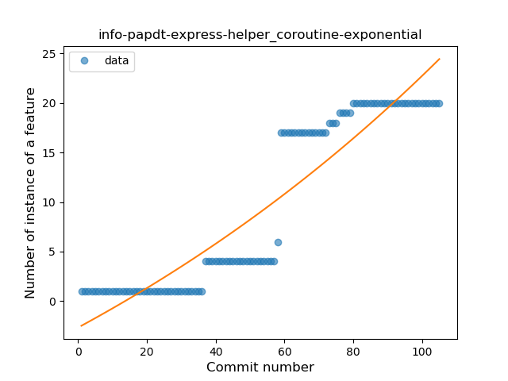
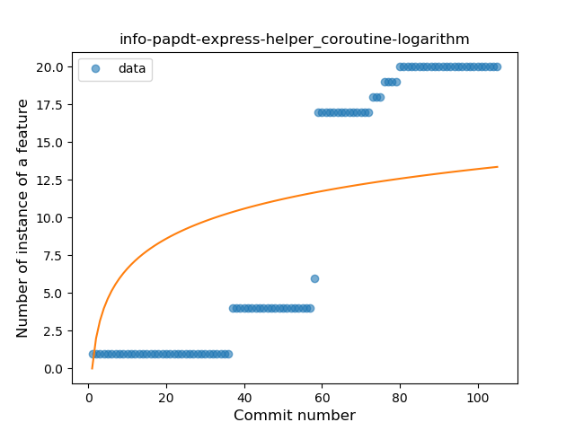
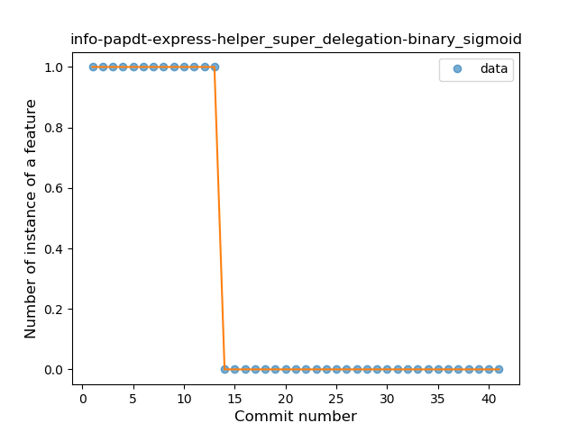

## info-papdt-express-helper
----
#### Metrics provided by Detekt
* Number of lines of code 10752
* Number of Kotlin files: 103
* Cyclomatic complexity: 1509
* Cyclomatic complexity by thousands of lines: 241 

----
**20** features analyzed

*	<a href="#type_inference">Type Inference</a> 
*	<a href="#lambda">Lambda</a> 
*	<a href="#safe_call">Safe Call</a> 
*	<a href="#when_expr">When expression</a> 
*	<a href="#unsafe_call">Unsafe Call</a> 
*	<a href="#companion_object">Companion Object</a> 
*	<a href="#string_template">String Template</a> 
*	<a href="#func_with_default_value">Function with Default Value</a> 
*	<a href="#singleton">Singleton</a> 
*	<a href="#range_expr">Range Expression</a> 
*	<a href="#smart_cast">Smart Cast</a> 
*	<a href="#data_class">Data Class</a> 
*	<a href="#func_call_with_named_arg">Function call with Named Argument</a> 
*	<a href="#extension_function">Extension Function</a> 
*	<a href="#property_delegation">Property Delegation</a> 
*	<a href="#destructuring_declaration">Destructuring Declaration</a> 
*	<a href="#inline_func">Inline Function</a> 
*	<a href="#overloaded_op">Overloaded Operator</a> 
*	<a href="#coroutine">Coroutine</a> 
*	<a href="#super_delegation">Super Delegation</a> 

### <a name="type_inference">Type Inference</a>
----
#### Functions
* **Constant Rise - Linear:** 
    * **R_Squared:** 0.86901775
* **Sudden Rise Plateau - Logarithm:** 
    * **R_Squared:** 0.85274105

**Plots** :chart_with_upwards_trend:
-----

### <a name="lambda">Lambda</a>
----
#### Functions
* **Constant Rise - Linear:** 
    * **R_Squared:** 0.85085861
* **Sudden Rise Plateau - Logarithm:** 
    * **R_Squared:** 0.76709384

**Plots** :chart_with_upwards_trend:
-----

### <a name="safe_call">Safe Call</a>
----
#### Functions
* **Sudden Rise Plateau - Logarithm:** 
    * **R_Squared:** 0.76769739
* **Constant Rise - Linear:** 
    * **R_Squared:** 0.75256576
* **Plateau Sudden Rise - Binary Sigmoid:** 
    * **R_Squared:** 0.19691022

**Plots** :chart_with_upwards_trend:
-----

### <a name="when_expr">When expression</a>
----
#### Functions
* **Constant Rise - Linear:** 
    * **R_Squared:** 0.92824613
* **Sudden Rise Plateau - Logarithm:** 
    * **R_Squared:** 0.77604578
* **Plateau Gradual Rise - Sigmoid:** 
    * **R_Squared:** 0.35292809

**Plots** :chart_with_upwards_trend:
-----

### <a name="unsafe_call">Unsafe Call</a>
----
#### Functions
* **Constant Decline - Linear:** 
    * **R_Squared:** 0.0792022
* **Sudden Rise Plateau - Logarithm:** 
    * **R_Squared:** 0.00431527

**Plots** :chart_with_upwards_trend:
-----

### <a name="companion_object">Companion Object</a>
----
#### Functions
* **Constant Rise - Linear:** 
    * **R_Squared:** 0.82751714
* **Sudden Rise Plateau - Logarithm:** 
    * **R_Squared:** 0.75588342

**Plots** :chart_with_upwards_trend:
-----

### <a name="string_template">String Template</a>
----
#### Functions
* **Sudden Rise - Exponential:** 
    * **R_Squared:** 0.9472042
* **Constant Rise - Linear:** 
    * **R_Squared:** 0.82682318
* **Sudden Rise Plateau - Logarithm:** 
    * **R_Squared:** 0.5038679
* **Plateau Sudden Rise - Binary Sigmoid:** 
    * **R_Squared:** 0.1856489

**Plots** :chart_with_upwards_trend:
-----

### <a name="func_with_default_value">Function with Default Value</a>
----
#### Functions
* **Sudden Rise - Exponential:** 
    * **R_Squared:** 0.81338958
* **Constant Rise - Linear:** 
    * **R_Squared:** 0.77147629
* **Sudden Rise Plateau - Logarithm:** 
    * **R_Squared:** 0.62378056

**Plots** :chart_with_upwards_trend:
-----

### <a name="singleton">Singleton</a>
----
#### Functions
* **Constant Rise - Linear:** 
    * **R_Squared:** 0.94262094
* **Sudden Rise - Exponential:** 
    * **R_Squared:** 0.94360752
* **Sudden Rise Plateau - Logarithm:** 
    * **R_Squared:** 0.48526719

**Plots** :chart_with_upwards_trend:
-----

### <a name="range_expr">Range Expression</a>
----
#### Functions
* **Constant Rise - Linear:** 
    * **R_Squared:** 0.80690635
* **Sudden Rise Plateau - Logarithm:** 
    * **R_Squared:** 0.8134153

**Plots** :chart_with_upwards_trend:
-----

### <a name="smart_cast">Smart Cast</a>
----
#### Functions
* **Constant Rise - Linear:** 
    * **R_Squared:** 0.88407469
* **Sudden Rise Plateau - Logarithm:** 
    * **R_Squared:** 0.62262903

**Plots** :chart_with_upwards_trend:
-----

### <a name="data_class">Data Class</a>
----
#### Functions
* **Plateau Gradual Rise - Sigmoid:** 
    * **R_Squared:** 0.99463345
* **Sudden Rise - Exponential:** 
    * **R_Squared:** 0.80694973
* **Constant Rise - Linear:** 
    * **R_Squared:** 0.57372995
* **Sudden Rise Plateau - Logarithm:** 
    * **R_Squared:** 0.21191899

**Plots** :chart_with_upwards_trend:
-----

### <a name="func_call_with_named_arg">Function call with Named Argument</a>
----
#### Functions
* **Plateau Gradual Rise - Sigmoid:** 
    * **R_Squared:** 0.93110717
* **Sudden Rise - Exponential:** 
    * **R_Squared:** 0.90853825
* **Constant Rise - Linear:** 
    * **R_Squared:** 0.85228999
* **Sudden Rise Plateau - Logarithm:** 
    * **R_Squared:** 0.44627758

**Plots** :chart_with_upwards_trend:
-----

### <a name="extension_function">Extension Function</a>
----
#### Functions
* **Plateau Gradual Rise - Sigmoid:** 
    * **R_Squared:** 0.91090267
* **Constant Rise - Linear:** 
    * **R_Squared:** 0.80350266
* **Sudden Rise - Exponential:** 
    * **R_Squared:** 0.8110832
* **Sudden Rise Plateau - Logarithm:** 
    * **R_Squared:** 0.49162621

**Plots** :chart_with_upwards_trend:
-----

### <a name="property_delegation">Property Delegation</a>
----
#### Functions
* **Sudden Rise Plateau - Logarithm:** 
    * **R_Squared:** 0.68514188
* **Constant Rise - Linear:** 
    * **R_Squared:** 0.44114967
* **Plateau Gradual Rise - Sigmoid:** 
    * **R_Squared:** 0.3345628

**Plots** :chart_with_upwards_trend:
-----

### <a name="destructuring_declaration">Destructuring Declaration</a>
----
#### Functions
* **Sudden Rise Plateau - Logarithm:** 
    * **R_Squared:** 0.80189312
* **Constant Rise - Linear:** 
    * **R_Squared:** 0.79032258

**Plots** :chart_with_upwards_trend:
-----

### <a name="inline_func">Inline Function</a>
----
#### Functions
* **Plateau Sudden Rise - Binary Sigmoid:** 
    * **R_Squared:** 1.0
* **Sudden Rise - Exponential:** 
    * **R_Squared:** 0.78018163
* **Constant Rise - Linear:** 
    * **R_Squared:** 0.46372931
* **Sudden Rise Plateau - Logarithm:** 
    * **R_Squared:** 0.20315491

**Plots** :chart_with_upwards_trend:
-----

### <a name="overloaded_op">Overloaded Operator</a>
----
#### Functions
* **Plateau Sudden Rise - Binary Sigmoid:** 
    * **R_Squared:** 1.0
* **Sudden Rise - Exponential:** 
    * **R_Squared:** 0.76751061
* **Constant Rise - Linear:** 
    * **R_Squared:** 0.58918919
* **Sudden Rise Plateau - Logarithm:** 
    * **R_Squared:** 0.28718329

**Plots** :chart_with_upwards_trend:
-----

### <a name="coroutine">Coroutine</a>
----
#### Functions
* **Instability - Polinomial 3:** )
    * **R_Squared:** 0.93432021
* **Constant Rise - Linear:** 
    * **R_Squared:** 0.852345
* **Sudden Rise - Exponential:** 
    * **R_Squared:** 0.85952509
* **Sudden Rise Plateau - Logarithm:** 
    * **R_Squared:** 0.36236723
* **Plateau Sudden Rise - Binary Sigmoid:** 
    * **R_Squared:** 0.06378065

**Plots** :chart_with_upwards_trend:
-----

### <a name="super_delegation">Super Delegation</a>
----
#### Functions
* **Plateau Sudden Decline - Binary Sigmoid:** 
    * **R_Squared:** 1.0
* **Sudden Decline - Exponential:** 
    * **R_Squared:** 0.76178456
* **Constant Decline - Linear:** 
    * **R_Squared:** 0.65
* **Sudden Rise Plateau - Logarithm:** 
    * **R_Squared:** -0.0

**Plots** :chart_with_upwards_trend:
-----

