## inorichi-tachiyomi
----
#### Metrics provided by Detekt
* Number of lines of code 40460
* Number of Kotlin files: 411
* Cyclomatic complexity: 5218
* Cyclomatic complexity by thousands of lines: 281 

----
**18** features analyzed

*	<a href="#type_inference">Type Inference</a> 
*	<a href="#lambda">Lambda</a> 
*	<a href="#safe_call">Safe Call</a> 
*	<a href="#when_expr">When expression</a> 
*	<a href="#companion_object">Companion Object</a> 
*	<a href="#unsafe_call">Unsafe Call</a> 
*	<a href="#string_template">String Template</a> 
*	<a href="#func_with_default_value">Function with Default Value</a> 
*	<a href="#singleton">Singleton</a> 
*	<a href="#smart_cast">Smart Cast</a> 
*	<a href="#range_expr">Range Expression</a> 
*	<a href="#func_call_with_named_arg">Function call with Named Argument</a> 
*	<a href="#data_class">Data Class</a> 
*	<a href="#extension_function">Extension Function</a> 
*	<a href="#property_delegation">Property Delegation</a> 
*	<a href="#destructuring_declaration">Destructuring Declaration</a> 
*	<a href="#inline_func">Inline Function</a> 
*	<a href="#super_delegation">Super Delegation</a> 

### <a name="type_inference">Type Inference</a>
----
#### Functions
* **Constant Rise - Linear:** 
    * **R_Squared:** 0.97908348
* **Sudden Rise Plateau - Logarithm:** 
    * **R_Squared:** 0.53013583

**Plots** :chart_with_upwards_trend:
-----

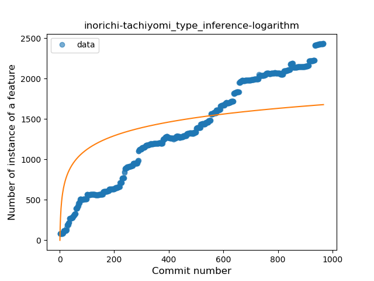
### <a name="lambda">Lambda</a>
----
#### Functions
* **Constant Rise - Linear:** 
    * **R_Squared:** 0.97264017
* **Sudden Rise Plateau - Logarithm:** 
    * **R_Squared:** 0.57533834

**Plots** :chart_with_upwards_trend:
-----

### <a name="safe_call">Safe Call</a>
----
#### Functions
* **Constant Rise - Linear:** 
    * **R_Squared:** 0.93126642
* **Sudden Rise - Exponential:** 
    * **R_Squared:** 0.93268208
* **Plateau Sudden Rise - Binary Sigmoid:** 
    * **R_Squared:** 0.53207274
* **Sudden Rise Plateau - Logarithm:** 
    * **R_Squared:** 0.45907466

**Plots** :chart_with_upwards_trend:
-----

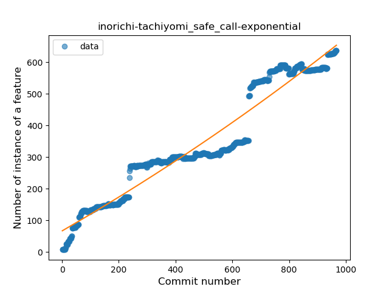
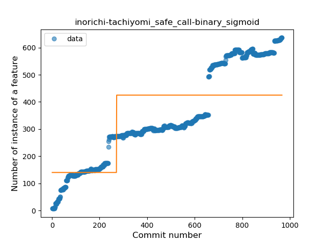
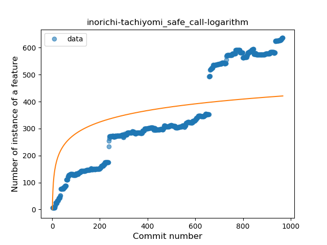
### <a name="when_expr">When expression</a>
----
#### Functions
* **Constant Rise - Linear:** 
    * **R_Squared:** 0.96737667
* **Sudden Rise Plateau - Logarithm:** 
    * **R_Squared:** 0.52925199
* **Plateau Sudden Rise - Binary Sigmoid:** 
    * **R_Squared:** 0.2479519

**Plots** :chart_with_upwards_trend:
-----

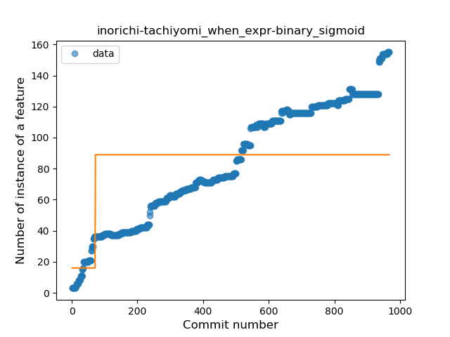
### <a name="companion_object">Companion Object</a>
----
#### Functions
* **Sudden Rise Plateau - Logarithm:** 
    * **R_Squared:** 0.88835899
* **Constant Rise - Linear:** 
    * **R_Squared:** 0.68833046

**Plots** :chart_with_upwards_trend:
-----

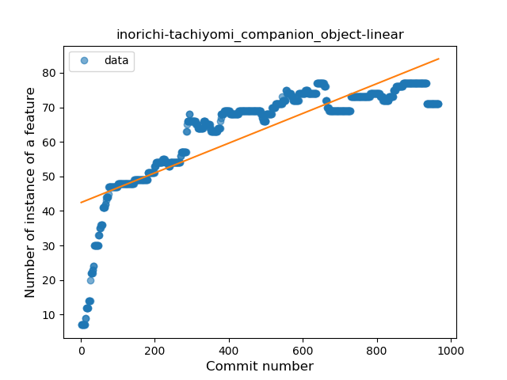
### <a name="unsafe_call">Unsafe Call</a>
----
#### Functions
* **Constant Rise - Linear:** 
    * **R_Squared:** 0.93771018
* **Sudden Rise - Exponential:** 
    * **R_Squared:** 0.94077036
* **Sudden Rise Plateau - Logarithm:** 
    * **R_Squared:** 0.42555198
* **Plateau Sudden Rise - Binary Sigmoid:** 
    * **R_Squared:** 0.27616933

**Plots** :chart_with_upwards_trend:
-----

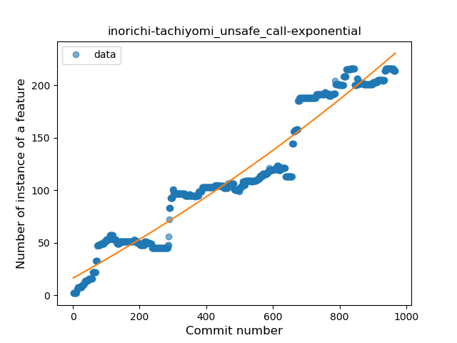

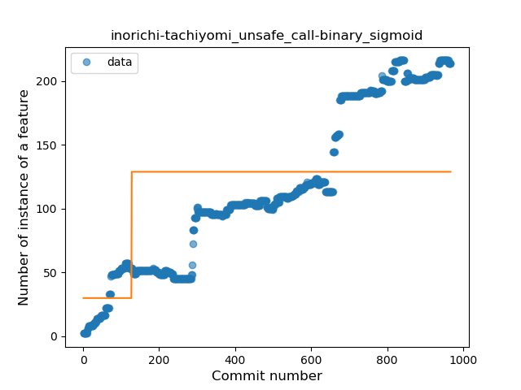
### <a name="string_template">String Template</a>
----
#### Functions
* **Constant Rise - Linear:** 
    * **R_Squared:** 0.96020214
* **Sudden Rise Plateau - Logarithm:** 
    * **R_Squared:** 0.49796911
* **Plateau Sudden Rise - Binary Sigmoid:** 
    * **R_Squared:** 0.45173773

**Plots** :chart_with_upwards_trend:
-----

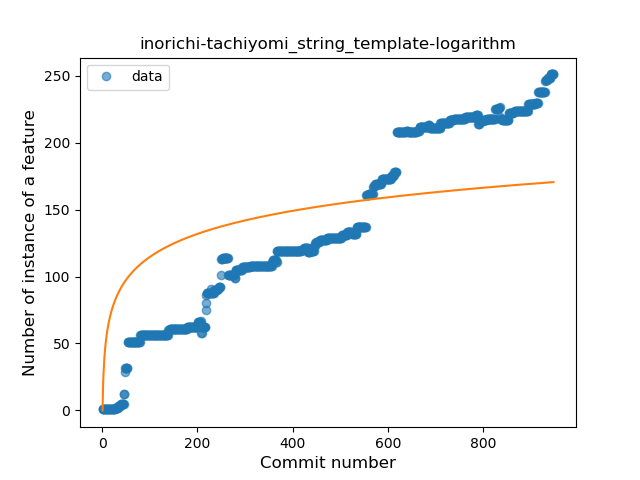

### <a name="func_with_default_value">Function with Default Value</a>
----
#### Functions
* **Sudden Rise - Exponential:** 
    * **R_Squared:** 0.96831433
* **Constant Rise - Linear:** 
    * **R_Squared:** 0.9327177
* **Plateau Sudden Rise - Binary Sigmoid:** 
    * **R_Squared:** 0.44860594
* **Sudden Rise Plateau - Logarithm:** 
    * **R_Squared:** 0.34771451

**Plots** :chart_with_upwards_trend:
-----

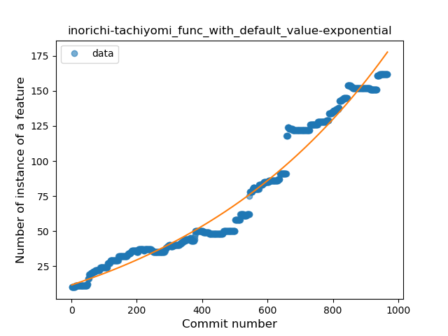
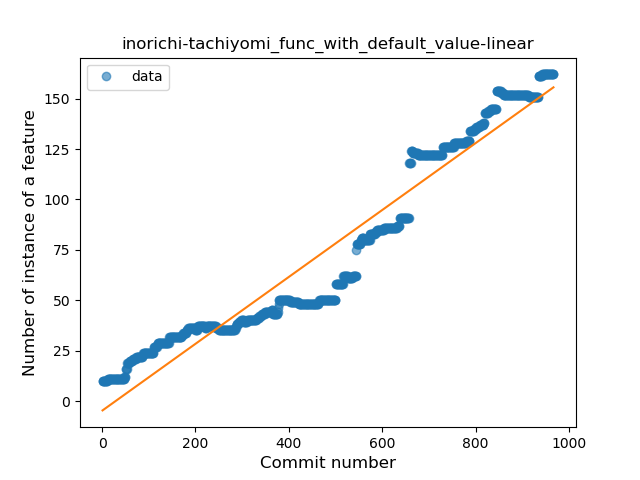
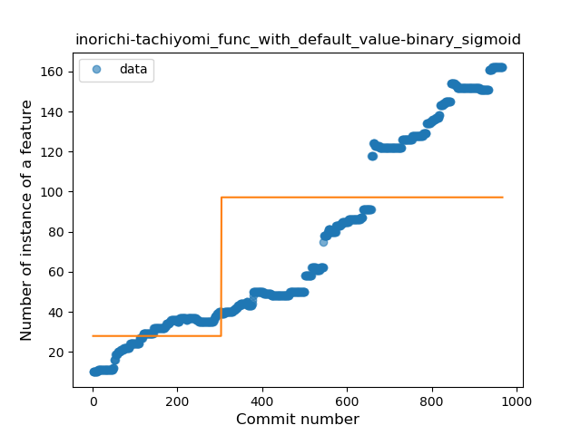
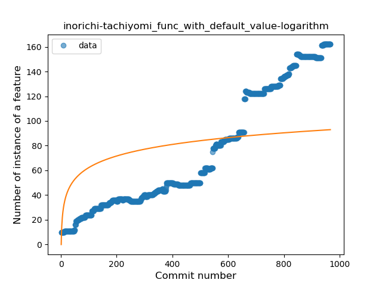
### <a name="singleton">Singleton</a>
----
#### Functions
* **Constant Rise - Linear:** 
    * **R_Squared:** 0.9341807
* **Sudden Rise - Exponential:** 
    * **R_Squared:** 0.93546629
* **Sudden Rise Plateau - Logarithm:** 
    * **R_Squared:** 0.45025172

**Plots** :chart_with_upwards_trend:
-----

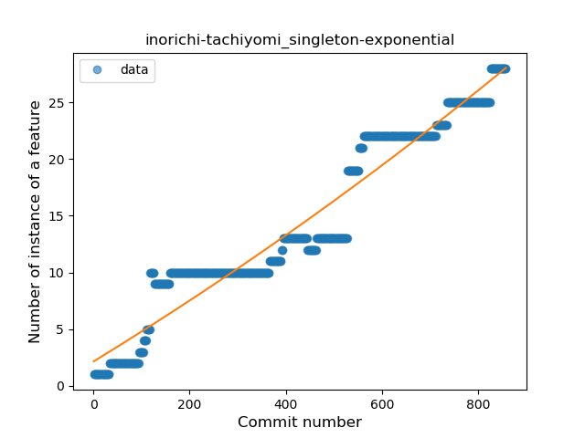
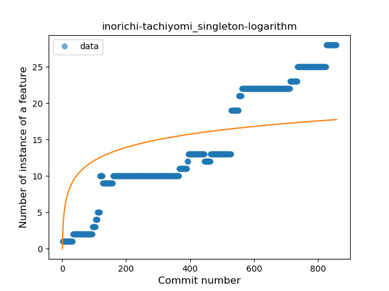
### <a name="smart_cast">Smart Cast</a>
----
#### Functions
* **Sudden Rise - Exponential:** 
    * **R_Squared:** 0.9369925
* **Constant Rise - Linear:** 
    * **R_Squared:** 0.90456558
* **Sudden Rise Plateau - Logarithm:** 
    * **R_Squared:** 0.27980595
* **Plateau Sudden Rise - Binary Sigmoid:** 
    * **R_Squared:** 0.0639544

**Plots** :chart_with_upwards_trend:
-----

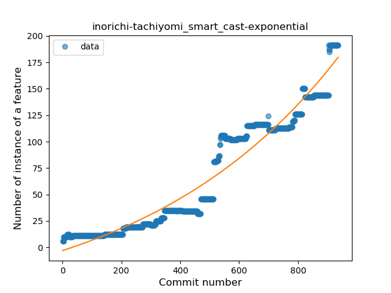
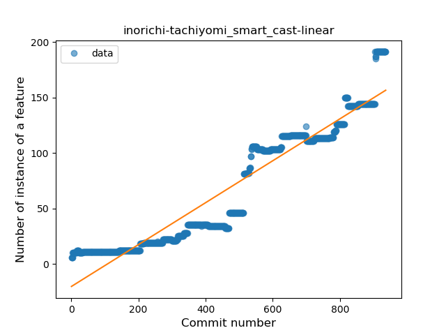
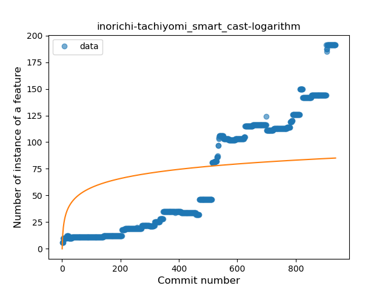
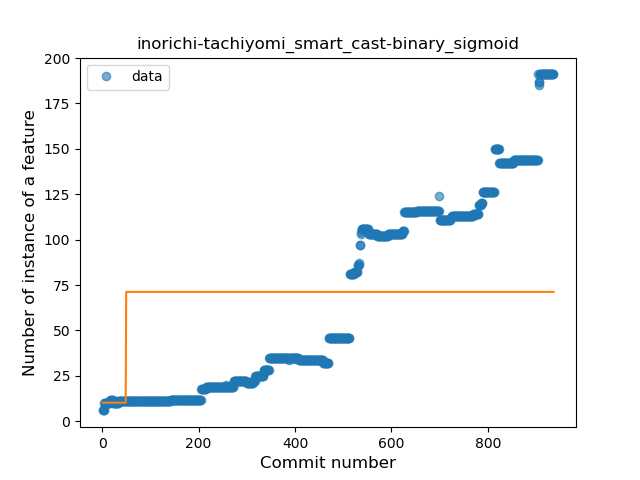
### <a name="range_expr">Range Expression</a>
----
#### Functions
* **Constant Rise - Linear:** 
    * **R_Squared:** 0.9247932
* **Sudden Rise - Exponential:** 
    * **R_Squared:** 0.92586888
* **Sudden Rise Plateau - Logarithm:** 
    * **R_Squared:** 0.3743269

**Plots** :chart_with_upwards_trend:
-----

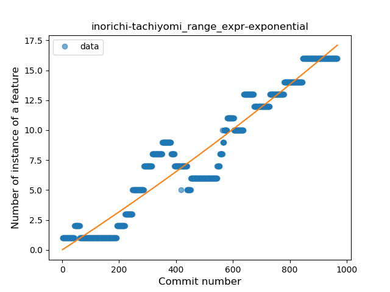

### <a name="func_call_with_named_arg">Function call with Named Argument</a>
----
#### Functions
* **Sudden Rise - Exponential:** 
    * **R_Squared:** 0.94636448
* **Constant Rise - Linear:** 
    * **R_Squared:** 0.88734707
* **Sudden Rise Plateau - Logarithm:** 
    * **R_Squared:** 0.26952764

**Plots** :chart_with_upwards_trend:
-----

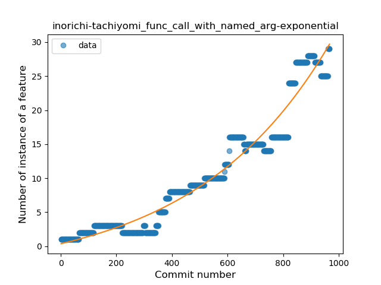
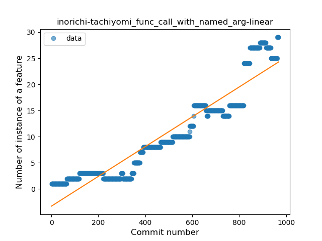
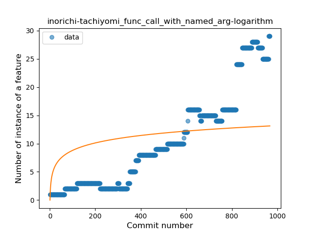
### <a name="data_class">Data Class</a>
----
#### Functions
* **Sudden Rise - Exponential:** 
    * **R_Squared:** 0.95872946
* **Constant Rise - Linear:** 
    * **R_Squared:** 0.94281556
* **Sudden Rise Plateau - Logarithm:** 
    * **R_Squared:** 0.39843006

**Plots** :chart_with_upwards_trend:
-----

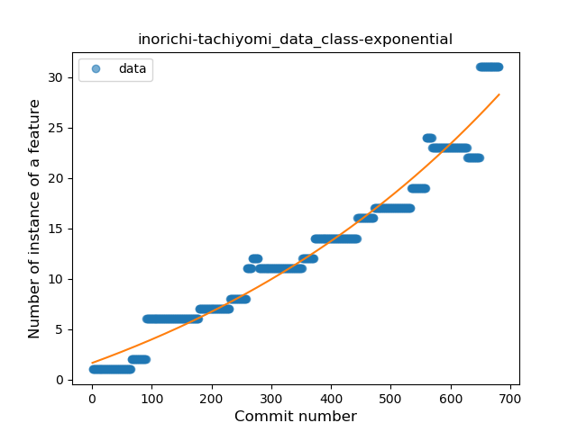
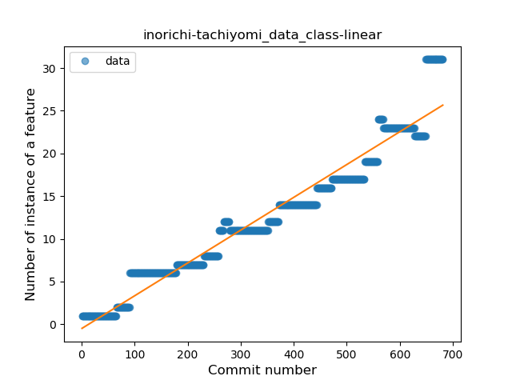
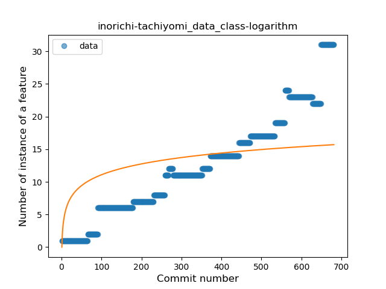
### <a name="extension_function">Extension Function</a>
----
#### Functions
* **Sudden Rise - Exponential:** 
    * **R_Squared:** 0.97749712
* **Plateau Gradual Rise - Sigmoid:** 
    * **R_Squared:** 0.98090375
* **Constant Rise - Linear:** 
    * **R_Squared:** 0.96365059
* **Sudden Rise Plateau - Logarithm:** 
    * **R_Squared:** 0.36561684

**Plots** :chart_with_upwards_trend:
-----

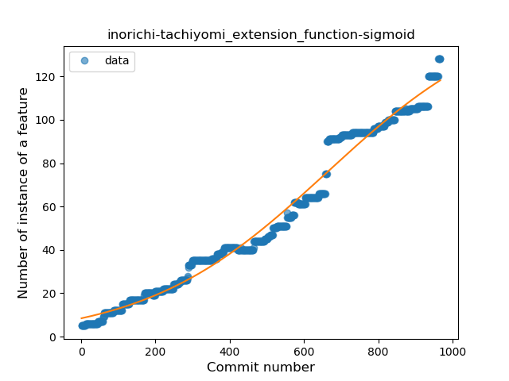
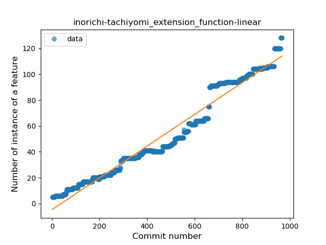
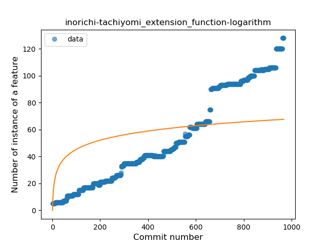
### <a name="property_delegation">Property Delegation</a>
----
#### Functions
* **Constant Rise - Linear:** 
    * **R_Squared:** 0.43363843
* **Sudden Rise Plateau - Logarithm:** 
    * **R_Squared:** 0.38865623
* **Plateau Sudden Rise - Binary Sigmoid:** 
    * **R_Squared:** 0.26613373

**Plots** :chart_with_upwards_trend:
-----

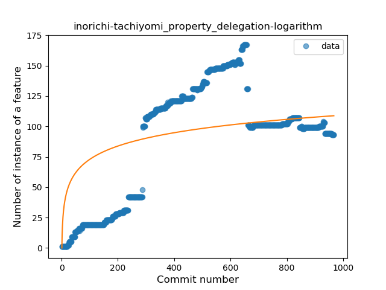
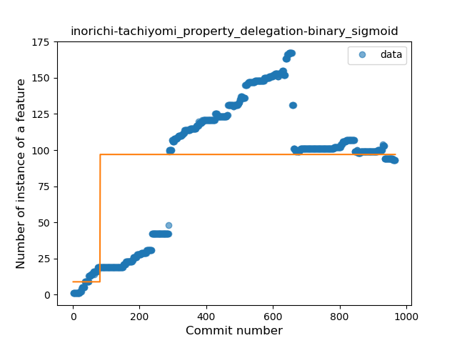
### <a name="destructuring_declaration">Destructuring Declaration</a>
----
#### Functions
* **Constant Rise - Linear:** 
    * **R_Squared:** 0.94225206
* **Sudden Rise - Exponential:** 
    * **R_Squared:** 0.94708226
* **Sudden Rise Plateau - Logarithm:** 
    * **R_Squared:** 0.39035819

**Plots** :chart_with_upwards_trend:
-----

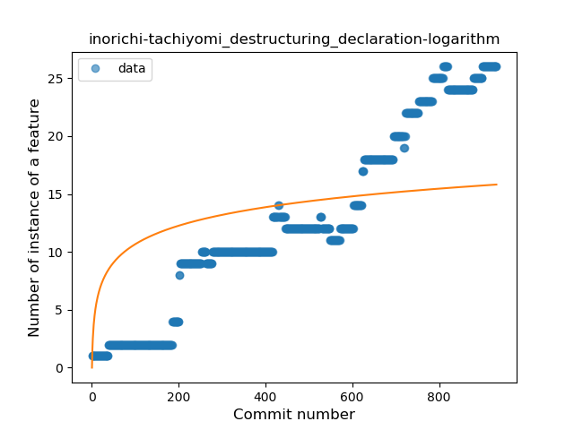
### <a name="inline_func">Inline Function</a>
----
#### Functions
* **Plateau Gradual Rise - Sigmoid:** 
    * **R_Squared:** 0.96060633
* **Sudden Rise - Exponential:** 
    * **R_Squared:** 0.89942212
* **Constant Rise - Linear:** 
    * **R_Squared:** 0.84358559
* **Sudden Rise Plateau - Logarithm:** 
    * **R_Squared:** 0.25939235

**Plots** :chart_with_upwards_trend:
-----

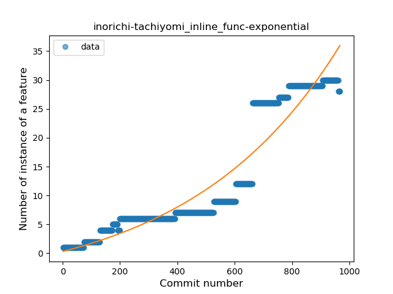
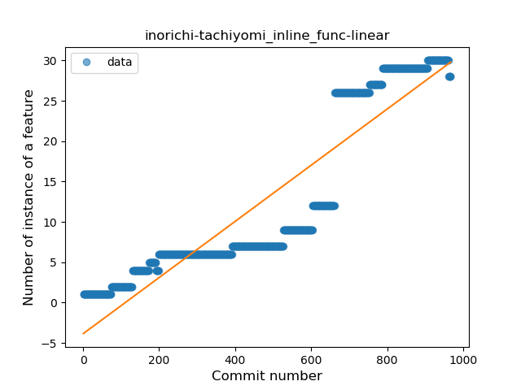
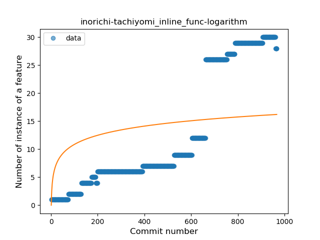
### <a name="super_delegation">Super Delegation</a>
----
#### Functions
* **Plateau Sudden Rise - Binary Sigmoid:** 
    * **R_Squared:** 0.28744891
* **Sudden Rise Plateau - Logarithm:** 
    * **R_Squared:** 0.05945301
* **Constant Decline - Linear:** 
    * **R_Squared:** 0.00610991

**Plots** :chart_with_upwards_trend:
-----

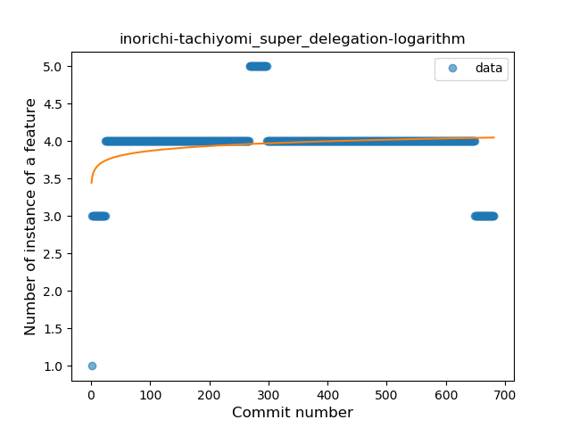
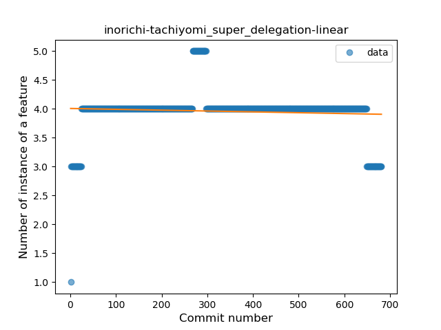
