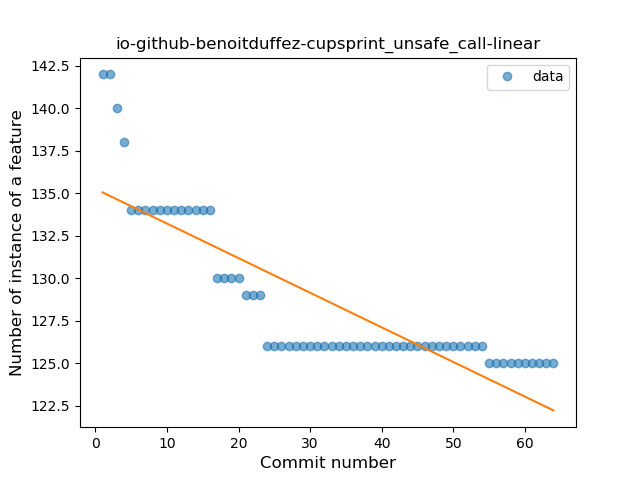

## io-github-benoitduffez-cupsprint
----
#### Metrics provided by Detekt
* Number of lines of code 6465
* Number of Kotlin files: 57
* Cyclomatic complexity: 830
* Cyclomatic complexity by thousands of lines: 275 

----
**10** features analyzed

*	<a href="#type_inference">Type Inference</a> 
*	<a href="#lambda">Lambda</a> 
*	<a href="#safe_call">Safe Call</a> 
*	<a href="#when_expr">When expression</a> 
*	<a href="#unsafe_call">Unsafe Call</a> 
*	<a href="#companion_object">Companion Object</a> 
*	<a href="#string_template">String Template</a> 
*	<a href="#func_with_default_value">Function with Default Value</a> 
*	<a href="#singleton">Singleton</a> 
*	<a href="#smart_cast">Smart Cast</a> 

### <a name="type_inference">Type Inference</a>
----
#### Functions
* **Instability - Polinomial 3:** )
    * **R_Squared:** 0.55941373
* **Sudden Rise - Exponential:** 
    * **R_Squared:** 0.47562211
* **Constant Rise - Linear:** 
    * **R_Squared:** 0.44516949
* **Sudden Rise Plateau - Logarithm:** 
    * **R_Squared:** 0.44687934

**Plots** :chart_with_upwards_trend:
-----

### <a name="lambda">Lambda</a>
----
#### Functions
* **Sudden Rise Plateau - Logarithm:** 
    * **R_Squared:** 0.60845899
* **Instability - Polinomial 3:** )
    * **R_Squared:** 0.59885282
* **Constant Rise - Linear:** 
    * **R_Squared:** 0.2937842

**Plots** :chart_with_upwards_trend:
-----

### <a name="safe_call">Safe Call</a>
----
#### Functions
* **Sudden Rise - Exponential:** 
    * **R_Squared:** 0.85015535
* **Constant Rise - Linear:** 
    * **R_Squared:** 0.78798976
* **Sudden Rise Plateau - Logarithm:** 
    * **R_Squared:** 0.43807268

**Plots** :chart_with_upwards_trend:
-----

### <a name="when_expr">When expression</a>
----
#### Functions
* **Sudden Rise Plateau - Logarithm:** 
    * **R_Squared:** 0.85531704
* **Instability - Polinomial 3:** )
    * **R_Squared:** 0.85565601
* **Constant Rise - Linear:** 
    * **R_Squared:** 0.61703346

**Plots** :chart_with_upwards_trend:
-----

### <a name="unsafe_call">Unsafe Call</a>
----
#### Functions
* **Constant Decline - Linear:** 
    * **R_Squared:** 0.71049264
* **Sudden Rise - Exponential:** 
    * **R_Squared:** 0.0
* **Sudden Rise Plateau - Logarithm:** 
    * **R_Squared:** -0.0

**Plots** :chart_with_upwards_trend:
-----

### <a name="companion_object">Companion Object</a>
----
#### Functions
* **Sudden Decline - Exponential:** 
    * **R_Squared:** 0.90799085
* **Instability - Polinomial 3:** )
    * **R_Squared:** 0.83059248
* **Constant Decline - Linear:** 
    * **R_Squared:** 0.3615894
* **Sudden Rise Plateau - Logarithm:** 
    * **R_Squared:** -0.0

**Plots** :chart_with_upwards_trend:
-----

### <a name="string_template">String Template</a>
----
#### Functions
* **Instability - Polinomial 3:** )
    * **R_Squared:** 0.96533735
* **Sudden Rise Plateau - Logarithm:** 
    * **R_Squared:** 0.9040468
* **Constant Rise - Linear:** 
    * **R_Squared:** 0.66855009

**Plots** :chart_with_upwards_trend:
-----

### <a name="func_with_default_value">Function with Default Value</a>
----
#### Functions
* **Constant Rise - Linear:** 
    * **R_Squared:** 0.77506193
* **Sudden Rise Plateau - Logarithm:** 
    * **R_Squared:** 0.68723432

**Plots** :chart_with_upwards_trend:
-----

### <a name="singleton">Singleton</a>
----
#### Functions
* **Sudden Decline - Exponential:** 
    * **R_Squared:** 1.0
* **Constant Decline - Linear:** 
    * **R_Squared:** 0.04615385
* **Sudden Rise Plateau - Logarithm:** 
    * **R_Squared:** -0.0

**Plots** :chart_with_upwards_trend:
-----

### <a name="smart_cast">Smart Cast</a>
----
#### Functions
* **Sudden Decline - Exponential:** 
    * **R_Squared:** 0.81905231
* **Instability - Polinomial 3:** )
    * **R_Squared:** 0.73715203
* **Plateau Sudden Decline - Binary Sigmoid:** 
    * **R_Squared:** 0.54499691
* **Constant Decline - Linear:** 
    * **R_Squared:** 0.30888331
* **Sudden Rise Plateau - Logarithm:** 
    * **R_Squared:** -0.0

**Plots** :chart_with_upwards_trend:
-----

