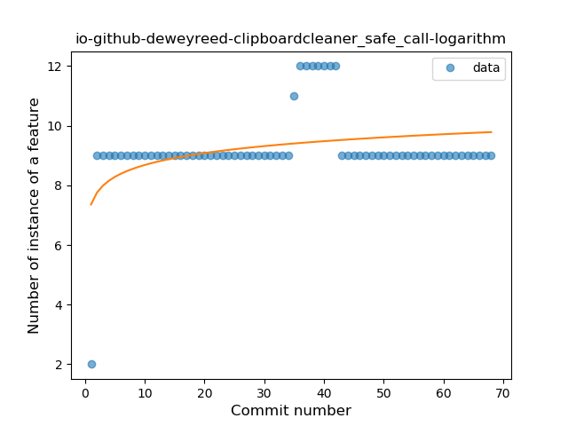

## io-github-deweyreed-clipboardcleaner
----
#### Metrics provided by Detekt
* Number of lines of code 845
* Number of Kotlin files: 10
* Cyclomatic complexity: 135
* Cyclomatic complexity by thousands of lines: 292 

----
**7** features analyzed

*	<a href="#type_inference">Type Inference</a> 
*	<a href="#lambda">Lambda</a> 
*	<a href="#safe_call">Safe Call</a> 
*	<a href="#when_expr">When expression</a> 
*	<a href="#func_with_default_value">Function with Default Value</a> 
*	<a href="#range_expr">Range Expression</a> 
*	<a href="#extension_function">Extension Function</a> 

### <a name="type_inference">Type Inference</a>
----
#### Functions
* **Sudden Rise Plateau - Logarithm:** 
    * **R_Squared:** 0.87017017
* **Constant Rise - Linear:** 
    * **R_Squared:** 0.83015403

**Plots** :chart_with_upwards_trend:
-----

### <a name="lambda">Lambda</a>
----
#### Functions
* **Constant Rise - Linear:** 
    * **R_Squared:** 0.7996881
* **Sudden Rise Plateau - Logarithm:** 
    * **R_Squared:** 0.79342401
* **Plateau Sudden Rise - Binary Sigmoid:** 
    * **R_Squared:** 0.41370653

**Plots** :chart_with_upwards_trend:
-----

### <a name="safe_call">Safe Call</a>
----
#### Functions
* **Sudden Rise Plateau - Logarithm:** 
    * **R_Squared:** 0.16296909
* **Plateau Sudden Rise - Binary Sigmoid:** 
    * **R_Squared:** 0.12858807
* **Constant Rise - Linear:** 
    * **R_Squared:** 0.03703794

**Plots** :chart_with_upwards_trend:
-----

### <a name="when_expr">When expression</a>
----
#### Functions
* **Plateau Sudden Rise - Binary Sigmoid:** 
    * **R_Squared:** 1.0
* **Constant Rise - Linear:** 
    * **R_Squared:** 0.7495133
* **Sudden Rise - Exponential:** 
    * **R_Squared:** 0.75023496
* **Sudden Rise Plateau - Logarithm:** 
    * **R_Squared:** 0.52063051

**Plots** :chart_with_upwards_trend:
-----

### <a name="func_with_default_value">Function with Default Value</a>
----
#### Functions
* **Plateau Sudden Rise - Binary Sigmoid:** 
    * **R_Squared:** 0.81241341
* **Instability - Polinomial 3:** )
    * **R_Squared:** 0.6328904
* **Sudden Rise - Exponential:** 
    * **R_Squared:** 0.49168862
* **Constant Rise - Linear:** 
    * **R_Squared:** 0.47564591
* **Sudden Rise Plateau - Logarithm:** 
    * **R_Squared:** 0.27854519

**Plots** :chart_with_upwards_trend:
-----

### <a name="range_expr">Range Expression</a>
----
#### Functions
* **Sudden Rise Plateau - Logarithm:** 
    * **R_Squared:** 0.1956725
* **Constant Rise - Linear:** 
    * **R_Squared:** 0.04347826

**Plots** :chart_with_upwards_trend:
-----

### <a name="extension_function">Extension Function</a>
----
#### Functions
* **Sudden Rise Plateau - Logarithm:** 
    * **R_Squared:** 0.79884749
* **Instability - Polinomial 3:** )
    * **R_Squared:** 0.75929998
* **Plateau Sudden Rise - Binary Sigmoid:** 
    * **R_Squared:** 0.58132573
* **Constant Rise - Linear:** 
    * **R_Squared:** 0.52569657

**Plots** :chart_with_upwards_trend:
-----

