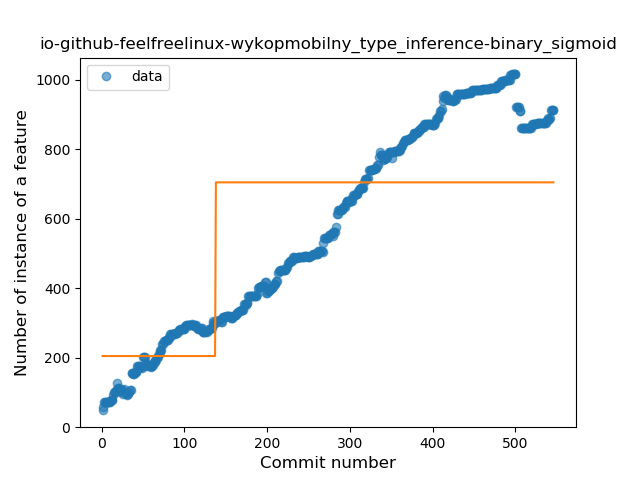
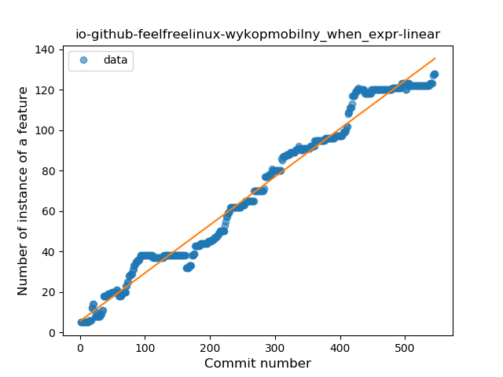
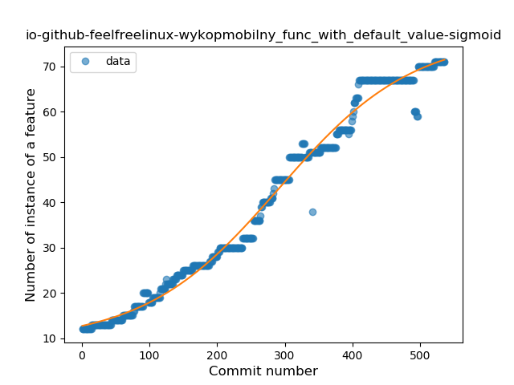
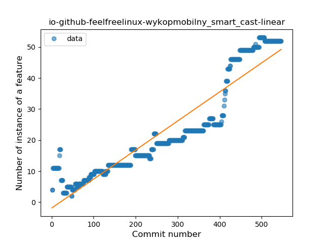
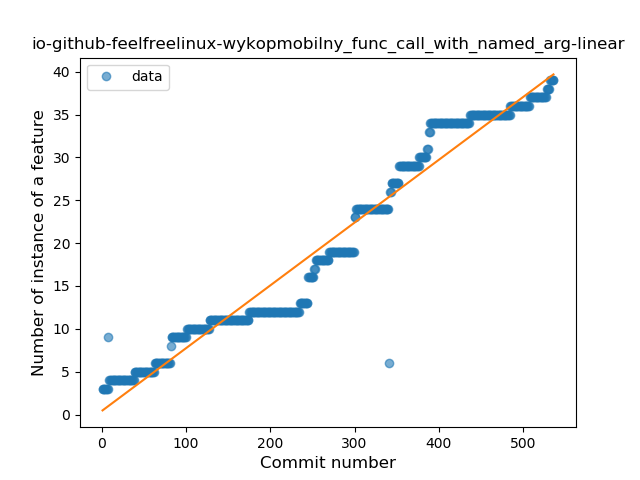
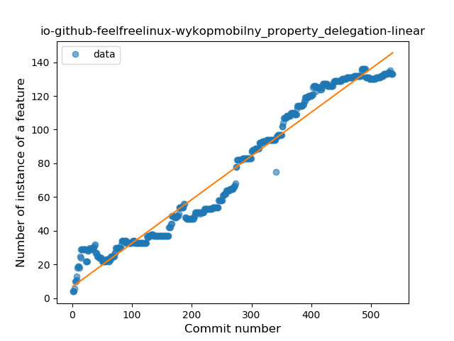

## io-github-feelfreelinux-wykopmobilny
----
#### Metrics provided by Detekt
* Number of lines of code 23963
* Number of Kotlin files: 538
* Cyclomatic complexity: 3500
* Cyclomatic complexity by thousands of lines: 265 

----
**18** features analyzed

*	<a href="#type_inference">Type Inference</a> 
*	<a href="#lambda">Lambda</a> 
*	<a href="#safe_call">Safe Call</a> 
*	<a href="#when_expr">When expression</a> 
*	<a href="#unsafe_call">Unsafe Call</a> 
*	<a href="#companion_object">Companion Object</a> 
*	<a href="#string_template">String Template</a> 
*	<a href="#func_with_default_value">Function with Default Value</a> 
*	<a href="#range_expr">Range Expression</a> 
*	<a href="#smart_cast">Smart Cast</a> 
*	<a href="#data_class">Data Class</a> 
*	<a href="#func_call_with_named_arg">Function call with Named Argument</a> 
*	<a href="#extension_function">Extension Function</a> 
*	<a href="#property_delegation">Property Delegation</a> 
*	<a href="#destructuring_declaration">Destructuring Declaration</a> 
*	<a href="#inline_func">Inline Function</a> 
*	<a href="#overloaded_op">Overloaded Operator</a> 
*	<a href="#type_alias">Type Alias</a> 

### <a name="type_inference">Type Inference</a>
----
#### Functions
* **Constant Rise - Linear:** 
    * **R_Squared:** 0.95183353
* **Plateau Sudden Rise - Binary Sigmoid:** 
    * **R_Squared:** 0.53377277
* **Sudden Rise Plateau - Logarithm:** 
    * **R_Squared:** 0.50275735

**Plots** :chart_with_upwards_trend:
-----

### <a name="lambda">Lambda</a>
----
#### Functions
* **Constant Rise - Linear:** 
    * **R_Squared:** 0.96026507
* **Plateau Sudden Rise - Binary Sigmoid:** 
    * **R_Squared:** 0.57033128
* **Sudden Rise Plateau - Logarithm:** 
    * **R_Squared:** 0.46145859

**Plots** :chart_with_upwards_trend:
-----

### <a name="safe_call">Safe Call</a>
----
#### Functions
* **Constant Rise - Linear:** 
    * **R_Squared:** 0.93764632
* **Plateau Sudden Rise - Binary Sigmoid:** 
    * **R_Squared:** 0.58834795
* **Sudden Rise Plateau - Logarithm:** 
    * **R_Squared:** 0.46300263

**Plots** :chart_with_upwards_trend:
-----

### <a name="when_expr">When expression</a>
----
#### Functions
* **Constant Rise - Linear:** 
    * **R_Squared:** 0.97870839
* **Sudden Rise Plateau - Logarithm:** 
    * **R_Squared:** 0.48836672
* **Plateau Sudden Rise - Binary Sigmoid:** 
    * **R_Squared:** 0.26662957

**Plots** :chart_with_upwards_trend:
-----

### <a name="unsafe_call">Unsafe Call</a>
----
#### Functions
* **Constant Rise - Linear:** 
    * **R_Squared:** 0.91543554
* **Plateau Sudden Rise - Binary Sigmoid:** 
    * **R_Squared:** 0.46458889
* **Sudden Rise Plateau - Logarithm:** 
    * **R_Squared:** 0.41281774

**Plots** :chart_with_upwards_trend:
-----

### <a name="companion_object">Companion Object</a>
----
#### Functions
* **Constant Rise - Linear:** 
    * **R_Squared:** 0.94696636
* **Sudden Rise Plateau - Logarithm:** 
    * **R_Squared:** 0.48978736
* **Plateau Sudden Rise - Binary Sigmoid:** 
    * **R_Squared:** 0.41602649

**Plots** :chart_with_upwards_trend:
-----

### <a name="string_template">String Template</a>
----
#### Functions
* **Constant Rise - Linear:** 
    * **R_Squared:** 0.92927566
* **Sudden Rise Plateau - Logarithm:** 
    * **R_Squared:** 0.5443039
* **Plateau Sudden Rise - Binary Sigmoid:** 
    * **R_Squared:** 0.49042717

**Plots** :chart_with_upwards_trend:
-----

### <a name="func_with_default_value">Function with Default Value</a>
----
#### Functions
* **Plateau Gradual Rise - Sigmoid:** 
    * **R_Squared:** 0.98715214
* **Constant Rise - Linear:** 
    * **R_Squared:** 0.97394871
* **Sudden Rise - Exponential:** 
    * **R_Squared:** 0.97530402
* **Sudden Rise Plateau - Logarithm:** 
    * **R_Squared:** 0.48954408

**Plots** :chart_with_upwards_trend:
-----

### <a name="range_expr">Range Expression</a>
----
#### Functions
* **Constant Rise - Linear:** 
    * **R_Squared:** 0.69927304
* **Sudden Rise Plateau - Logarithm:** 
    * **R_Squared:** 0.39671117
* **Plateau Sudden Rise - Binary Sigmoid:** 
    * **R_Squared:** 0.21345116

**Plots** :chart_with_upwards_trend:
-----

### <a name="smart_cast">Smart Cast</a>
----
#### Functions
* **Sudden Rise - Exponential:** 
    * **R_Squared:** 0.9442005
* **Constant Rise - Linear:** 
    * **R_Squared:** 0.87050332
* **Sudden Rise Plateau - Logarithm:** 
    * **R_Squared:** 0.32375106
* **Plateau Sudden Rise - Binary Sigmoid:** 
    * **R_Squared:** 0.07078209

**Plots** :chart_with_upwards_trend:
-----

### <a name="data_class">Data Class</a>
----
#### Functions
* **Constant Rise - Linear:** 
    * **R_Squared:** 0.85733288
* **Sudden Rise Plateau - Logarithm:** 
    * **R_Squared:** 0.71489428

**Plots** :chart_with_upwards_trend:
-----

### <a name="func_call_with_named_arg">Function call with Named Argument</a>
----
#### Functions
* **Constant Rise - Linear:** 
    * **R_Squared:** 0.95811929
* **Sudden Rise - Exponential:** 
    * **R_Squared:** 0.96245299
* **Sudden Rise Plateau - Logarithm:** 
    * **R_Squared:** 0.43136648
* **Plateau Sudden Rise - Binary Sigmoid:** 
    * **R_Squared:** 0.06411132

**Plots** :chart_with_upwards_trend:
-----

### <a name="extension_function">Extension Function</a>
----
#### Functions
* **Plateau Gradual Rise - Sigmoid:** 
    * **R_Squared:** 0.83203974
* **Sudden Rise - Exponential:** 
    * **R_Squared:** 0.79120393
* **Constant Rise - Linear:** 
    * **R_Squared:** 0.76615658
* **Sudden Rise Plateau - Logarithm:** 
    * **R_Squared:** 0.48078806

**Plots** :chart_with_upwards_trend:
-----

### <a name="property_delegation">Property Delegation</a>
----
#### Functions
* **Constant Rise - Linear:** 
    * **R_Squared:** 0.96145165
* **Sudden Rise - Exponential:** 
    * **R_Squared:** 0.96366634
* **Sudden Rise Plateau - Logarithm:** 
    * **R_Squared:** 0.45844762
* **Plateau Sudden Rise - Binary Sigmoid:** 
    * **R_Squared:** 0.22552268

**Plots** :chart_with_upwards_trend:
-----

### <a name="destructuring_declaration">Destructuring Declaration</a>
----
#### Functions
* **Sudden Decline - Exponential:** 
    * **R_Squared:** 0.796152
* **Constant Decline - Linear:** 
    * **R_Squared:** 0.10445284
* **Sudden Rise Plateau - Logarithm:** 
    * **R_Squared:** 0.0

**Plots** :chart_with_upwards_trend:
-----

### <a name="inline_func">Inline Function</a>
----
#### Functions
* **Plateau Sudden Decline - Binary Sigmoid:** 
    * **R_Squared:** 0.81979683
* **Sudden Decline - Exponential:** 
    * **R_Squared:** 0.51971709
* **Constant Decline - Linear:** 
    * **R_Squared:** 0.09791875
* **Sudden Rise Plateau - Logarithm:** 
    * **R_Squared:** -0.0

**Plots** :chart_with_upwards_trend:
-----

### <a name="overloaded_op">Overloaded Operator</a>
----
#### Functions
* **Constant Decline - Linear:** 
    * **R_Squared:** 0.00041037
* **Sudden Decline - Exponential:** 
    * **R_Squared:** 0.00041157
* **Sudden Rise Plateau - Logarithm:** 
    * **R_Squared:** 0.0

**Plots** :chart_with_upwards_trend:
-----

### <a name="type_alias">Type Alias</a>
----
#### Functions
* **Sudden Rise - Exponential:** 
    * **R_Squared:** 0.1504022
* **Constant Rise - Linear:** 
    * **R_Squared:** 0.05112598
* **Sudden Rise Plateau - Logarithm:** 
    * **R_Squared:** 0.00095246

**Plots** :chart_with_upwards_trend:
-----

