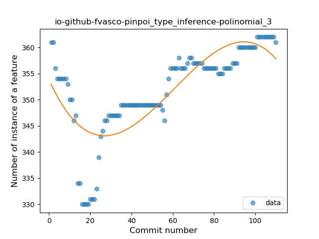
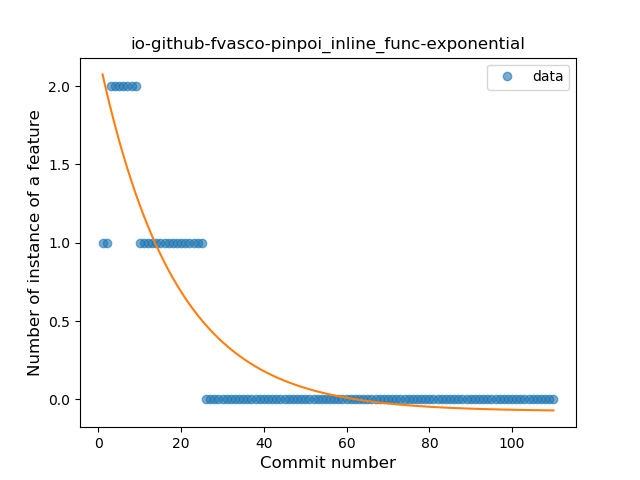

## io-github-fvasco-pinpoi
----
#### Metrics provided by Detekt
* Number of lines of code 5328
* Number of Kotlin files: 49
* Cyclomatic complexity: 811
* Cyclomatic complexity by thousands of lines: 266 

----
**16** features analyzed

*	<a href="#type_inference">Type Inference</a> 
*	<a href="#lambda">Lambda</a> 
*	<a href="#safe_call">Safe Call</a> 
*	<a href="#when_expr">When expression</a> 
*	<a href="#unsafe_call">Unsafe Call</a> 
*	<a href="#companion_object">Companion Object</a> 
*	<a href="#string_template">String Template</a> 
*	<a href="#func_with_default_value">Function with Default Value</a> 
*	<a href="#singleton">Singleton</a> 
*	<a href="#range_expr">Range Expression</a> 
*	<a href="#data_class">Data Class</a> 
*	<a href="#func_call_with_named_arg">Function call with Named Argument</a> 
*	<a href="#extension_function">Extension Function</a> 
*	<a href="#property_delegation">Property Delegation</a> 
*	<a href="#destructuring_declaration">Destructuring Declaration</a> 
*	<a href="#inline_func">Inline Function</a> 

### <a name="type_inference">Type Inference</a>
----
#### Functions
* **Instability - Polinomial 3:** )
    * **R_Squared:** 0.6336987
* **Sudden Rise - Exponential:** 
    * **R_Squared:** 0.49407838
* **Constant Rise - Linear:** 
    * **R_Squared:** 0.47040254
* **Sudden Rise Plateau - Logarithm:** 
    * **R_Squared:** 0.17503482

**Plots** :chart_with_upwards_trend:
-----

### <a name="lambda">Lambda</a>
----
#### Functions
* **Sudden Rise Plateau - Logarithm:** 
    * **R_Squared:** 0.92468629
* **Constant Rise - Linear:** 
    * **R_Squared:** 0.79849298

**Plots** :chart_with_upwards_trend:
-----

### <a name="safe_call">Safe Call</a>
----
#### Functions
* **Sudden Rise - Exponential:** 
    * **R_Squared:** 0.93676311
* **Constant Rise - Linear:** 
    * **R_Squared:** 0.8809118
* **Sudden Rise Plateau - Logarithm:** 
    * **R_Squared:** 0.66585068

**Plots** :chart_with_upwards_trend:
-----

### <a name="when_expr">When expression</a>
----
#### Functions
* **Constant Rise - Linear:** 
    * **R_Squared:** 0.91671728
* **Sudden Rise Plateau - Logarithm:** 
    * **R_Squared:** 0.83074127

**Plots** :chart_with_upwards_trend:
-----

### <a name="unsafe_call">Unsafe Call</a>
----
#### Functions
* **Instability - Polinomial 3:** )
    * **R_Squared:** 0.87564648
* **Constant Decline - Linear:** 
    * **R_Squared:** 0.43131233
* **Sudden Rise - Exponential:** 
    * **R_Squared:** 0.0
* **Sudden Rise Plateau - Logarithm:** 
    * **R_Squared:** -0.0

**Plots** :chart_with_upwards_trend:
-----

### <a name="companion_object">Companion Object</a>
----
#### Functions
* **Sudden Decline - Exponential:** 
    * **R_Squared:** 0.55229624
* **Constant Decline - Linear:** 
    * **R_Squared:** 0.11962687
* **Sudden Rise Plateau - Logarithm:** 
    * **R_Squared:** -0.0

**Plots** :chart_with_upwards_trend:
-----

### <a name="string_template">String Template</a>
----
#### Functions
* **Constant Rise - Linear:** 
    * **R_Squared:** 0.90777495
* **Sudden Rise Plateau - Logarithm:** 
    * **R_Squared:** 0.86838965

**Plots** :chart_with_upwards_trend:
-----

### <a name="func_with_default_value">Function with Default Value</a>
----
#### Functions
* **Plateau Gradual Rise - Sigmoid:** 
    * **R_Squared:** 0.88963313
* **Sudden Rise Plateau - Logarithm:** 
    * **R_Squared:** 0.62147517
* **Constant Rise - Linear:** 
    * **R_Squared:** 0.3256256

**Plots** :chart_with_upwards_trend:
-----

### <a name="singleton">Singleton</a>
----
#### Functions
* **Sudden Rise - Exponential:** 
    * **R_Squared:** 0.10559099
* **Constant Rise - Linear:** 
    * **R_Squared:** 0.07245882
* **Sudden Rise Plateau - Logarithm:** 
    * **R_Squared:** 0.03315073

**Plots** :chart_with_upwards_trend:
-----

### <a name="range_expr">Range Expression</a>
----
#### Functions
* **Sudden Rise - Exponential:** 
    * **R_Squared:** 0.91578836
* **Constant Rise - Linear:** 
    * **R_Squared:** 0.56998942
* **Sudden Rise Plateau - Logarithm:** 
    * **R_Squared:** 0.2249753

**Plots** :chart_with_upwards_trend:
-----

### <a name="data_class">Data Class</a>
----
#### Functions
* **Plateau Sudden Rise - Binary Sigmoid:** 
    * **R_Squared:** 1.0
* **Sudden Rise - Exponential:** 
    * **R_Squared:** 0.78368704
* **Constant Rise - Linear:** 
    * **R_Squared:** 0.42871312
* **Sudden Rise Plateau - Logarithm:** 
    * **R_Squared:** 0.18918132

**Plots** :chart_with_upwards_trend:
-----

### <a name="func_call_with_named_arg">Function call with Named Argument</a>
----
#### Functions
* **Plateau Gradual Rise - Sigmoid:** 
    * **R_Squared:** 0.95340947
* **Sudden Rise - Exponential:** 
    * **R_Squared:** 0.92498543
* **Constant Rise - Linear:** 
    * **R_Squared:** 0.86752381
* **Sudden Rise Plateau - Logarithm:** 
    * **R_Squared:** 0.51960813

**Plots** :chart_with_upwards_trend:
-----

### <a name="extension_function">Extension Function</a>
----
#### Functions
* **Sudden Rise - Exponential:** 
    * **R_Squared:** 0.88843327
* **Constant Rise - Linear:** 
    * **R_Squared:** 0.50266435
* **Sudden Rise Plateau - Logarithm:** 
    * **R_Squared:** 0.23467451

**Plots** :chart_with_upwards_trend:
-----

### <a name="property_delegation">Property Delegation</a>
----
#### Functions
* **Constant Decline - Linear:** 
    * **R_Squared:** 0.44044303
* **Sudden Rise Plateau - Logarithm:** 
    * **R_Squared:** -0.0

**Plots** :chart_with_upwards_trend:
-----

### <a name="destructuring_declaration">Destructuring Declaration</a>
----
#### Functions
* **Plateau Sudden Rise - Binary Sigmoid:** 
    * **R_Squared:** 1.0
* **Constant Rise - Linear:** 
    * **R_Squared:** 0.7478304
* **Sudden Rise - Exponential:** 
    * **R_Squared:** 0.75031071
* **Sudden Rise Plateau - Logarithm:** 
    * **R_Squared:** 0.49598294

**Plots** :chart_with_upwards_trend:
-----

### <a name="inline_func">Inline Function</a>
----
#### Functions
* **Plateau Gradual Decline - Sigmoid:** 
    * **R_Squared:** 0.88124576
* **Sudden Decline - Exponential:** 
    * **R_Squared:** 0.81618201
* **Constant Decline - Linear:** 
    * **R_Squared:** 0.4878683
* **Sudden Rise Plateau - Logarithm:** 
    * **R_Squared:** -0.0

**Plots** :chart_with_upwards_trend:
-----

