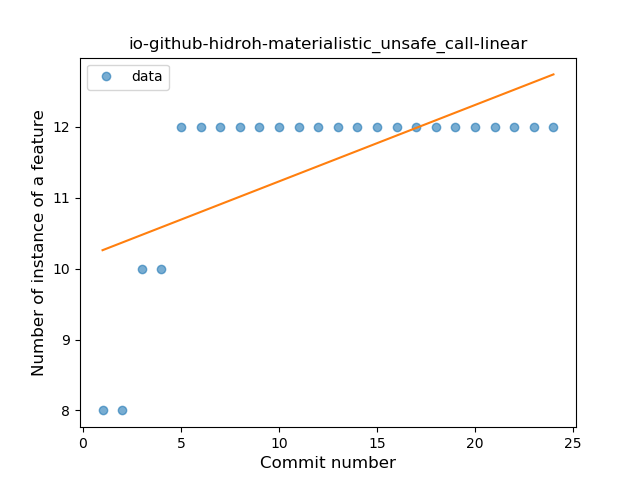
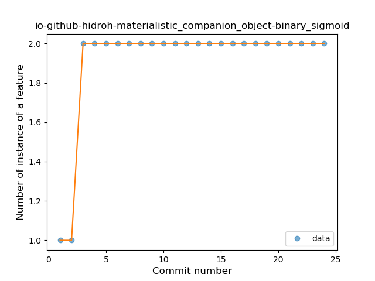

## io-github-hidroh-materialistic
----
#### Metrics provided by Detekt
* Number of lines of code 1403
* Number of Kotlin files: 16
* Cyclomatic complexity: 144
* Cyclomatic complexity by thousands of lines: 217 

----
**5** features analyzed

*	<a href="#type_inference">Type Inference</a> 
*	<a href="#lambda">Lambda</a> 
*	<a href="#safe_call">Safe Call</a> 
*	<a href="#unsafe_call">Unsafe Call</a> 
*	<a href="#companion_object">Companion Object</a> 

### <a name="type_inference">Type Inference</a>
----
#### Functions
* **Instability - Polinomial 3:** )
    * **R_Squared:** 0.90242993
* **Instability - Polinomial 4:** 
    * **R_Squared:** 0.90583185
* **Sudden Rise Plateau - Logarithm:** 
    * **R_Squared:** 0.77366879
* **Constant Rise - Linear:** 
    * **R_Squared:** 0.53850309

**Plots** :chart_with_upwards_trend:
-----

### <a name="lambda">Lambda</a>
----
#### Functions
* **Instability - Polinomial 3:** )
    * **R_Squared:** 0.86376652
* **Sudden Rise Plateau - Logarithm:** 
    * **R_Squared:** 0.72355591
* **Constant Rise - Linear:** 
    * **R_Squared:** 0.46810747

**Plots** :chart_with_upwards_trend:
-----

### <a name="safe_call">Safe Call</a>
----
#### Functions
* **Plateau Sudden Rise - Binary Sigmoid:** 
    * **R_Squared:** 1.0
* **Instability - Polinomial 4:** 
    * **R_Squared:** 0.82727532
* **Instability - Polinomial 3:** )
    * **R_Squared:** 0.81426086
* **Sudden Rise Plateau - Logarithm:** 
    * **R_Squared:** 0.64404164
* **Constant Rise - Linear:** 
    * **R_Squared:** 0.36781609

**Plots** :chart_with_upwards_trend:
-----

### <a name="unsafe_call">Unsafe Call</a>
----
#### Functions
* **Plateau Gradual Rise - Sigmoid:** 
    * **R_Squared:** 0.96374728
* **Instability - Polinomial 4:** 
    * **R_Squared:** 0.93522145
* **Instability - Polinomial 3:** )
    * **R_Squared:** 0.90507819
* **Sudden Rise Plateau - Logarithm:** 
    * **R_Squared:** 0.71591903
* **Constant Rise - Linear:** 
    * **R_Squared:** 0.39324808

**Plots** :chart_with_upwards_trend:
-----

### <a name="companion_object">Companion Object</a>
----
#### Functions
* **Plateau Sudden Rise - Binary Sigmoid:** 
    * **R_Squared:** 1.0
* **Instability - Polinomial 4:** 
    * **R_Squared:** 0.82066146
* **Instability - Polinomial 3:** )
    * **R_Squared:** 0.70761799
* **Sudden Rise Plateau - Logarithm:** 
    * **R_Squared:** 0.51558944
* **Constant Rise - Linear:** 
    * **R_Squared:** 0.22956522

**Plots** :chart_with_upwards_trend:
-----

