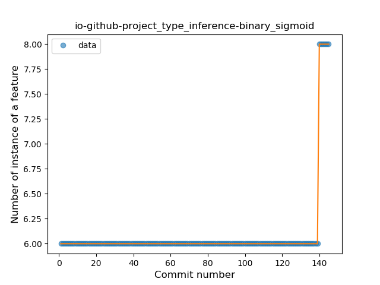

## io-github-project
----
#### Metrics provided by Detekt
* Number of lines of code 132
* Number of Kotlin files: 5
* Cyclomatic complexity: 14
* Cyclomatic complexity by thousands of lines: 202 

----
**2** features analyzed

*	<a href="#type_inference">Type Inference</a> 
*	<a href="#companion_object">Companion Object</a> 

### <a name="type_inference">Type Inference</a>
----
#### Functions
* **Plateau Sudden Rise - Binary Sigmoid:** 
    * **R_Squared:** 1.0
* **Sudden Rise - Exponential:** 
    * **R_Squared:** 0.81056981
* **Constant Rise - Linear:** 
    * **R_Squared:** 0.11900685
* **Sudden Rise Plateau - Logarithm:** 
    * **R_Squared:** 0.04490436

**Plots** :chart_with_upwards_trend:
-----

### <a name="companion_object">Companion Object</a>
----
#### Functions
* **Plateau Sudden Rise - Binary Sigmoid:** 
    * **R_Squared:** 1.0
* **Sudden Rise - Exponential:** 
    * **R_Squared:** 0.81056981
* **Constant Rise - Linear:** 
    * **R_Squared:** 0.11900685
* **Sudden Rise Plateau - Logarithm:** 
    * **R_Squared:** 0.04490436

**Plots** :chart_with_upwards_trend:
-----

