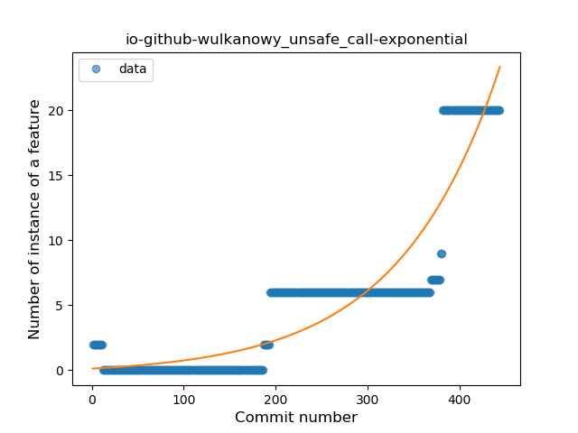
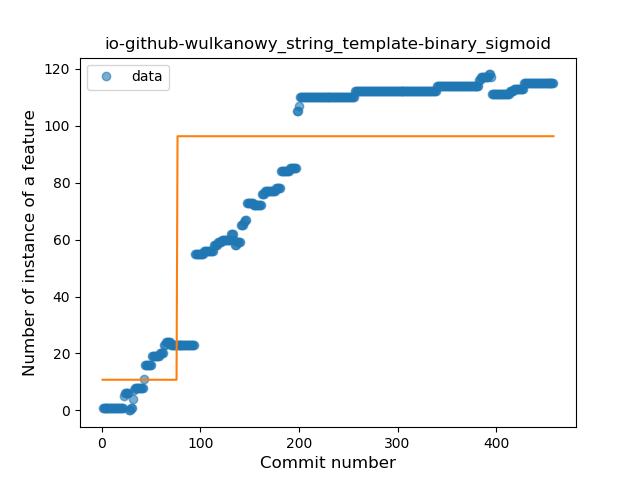
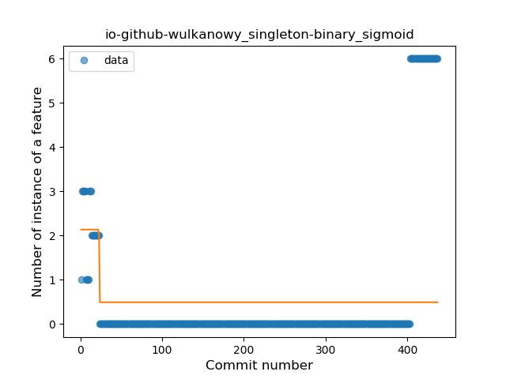
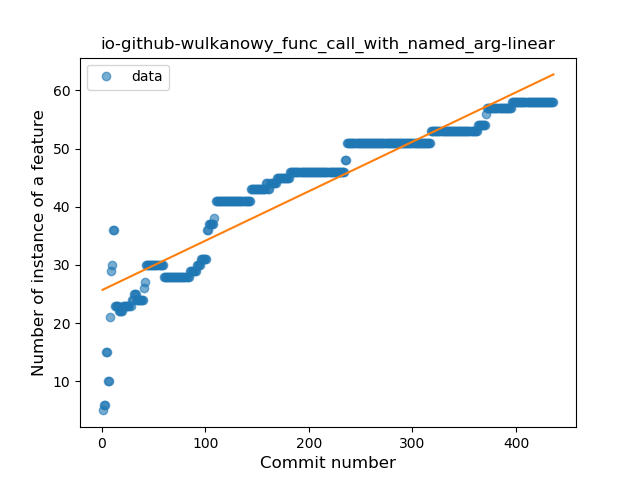

## io-github-wulkanowy
----
#### Metrics provided by Detekt
* Number of lines of code 22907
* Number of Kotlin files: 383
* Cyclomatic complexity: 3636
* Cyclomatic complexity by thousands of lines: 306 

----
**17** features analyzed

*	<a href="#type_inference">Type Inference</a> 
*	<a href="#lambda">Lambda</a> 
*	<a href="#safe_call">Safe Call</a> 
*	<a href="#when_expr">When expression</a> 
*	<a href="#unsafe_call">Unsafe Call</a> 
*	<a href="#companion_object">Companion Object</a> 
*	<a href="#string_template">String Template</a> 
*	<a href="#func_with_default_value">Function with Default Value</a> 
*	<a href="#singleton">Singleton</a> 
*	<a href="#range_expr">Range Expression</a> 
*	<a href="#smart_cast">Smart Cast</a> 
*	<a href="#data_class">Data Class</a> 
*	<a href="#func_call_with_named_arg">Function call with Named Argument</a> 
*	<a href="#extension_function">Extension Function</a> 
*	<a href="#property_delegation">Property Delegation</a> 
*	<a href="#destructuring_declaration">Destructuring Declaration</a> 
*	<a href="#inline_func">Inline Function</a> 

### <a name="type_inference">Type Inference</a>
----
#### Functions
* **Constant Rise - Linear:** 
    * **R_Squared:** 0.97052756
* **Plateau Sudden Rise - Binary Sigmoid:** 
    * **R_Squared:** 0.59859219
* **Sudden Rise Plateau - Logarithm:** 
    * **R_Squared:** 0.53065935

**Plots** :chart_with_upwards_trend:
-----

### <a name="lambda">Lambda</a>
----
#### Functions
* **Sudden Rise Plateau - Logarithm:** 
    * **R_Squared:** 0.83801329
* **Constant Rise - Linear:** 
    * **R_Squared:** 0.78054868
* **Plateau Sudden Rise - Binary Sigmoid:** 
    * **R_Squared:** 0.30180788

**Plots** :chart_with_upwards_trend:
-----

### <a name="safe_call">Safe Call</a>
----
#### Functions
* **Constant Rise - Linear:** 
    * **R_Squared:** 0.83974011
* **Sudden Rise Plateau - Logarithm:** 
    * **R_Squared:** 0.81353887
* **Plateau Sudden Rise - Binary Sigmoid:** 
    * **R_Squared:** 0.43835256

**Plots** :chart_with_upwards_trend:
-----

### <a name="when_expr">When expression</a>
----
#### Functions
* **Plateau Gradual Rise - Sigmoid:** 
    * **R_Squared:** 0.96913481
* **Constant Rise - Linear:** 
    * **R_Squared:** 0.79891514
* **Sudden Rise Plateau - Logarithm:** 
    * **R_Squared:** 0.69194734

**Plots** :chart_with_upwards_trend:
-----

### <a name="unsafe_call">Unsafe Call</a>
----
#### Functions
* **Sudden Rise - Exponential:** 
    * **R_Squared:** 0.85744677
* **Constant Rise - Linear:** 
    * **R_Squared:** 0.70220936
* **Sudden Rise Plateau - Logarithm:** 
    * **R_Squared:** 0.175511

**Plots** :chart_with_upwards_trend:
-----

### <a name="companion_object">Companion Object</a>
----
#### Functions
* **Sudden Rise Plateau - Logarithm:** 
    * **R_Squared:** 0.80889349
* **Plateau Sudden Rise - Binary Sigmoid:** 
    * **R_Squared:** 0.74885815
* **Constant Rise - Linear:** 
    * **R_Squared:** 0.59059145

**Plots** :chart_with_upwards_trend:
-----

### <a name="string_template">String Template</a>
----
#### Functions
* **Constant Rise - Linear:** 
    * **R_Squared:** 0.80318569
* **Plateau Sudden Rise - Binary Sigmoid:** 
    * **R_Squared:** 0.63740824
* **Sudden Rise Plateau - Logarithm:** 
    * **R_Squared:** 0.57484276

**Plots** :chart_with_upwards_trend:
-----

### <a name="func_with_default_value">Function with Default Value</a>
----
#### Functions
* **Sudden Rise Plateau - Logarithm:** 
    * **R_Squared:** 0.92188084
* **Constant Rise - Linear:** 
    * **R_Squared:** 0.71178817

**Plots** :chart_with_upwards_trend:
-----

### <a name="singleton">Singleton</a>
----
#### Functions
* **Sudden Rise - Exponential:** 
    * **R_Squared:** 0.71313341
* **Constant Rise - Linear:** 
    * **R_Squared:** 0.11529452
* **Plateau Sudden Decline - Binary Sigmoid:** 
    * **R_Squared:** 0.04893751
* **Sudden Rise Plateau - Logarithm:** 
    * **R_Squared:** 0.00573535

**Plots** :chart_with_upwards_trend:
-----

### <a name="range_expr">Range Expression</a>
----
#### Functions
* **Constant Rise - Linear:** 
    * **R_Squared:** 0.89949678
* **Sudden Rise Plateau - Logarithm:** 
    * **R_Squared:** 0.7641754

**Plots** :chart_with_upwards_trend:
-----

### <a name="smart_cast">Smart Cast</a>
----
#### Functions
* **Constant Rise - Linear:** 
    * **R_Squared:** 0.89052628
* **Sudden Rise Plateau - Logarithm:** 
    * **R_Squared:** 0.68581023

**Plots** :chart_with_upwards_trend:
-----

### <a name="data_class">Data Class</a>
----
#### Functions
* **Constant Rise - Linear:** 
    * **R_Squared:** 0.81513675
* **Sudden Rise Plateau - Logarithm:** 
    * **R_Squared:** 0.77250016

**Plots** :chart_with_upwards_trend:
-----

### <a name="func_call_with_named_arg">Function call with Named Argument</a>
----
#### Functions
* **Constant Rise - Linear:** 
    * **R_Squared:** 0.8821942
* **Sudden Rise Plateau - Logarithm:** 
    * **R_Squared:** 0.85319117

**Plots** :chart_with_upwards_trend:
-----

### <a name="extension_function">Extension Function</a>
----
#### Functions
* **Sudden Rise Plateau - Logarithm:** 
    * **R_Squared:** 0.92503433
* **Constant Rise - Linear:** 
    * **R_Squared:** 0.86737247
* **Plateau Gradual Rise - Sigmoid:** 
    * **R_Squared:** 0.65338845

**Plots** :chart_with_upwards_trend:
-----

### <a name="property_delegation">Property Delegation</a>
----
#### Functions
* **Sudden Decline - Exponential:** 
    * **R_Squared:** 0.58872039
* **Constant Decline - Linear:** 
    * **R_Squared:** 0.00082794
* **Sudden Rise Plateau - Logarithm:** 
    * **R_Squared:** -0.0

**Plots** :chart_with_upwards_trend:
-----

### <a name="destructuring_declaration">Destructuring Declaration</a>
----
#### Functions
* **Constant Rise - Linear:** 
    * **R_Squared:** 0.82966515
* **Sudden Rise Plateau - Logarithm:** 
    * **R_Squared:** 0.66466167
* **Plateau Sudden Rise - Binary Sigmoid:** 
    * **R_Squared:** 0.12021181

**Plots** :chart_with_upwards_trend:
-----

### <a name="inline_func">Inline Function</a>
----
#### Functions
* **Sudden Rise Plateau - Logarithm:** 
    * **R_Squared:** 0.35188978
* **Constant Rise - Linear:** 
    * **R_Squared:** 0.06308189

**Plots** :chart_with_upwards_trend:
-----

