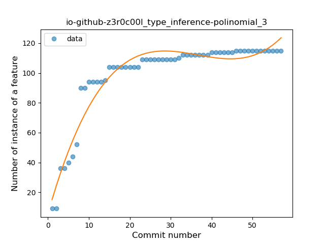
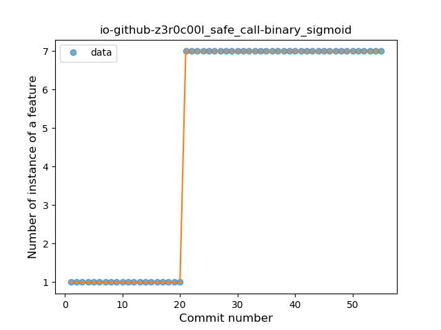
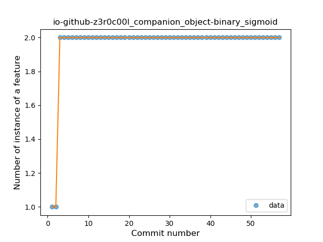
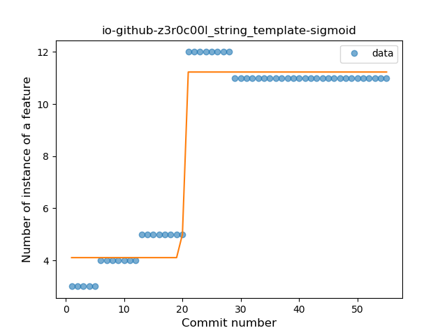
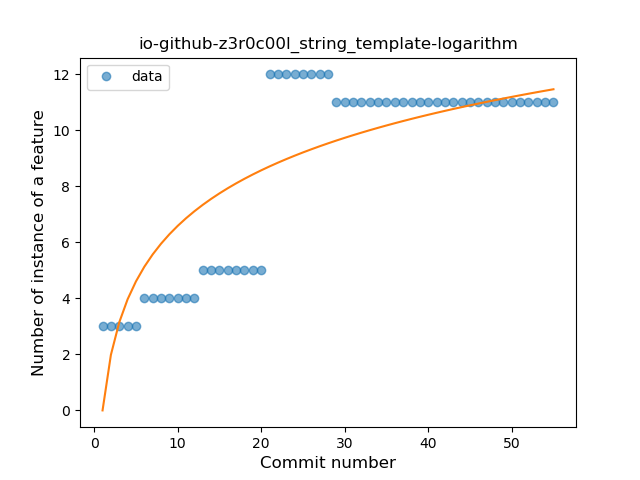

## io-github-z3r0c00l
----
#### Metrics provided by Detekt
* Number of lines of code 1334
* Number of Kotlin files: 12
* Cyclomatic complexity: 111
* Cyclomatic complexity by thousands of lines: 140 

----
**7** features analyzed

*	<a href="#type_inference">Type Inference</a> 
*	<a href="#lambda">Lambda</a> 
*	<a href="#safe_call">Safe Call</a> 
*	<a href="#when_expr">When expression</a> 
*	<a href="#unsafe_call">Unsafe Call</a> 
*	<a href="#companion_object">Companion Object</a> 
*	<a href="#string_template">String Template</a> 

### <a name="type_inference">Type Inference</a>
----
#### Functions
* **Instability - Polinomial 4:** 
    * **R_Squared:** 0.96573617
* **Instability - Polinomial 3:** )
    * **R_Squared:** 0.93304926
* **Sudden Rise Plateau - Logarithm:** 
    * **R_Squared:** 0.87117947
* **Constant Rise - Linear:** 
    * **R_Squared:** 0.54100209
* **Plateau Sudden Rise - Binary Sigmoid:** 
    * **R_Squared:** 0.01313466

**Plots** :chart_with_upwards_trend:
-----

### <a name="lambda">Lambda</a>
----
#### Functions
* **Sudden Rise Plateau - Logarithm:** 
    * **R_Squared:** 0.92971843
* **Constant Rise - Linear:** 
    * **R_Squared:** 0.68685559

**Plots** :chart_with_upwards_trend:
-----

### <a name="safe_call">Safe Call</a>
----
#### Functions
* **Plateau Sudden Rise - Binary Sigmoid:** 
    * **R_Squared:** 1.0
* **Constant Rise - Linear:** 
    * **R_Squared:** 0.69444444
* **Sudden Rise Plateau - Logarithm:** 
    * **R_Squared:** 0.55199225

**Plots** :chart_with_upwards_trend:
-----

### <a name="when_expr">When expression</a>
----
#### Functions
* **Plateau Sudden Rise - Binary Sigmoid:** 
    * **R_Squared:** 0.84185073
* **Instability - Polinomial 3:** )
    * **R_Squared:** 0.59052163
* **Sudden Rise Plateau - Logarithm:** 
    * **R_Squared:** 0.54024846
* **Constant Rise - Linear:** 
    * **R_Squared:** 0.2874983

**Plots** :chart_with_upwards_trend:
-----

### <a name="unsafe_call">Unsafe Call</a>
----
#### Functions
* **Instability - Polinomial 4:** 
    * **R_Squared:** 0.7558191
* **Instability - Polinomial 3:** )
    * **R_Squared:** 0.60839343
* **Sudden Rise Plateau - Logarithm:** 
    * **R_Squared:** 0.48994004
* **Constant Rise - Linear:** 
    * **R_Squared:** 0.21301971

**Plots** :chart_with_upwards_trend:
-----

### <a name="companion_object">Companion Object</a>
----
#### Functions
* **Plateau Sudden Rise - Binary Sigmoid:** 
    * **R_Squared:** 1.0
* **Sudden Rise Plateau - Logarithm:** 
    * **R_Squared:** 0.34691006
* **Constant Rise - Linear:** 
    * **R_Squared:** 0.10160099

**Plots** :chart_with_upwards_trend:
-----

### <a name="string_template">String Template</a>
----
#### Functions
* **Plateau Gradual Rise - Sigmoid:** 
    * **R_Squared:** 0.97263878
* **Sudden Rise Plateau - Logarithm:** 
    * **R_Squared:** 0.69334692
* **Constant Rise - Linear:** 
    * **R_Squared:** 0.66244089

**Plots** :chart_with_upwards_trend:
-----

