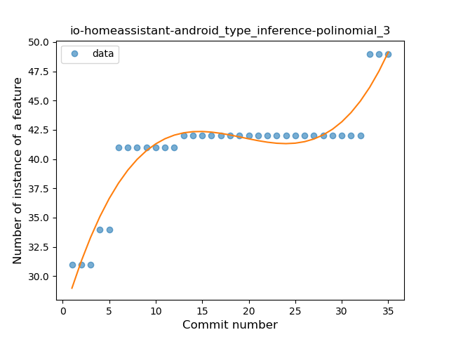
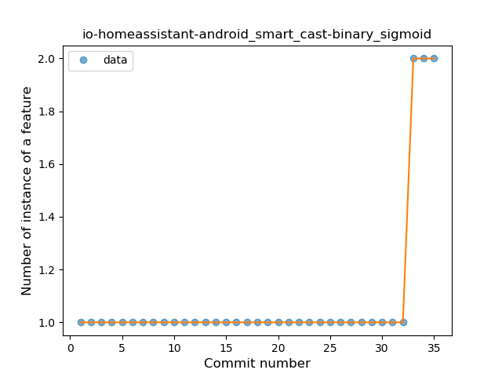

## io-homeassistant-android
----
#### Metrics provided by Detekt
* Number of lines of code 642
* Number of Kotlin files: 7
* Cyclomatic complexity: 129
* Cyclomatic complexity by thousands of lines: 376 

----
**6** features analyzed

*	<a href="#type_inference">Type Inference</a> 
*	<a href="#lambda">Lambda</a> 
*	<a href="#safe_call">Safe Call</a> 
*	<a href="#when_expr">When expression</a> 
*	<a href="#singleton">Singleton</a> 
*	<a href="#smart_cast">Smart Cast</a> 

### <a name="type_inference">Type Inference</a>
----
#### Functions
* **Instability - Polinomial 3:** )
    * **R_Squared:** 0.89997218
* **Sudden Rise Plateau - Logarithm:** 
    * **R_Squared:** 0.74528632
* **Constant Rise - Linear:** 
    * **R_Squared:** 0.59992148

**Plots** :chart_with_upwards_trend:
-----

### <a name="lambda">Lambda</a>
----
#### Functions
* **Instability - Polinomial 3:** )
    * **R_Squared:** 0.83769726
* **Instability - Polinomial 4:** 
    * **R_Squared:** 0.84564516
* **Sudden Rise Plateau - Logarithm:** 
    * **R_Squared:** 0.68581999
* **Constant Rise - Linear:** 
    * **R_Squared:** 0.41694008
* **Plateau Sudden Rise - Binary Sigmoid:** 
    * **R_Squared:** 0.37571124

**Plots** :chart_with_upwards_trend:
-----

### <a name="safe_call">Safe Call</a>
----
#### Functions
* **Instability - Polinomial 3:** )
    * **R_Squared:** 0.86840643
* **Sudden Rise Plateau - Logarithm:** 
    * **R_Squared:** 0.68015048
* **Constant Rise - Linear:** 
    * **R_Squared:** 0.3481773

**Plots** :chart_with_upwards_trend:
-----

### <a name="when_expr">When expression</a>
----
#### Functions
* **Plateau Sudden Rise - Binary Sigmoid:** 
    * **R_Squared:** 1.0
* **Instability - Polinomial 3:** )
    * **R_Squared:** 0.71119001
* **Sudden Rise Plateau - Logarithm:** 
    * **R_Squared:** 0.53658686
* **Constant Rise - Linear:** 
    * **R_Squared:** 0.23529412

**Plots** :chart_with_upwards_trend:
-----

### <a name="singleton">Singleton</a>
----
#### Functions
* **Instability - Polinomial 3:** )
    * **R_Squared:** 0.8341639
* **Plateau Sudden Rise - Binary Sigmoid:** 
    * **R_Squared:** 0.65892073
* **Sudden Rise Plateau - Logarithm:** 
    * **R_Squared:** 0.61194178
* **Constant Rise - Linear:** 
    * **R_Squared:** 0.53740409

**Plots** :chart_with_upwards_trend:
-----

### <a name="smart_cast">Smart Cast</a>
----
#### Functions
* **Plateau Sudden Rise - Binary Sigmoid:** 
    * **R_Squared:** 1.0
* **Sudden Rise - Exponential:** 
    * **R_Squared:** 0.8127925
* **Instability - Polinomial 3:** )
    * **R_Squared:** 0.71119001
* **Constant Rise - Linear:** 
    * **R_Squared:** 0.23529412
* **Sudden Rise Plateau - Logarithm:** 
    * **R_Squared:** 0.10344701

**Plots** :chart_with_upwards_trend:
-----

