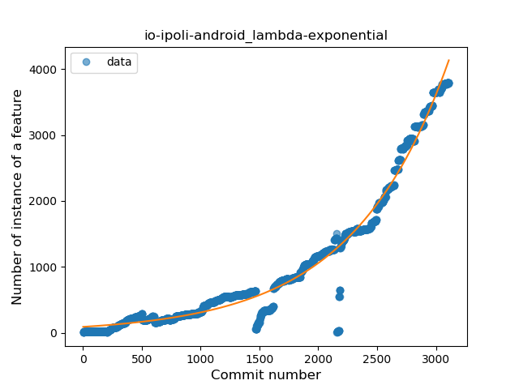
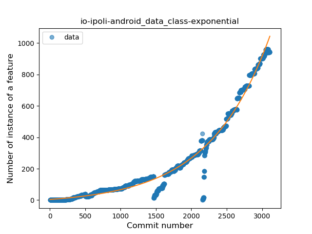
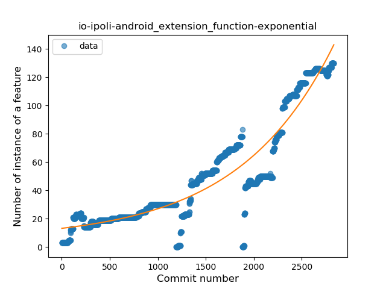
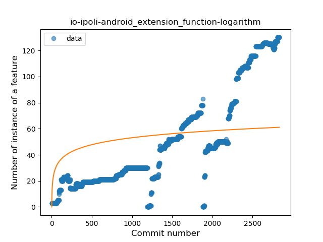

## io-ipoli-android
----
#### Metrics provided by Detekt
* Number of lines of code 98068
* Number of Kotlin files: 581
* Cyclomatic complexity: 10264
* Cyclomatic complexity by thousands of lines: 169 

----
**23** features analyzed

*	<a href="#type_inference">Type Inference</a> 
*	<a href="#lambda">Lambda</a> 
*	<a href="#safe_call">Safe Call</a> 
*	<a href="#when_expr">When expression</a> 
*	<a href="#unsafe_call">Unsafe Call</a> 
*	<a href="#companion_object">Companion Object</a> 
*	<a href="#string_template">String Template</a> 
*	<a href="#func_with_default_value">Function with Default Value</a> 
*	<a href="#singleton">Singleton</a> 
*	<a href="#range_expr">Range Expression</a> 
*	<a href="#smart_cast">Smart Cast</a> 
*	<a href="#data_class">Data Class</a> 
*	<a href="#func_call_with_named_arg">Function call with Named Argument</a> 
*	<a href="#extension_function">Extension Function</a> 
*	<a href="#property_delegation">Property Delegation</a> 
*	<a href="#destructuring_declaration">Destructuring Declaration</a> 
*	<a href="#inline_func">Inline Function</a> 
*	<a href="#overloaded_op">Overloaded Operator</a> 
*	<a href="#coroutine">Coroutine</a> 
*	<a href="#sealed_class">Sealed Class</a> 
*	<a href="#type_alias">Type Alias</a> 
*	<a href="#super_delegation">Super Delegation</a> 
*	<a href="#infix_func">Infix Function</a> 

### <a name="type_inference">Type Inference</a>
----
#### Functions
* **Sudden Rise - Exponential:** 
    * **R_Squared:** 0.96166187
* **Constant Rise - Linear:** 
    * **R_Squared:** 0.86476316
* **Plateau Sudden Rise - Binary Sigmoid:** 
    * **R_Squared:** 0.4107796
* **Sudden Rise Plateau - Logarithm:** 
    * **R_Squared:** 0.21740354

**Plots** :chart_with_upwards_trend:
-----

### <a name="lambda">Lambda</a>
----
#### Functions
* **Sudden Rise - Exponential:** 
    * **R_Squared:** 0.97753183
* **Constant Rise - Linear:** 
    * **R_Squared:** 0.8031494
* **Sudden Rise Plateau - Logarithm:** 
    * **R_Squared:** 0.17095002
* **Plateau Sudden Rise - Binary Sigmoid:** 
    * **R_Squared:** 0.02447113

**Plots** :chart_with_upwards_trend:
-----

### <a name="safe_call">Safe Call</a>
----
#### Functions
* **Sudden Rise - Exponential:** 
    * **R_Squared:** 0.96937952
* **Constant Rise - Linear:** 
    * **R_Squared:** 0.73342243
* **Sudden Rise Plateau - Logarithm:** 
    * **R_Squared:** 0.15084779
* **Plateau Sudden Rise - Binary Sigmoid:** 
    * **R_Squared:** 0.08747129

**Plots** :chart_with_upwards_trend:
-----

### <a name="when_expr">When expression</a>
----
#### Functions
* **Sudden Rise - Exponential:** 
    * **R_Squared:** 0.98263768
* **Constant Rise - Linear:** 
    * **R_Squared:** 0.8208617
* **Sudden Rise Plateau - Logarithm:** 
    * **R_Squared:** 0.1614403
* **Plateau Sudden Rise - Binary Sigmoid:** 
    * **R_Squared:** 0.0441326

**Plots** :chart_with_upwards_trend:
-----

### <a name="unsafe_call">Unsafe Call</a>
----
#### Functions
* **Sudden Rise - Exponential:** 
    * **R_Squared:** 0.96528476
* **Constant Rise - Linear:** 
    * **R_Squared:** 0.73544473
* **Sudden Rise Plateau - Logarithm:** 
    * **R_Squared:** 0.16420462
* **Plateau Sudden Rise - Binary Sigmoid:** 
    * **R_Squared:** 0.09111609

**Plots** :chart_with_upwards_trend:
-----

### <a name="companion_object">Companion Object</a>
----
#### Functions
* **Sudden Rise - Exponential:** 
    * **R_Squared:** 0.87159561
* **Constant Rise - Linear:** 
    * **R_Squared:** 0.7973731
* **Sudden Rise Plateau - Logarithm:** 
    * **R_Squared:** 0.32224907
* **Plateau Gradual Rise - Sigmoid:** 
    * **R_Squared:** 0.2787287

**Plots** :chart_with_upwards_trend:
-----

### <a name="string_template">String Template</a>
----
#### Functions
* **Sudden Rise - Exponential:** 
    * **R_Squared:** 0.98775853
* **Constant Rise - Linear:** 
    * **R_Squared:** 0.76820045
* **Plateau Sudden Rise - Binary Sigmoid:** 
    * **R_Squared:** 0.20897913
* **Sudden Rise Plateau - Logarithm:** 
    * **R_Squared:** 0.14430172

**Plots** :chart_with_upwards_trend:
-----

### <a name="func_with_default_value">Function with Default Value</a>
----
#### Functions
* **Sudden Rise - Exponential:** 
    * **R_Squared:** 0.96987796
* **Constant Rise - Linear:** 
    * **R_Squared:** 0.79045357
* **Sudden Rise Plateau - Logarithm:** 
    * **R_Squared:** 0.16901723
* **Plateau Sudden Rise - Binary Sigmoid:** 
    * **R_Squared:** 0.04895339

**Plots** :chart_with_upwards_trend:
-----

### <a name="singleton">Singleton</a>
----
#### Functions
* **Sudden Rise - Exponential:** 
    * **R_Squared:** 0.95688407
* **Constant Rise - Linear:** 
    * **R_Squared:** 0.79812543
* **Sudden Rise Plateau - Logarithm:** 
    * **R_Squared:** 0.17586175
* **Plateau Sudden Rise - Binary Sigmoid:** 
    * **R_Squared:** 0.04872971

**Plots** :chart_with_upwards_trend:
-----

### <a name="range_expr">Range Expression</a>
----
#### Functions
* **Sudden Rise - Exponential:** 
    * **R_Squared:** 0.88431027
* **Plateau Gradual Rise - Sigmoid:** 
    * **R_Squared:** 0.89081654
* **Constant Rise - Linear:** 
    * **R_Squared:** 0.73902397
* **Sudden Rise Plateau - Logarithm:** 
    * **R_Squared:** 0.19881125

**Plots** :chart_with_upwards_trend:
-----

### <a name="smart_cast">Smart Cast</a>
----
#### Functions
* **Sudden Rise - Exponential:** 
    * **R_Squared:** 0.97979449
* **Constant Rise - Linear:** 
    * **R_Squared:** 0.79924913
* **Sudden Rise Plateau - Logarithm:** 
    * **R_Squared:** 0.14927099
* **Plateau Sudden Rise - Binary Sigmoid:** 
    * **R_Squared:** 0.09818299

**Plots** :chart_with_upwards_trend:
-----

### <a name="data_class">Data Class</a>
----
#### Functions
* **Sudden Rise - Exponential:** 
    * **R_Squared:** 0.98123978
* **Constant Rise - Linear:** 
    * **R_Squared:** 0.81383168
* **Sudden Rise Plateau - Logarithm:** 
    * **R_Squared:** 0.16510821
* **Plateau Sudden Rise - Binary Sigmoid:** 
    * **R_Squared:** 0.11421453

**Plots** :chart_with_upwards_trend:
-----

### <a name="func_call_with_named_arg">Function call with Named Argument</a>
----
#### Functions
* **Sudden Rise - Exponential:** 
    * **R_Squared:** 0.97099718
* **Constant Rise - Linear:** 
    * **R_Squared:** 0.79383029
* **Sudden Rise Plateau - Logarithm:** 
    * **R_Squared:** 0.15730429
* **Plateau Sudden Rise - Binary Sigmoid:** 
    * **R_Squared:** 0.04510228

**Plots** :chart_with_upwards_trend:
-----

### <a name="extension_function">Extension Function</a>
----
#### Functions
* **Sudden Rise - Exponential:** 
    * **R_Squared:** 0.88852164
* **Constant Rise - Linear:** 
    * **R_Squared:** 0.78982768
* **Sudden Rise Plateau - Logarithm:** 
    * **R_Squared:** 0.23396711

**Plots** :chart_with_upwards_trend:
-----

### <a name="property_delegation">Property Delegation</a>
----
#### Functions
* **Sudden Rise - Exponential:** 
    * **R_Squared:** 0.96933805
* **Constant Rise - Linear:** 
    * **R_Squared:** 0.86538004
* **Sudden Rise Plateau - Logarithm:** 
    * **R_Squared:** 0.22051746
* **Plateau Sudden Rise - Binary Sigmoid:** 
    * **R_Squared:** 0.15094063

**Plots** :chart_with_upwards_trend:
-----

### <a name="destructuring_declaration">Destructuring Declaration</a>
----
#### Functions
* **Sudden Rise - Exponential:** 
    * **R_Squared:** 0.93640189
* **Constant Rise - Linear:** 
    * **R_Squared:** 0.70217828
* **Sudden Rise Plateau - Logarithm:** 
    * **R_Squared:** 0.19135204
* **Plateau Sudden Rise - Binary Sigmoid:** 
    * **R_Squared:** 0.00595562

**Plots** :chart_with_upwards_trend:
-----

### <a name="inline_func">Inline Function</a>
----
#### Functions
* **Plateau Gradual Rise - Sigmoid:** 
    * **R_Squared:** 0.95385141
* **Sudden Rise - Exponential:** 
    * **R_Squared:** 0.87016508
* **Constant Rise - Linear:** 
    * **R_Squared:** 0.78901412
* **Sudden Rise Plateau - Logarithm:** 
    * **R_Squared:** 0.26931059

**Plots** :chart_with_upwards_trend:
-----

### <a name="overloaded_op">Overloaded Operator</a>
----
#### Functions
* **Plateau Gradual Rise - Sigmoid:** 
    * **R_Squared:** 0.35508865
* **Constant Rise - Linear:** 
    * **R_Squared:** 0.19796704
* **Sudden Rise Plateau - Logarithm:** 
    * **R_Squared:** 0.17014357

**Plots** :chart_with_upwards_trend:
-----

### <a name="coroutine">Coroutine</a>
----
#### Functions
* **Constant Rise - Linear:** 
    * **R_Squared:** 0.63371873
* **Sudden Rise - Exponential:** 
    * **R_Squared:** 0.63227872
* **Sudden Rise Plateau - Logarithm:** 
    * **R_Squared:** 0.35179274
* **Plateau Sudden Rise - Binary Sigmoid:** 
    * **R_Squared:** 0.03560314

**Plots** :chart_with_upwards_trend:
-----

### <a name="sealed_class">Sealed Class</a>
----
#### Functions
* **Sudden Rise - Exponential:** 
    * **R_Squared:** 0.9685406
* **Constant Rise - Linear:** 
    * **R_Squared:** 0.87705605
* **Sudden Rise Plateau - Logarithm:** 
    * **R_Squared:** 0.20741335

**Plots** :chart_with_upwards_trend:
-----

### <a name="type_alias">Type Alias</a>
----
#### Functions
* **Sudden Rise - Exponential:** 
    * **R_Squared:** 0.02247772
* **Constant Rise - Linear:** 
    * **R_Squared:** 0.00502355
* **Plateau Gradual Decline - Sigmoid:** 
    * **R_Squared:** 0.01456211
* **Sudden Rise Plateau - Logarithm:** 
    * **R_Squared:** -0.0

**Plots** :chart_with_upwards_trend:
-----

### <a name="super_delegation">Super Delegation</a>
----
#### Functions
* **Plateau Gradual Rise - Sigmoid:** 
    * **R_Squared:** 0.18932397
* **Constant Decline - Linear:** 
    * **R_Squared:** 0.1270927
* **Sudden Rise Plateau - Logarithm:** 
    * **R_Squared:** 3.43e-06

**Plots** :chart_with_upwards_trend:
-----

### <a name="infix_func">Infix Function</a>
----
#### Functions
* **Plateau Sudden Decline - Binary Sigmoid:** 
    * **R_Squared:** 0.49002249
* **Constant Decline - Linear:** 
    * **R_Squared:** 0.29187128
* **Sudden Decline - Exponential:** 
    * **R_Squared:** 0.29590458
* **Sudden Rise Plateau - Logarithm:** 
    * **R_Squared:** -0.0

**Plots** :chart_with_upwards_trend:
-----

