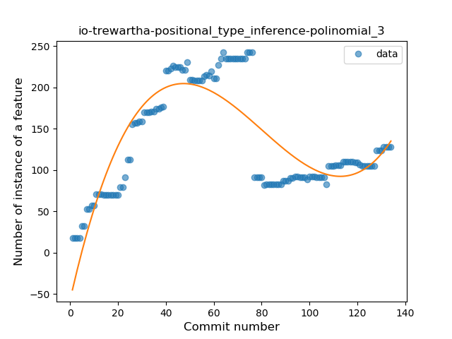
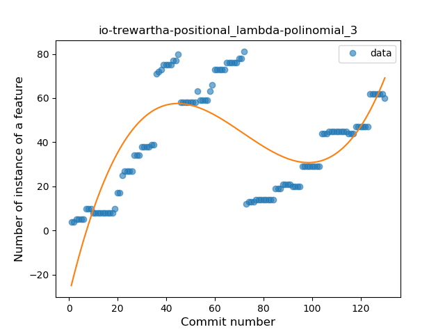
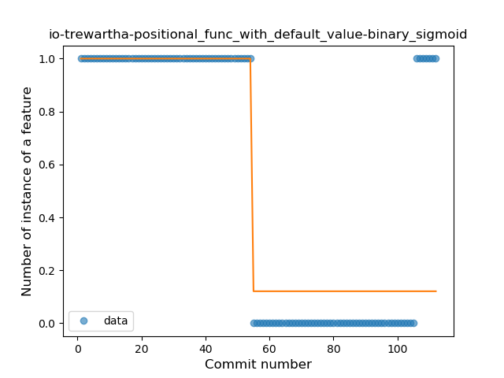
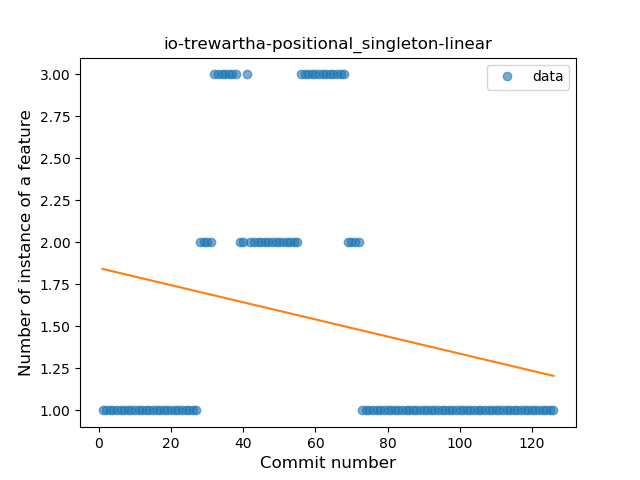
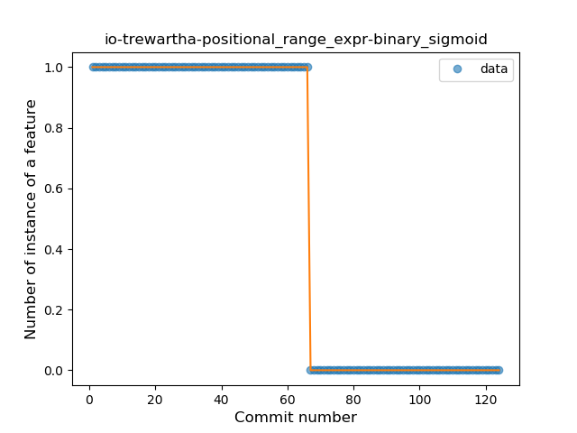
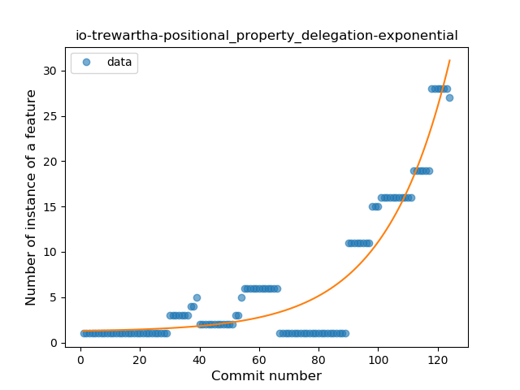

## io-trewartha-positional
----
#### Metrics provided by Detekt
* Number of lines of code 1851
* Number of Kotlin files: 32
* Cyclomatic complexity: 283
* Cyclomatic complexity by thousands of lines: 266 

----
**14** features analyzed

*	<a href="#type_inference">Type Inference</a> 
*	<a href="#lambda">Lambda</a> 
*	<a href="#safe_call">Safe Call</a> 
*	<a href="#when_expr">When expression</a> 
*	<a href="#unsafe_call">Unsafe Call</a> 
*	<a href="#companion_object">Companion Object</a> 
*	<a href="#string_template">String Template</a> 
*	<a href="#func_with_default_value">Function with Default Value</a> 
*	<a href="#singleton">Singleton</a> 
*	<a href="#range_expr">Range Expression</a> 
*	<a href="#data_class">Data Class</a> 
*	<a href="#func_call_with_named_arg">Function call with Named Argument</a> 
*	<a href="#extension_function">Extension Function</a> 
*	<a href="#property_delegation">Property Delegation</a> 

### <a name="type_inference">Type Inference</a>
----
#### Functions
* **Instability - Polinomial 3:** )
    * **R_Squared:** 0.71939126
* **Sudden Rise Plateau - Logarithm:** 
    * **R_Squared:** 0.0812089
* **Plateau Sudden Decline - Binary Sigmoid:** 
    * **R_Squared:** 0.06248117
* **Constant Decline - Linear:** 
    * **R_Squared:** 0.00036658
* **Sudden Decline - Exponential:** 
    * **R_Squared:** 8.98e-06

**Plots** :chart_with_upwards_trend:
-----

### <a name="lambda">Lambda</a>
----
#### Functions
* **Instability - Polinomial 3:** )
    * **R_Squared:** 0.54324685
* **Plateau Gradual Rise - Sigmoid:** 
    * **R_Squared:** 0.36675039
* **Sudden Rise Plateau - Logarithm:** 
    * **R_Squared:** 0.18055322
* **Constant Rise - Linear:** 
    * **R_Squared:** 0.06928856

**Plots** :chart_with_upwards_trend:
-----

### <a name="safe_call">Safe Call</a>
----
#### Functions
* **Instability - Polinomial 3:** )
    * **R_Squared:** 0.64564521
* **Sudden Rise Plateau - Logarithm:** 
    * **R_Squared:** 0.02634145
* **Constant Decline - Linear:** 
    * **R_Squared:** 0.01528462
* **Sudden Decline - Exponential:** 
    * **R_Squared:** 0.0

**Plots** :chart_with_upwards_trend:
-----

### <a name="when_expr">When expression</a>
----
#### Functions
* **Sudden Rise Plateau - Logarithm:** 
    * **R_Squared:** 0.17704289
* **Constant Rise - Linear:** 
    * **R_Squared:** 0.01823567

**Plots** :chart_with_upwards_trend:
-----

### <a name="unsafe_call">Unsafe Call</a>
----
#### Functions
* **Sudden Rise - Exponential:** 
    * **R_Squared:** 0.34225866
* **Plateau Sudden Decline - Binary Sigmoid:** 
    * **R_Squared:** 0.07444326
* **Constant Rise - Linear:** 
    * **R_Squared:** 0.00528017
* **Sudden Rise Plateau - Logarithm:** 
    * **R_Squared:** -0.0

**Plots** :chart_with_upwards_trend:
-----

### <a name="companion_object">Companion Object</a>
----
#### Functions
* **Instability - Polinomial 3:** )
    * **R_Squared:** 0.71595155
* **Constant Decline - Linear:** 
    * **R_Squared:** 0.04256221
* **Sudden Rise Plateau - Logarithm:** 
    * **R_Squared:** 0.01060512

**Plots** :chart_with_upwards_trend:
-----

### <a name="string_template">String Template</a>
----
#### Functions
* **Plateau Gradual Rise - Sigmoid:** 
    * **R_Squared:** 0.23650233
* **Sudden Rise Plateau - Logarithm:** 
    * **R_Squared:** 0.05611339
* **Constant Decline - Linear:** 
    * **R_Squared:** 0.00740953

**Plots** :chart_with_upwards_trend:
-----

### <a name="func_with_default_value">Function with Default Value</a>
----
#### Functions
* **Plateau Sudden Decline - Binary Sigmoid:** 
    * **R_Squared:** 0.77840588
* **Sudden Decline - Exponential:** 
    * **R_Squared:** 0.4770498
* **Constant Decline - Linear:** 
    * **R_Squared:** 0.44172898
* **Sudden Rise Plateau - Logarithm:** 
    * **R_Squared:** -0.0

**Plots** :chart_with_upwards_trend:
-----

### <a name="singleton">Singleton</a>
----
#### Functions
* **Plateau Sudden Rise - Binary Sigmoid:** 
    * **R_Squared:** 0.12840467
* **Constant Decline - Linear:** 
    * **R_Squared:** 0.05889077
* **Sudden Rise Plateau - Logarithm:** 
    * **R_Squared:** 0.00035631

**Plots** :chart_with_upwards_trend:
-----

### <a name="range_expr">Range Expression</a>
----
#### Functions
* **Plateau Sudden Decline - Binary Sigmoid:** 
    * **R_Squared:** 1.0
* **Constant Decline - Linear:** 
    * **R_Squared:** 0.74692683
* **Sudden Rise Plateau - Logarithm:** 
    * **R_Squared:** -0.0

**Plots** :chart_with_upwards_trend:
-----

### <a name="data_class">Data Class</a>
----
#### Functions
* **Sudden Rise - Exponential:** 
    * **R_Squared:** 0.35556673
* **Constant Rise - Linear:** 
    * **R_Squared:** 0.00066554
* **Sudden Rise Plateau - Logarithm:** 
    * **R_Squared:** -0.0

**Plots** :chart_with_upwards_trend:
-----

### <a name="func_call_with_named_arg">Function call with Named Argument</a>
----
#### Functions
* **Plateau Sudden Decline - Binary Sigmoid:** 
    * **R_Squared:** 1.0
* **Sudden Decline - Exponential:** 
    * **R_Squared:** 0.76111642
* **Constant Decline - Linear:** 
    * **R_Squared:** 0.65033223
* **Sudden Rise Plateau - Logarithm:** 
    * **R_Squared:** -0.0

**Plots** :chart_with_upwards_trend:
-----

### <a name="extension_function">Extension Function</a>
----
#### Functions
* **Sudden Decline - Exponential:** 
    * **R_Squared:** 0.88129288
* **Plateau Gradual Decline - Sigmoid:** 
    * **R_Squared:** 0.88748708
* **Constant Decline - Linear:** 
    * **R_Squared:** 0.71800959
* **Sudden Rise Plateau - Logarithm:** 
    * **R_Squared:** -0.0

**Plots** :chart_with_upwards_trend:
-----

### <a name="property_delegation">Property Delegation</a>
----
#### Functions
* **Sudden Rise - Exponential:** 
    * **R_Squared:** 0.89047035
* **Instability - Polinomial 3:** )
    * **R_Squared:** 0.90025446
* **Constant Rise - Linear:** 
    * **R_Squared:** 0.6044942
* **Sudden Rise Plateau - Logarithm:** 
    * **R_Squared:** 0.19565964

**Plots** :chart_with_upwards_trend:
-----

