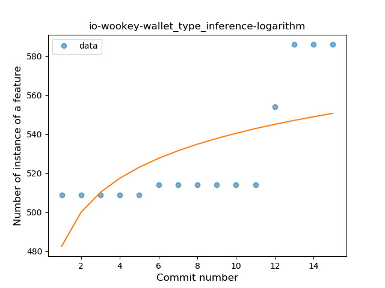
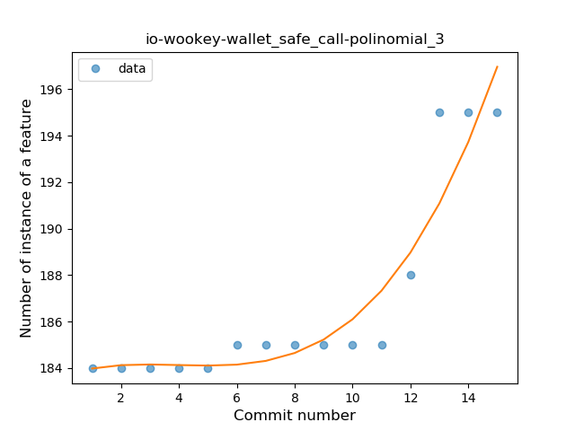
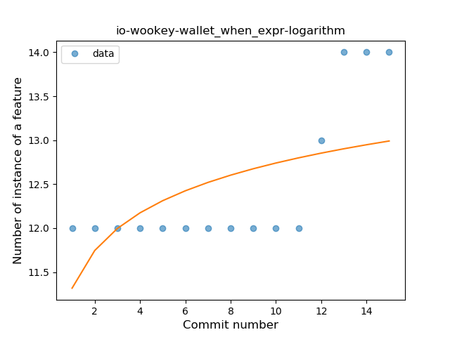
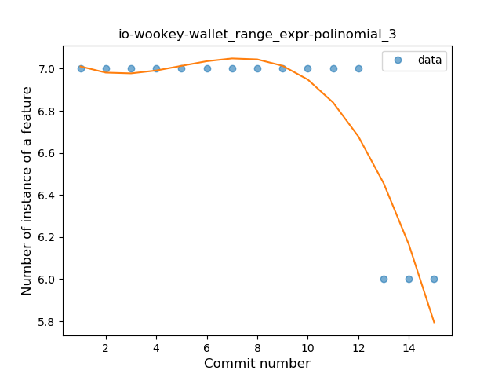
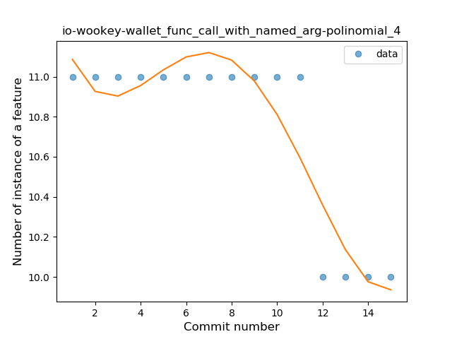
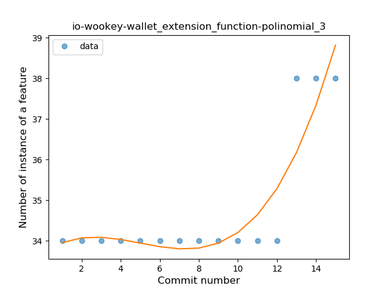
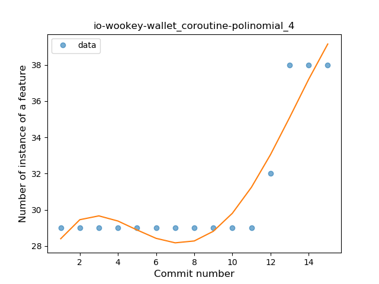

## io-wookey-wallet
----
#### Metrics provided by Detekt
* Number of lines of code 8229
* Number of Kotlin files: 87
* Cyclomatic complexity: 1173
* Cyclomatic complexity by thousands of lines: 257 

----
**12** features analyzed

*	<a href="#type_inference">Type Inference</a> 
*	<a href="#lambda">Lambda</a> 
*	<a href="#safe_call">Safe Call</a> 
*	<a href="#when_expr">When expression</a> 
*	<a href="#unsafe_call">Unsafe Call</a> 
*	<a href="#string_template">String Template</a> 
*	<a href="#func_with_default_value">Function with Default Value</a> 
*	<a href="#range_expr">Range Expression</a> 
*	<a href="#data_class">Data Class</a> 
*	<a href="#func_call_with_named_arg">Function call with Named Argument</a> 
*	<a href="#extension_function">Extension Function</a> 
*	<a href="#coroutine">Coroutine</a> 

### <a name="type_inference">Type Inference</a>
----
#### Functions
* **Instability - Polinomial 4:** 
    * **R_Squared:** 0.90790086
* **Sudden Rise - Exponential:** 
    * **R_Squared:** 0.86651772
* **Constant Rise - Linear:** 
    * **R_Squared:** 0.65067521
* **Sudden Rise Plateau - Logarithm:** 
    * **R_Squared:** 0.39532432

**Plots** :chart_with_upwards_trend:
-----

### <a name="lambda">Lambda</a>
----
#### Functions
* **Instability - Polinomial 4:** 
    * **R_Squared:** 0.90779067
* **Sudden Rise - Exponential:** 
    * **R_Squared:** 0.86302885
* **Constant Rise - Linear:** 
    * **R_Squared:** 0.63805207
* **Sudden Rise Plateau - Logarithm:** 
    * **R_Squared:** 0.38310901

**Plots** :chart_with_upwards_trend:
-----

### <a name="safe_call">Safe Call</a>
----
#### Functions
* **Instability - Polinomial 3:** )
    * **R_Squared:** 0.88607168
* **Instability - Polinomial 4:** 
    * **R_Squared:** 0.89474779
* **Sudden Rise - Exponential:** 
    * **R_Squared:** 0.87034764
* **Constant Rise - Linear:** 
    * **R_Squared:** 0.6425433
* **Sudden Rise Plateau - Logarithm:** 
    * **R_Squared:** 0.393922

**Plots** :chart_with_upwards_trend:
-----

### <a name="when_expr">When expression</a>
----
#### Functions
* **Instability - Polinomial 4:** 
    * **R_Squared:** 0.90670091
* **Sudden Rise - Exponential:** 
    * **R_Squared:** 0.84774832
* **Constant Rise - Linear:** 
    * **R_Squared:** 0.58708415
* **Sudden Rise Plateau - Logarithm:** 
    * **R_Squared:** 0.33576339

**Plots** :chart_with_upwards_trend:
-----

### <a name="unsafe_call">Unsafe Call</a>
----
#### Functions
* **Instability - Polinomial 4:** 
    * **R_Squared:** 0.86090793
* **Sudden Rise - Exponential:** 
    * **R_Squared:** 0.77590504
* **Constant Rise - Linear:** 
    * **R_Squared:** 0.58928571
* **Sudden Rise Plateau - Logarithm:** 
    * **R_Squared:** 0.34823803

**Plots** :chart_with_upwards_trend:
-----

### <a name="string_template">String Template</a>
----
#### Functions
* **Instability - Polinomial 4:** 
    * **R_Squared:** 0.23579553
* **Instability - Polinomial 3:** )
    * **R_Squared:** 0.15367686
* **Constant Rise - Linear:** 
    * **R_Squared:** 0.06122449
* **Sudden Rise Plateau - Logarithm:** 
    * **R_Squared:** 0.04888207

**Plots** :chart_with_upwards_trend:
-----

### <a name="func_with_default_value">Function with Default Value</a>
----
#### Functions
* **Instability - Polinomial 3:** )
    * **R_Squared:** 0.82653254
* **Instability - Polinomial 4:** 
    * **R_Squared:** 0.83221629
* **Sudden Rise - Exponential:** 
    * **R_Squared:** 0.79289517
* **Constant Rise - Linear:** 
    * **R_Squared:** 0.48214286
* **Sudden Rise Plateau - Logarithm:** 
    * **R_Squared:** 0.26473412

**Plots** :chart_with_upwards_trend:
-----

### <a name="range_expr">Range Expression</a>
----
#### Functions
* **Instability - Polinomial 3:** )
    * **R_Squared:** 0.82653254
* **Instability - Polinomial 4:** 
    * **R_Squared:** 0.83221629
* **Constant Decline - Linear:** 
    * **R_Squared:** 0.48214286
* **Sudden Rise Plateau - Logarithm:** 
    * **R_Squared:** -0.0

**Plots** :chart_with_upwards_trend:
-----

### <a name="data_class">Data Class</a>
----
#### Functions
* **Instability - Polinomial 3:** )
    * **R_Squared:** 0.82653254
* **Instability - Polinomial 4:** 
    * **R_Squared:** 0.83221629
* **Sudden Rise - Exponential:** 
    * **R_Squared:** 0.79289517
* **Constant Rise - Linear:** 
    * **R_Squared:** 0.48214286
* **Sudden Rise Plateau - Logarithm:** 
    * **R_Squared:** 0.26473412

**Plots** :chart_with_upwards_trend:
-----

### <a name="func_call_with_named_arg">Function call with Named Argument</a>
----
#### Functions
* **Instability - Polinomial 4:** 
    * **R_Squared:** 0.86090793
* **Constant Decline - Linear:** 
    * **R_Squared:** 0.58928571
* **Sudden Rise Plateau - Logarithm:** 
    * **R_Squared:** -0.0

**Plots** :chart_with_upwards_trend:
-----

### <a name="extension_function">Extension Function</a>
----
#### Functions
* **Instability - Polinomial 3:** )
    * **R_Squared:** 0.82653254
* **Instability - Polinomial 4:** 
    * **R_Squared:** 0.83221629
* **Sudden Rise - Exponential:** 
    * **R_Squared:** 0.79289517
* **Constant Rise - Linear:** 
    * **R_Squared:** 0.48214286
* **Sudden Rise Plateau - Logarithm:** 
    * **R_Squared:** 0.26473412

**Plots** :chart_with_upwards_trend:
-----

### <a name="coroutine">Coroutine</a>
----
#### Functions
* **Instability - Polinomial 4:** 
    * **R_Squared:** 0.8962384
* **Sudden Rise - Exponential:** 
    * **R_Squared:** 0.84517194
* **Constant Rise - Linear:** 
    * **R_Squared:** 0.56316964
* **Sudden Rise Plateau - Logarithm:** 
    * **R_Squared:** 0.31806654

**Plots** :chart_with_upwards_trend:
-----

