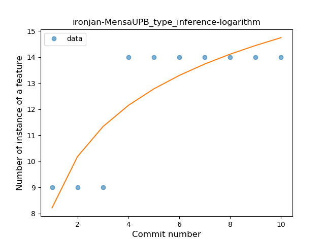
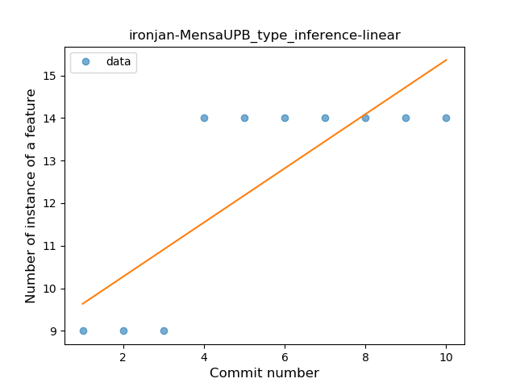
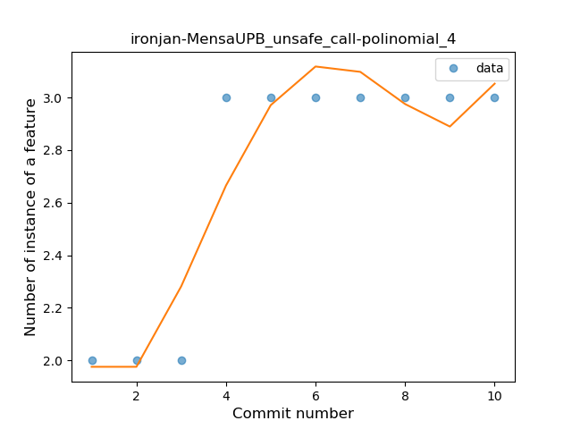
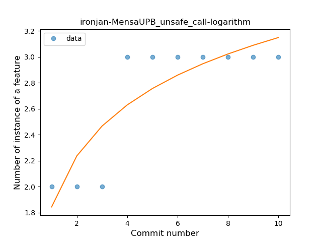
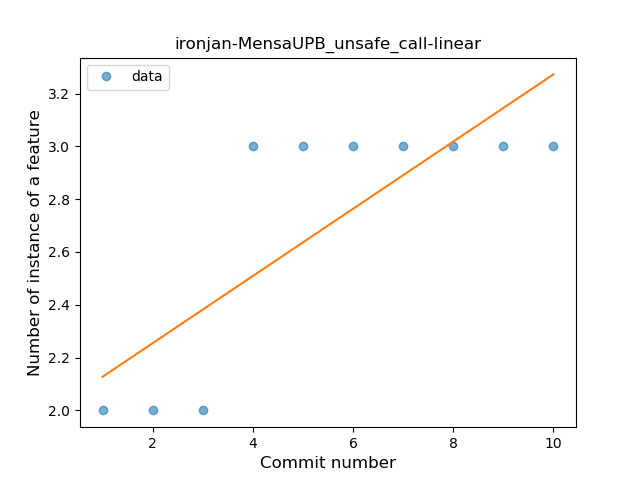
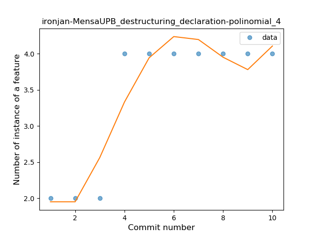
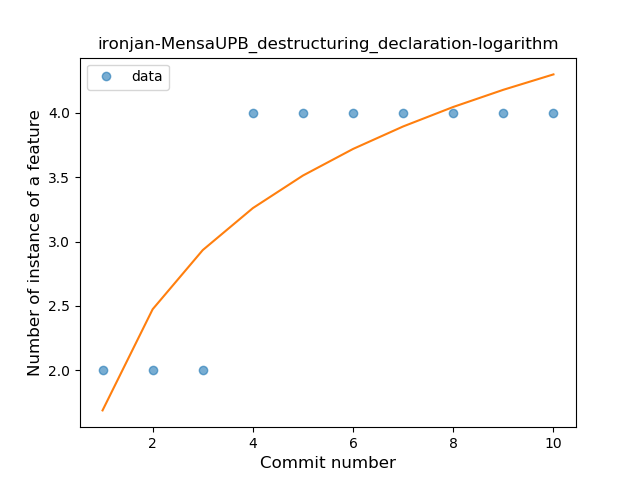
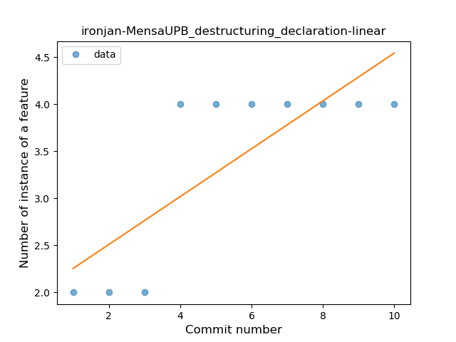

## ironjan-MensaUPB
----
#### Metrics provided by Detekt
* Number of lines of code 113
* Number of Kotlin files: 3
* Cyclomatic complexity: 15
* Cyclomatic complexity by thousands of lines: 223 

----
**3** features analyzed

*	<a href="#type_inference">Type Inference</a> 
*	<a href="#unsafe_call">Unsafe Call</a> 
*	<a href="#destructuring_declaration">Destructuring Declaration</a> 

### <a name="type_inference">Type Inference</a>
----
#### Functions
* **Instability - Polinomial 4:** 
    * **R_Squared:** 0.88927739
* **Sudden Rise Plateau - Logarithm:** 
    * **R_Squared:** 0.73903493
* **Constant Rise - Linear:** 
    * **R_Squared:** 0.63636364

**Plots** :chart_with_upwards_trend:
-----

### <a name="unsafe_call">Unsafe Call</a>
----
#### Functions
* **Plateau Sudden Rise - Binary Sigmoid:** 
    * **R_Squared:** 1.0
* **Instability - Polinomial 4:** 
    * **R_Squared:** 0.88927739
* **Sudden Rise Plateau - Logarithm:** 
    * **R_Squared:** 0.73903493
* **Constant Rise - Linear:** 
    * **R_Squared:** 0.63636364

**Plots** :chart_with_upwards_trend:
-----

### <a name="destructuring_declaration">Destructuring Declaration</a>
----
#### Functions
* **Plateau Sudden Rise - Binary Sigmoid:** 
    * **R_Squared:** 1.0
* **Instability - Polinomial 4:** 
    * **R_Squared:** 0.88927739
* **Sudden Rise Plateau - Logarithm:** 
    * **R_Squared:** 0.73903493
* **Constant Rise - Linear:** 
    * **R_Squared:** 0.63636364

**Plots** :chart_with_upwards_trend:
-----

