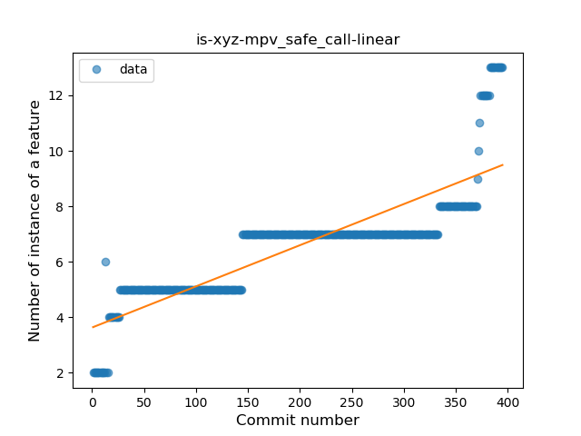
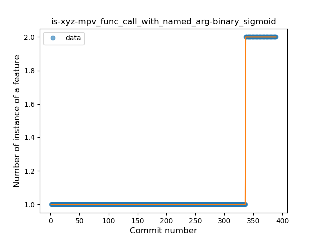
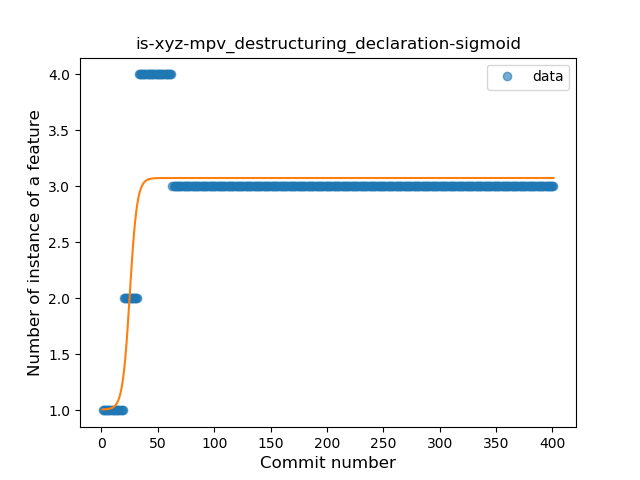
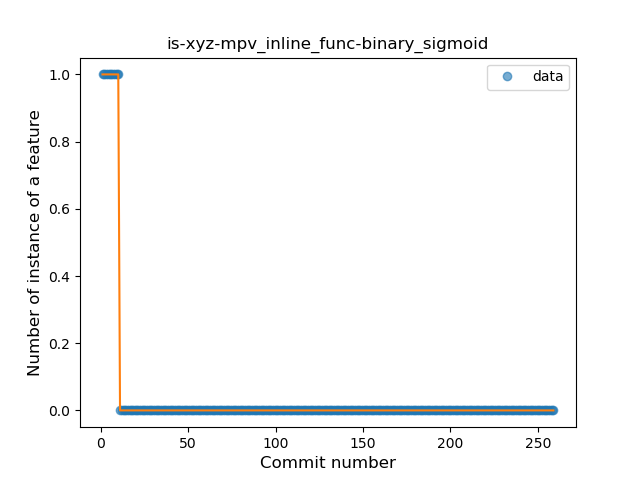

## is-xyz-mpv
----
#### Metrics provided by Detekt
* Number of lines of code 2410
* Number of Kotlin files: 13
* Cyclomatic complexity: 421
* Cyclomatic complexity by thousands of lines: 295 

----
**14** features analyzed

*	<a href="#type_inference">Type Inference</a> 
*	<a href="#lambda">Lambda</a> 
*	<a href="#safe_call">Safe Call</a> 
*	<a href="#when_expr">When expression</a> 
*	<a href="#unsafe_call">Unsafe Call</a> 
*	<a href="#companion_object">Companion Object</a> 
*	<a href="#string_template">String Template</a> 
*	<a href="#func_with_default_value">Function with Default Value</a> 
*	<a href="#range_expr">Range Expression</a> 
*	<a href="#smart_cast">Smart Cast</a> 
*	<a href="#data_class">Data Class</a> 
*	<a href="#func_call_with_named_arg">Function call with Named Argument</a> 
*	<a href="#destructuring_declaration">Destructuring Declaration</a> 
*	<a href="#inline_func">Inline Function</a> 

### <a name="type_inference">Type Inference</a>
----
#### Functions
* **Constant Rise - Linear:** 
    * **R_Squared:** 0.95284239
* **Sudden Rise - Exponential:** 
    * **R_Squared:** 0.95782683
* **Sudden Rise Plateau - Logarithm:** 
    * **R_Squared:** 0.6184355
* **Plateau Sudden Rise - Binary Sigmoid:** 
    * **R_Squared:** 0.3579078

**Plots** :chart_with_upwards_trend:
-----

### <a name="lambda">Lambda</a>
----
#### Functions
* **Sudden Rise - Exponential:** 
    * **R_Squared:** 0.82023919
* **Constant Rise - Linear:** 
    * **R_Squared:** 0.57345121
* **Sudden Rise Plateau - Logarithm:** 
    * **R_Squared:** 0.43203665

**Plots** :chart_with_upwards_trend:
-----

### <a name="safe_call">Safe Call</a>
----
#### Functions
* **Sudden Rise - Exponential:** 
    * **R_Squared:** 0.72030775
* **Constant Rise - Linear:** 
    * **R_Squared:** 0.70290282
* **Sudden Rise Plateau - Logarithm:** 
    * **R_Squared:** 0.58039326

**Plots** :chart_with_upwards_trend:
-----

### <a name="when_expr">When expression</a>
----
#### Functions
* **Constant Rise - Linear:** 
    * **R_Squared:** 0.93207957
* **Sudden Rise Plateau - Logarithm:** 
    * **R_Squared:** 0.77387993

**Plots** :chart_with_upwards_trend:
-----

### <a name="unsafe_call">Unsafe Call</a>
----
#### Functions
* **Sudden Rise Plateau - Logarithm:** 
    * **R_Squared:** 0.59089419
* **Constant Rise - Linear:** 
    * **R_Squared:** 0.52632049

**Plots** :chart_with_upwards_trend:
-----

### <a name="companion_object">Companion Object</a>
----
#### Functions
* **Plateau Gradual Rise - Sigmoid:** 
    * **R_Squared:** 0.904182
* **Sudden Rise - Exponential:** 
    * **R_Squared:** 0.85812736
* **Constant Rise - Linear:** 
    * **R_Squared:** 0.80071646
* **Sudden Rise Plateau - Logarithm:** 
    * **R_Squared:** 0.54287645

**Plots** :chart_with_upwards_trend:
-----

### <a name="string_template">String Template</a>
----
#### Functions
* **Constant Rise - Linear:** 
    * **R_Squared:** 0.96268742
* **Sudden Rise Plateau - Logarithm:** 
    * **R_Squared:** 0.66182688
* **Plateau Gradual Rise - Sigmoid:** 
    * **R_Squared:** 0.26594871

**Plots** :chart_with_upwards_trend:
-----

### <a name="func_with_default_value">Function with Default Value</a>
----
#### Functions
* **Sudden Rise - Exponential:** 
    * **R_Squared:** 0.93164292
* **Constant Rise - Linear:** 
    * **R_Squared:** 0.91581611
* **Sudden Rise Plateau - Logarithm:** 
    * **R_Squared:** 0.69811923

**Plots** :chart_with_upwards_trend:
-----

### <a name="range_expr">Range Expression</a>
----
#### Functions
* **Plateau Gradual Rise - Sigmoid:** 
    * **R_Squared:** 0.96677015
* **Sudden Rise - Exponential:** 
    * **R_Squared:** 0.87203901
* **Constant Rise - Linear:** 
    * **R_Squared:** 0.50206372
* **Sudden Rise Plateau - Logarithm:** 
    * **R_Squared:** 0.20644572

**Plots** :chart_with_upwards_trend:
-----

### <a name="smart_cast">Smart Cast</a>
----
#### Functions
* **Plateau Sudden Rise - Binary Sigmoid:** 
    * **R_Squared:** 0.84159237
* **Sudden Rise Plateau - Logarithm:** 
    * **R_Squared:** 0.27789105
* **Constant Rise - Linear:** 
    * **R_Squared:** 0.08210099

**Plots** :chart_with_upwards_trend:
-----

### <a name="data_class">Data Class</a>
----
#### Functions
* **Sudden Rise Plateau - Logarithm:** 
    * **R_Squared:** 0.58344717
* **Plateau Gradual Rise - Sigmoid:** 
    * **R_Squared:** 0.58383346
* **Sudden Rise - Exponential:** 
    * **R_Squared:** 0.49472431
* **Constant Rise - Linear:** 
    * **R_Squared:** 0.44908374

**Plots** :chart_with_upwards_trend:
-----

### <a name="func_call_with_named_arg">Function call with Named Argument</a>
----
#### Functions
* **Plateau Sudden Rise - Binary Sigmoid:** 
    * **R_Squared:** 1.0
* **Sudden Rise - Exponential:** 
    * **R_Squared:** 0.7901315
* **Constant Rise - Linear:** 
    * **R_Squared:** 0.35305313
* **Sudden Rise Plateau - Logarithm:** 
    * **R_Squared:** 0.14186507

**Plots** :chart_with_upwards_trend:
-----

### <a name="destructuring_declaration">Destructuring Declaration</a>
----
#### Functions
* **Plateau Gradual Rise - Sigmoid:** 
    * **R_Squared:** 0.72377642
* **Sudden Rise Plateau - Logarithm:** 
    * **R_Squared:** 0.22220896
* **Constant Rise - Linear:** 
    * **R_Squared:** 0.03833341

**Plots** :chart_with_upwards_trend:
-----

### <a name="inline_func">Inline Function</a>
----
#### Functions
* **Plateau Sudden Decline - Binary Sigmoid:** 
    * **R_Squared:** 1.0
* **Sudden Decline - Exponential:** 
    * **R_Squared:** 0.80905276
* **Constant Decline - Linear:** 
    * **R_Squared:** 0.11135957
* **Sudden Rise Plateau - Logarithm:** 
    * **R_Squared:** -0.0

**Plots** :chart_with_upwards_trend:
-----

