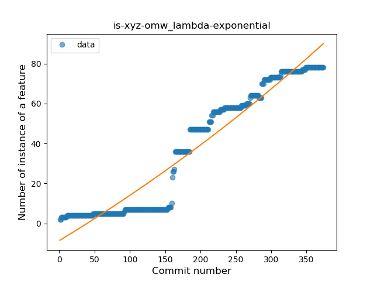
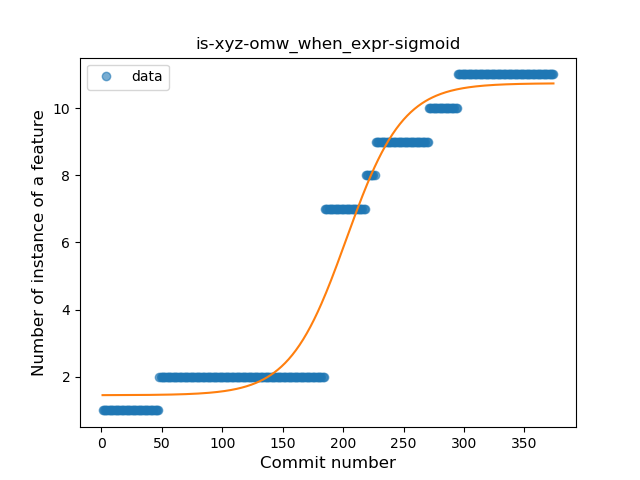
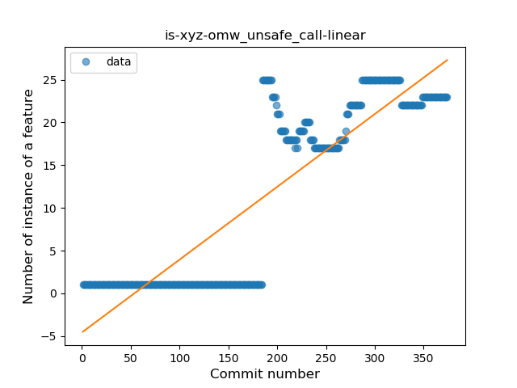
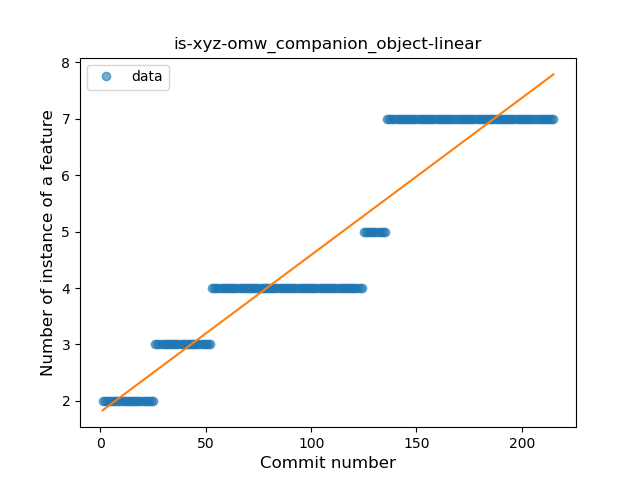
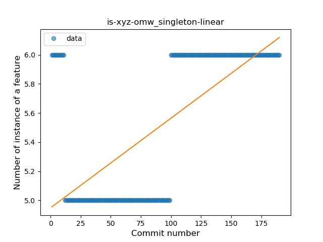

## is-xyz-omw
----
#### Metrics provided by Detekt
* Number of lines of code 3681
* Number of Kotlin files: 30
* Cyclomatic complexity: 360
* Cyclomatic complexity by thousands of lines: 184 

----
**11** features analyzed

*	<a href="#type_inference">Type Inference</a> 
*	<a href="#lambda">Lambda</a> 
*	<a href="#safe_call">Safe Call</a> 
*	<a href="#when_expr">When expression</a> 
*	<a href="#unsafe_call">Unsafe Call</a> 
*	<a href="#companion_object">Companion Object</a> 
*	<a href="#string_template">String Template</a> 
*	<a href="#func_with_default_value">Function with Default Value</a> 
*	<a href="#singleton">Singleton</a> 
*	<a href="#range_expr">Range Expression</a> 
*	<a href="#smart_cast">Smart Cast</a> 

### <a name="type_inference">Type Inference</a>
----
#### Functions
* **Constant Rise - Linear:** 
    * **R_Squared:** 0.90477022
* **Sudden Rise - Exponential:** 
    * **R_Squared:** 0.90534241
* **Sudden Rise Plateau - Logarithm:** 
    * **R_Squared:** 0.44550158
* **Plateau Sudden Rise - Binary Sigmoid:** 
    * **R_Squared:** 0.40335666

**Plots** :chart_with_upwards_trend:
-----

### <a name="lambda">Lambda</a>
----
#### Functions
* **Constant Rise - Linear:** 
    * **R_Squared:** 0.91999497
* **Sudden Rise - Exponential:** 
    * **R_Squared:** 0.92308191
* **Sudden Rise Plateau - Logarithm:** 
    * **R_Squared:** 0.33856188

**Plots** :chart_with_upwards_trend:
-----

### <a name="safe_call">Safe Call</a>
----
#### Functions
* **Constant Rise - Linear:** 
    * **R_Squared:** 0.91198285
* **Sudden Rise Plateau - Logarithm:** 
    * **R_Squared:** 0.8372025

**Plots** :chart_with_upwards_trend:
-----

### <a name="when_expr">When expression</a>
----
#### Functions
* **Plateau Gradual Rise - Sigmoid:** 
    * **R_Squared:** 0.96893815
* **Constant Rise - Linear:** 
    * **R_Squared:** 0.88679428
* **Sudden Rise - Exponential:** 
    * **R_Squared:** 0.89371386
* **Sudden Rise Plateau - Logarithm:** 
    * **R_Squared:** 0.35446488

**Plots** :chart_with_upwards_trend:
-----

### <a name="unsafe_call">Unsafe Call</a>
----
#### Functions
* **Constant Rise - Linear:** 
    * **R_Squared:** 0.77683101
* **Sudden Rise - Exponential:** 
    * **R_Squared:** 0.77870707
* **Sudden Rise Plateau - Logarithm:** 
    * **R_Squared:** 0.2675117

**Plots** :chart_with_upwards_trend:
-----

### <a name="companion_object">Companion Object</a>
----
#### Functions
* **Constant Rise - Linear:** 
    * **R_Squared:** 0.8949041
* **Plateau Gradual Rise - Sigmoid:** 
    * **R_Squared:** 0.9048678
* **Sudden Rise Plateau - Logarithm:** 
    * **R_Squared:** 0.63455387

**Plots** :chart_with_upwards_trend:
-----

### <a name="string_template">String Template</a>
----
#### Functions
* **Constant Rise - Linear:** 
    * **R_Squared:** 0.82685004
* **Sudden Rise - Exponential:** 
    * **R_Squared:** 0.82709749
* **Sudden Rise Plateau - Logarithm:** 
    * **R_Squared:** 0.56632915

**Plots** :chart_with_upwards_trend:
-----

### <a name="func_with_default_value">Function with Default Value</a>
----
#### Functions
* **Plateau Gradual Rise - Sigmoid:** 
    * **R_Squared:** 0.90832172
* **Sudden Rise - Exponential:** 
    * **R_Squared:** 0.89547393
* **Constant Rise - Linear:** 
    * **R_Squared:** 0.57965524
* **Sudden Rise Plateau - Logarithm:** 
    * **R_Squared:** 0.26039668

**Plots** :chart_with_upwards_trend:
-----

### <a name="singleton">Singleton</a>
----
#### Functions
* **Sudden Rise - Exponential:** 
    * **R_Squared:** 0.49305603
* **Constant Rise - Linear:** 
    * **R_Squared:** 0.45886883
* **Sudden Rise Plateau - Logarithm:** 
    * **R_Squared:** 0.14048061
* **Plateau Gradual Decline - Sigmoid:** 
    * **R_Squared:** 0.05301785

**Plots** :chart_with_upwards_trend:
-----

### <a name="range_expr">Range Expression</a>
----
#### Functions
* **Plateau Gradual Rise - Sigmoid:** 
    * **R_Squared:** 0.95356433
* **Constant Rise - Linear:** 
    * **R_Squared:** 0.82608504
* **Sudden Rise Plateau - Logarithm:** 
    * **R_Squared:** 0.50668805

**Plots** :chart_with_upwards_trend:
-----

### <a name="smart_cast">Smart Cast</a>
----
#### Functions
* **Plateau Sudden Rise - Binary Sigmoid:** 
    * **R_Squared:** 1.0
* **Sudden Rise Plateau - Logarithm:** 
    * **R_Squared:** 0.65308411
* **Constant Rise - Linear:** 
    * **R_Squared:** 0.39408186

**Plots** :chart_with_upwards_trend:
-----

