## iskandergaba-Botanist
----
#### Metrics provided by Detekt
* Number of lines of code 938
* Number of Kotlin files: 13
* Cyclomatic complexity: 101
* Cyclomatic complexity by thousands of lines: 246 

----
**4** features analyzed

*	<a href="#type_inference">Type Inference</a> 
*	<a href="#lambda">Lambda</a> 
*	<a href="#safe_call">Safe Call</a> 
*	<a href="#unsafe_call">Unsafe Call</a> 

### <a name="type_inference">Type Inference</a>
----
#### Functions
* **Constant Rise - Linear:** 
    * **R_Squared:** 0.86275034
* **Sudden Rise Plateau - Logarithm:** 
    * **R_Squared:** 0.83852067

**Plots** :chart_with_upwards_trend:
-----

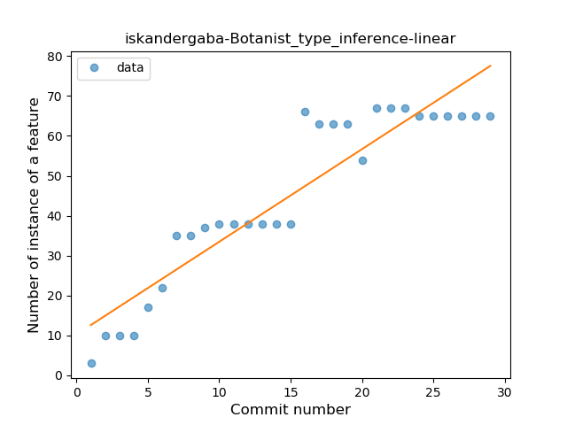
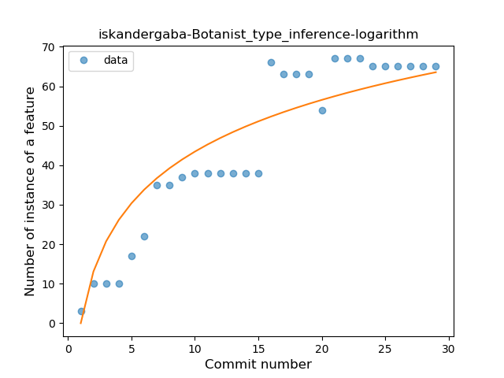
### <a name="lambda">Lambda</a>
----
#### Functions
* **Plateau Gradual Rise - Sigmoid:** 
    * **R_Squared:** 0.94555731
* **Instability - Polinomial 3:** )
    * **R_Squared:** 0.8980955
* **Constant Rise - Linear:** 
    * **R_Squared:** 0.82253793
* **Sudden Rise Plateau - Logarithm:** 
    * **R_Squared:** 0.73079596

**Plots** :chart_with_upwards_trend:
-----

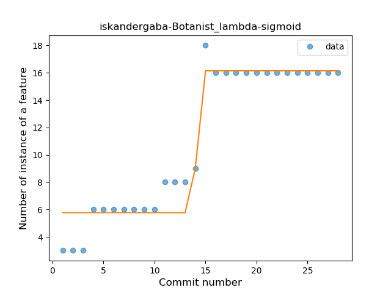
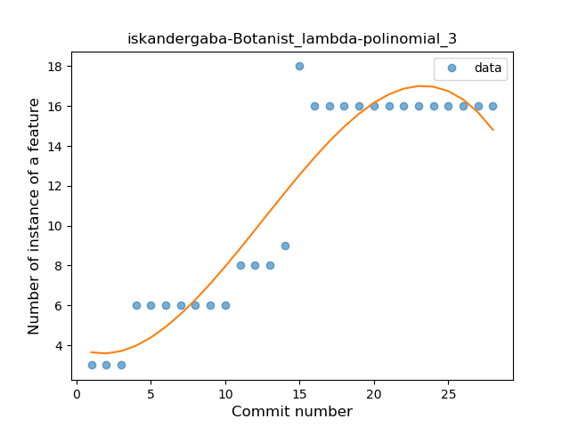
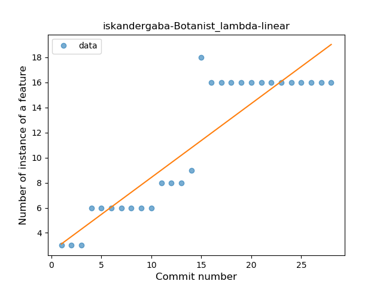
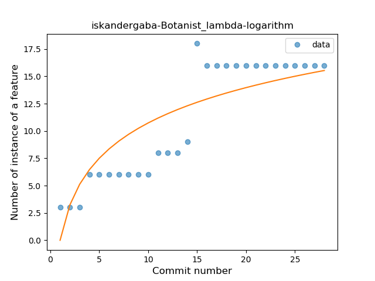
### <a name="safe_call">Safe Call</a>
----
#### Functions
* **Plateau Gradual Rise - Sigmoid:** 
    * **R_Squared:** 0.87211116
* **Instability - Polinomial 3:** )
    * **R_Squared:** 0.86770463
* **Constant Rise - Linear:** 
    * **R_Squared:** 0.81906229
* **Sudden Rise - Exponential:** 
    * **R_Squared:** 0.82206597
* **Sudden Rise Plateau - Logarithm:** 
    * **R_Squared:** 0.59262418

**Plots** :chart_with_upwards_trend:
-----

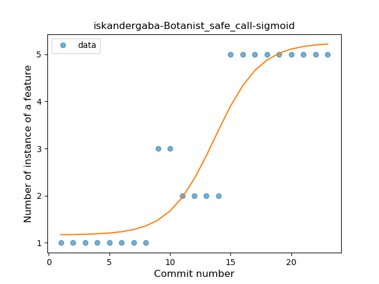
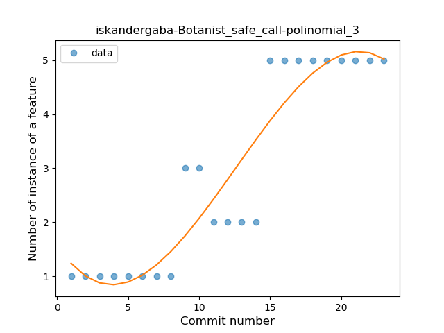
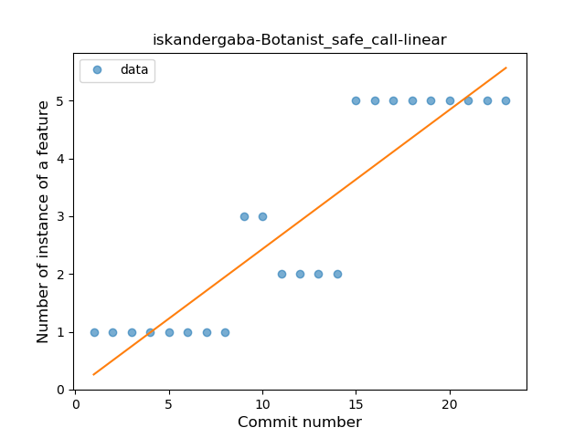
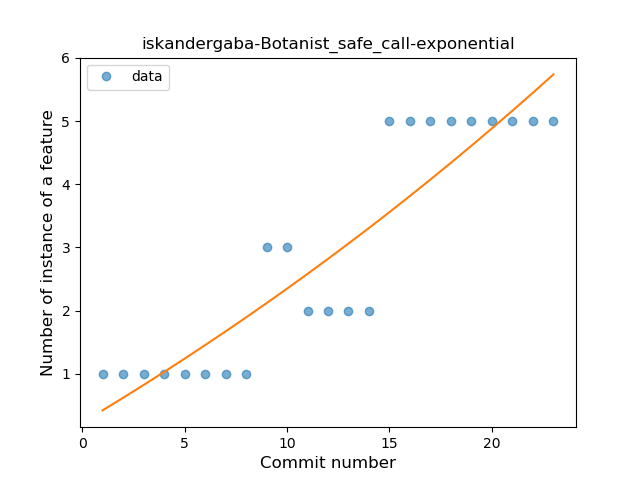
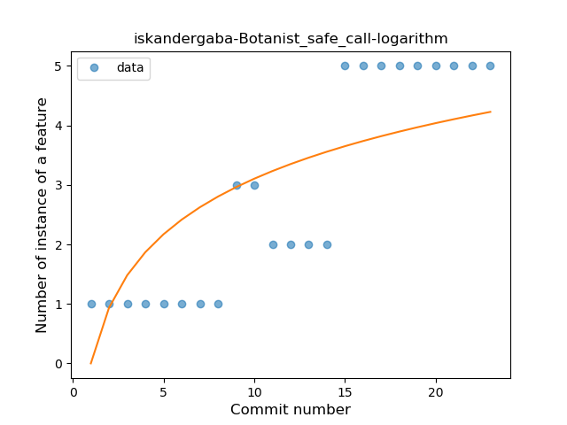
### <a name="unsafe_call">Unsafe Call</a>
----
#### Functions
* **Plateau Gradual Rise - Sigmoid:** 
    * **R_Squared:** 0.70779076
* **Sudden Rise Plateau - Logarithm:** 
    * **R_Squared:** 0.59650312
* **Constant Rise - Linear:** 
    * **R_Squared:** 0.50194561

**Plots** :chart_with_upwards_trend:
-----

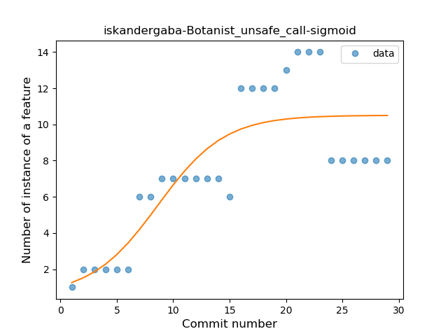
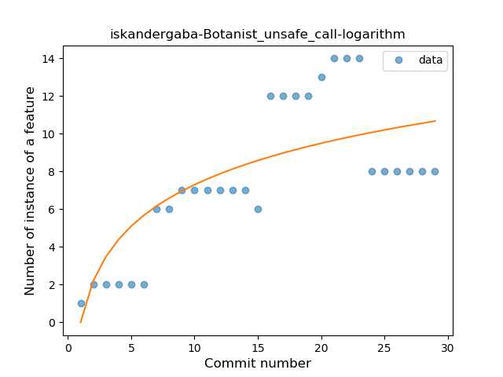
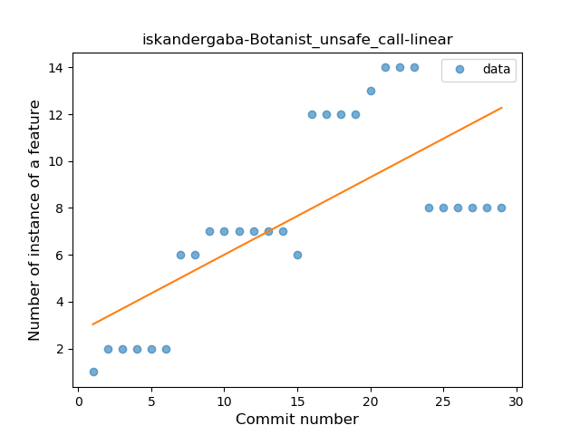
