## it-diab
----
#### Metrics provided by Detekt
* Number of lines of code 10076
* Number of Kotlin files: 169
* Cyclomatic complexity: 931
* Cyclomatic complexity by thousands of lines: 214 

----
**20** features analyzed

*	<a href="#type_inference">Type Inference</a> 
*	<a href="#lambda">Lambda</a> 
*	<a href="#safe_call">Safe Call</a> 
*	<a href="#when_expr">When expression</a> 
*	<a href="#unsafe_call">Unsafe Call</a> 
*	<a href="#companion_object">Companion Object</a> 
*	<a href="#string_template">String Template</a> 
*	<a href="#func_with_default_value">Function with Default Value</a> 
*	<a href="#singleton">Singleton</a> 
*	<a href="#range_expr">Range Expression</a> 
*	<a href="#smart_cast">Smart Cast</a> 
*	<a href="#data_class">Data Class</a> 
*	<a href="#func_call_with_named_arg">Function call with Named Argument</a> 
*	<a href="#extension_function">Extension Function</a> 
*	<a href="#property_delegation">Property Delegation</a> 
*	<a href="#destructuring_declaration">Destructuring Declaration</a> 
*	<a href="#inline_func">Inline Function</a> 
*	<a href="#overloaded_op">Overloaded Operator</a> 
*	<a href="#coroutine">Coroutine</a> 
*	<a href="#sealed_class">Sealed Class</a> 

### <a name="type_inference">Type Inference</a>
----
#### Functions
* **Plateau Gradual Rise - Sigmoid:** 
    * **R_Squared:** 0.92938291
* **Constant Rise - Linear:** 
    * **R_Squared:** 0.88957907
* **Sudden Rise Plateau - Logarithm:** 
    * **R_Squared:** 0.71319052

**Plots** :chart_with_upwards_trend:
-----

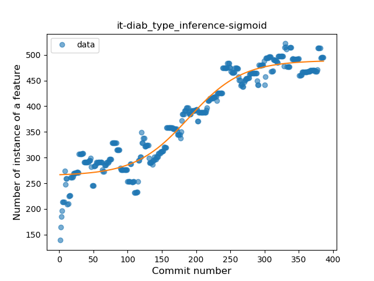

### <a name="lambda">Lambda</a>
----
#### Functions
* **Constant Rise - Linear:** 
    * **R_Squared:** 0.95348153
* **Plateau Sudden Rise - Binary Sigmoid:** 
    * **R_Squared:** 0.71809207
* **Sudden Rise Plateau - Logarithm:** 
    * **R_Squared:** 0.58031391

**Plots** :chart_with_upwards_trend:
-----

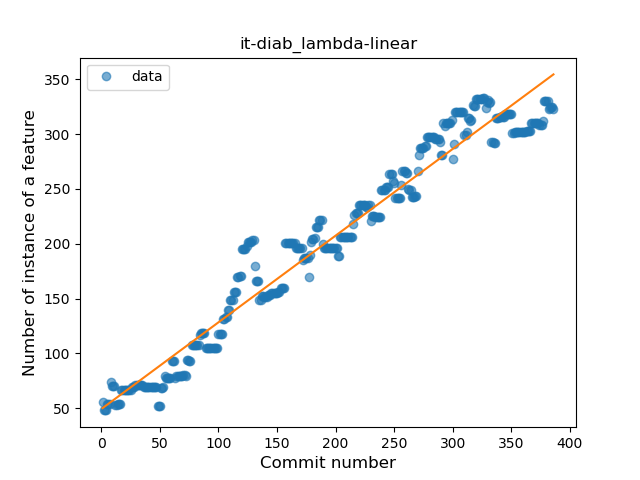

### <a name="safe_call">Safe Call</a>
----
#### Functions
* **Sudden Rise - Exponential:** 
    * **R_Squared:** 0.708516
* **Constant Rise - Linear:** 
    * **R_Squared:** 0.41023011
* **Sudden Rise Plateau - Logarithm:** 
    * **R_Squared:** 0.18344953
* **Plateau Sudden Rise - Binary Sigmoid:** 
    * **R_Squared:** 0.0053258

**Plots** :chart_with_upwards_trend:
-----

### <a name="when_expr">When expression</a>
----
#### Functions
* **Sudden Rise - Exponential:** 
    * **R_Squared:** 0.8935618
* **Constant Rise - Linear:** 
    * **R_Squared:** 0.77443922
* **Sudden Rise Plateau - Logarithm:** 
    * **R_Squared:** 0.44838625
* **Plateau Sudden Rise - Binary Sigmoid:** 
    * **R_Squared:** 0.05611535

**Plots** :chart_with_upwards_trend:
-----

### <a name="unsafe_call">Unsafe Call</a>
----
#### Functions
* **Sudden Decline - Exponential:** 
    * **R_Squared:** 0.54436845
* **Constant Decline - Linear:** 
    * **R_Squared:** 0.52195572
* **Plateau Sudden Decline - Binary Sigmoid:** 
    * **R_Squared:** 0.50244432
* **Sudden Rise Plateau - Logarithm:** 
    * **R_Squared:** -0.0

**Plots** :chart_with_upwards_trend:
-----

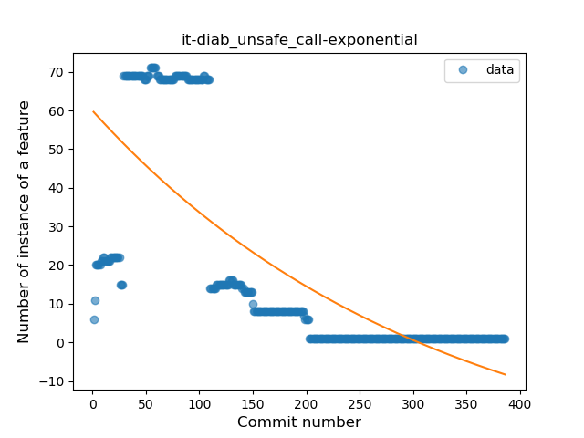

### <a name="companion_object">Companion Object</a>
----
#### Functions
* **Constant Rise - Linear:** 
    * **R_Squared:** 0.92092386
* **Sudden Rise - Exponential:** 
    * **R_Squared:** 0.93025505
* **Sudden Rise Plateau - Logarithm:** 
    * **R_Squared:** 0.67335858

**Plots** :chart_with_upwards_trend:
-----

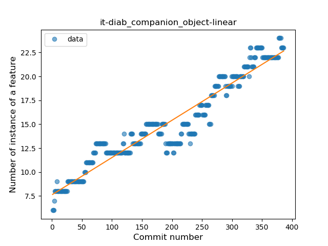

### <a name="string_template">String Template</a>
----
#### Functions
* **Plateau Gradual Rise - Sigmoid:** 
    * **R_Squared:** 0.85418725
* **Constant Rise - Linear:** 
    * **R_Squared:** 0.52535614
* **Sudden Rise Plateau - Logarithm:** 
    * **R_Squared:** 0.41801436

**Plots** :chart_with_upwards_trend:
-----

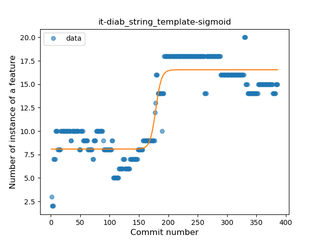

### <a name="func_with_default_value">Function with Default Value</a>
----
#### Functions
* **Plateau Gradual Rise - Sigmoid:** 
    * **R_Squared:** 0.96163691
* **Sudden Rise - Exponential:** 
    * **R_Squared:** 0.89401186
* **Constant Rise - Linear:** 
    * **R_Squared:** 0.59429558
* **Sudden Rise Plateau - Logarithm:** 
    * **R_Squared:** 0.16897425

**Plots** :chart_with_upwards_trend:
-----

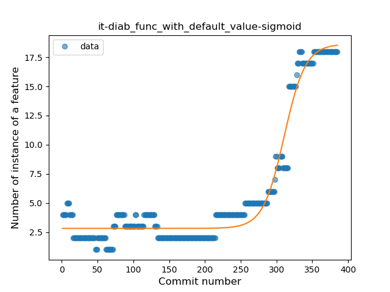

### <a name="singleton">Singleton</a>
----
#### Functions
* **Sudden Rise - Exponential:** 
    * **R_Squared:** 0.93169215
* **Plateau Gradual Rise - Sigmoid:** 
    * **R_Squared:** 0.94057903
* **Constant Rise - Linear:** 
    * **R_Squared:** 0.87203375
* **Sudden Rise Plateau - Logarithm:** 
    * **R_Squared:** 0.3114946

**Plots** :chart_with_upwards_trend:
-----

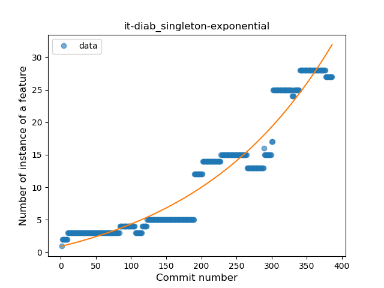

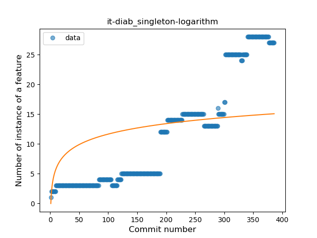
### <a name="range_expr">Range Expression</a>
----
#### Functions
* **Plateau Sudden Decline - Binary Sigmoid:** 
    * **R_Squared:** 0.44266581
* **Sudden Decline - Exponential:** 
    * **R_Squared:** 0.37398507
* **Constant Decline - Linear:** 
    * **R_Squared:** 0.34825153
* **Sudden Rise Plateau - Logarithm:** 
    * **R_Squared:** -0.0

**Plots** :chart_with_upwards_trend:
-----

### <a name="smart_cast">Smart Cast</a>
----
#### Functions
* **Plateau Gradual Rise - Sigmoid:** 
    * **R_Squared:** 0.95056445
* **Sudden Rise - Exponential:** 
    * **R_Squared:** 0.89179093
* **Constant Rise - Linear:** 
    * **R_Squared:** 0.67600559
* **Sudden Rise Plateau - Logarithm:** 
    * **R_Squared:** 0.22089188

**Plots** :chart_with_upwards_trend:
-----

### <a name="data_class">Data Class</a>
----
#### Functions
* **Plateau Gradual Rise - Sigmoid:** 
    * **R_Squared:** 0.97391274
* **Sudden Rise - Exponential:** 
    * **R_Squared:** 0.87609378
* **Constant Rise - Linear:** 
    * **R_Squared:** 0.59095103
* **Sudden Rise Plateau - Logarithm:** 
    * **R_Squared:** 0.11970212

**Plots** :chart_with_upwards_trend:
-----

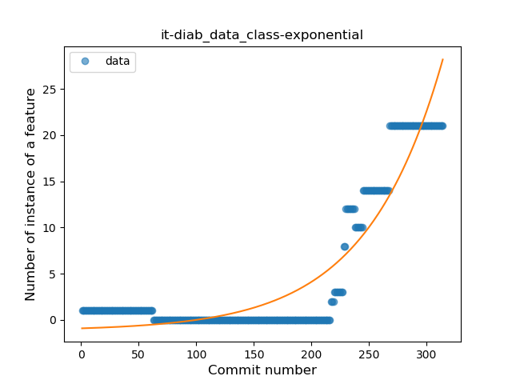

### <a name="func_call_with_named_arg">Function call with Named Argument</a>
----
#### Functions
* **Plateau Gradual Rise - Sigmoid:** 
    * **R_Squared:** 0.71555323
* **Sudden Rise - Exponential:** 
    * **R_Squared:** 0.59219898
* **Constant Rise - Linear:** 
    * **R_Squared:** 0.50768268
* **Sudden Rise Plateau - Logarithm:** 
    * **R_Squared:** 0.18407557

**Plots** :chart_with_upwards_trend:
-----

### <a name="extension_function">Extension Function</a>
----
#### Functions
* **Plateau Gradual Rise - Sigmoid:** 
    * **R_Squared:** 0.43017399
* **Constant Rise - Linear:** 
    * **R_Squared:** 0.37940929
* **Sudden Rise Plateau - Logarithm:** 
    * **R_Squared:** 0.28909077

**Plots** :chart_with_upwards_trend:
-----

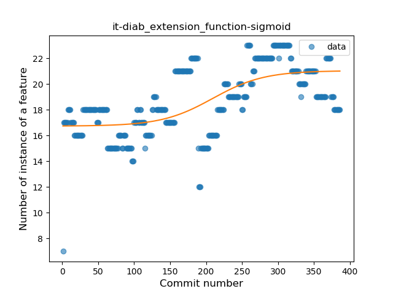

### <a name="property_delegation">Property Delegation</a>
----
#### Functions
* **Plateau Sudden Rise - Binary Sigmoid:** 
    * **R_Squared:** 0.61196748
* **Sudden Rise Plateau - Logarithm:** 
    * **R_Squared:** 0.17711484
* **Constant Rise - Linear:** 
    * **R_Squared:** 0.00682082

**Plots** :chart_with_upwards_trend:
-----

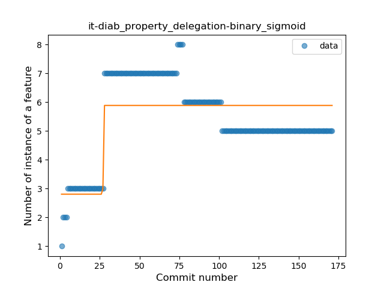

### <a name="destructuring_declaration">Destructuring Declaration</a>
----
#### Functions
* **Plateau Sudden Decline - Binary Sigmoid:** 
    * **R_Squared:** 0.3554534
* **Sudden Rise - Exponential:** 
    * **R_Squared:** 0.21274065
* **Constant Rise - Linear:** 
    * **R_Squared:** 0.00010451
* **Sudden Rise Plateau - Logarithm:** 
    * **R_Squared:** -0.0

**Plots** :chart_with_upwards_trend:
-----

### <a name="inline_func">Inline Function</a>
----
#### Functions
* **Plateau Sudden Rise - Binary Sigmoid:** 
    * **R_Squared:** 1.0
* **Sudden Rise - Exponential:** 
    * **R_Squared:** 0.75246716
* **Constant Rise - Linear:** 
    * **R_Squared:** 0.72782595
* **Sudden Rise Plateau - Logarithm:** 
    * **R_Squared:** 0.38212893

**Plots** :chart_with_upwards_trend:
-----

### <a name="overloaded_op">Overloaded Operator</a>
----
#### Functions
* **Sudden Rise - Exponential:** 
    * **R_Squared:** 0.72291306
* **Constant Rise - Linear:** 
    * **R_Squared:** 0.60530846
* **Sudden Rise Plateau - Logarithm:** 
    * **R_Squared:** 0.32452692

**Plots** :chart_with_upwards_trend:
-----

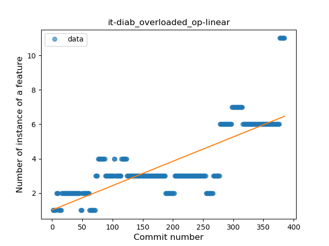

### <a name="coroutine">Coroutine</a>
----
#### Functions
* **Sudden Rise Plateau - Logarithm:** 
    * **R_Squared:** 0.21776995
* **Plateau Sudden Rise - Binary Sigmoid:** 
    * **R_Squared:** 0.07108605
* **Constant Rise - Linear:** 
    * **R_Squared:** 0.04188181

**Plots** :chart_with_upwards_trend:
-----

### <a name="sealed_class">Sealed Class</a>
----
#### Functions
* **Sudden Rise Plateau - Logarithm:** 
    * **R_Squared:** 0.84392983
* **Constant Rise - Linear:** 
    * **R_Squared:** 0.65895357
* **Plateau Sudden Rise - Binary Sigmoid:** 
    * **R_Squared:** 0.54186192

**Plots** :chart_with_upwards_trend:
-----

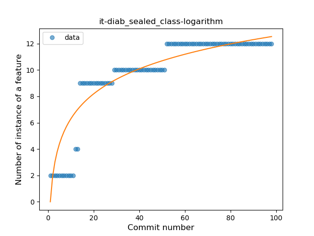

