## jeeb-mpv-android
----
#### Metrics provided by Detekt
* Number of lines of code 1365
* Number of Kotlin files: 6
* Cyclomatic complexity: 249
* Cyclomatic complexity by thousands of lines: 317 

----
**11** features analyzed

*	<a href="#type_inference">Type Inference</a> 
*	<a href="#lambda">Lambda</a> 
*	<a href="#safe_call">Safe Call</a> 
*	<a href="#when_expr">When expression</a> 
*	<a href="#companion_object">Companion Object</a> 
*	<a href="#unsafe_call">Unsafe Call</a> 
*	<a href="#string_template">String Template</a> 
*	<a href="#smart_cast">Smart Cast</a> 
*	<a href="#data_class">Data Class</a> 
*	<a href="#destructuring_declaration">Destructuring Declaration</a> 
*	<a href="#inline_func">Inline Function</a> 

### <a name="type_inference">Type Inference</a>
----
#### Functions
* **Constant Rise - Linear:** 
    * **R_Squared:** 0.88424459
* **Sudden Rise Plateau - Logarithm:** 
    * **R_Squared:** 0.79613817
* **Plateau Gradual Rise - Sigmoid:** 
    * **R_Squared:** 0.37187896

**Plots** :chart_with_upwards_trend:
-----

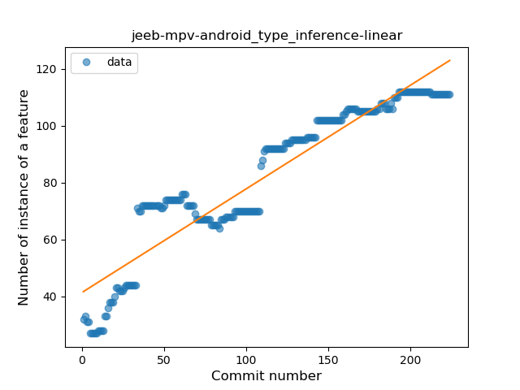
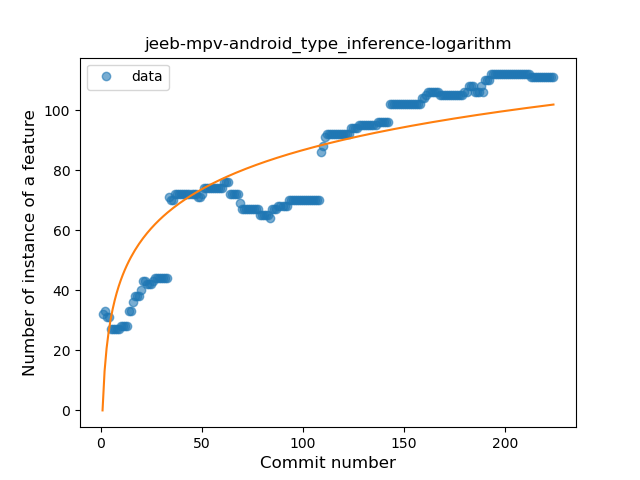
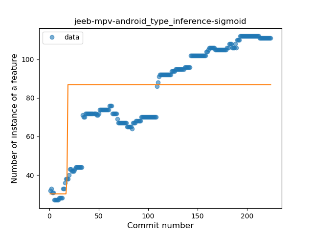
### <a name="lambda">Lambda</a>
----
#### Functions
* **Sudden Rise Plateau - Logarithm:** 
    * **R_Squared:** 0.74890074
* **Constant Rise - Linear:** 
    * **R_Squared:** 0.40899751

**Plots** :chart_with_upwards_trend:
-----

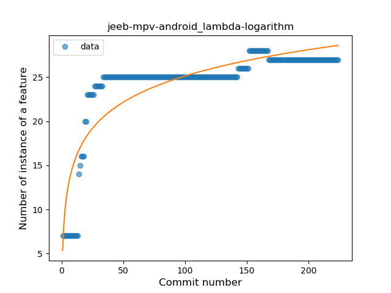
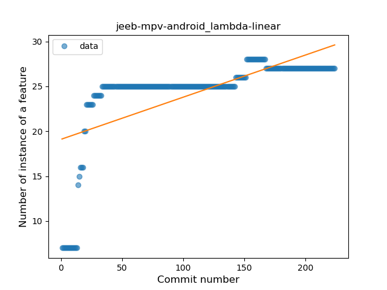
### <a name="safe_call">Safe Call</a>
----
#### Functions
* **Constant Rise - Linear:** 
    * **R_Squared:** 0.73803503
* **Sudden Rise Plateau - Logarithm:** 
    * **R_Squared:** 0.73507528

**Plots** :chart_with_upwards_trend:
-----

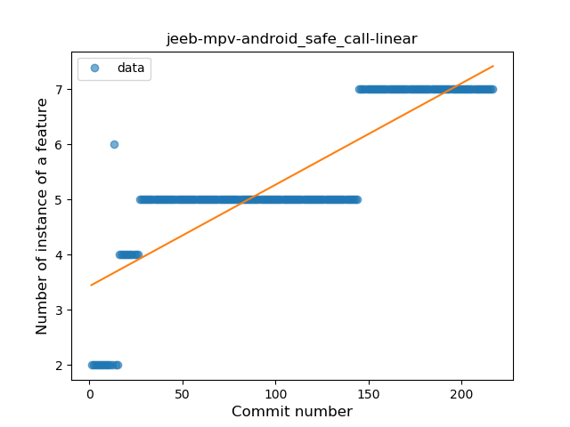
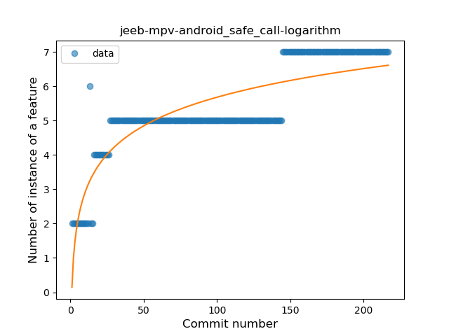
### <a name="when_expr">When expression</a>
----
#### Functions
* **Constant Rise - Linear:** 
    * **R_Squared:** 0.83405412
* **Sudden Rise Plateau - Logarithm:** 
    * **R_Squared:** 0.80736227

**Plots** :chart_with_upwards_trend:
-----

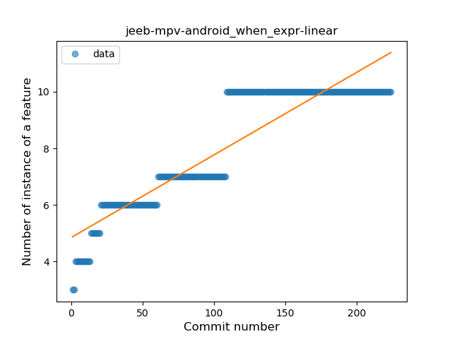
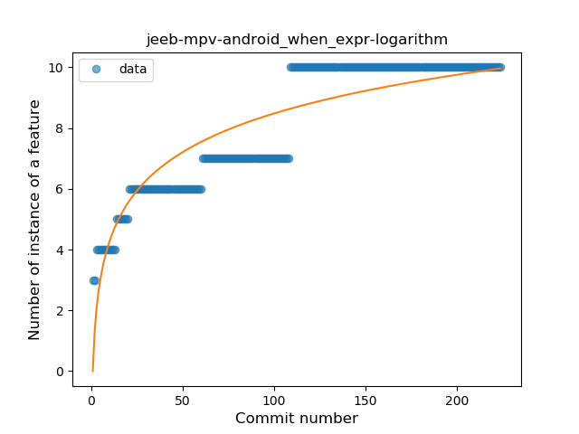
### <a name="companion_object">Companion Object</a>
----
#### Functions
* **Plateau Sudden Rise - Binary Sigmoid:** 
    * **R_Squared:** 1.0
* **Sudden Rise Plateau - Logarithm:** 
    * **R_Squared:** 0.64769731
* **Constant Rise - Linear:** 
    * **R_Squared:** 0.37686099

**Plots** :chart_with_upwards_trend:
-----

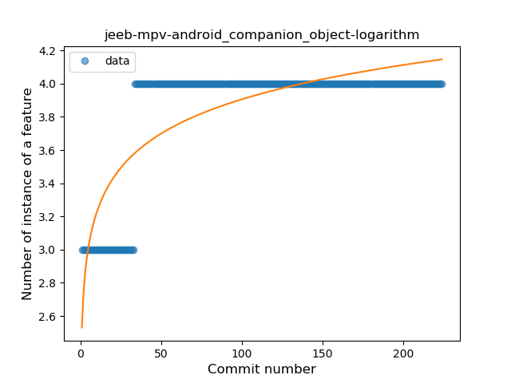
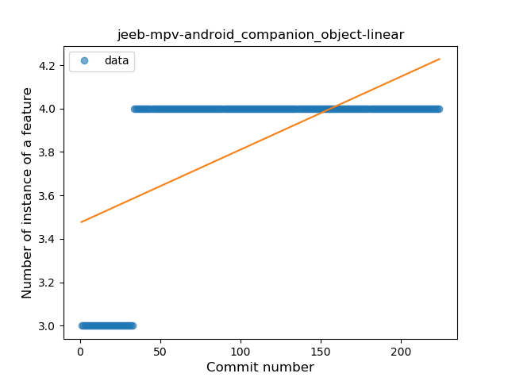
### <a name="unsafe_call">Unsafe Call</a>
----
#### Functions
* **Plateau Gradual Rise - Sigmoid:** 
    * **R_Squared:** 0.76245729
* **Sudden Rise Plateau - Logarithm:** 
    * **R_Squared:** 0.4178815
* **Constant Rise - Linear:** 
    * **R_Squared:** 0.14060054

**Plots** :chart_with_upwards_trend:
-----

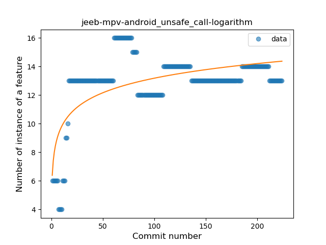
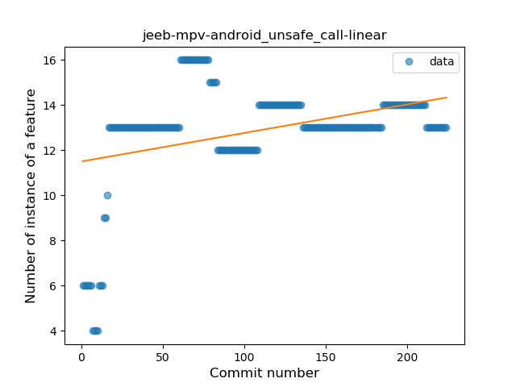
### <a name="string_template">String Template</a>
----
#### Functions
* **Constant Rise - Linear:** 
    * **R_Squared:** 0.87003703
* **Sudden Rise Plateau - Logarithm:** 
    * **R_Squared:** 0.83053897
* **Plateau Gradual Rise - Sigmoid:** 
    * **R_Squared:** 0.69056894

**Plots** :chart_with_upwards_trend:
-----

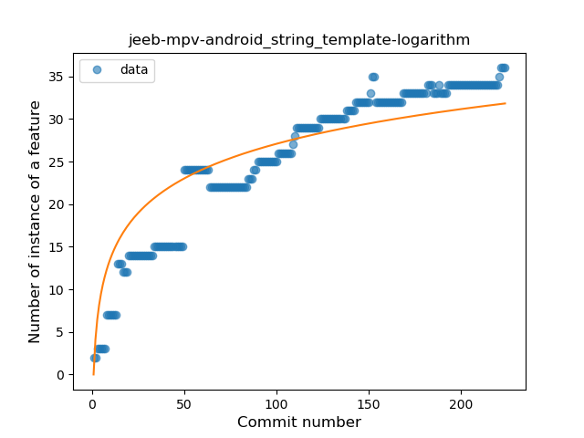

### <a name="smart_cast">Smart Cast</a>
----
#### Functions
* **Plateau Sudden Rise - Binary Sigmoid:** 
    * **R_Squared:** 0.83738541
* **Sudden Rise Plateau - Logarithm:** 
    * **R_Squared:** 0.3463077
* **Constant Rise - Linear:** 
    * **R_Squared:** 0.14676765

**Plots** :chart_with_upwards_trend:
-----

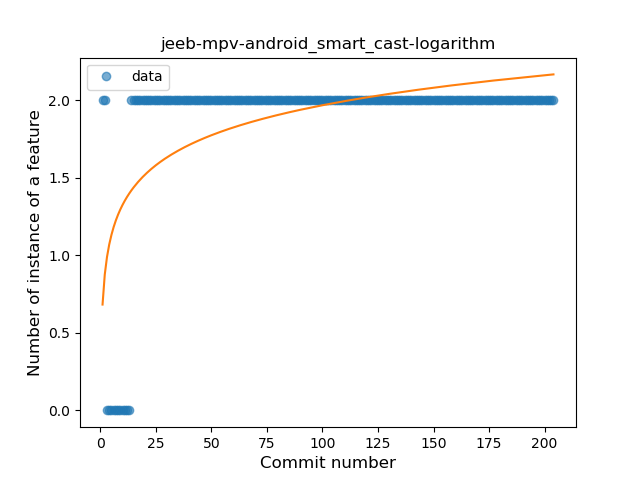
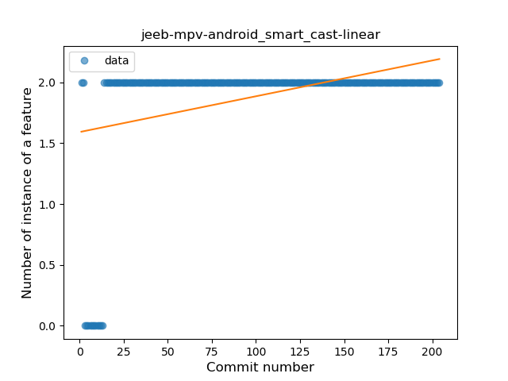
### <a name="data_class">Data Class</a>
----
#### Functions
* **Plateau Gradual Rise - Sigmoid:** 
    * **R_Squared:** 0.97407084
* **Sudden Rise Plateau - Logarithm:** 
    * **R_Squared:** 0.71067027
* **Constant Rise - Linear:** 
    * **R_Squared:** 0.32320962

**Plots** :chart_with_upwards_trend:
-----

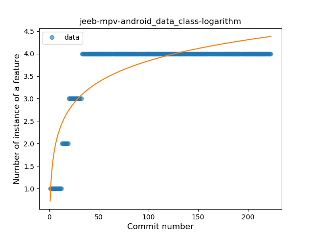

### <a name="destructuring_declaration">Destructuring Declaration</a>
----
#### Functions
* **Plateau Gradual Rise - Sigmoid:** 
    * **R_Squared:** 0.73830747
* **Sudden Rise Plateau - Logarithm:** 
    * **R_Squared:** 0.3198539
* **Constant Rise - Linear:** 
    * **R_Squared:** 0.08652971

**Plots** :chart_with_upwards_trend:
-----

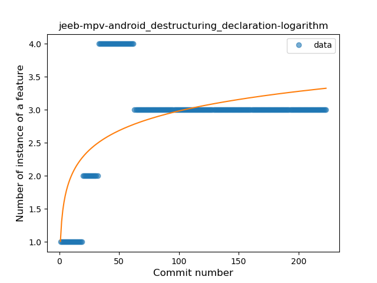
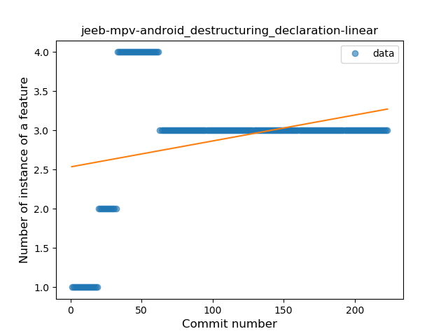
### <a name="inline_func">Inline Function</a>
----
#### Functions
* **Plateau Sudden Decline - Binary Sigmoid:** 
    * **R_Squared:** 1.0
* **Sudden Decline - Exponential:** 
    * **R_Squared:** 0.79367095
* **Constant Decline - Linear:** 
    * **R_Squared:** 0.32469512
* **Sudden Rise Plateau - Logarithm:** 
    * **R_Squared:** -0.0

**Plots** :chart_with_upwards_trend:
-----

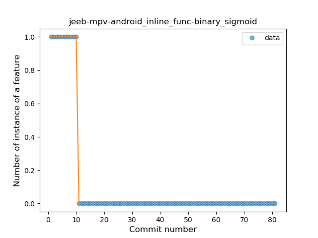
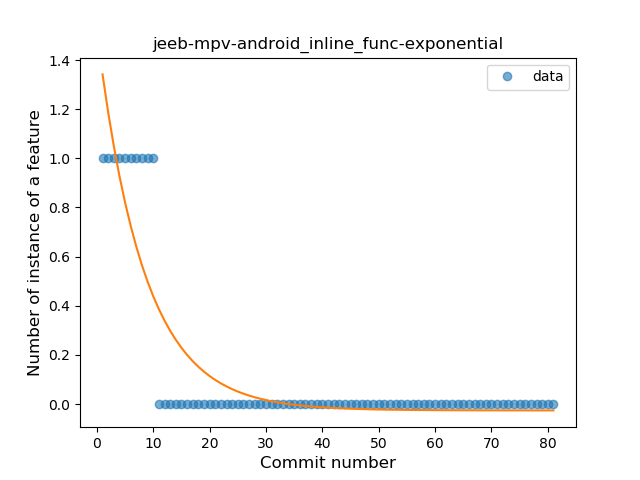
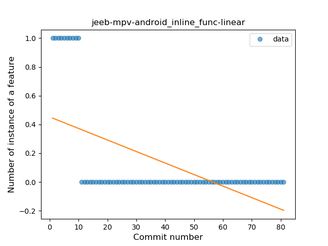

