## jereksel-Bucket
----
#### Metrics provided by Detekt
* Number of lines of code 13968
* Number of Kotlin files: 174
* Cyclomatic complexity: 1097
* Cyclomatic complexity by thousands of lines: 170 

----
**18** features analyzed

*	<a href="#type_inference">Type Inference</a> 
*	<a href="#lambda">Lambda</a> 
*	<a href="#safe_call">Safe Call</a> 
*	<a href="#when_expr">When expression</a> 
*	<a href="#companion_object">Companion Object</a> 
*	<a href="#unsafe_call">Unsafe Call</a> 
*	<a href="#string_template">String Template</a> 
*	<a href="#func_with_default_value">Function with Default Value</a> 
*	<a href="#singleton">Singleton</a> 
*	<a href="#smart_cast">Smart Cast</a> 
*	<a href="#range_expr">Range Expression</a> 
*	<a href="#func_call_with_named_arg">Function call with Named Argument</a> 
*	<a href="#data_class">Data Class</a> 
*	<a href="#extension_function">Extension Function</a> 
*	<a href="#property_delegation">Property Delegation</a> 
*	<a href="#destructuring_declaration">Destructuring Declaration</a> 
*	<a href="#inline_func">Inline Function</a> 
*	<a href="#overloaded_op">Overloaded Operator</a> 

### <a name="type_inference">Type Inference</a>
----
#### Functions
* **Constant Rise - Linear:** 
    * **R_Squared:** 0.95564242
* **Sudden Rise Plateau - Logarithm:** 
    * **R_Squared:** 0.53202355
* **Plateau Sudden Rise - Binary Sigmoid:** 
    * **R_Squared:** 0.08875313

**Plots** :chart_with_upwards_trend:
-----

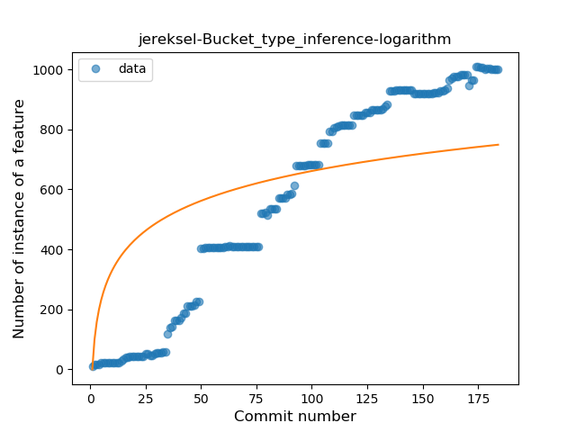
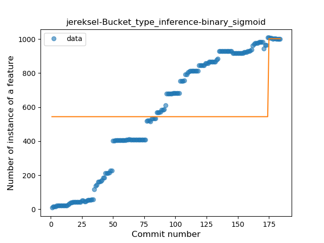
### <a name="lambda">Lambda</a>
----
#### Functions
* **Constant Rise - Linear:** 
    * **R_Squared:** 0.94510917
* **Sudden Rise Plateau - Logarithm:** 
    * **R_Squared:** 0.56580799

**Plots** :chart_with_upwards_trend:
-----

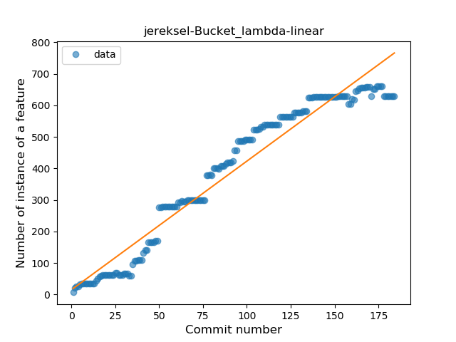
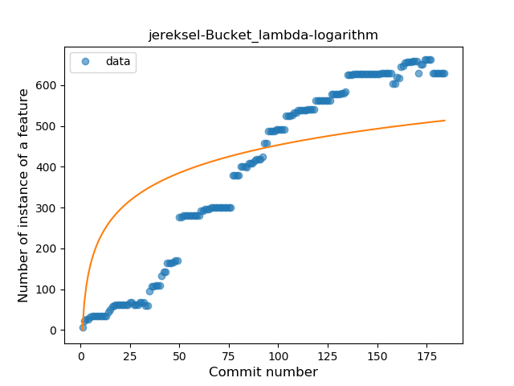
### <a name="safe_call">Safe Call</a>
----
#### Functions
* **Constant Rise - Linear:** 
    * **R_Squared:** 0.82877148
* **Plateau Sudden Rise - Binary Sigmoid:** 
    * **R_Squared:** 0.80046555
* **Sudden Rise Plateau - Logarithm:** 
    * **R_Squared:** 0.56990224

**Plots** :chart_with_upwards_trend:
-----

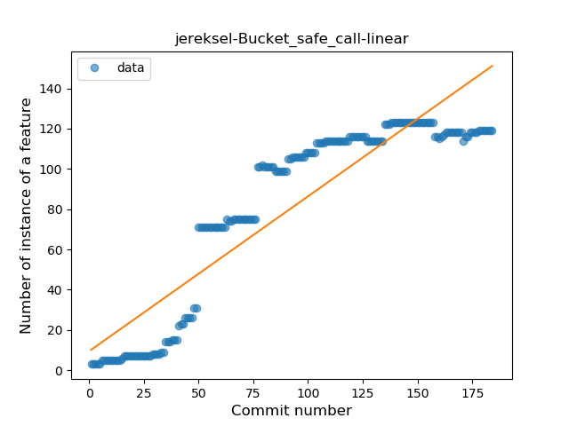
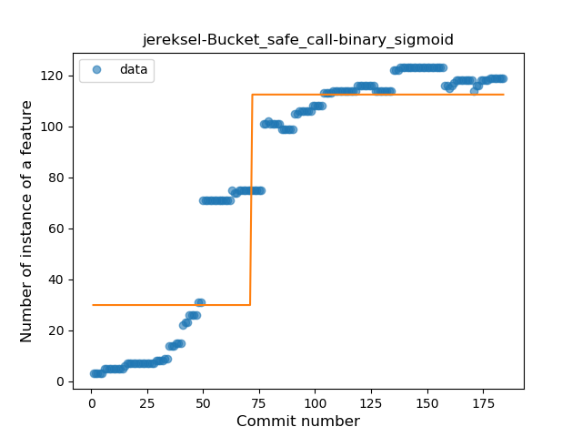
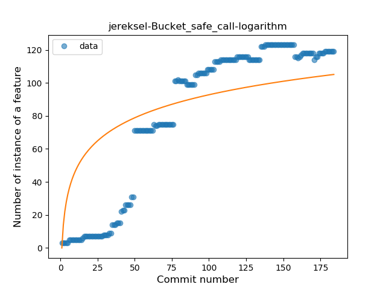
### <a name="when_expr">When expression</a>
----
#### Functions
* **Plateau Gradual Rise - Sigmoid:** 
    * **R_Squared:** 0.85433656
* **Sudden Rise - Exponential:** 
    * **R_Squared:** 0.80990204
* **Constant Rise - Linear:** 
    * **R_Squared:** 0.51468572
* **Sudden Rise Plateau - Logarithm:** 
    * **R_Squared:** 0.31294848

**Plots** :chart_with_upwards_trend:
-----

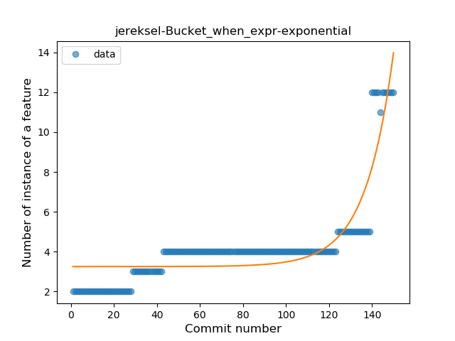
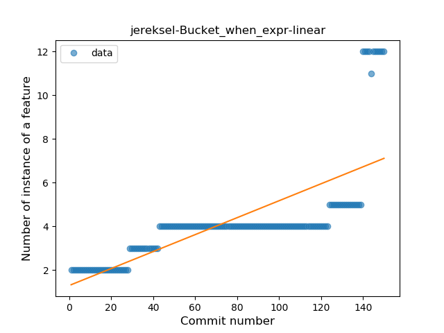
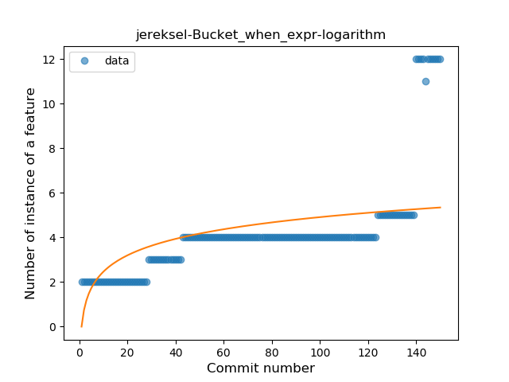
### <a name="companion_object">Companion Object</a>
----
#### Functions
* **Plateau Gradual Rise - Sigmoid:** 
    * **R_Squared:** 0.83957058
* **Sudden Rise Plateau - Logarithm:** 
    * **R_Squared:** 0.67914426
* **Constant Rise - Linear:** 
    * **R_Squared:** 0.63746465

**Plots** :chart_with_upwards_trend:
-----

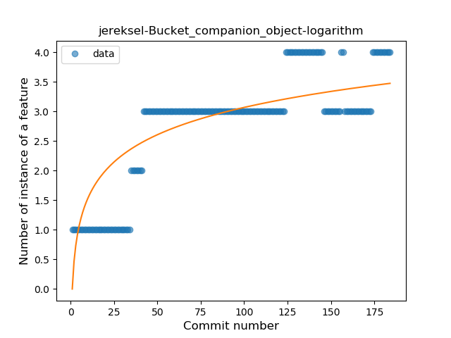
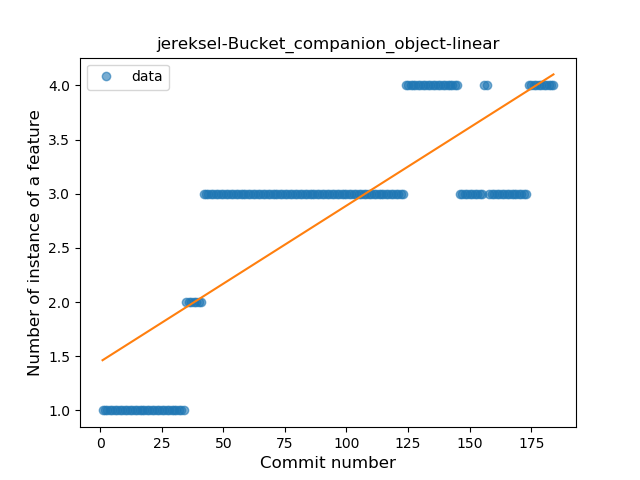
### <a name="unsafe_call">Unsafe Call</a>
----
#### Functions
* **Constant Rise - Linear:** 
    * **R_Squared:** 0.92169611
* **Plateau Gradual Rise - Sigmoid:** 
    * **R_Squared:** 0.64400503
* **Sudden Rise Plateau - Logarithm:** 
    * **R_Squared:** 0.59755353

**Plots** :chart_with_upwards_trend:
-----

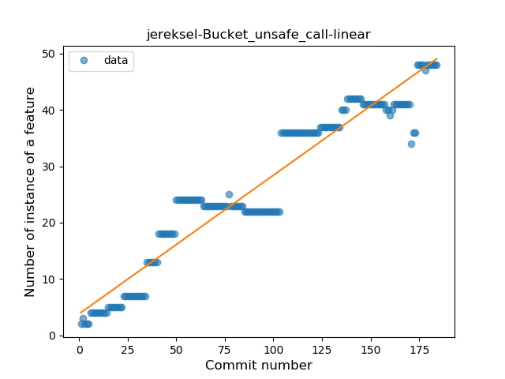
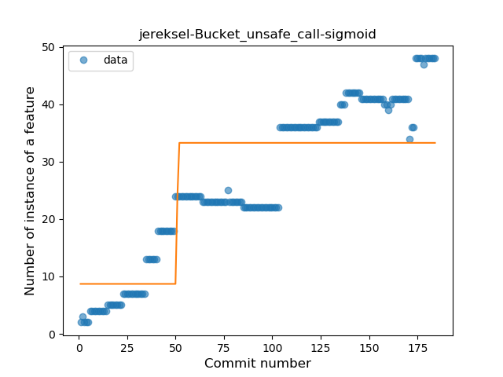
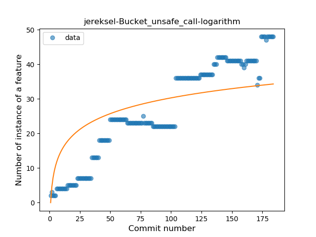
### <a name="string_template">String Template</a>
----
#### Functions
* **Constant Rise - Linear:** 
    * **R_Squared:** 0.95196232
* **Plateau Gradual Rise - Sigmoid:** 
    * **R_Squared:** 0.61379317
* **Sudden Rise Plateau - Logarithm:** 
    * **R_Squared:** 0.59890548

**Plots** :chart_with_upwards_trend:
-----

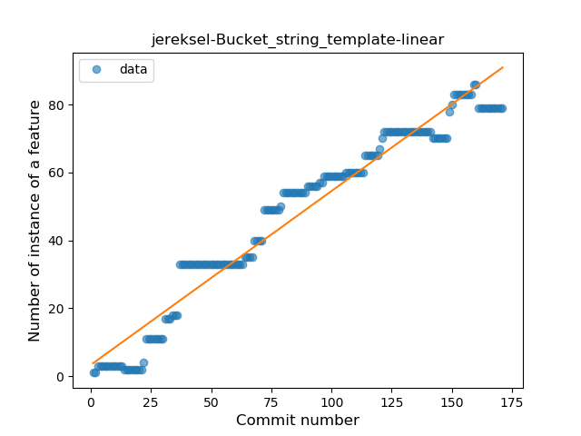
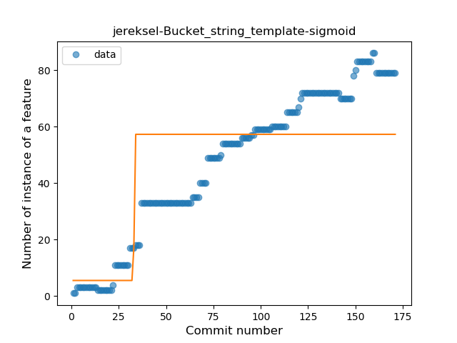
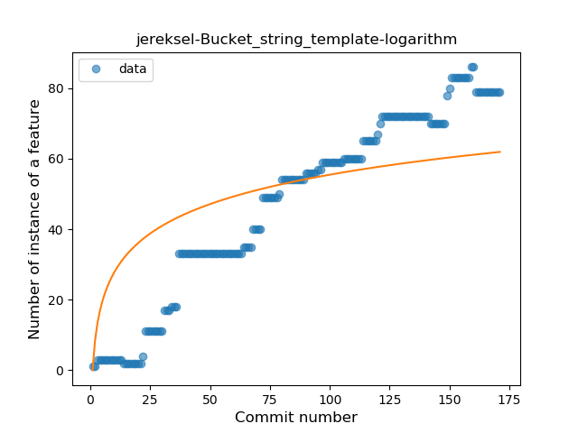
### <a name="func_with_default_value">Function with Default Value</a>
----
#### Functions
* **Constant Rise - Linear:** 
    * **R_Squared:** 0.83462651
* **Sudden Rise Plateau - Logarithm:** 
    * **R_Squared:** 0.69009137
* **Plateau Gradual Rise - Sigmoid:** 
    * **R_Squared:** 0.30159854

**Plots** :chart_with_upwards_trend:
-----

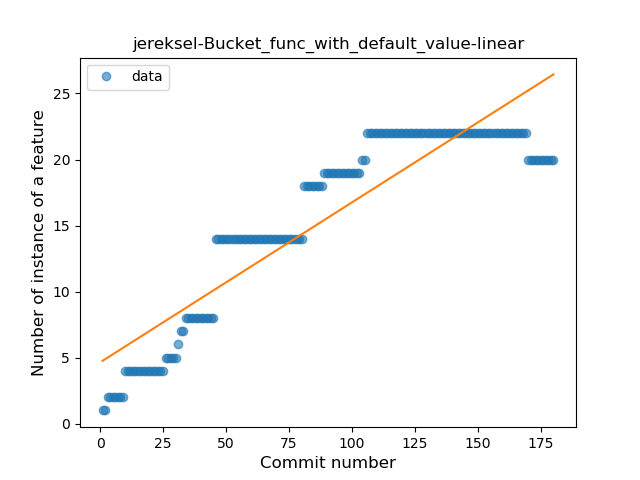

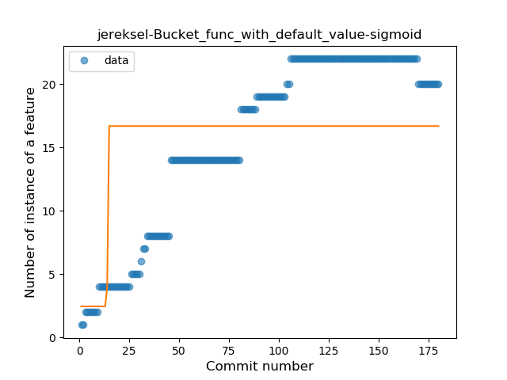
### <a name="singleton">Singleton</a>
----
#### Functions
* **Sudden Rise - Exponential:** 
    * **R_Squared:** 0.93725033
* **Constant Rise - Linear:** 
    * **R_Squared:** 0.83255593
* **Sudden Rise Plateau - Logarithm:** 
    * **R_Squared:** 0.36176563

**Plots** :chart_with_upwards_trend:
-----

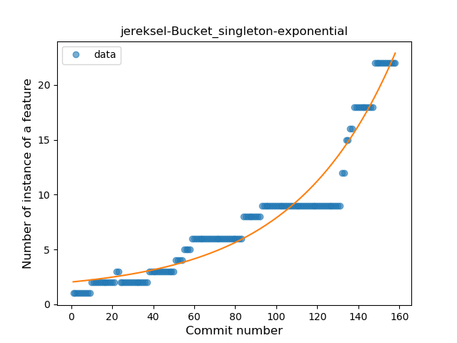
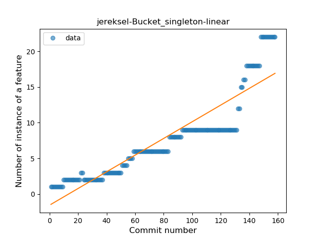
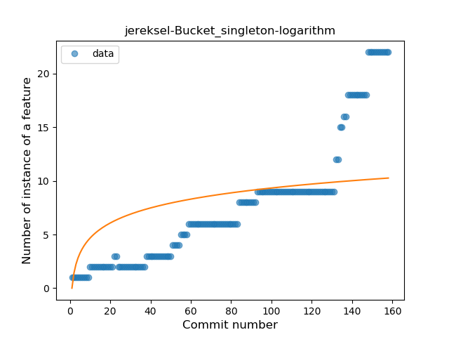
### <a name="smart_cast">Smart Cast</a>
----
#### Functions
* **Plateau Gradual Rise - Sigmoid:** 
    * **R_Squared:** 0.96347782
* **Sudden Rise - Exponential:** 
    * **R_Squared:** 0.84456271
* **Instability - Polinomial 3:** )
    * **R_Squared:** 0.75759245
* **Constant Rise - Linear:** 
    * **R_Squared:** 0.37229453
* **Sudden Rise Plateau - Logarithm:** 
    * **R_Squared:** 0.10661378

**Plots** :chart_with_upwards_trend:
-----

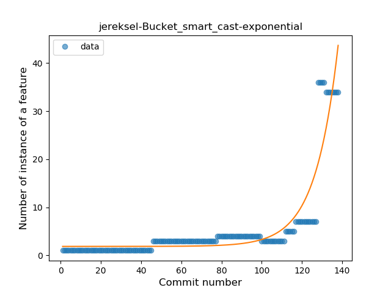
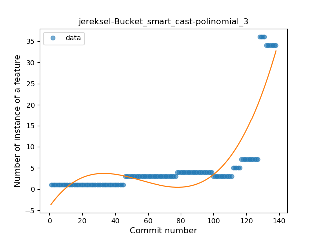
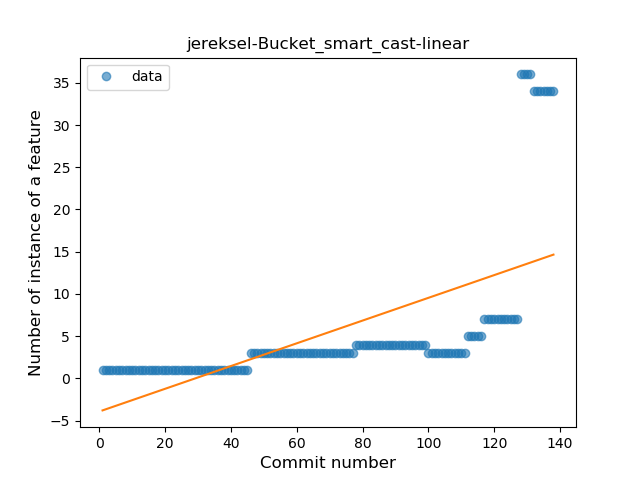
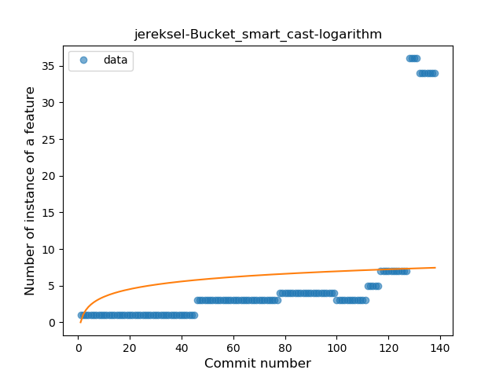
### <a name="range_expr">Range Expression</a>
----
#### Functions
* **Sudden Rise - Exponential:** 
    * **R_Squared:** 0.33114966
* **Constant Rise - Linear:** 
    * **R_Squared:** 0.30941879
* **Plateau Sudden Rise - Binary Sigmoid:** 
    * **R_Squared:** 0.31417705
* **Sudden Rise Plateau - Logarithm:** 
    * **R_Squared:** 0.27678395

**Plots** :chart_with_upwards_trend:
-----

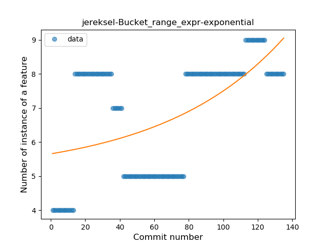
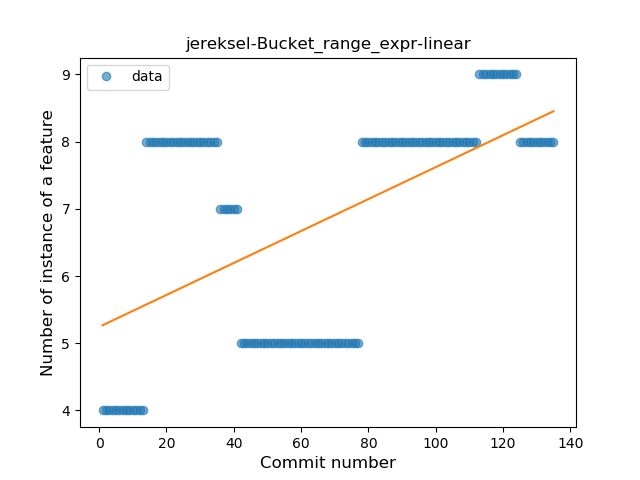
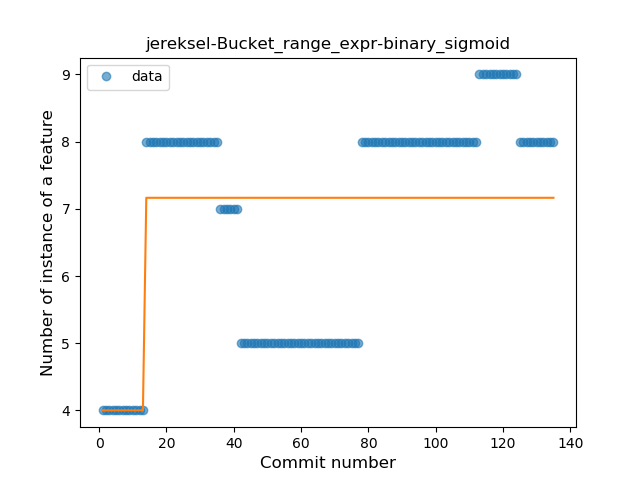
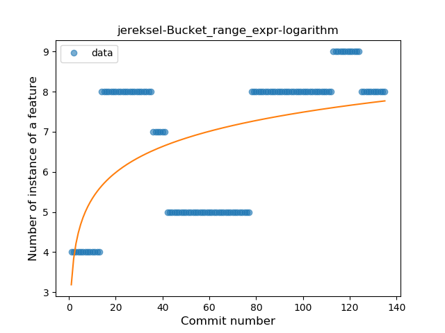
### <a name="func_call_with_named_arg">Function call with Named Argument</a>
----
#### Functions
* **Sudden Rise - Exponential:** 
    * **R_Squared:** 0.83284289
* **Constant Rise - Linear:** 
    * **R_Squared:** 0.67673169
* **Sudden Rise Plateau - Logarithm:** 
    * **R_Squared:** 0.30259887

**Plots** :chart_with_upwards_trend:
-----

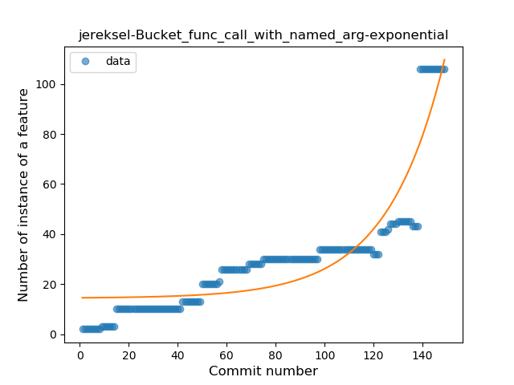
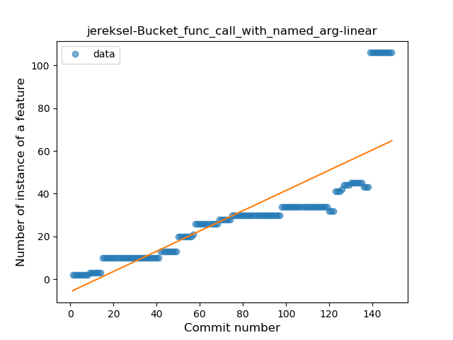
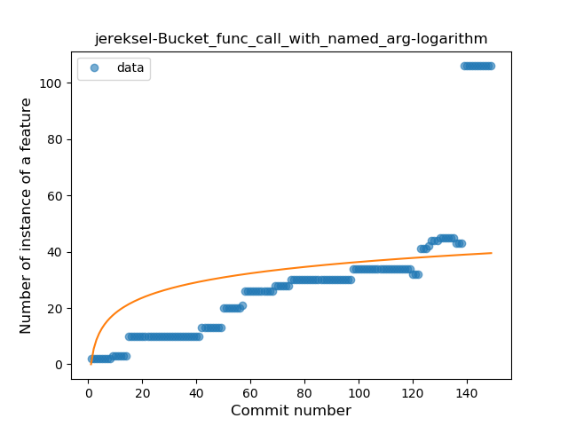
### <a name="data_class">Data Class</a>
----
#### Functions
* **Sudden Rise - Exponential:** 
    * **R_Squared:** 0.72135729
* **Constant Rise - Linear:** 
    * **R_Squared:** 0.57358759
* **Sudden Rise Plateau - Logarithm:** 
    * **R_Squared:** 0.35917461
* **Plateau Sudden Rise - Binary Sigmoid:** 
    * **R_Squared:** 0.27098479

**Plots** :chart_with_upwards_trend:
-----

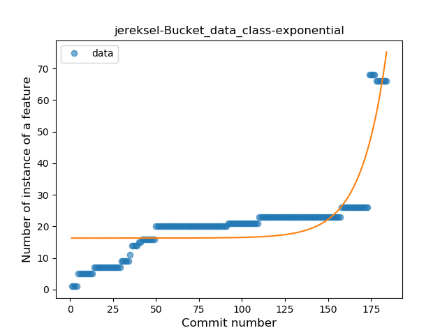
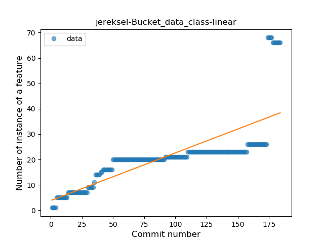
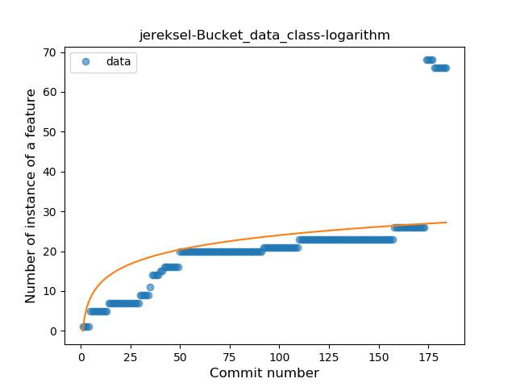
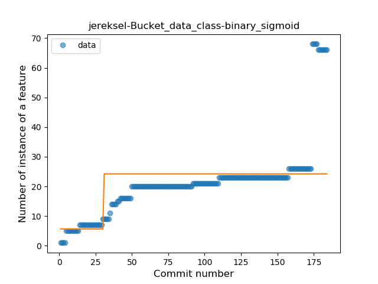
### <a name="extension_function">Extension Function</a>
----
#### Functions
* **Constant Rise - Linear:** 
    * **R_Squared:** 0.9138641
* **Sudden Rise Plateau - Logarithm:** 
    * **R_Squared:** 0.59210337
* **Plateau Gradual Rise - Sigmoid:** 
    * **R_Squared:** 0.25780551

**Plots** :chart_with_upwards_trend:
-----

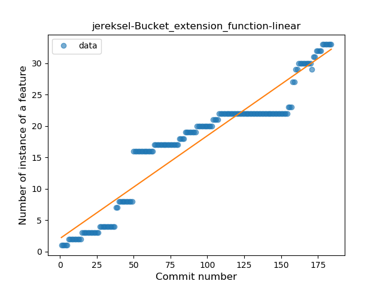
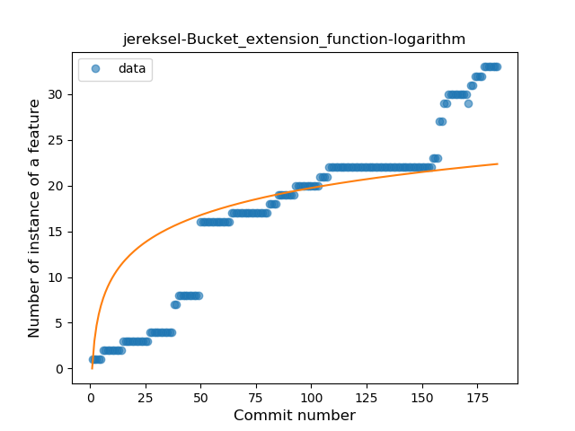

### <a name="property_delegation">Property Delegation</a>
----
#### Functions
* **Constant Rise - Linear:** 
    * **R_Squared:** 0.88410318
* **Sudden Rise Plateau - Logarithm:** 
    * **R_Squared:** 0.6196574

**Plots** :chart_with_upwards_trend:
-----

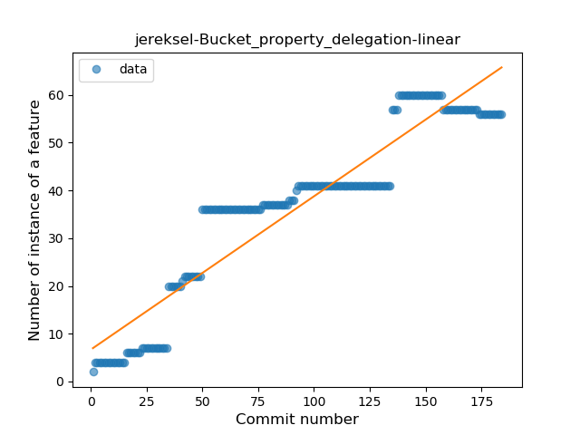
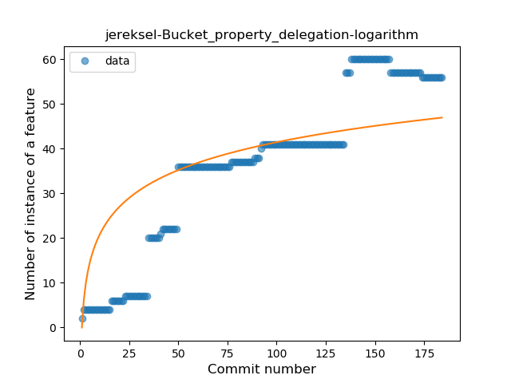
### <a name="destructuring_declaration">Destructuring Declaration</a>
----
#### Functions
* **Sudden Rise - Exponential:** 
    * **R_Squared:** 0.83019453
* **Constant Rise - Linear:** 
    * **R_Squared:** 0.69660394
* **Sudden Rise Plateau - Logarithm:** 
    * **R_Squared:** 0.35067751

**Plots** :chart_with_upwards_trend:
-----

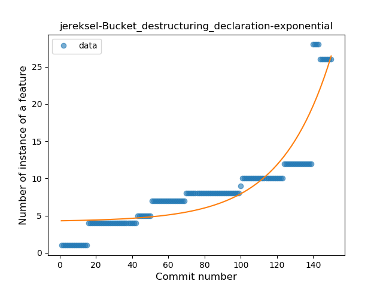
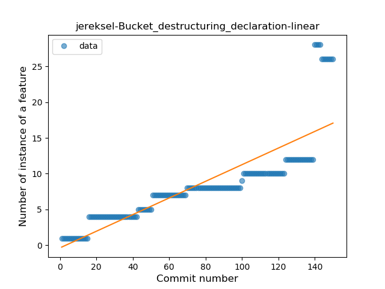
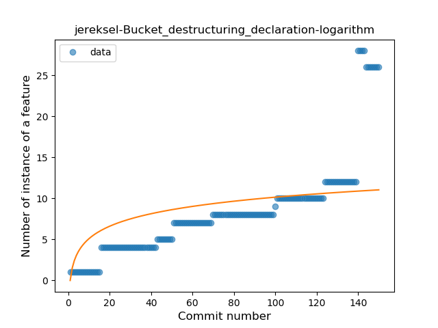
### <a name="inline_func">Inline Function</a>
----
#### Functions
* **Sudden Rise - Exponential:** 
    * **R_Squared:** 0.8985021
* **Constant Rise - Linear:** 
    * **R_Squared:** 0.68294845
* **Sudden Rise Plateau - Logarithm:** 
    * **R_Squared:** 0.29957948

**Plots** :chart_with_upwards_trend:
-----

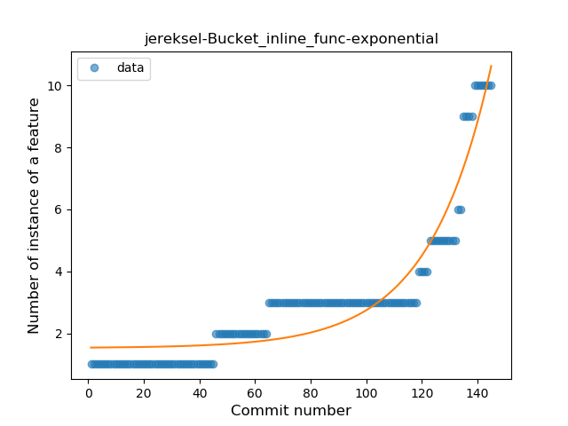
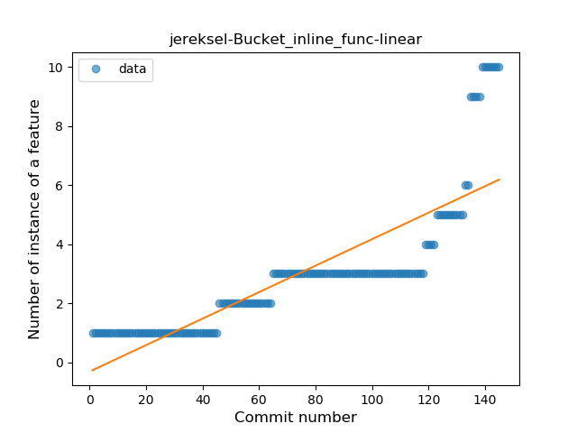
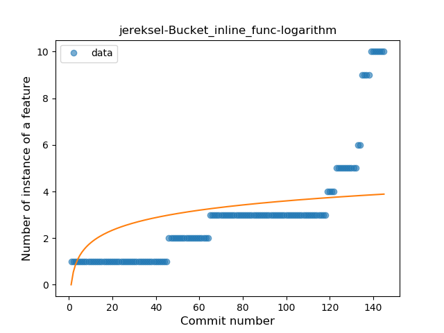
### <a name="overloaded_op">Overloaded Operator</a>
----
#### Functions
* **Sudden Rise - Exponential:** 
    * **R_Squared:** 0.12151267
* **Constant Rise - Linear:** 
    * **R_Squared:** 0.0271376
* **Sudden Rise Plateau - Logarithm:** 
    * **R_Squared:** -0.0

**Plots** :chart_with_upwards_trend:
-----

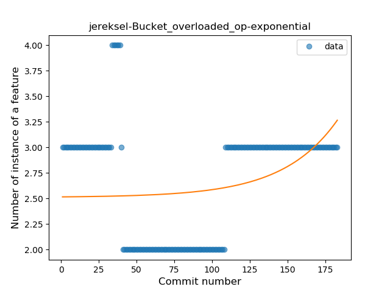
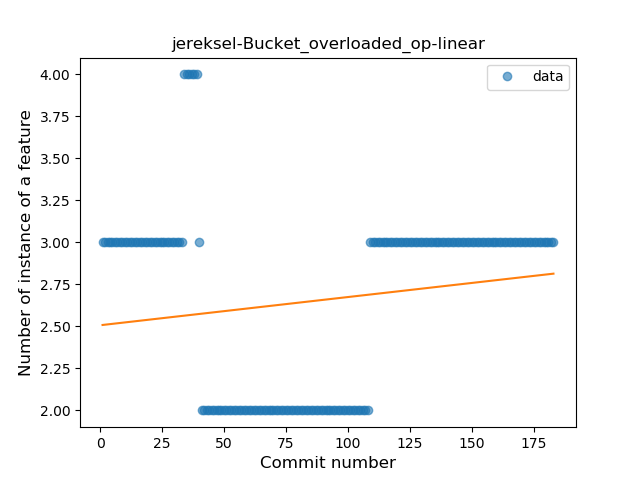
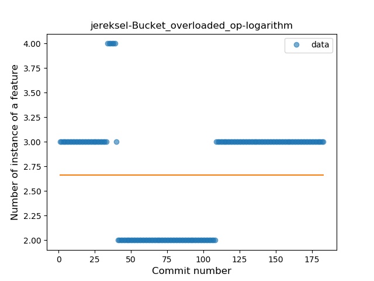
