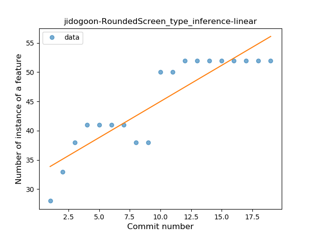
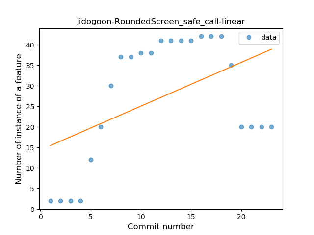
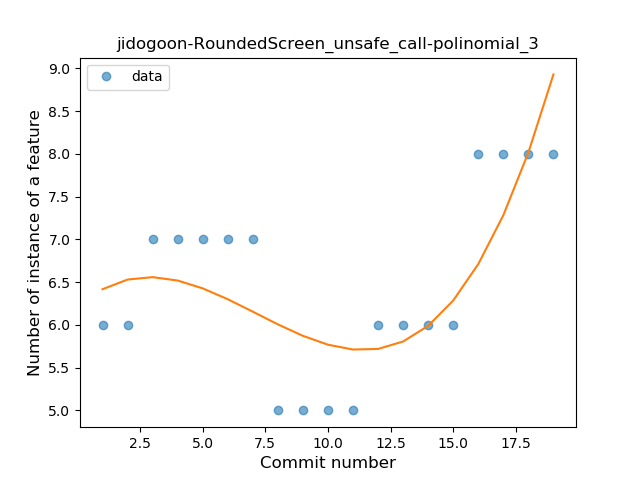
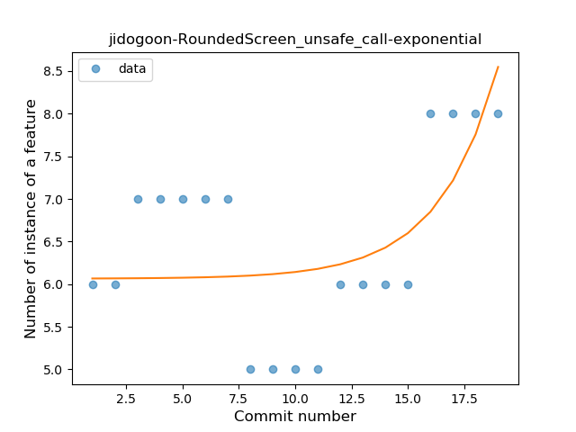
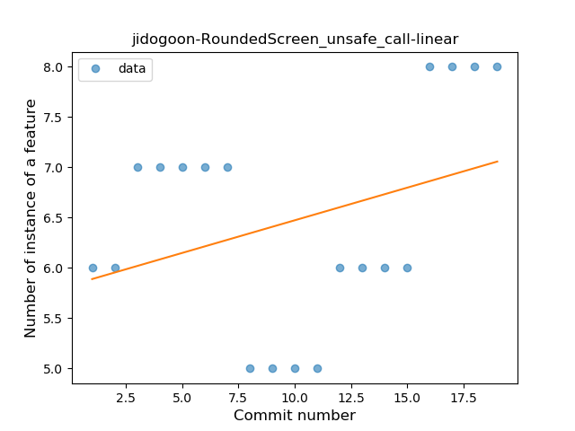
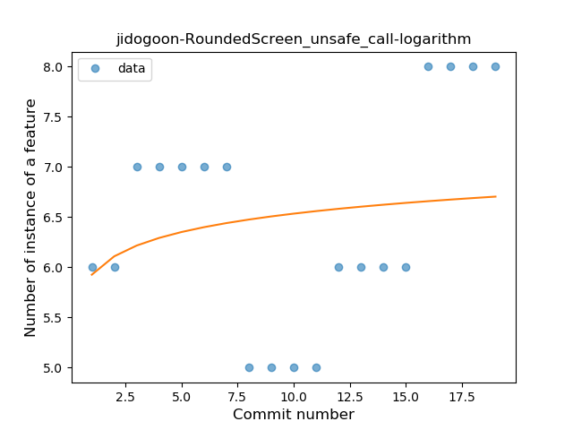

## jidogoon-RoundedScreen
----
#### Metrics provided by Detekt
* Number of lines of code 600
* Number of Kotlin files: 9
* Cyclomatic complexity: 76
* Cyclomatic complexity by thousands of lines: 214 

----
**3** features analyzed

*	<a href="#type_inference">Type Inference</a> 
*	<a href="#safe_call">Safe Call</a> 
*	<a href="#unsafe_call">Unsafe Call</a> 

### <a name="type_inference">Type Inference</a>
----
#### Functions
* **Sudden Rise Plateau - Logarithm:** 
    * **R_Squared:** 0.84025426
* **Constant Rise - Linear:** 
    * **R_Squared:** 0.80064618

**Plots** :chart_with_upwards_trend:
-----

### <a name="safe_call">Safe Call</a>
----
#### Functions
* **Sudden Rise Plateau - Logarithm:** 
    * **R_Squared:** 0.4650082
* **Constant Rise - Linear:** 
    * **R_Squared:** 0.23229489

**Plots** :chart_with_upwards_trend:
-----

### <a name="unsafe_call">Unsafe Call</a>
----
#### Functions
* **Instability - Polinomial 4:** 
    * **R_Squared:** 0.8105442
* **Instability - Polinomial 3:** )
    * **R_Squared:** 0.58902961
* **Sudden Rise - Exponential:** 
    * **R_Squared:** 0.40139101
* **Constant Rise - Linear:** 
    * **R_Squared:** 0.11582064
* **Sudden Rise Plateau - Logarithm:** 
    * **R_Squared:** 0.03952247

**Plots** :chart_with_upwards_trend:
-----

