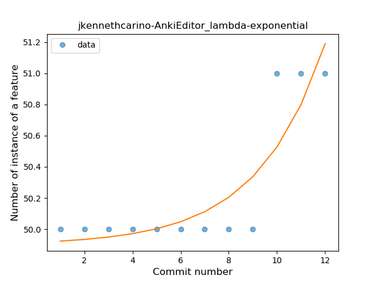
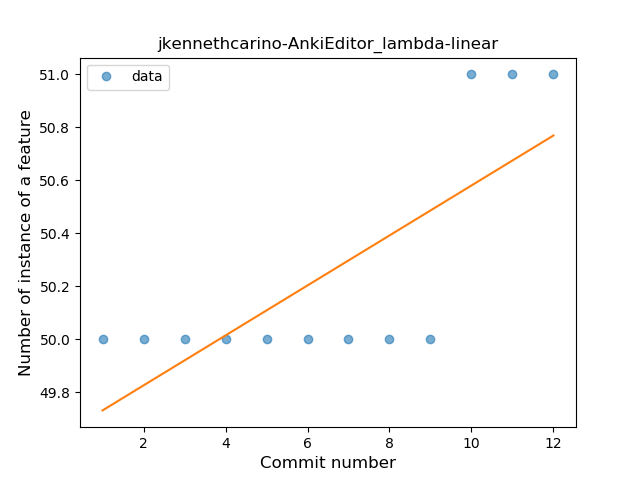
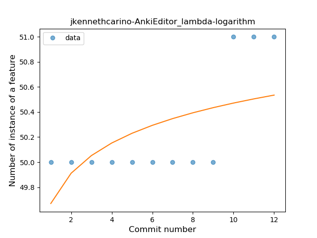
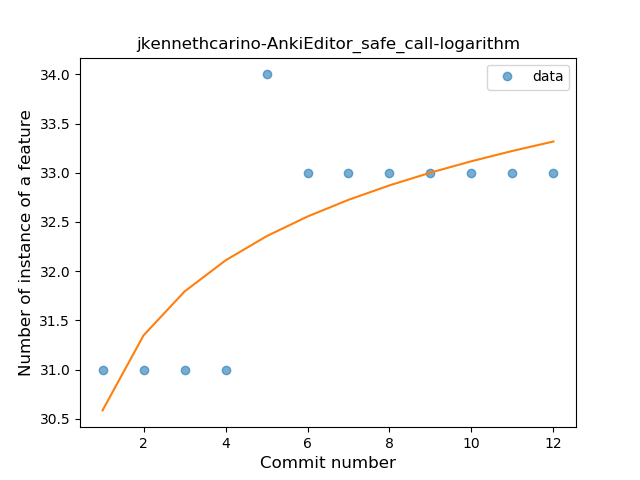
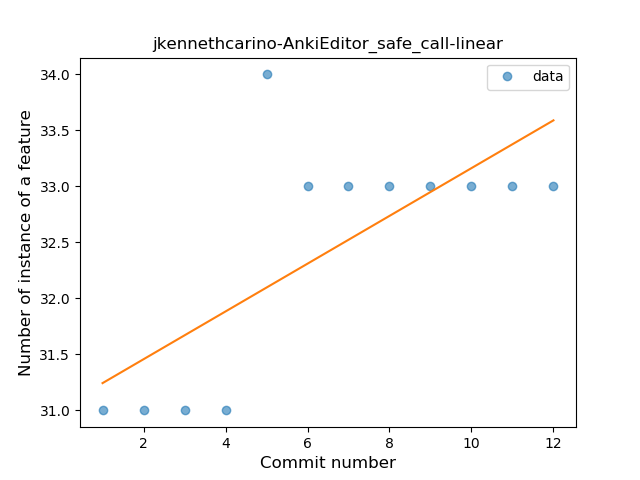
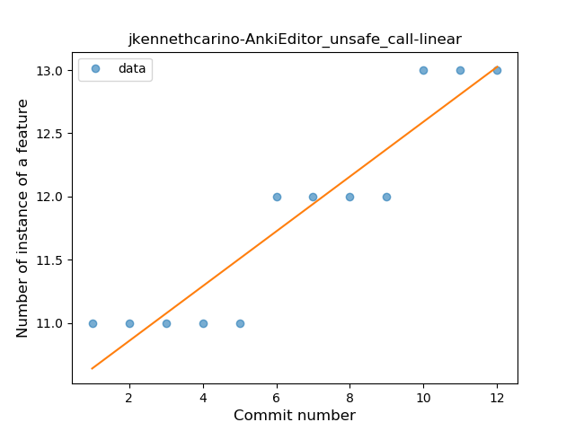
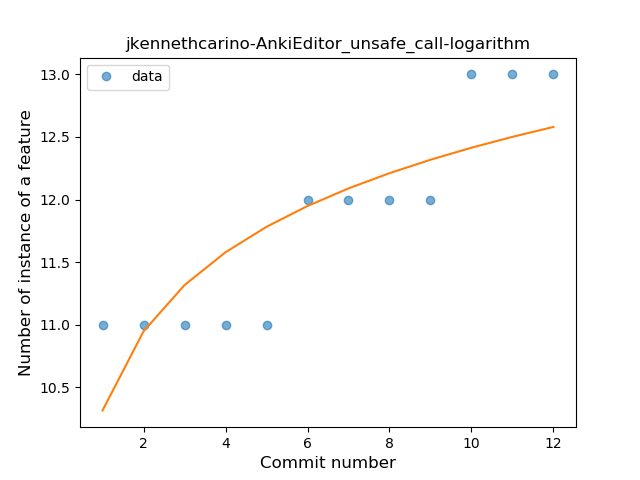

## jkennethcarino-AnkiEditor
----
#### Metrics provided by Detekt
* Number of lines of code 1510
* Number of Kotlin files: 20
* Cyclomatic complexity: 182
* Cyclomatic complexity by thousands of lines: 307 

----
**3** features analyzed

*	<a href="#lambda">Lambda</a> 
*	<a href="#safe_call">Safe Call</a> 
*	<a href="#unsafe_call">Unsafe Call</a> 

### <a name="lambda">Lambda</a>
----
#### Functions
* **Instability - Polinomial 4:** 
    * **R_Squared:** 0.85664336
* **Sudden Rise - Exponential:** 
    * **R_Squared:** 0.78495757
* **Constant Rise - Linear:** 
    * **R_Squared:** 0.56643357
* **Sudden Rise Plateau - Logarithm:** 
    * **R_Squared:** 0.3387624

**Plots** :chart_with_upwards_trend:
-----

### <a name="safe_call">Safe Call</a>
----
#### Functions
* **Instability - Polinomial 4:** 
    * **R_Squared:** 0.74686819
* **Sudden Rise Plateau - Logarithm:** 
    * **R_Squared:** 0.58867585
* **Constant Rise - Linear:** 
    * **R_Squared:** 0.50363185

**Plots** :chart_with_upwards_trend:
-----

### <a name="unsafe_call">Unsafe Call</a>
----
#### Functions
* **Sudden Rise - Exponential:** 
    * **R_Squared:** 0.89590257
* **Constant Rise - Linear:** 
    * **R_Squared:** 0.87655822
* **Sudden Rise Plateau - Logarithm:** 
    * **R_Squared:** 0.68126707

**Plots** :chart_with_upwards_trend:
-----

