## joan-domingo-Podcasts-RAC1-Android
----
#### Metrics provided by Detekt
* Number of lines of code 5912
* Number of Kotlin files: 83
* Cyclomatic complexity: 757
* Cyclomatic complexity by thousands of lines: 228 

----
**12** features analyzed

*	<a href="#type_inference">Type Inference</a> 
*	<a href="#lambda">Lambda</a> 
*	<a href="#safe_call">Safe Call</a> 
*	<a href="#when_expr">When expression</a> 
*	<a href="#companion_object">Companion Object</a> 
*	<a href="#unsafe_call">Unsafe Call</a> 
*	<a href="#string_template">String Template</a> 
*	<a href="#func_with_default_value">Function with Default Value</a> 
*	<a href="#singleton">Singleton</a> 
*	<a href="#smart_cast">Smart Cast</a> 
*	<a href="#data_class">Data Class</a> 
*	<a href="#property_delegation">Property Delegation</a> 

### <a name="type_inference">Type Inference</a>
----
#### Functions
* **Sudden Rise Plateau - Logarithm:** 
    * **R_Squared:** 0.7529809
* **Constant Rise - Linear:** 
    * **R_Squared:** 0.70402472

**Plots** :chart_with_upwards_trend:
-----

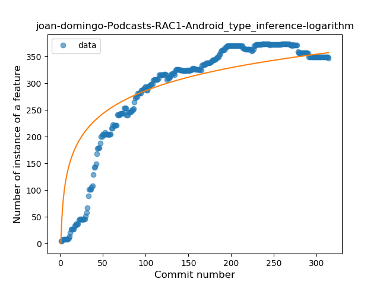
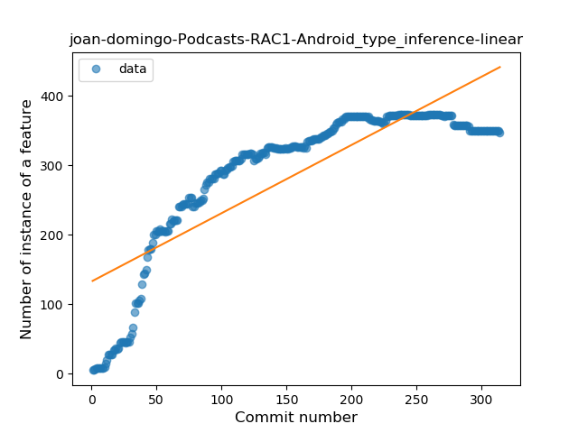
### <a name="lambda">Lambda</a>
----
#### Functions
* **Constant Rise - Linear:** 
    * **R_Squared:** 0.85123819
* **Plateau Gradual Rise - Sigmoid:** 
    * **R_Squared:** 0.7490908
* **Sudden Rise Plateau - Logarithm:** 
    * **R_Squared:** 0.67112965

**Plots** :chart_with_upwards_trend:
-----

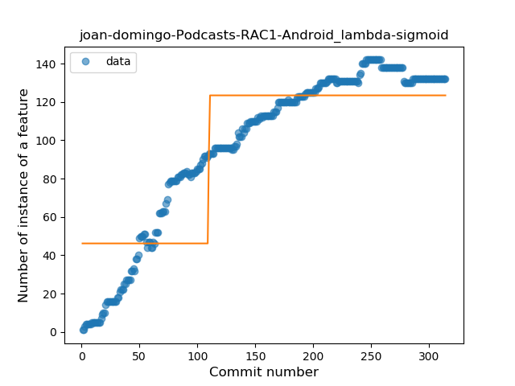

### <a name="safe_call">Safe Call</a>
----
#### Functions
* **Constant Rise - Linear:** 
    * **R_Squared:** 0.91981851
* **Plateau Sudden Rise - Binary Sigmoid:** 
    * **R_Squared:** 0.72092507
* **Sudden Rise Plateau - Logarithm:** 
    * **R_Squared:** 0.58031105

**Plots** :chart_with_upwards_trend:
-----

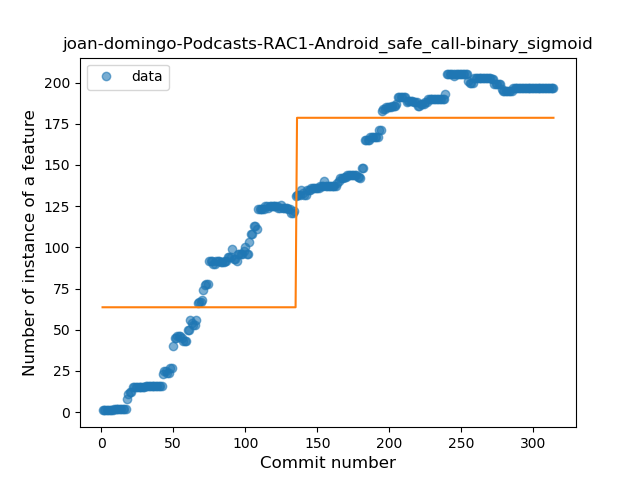
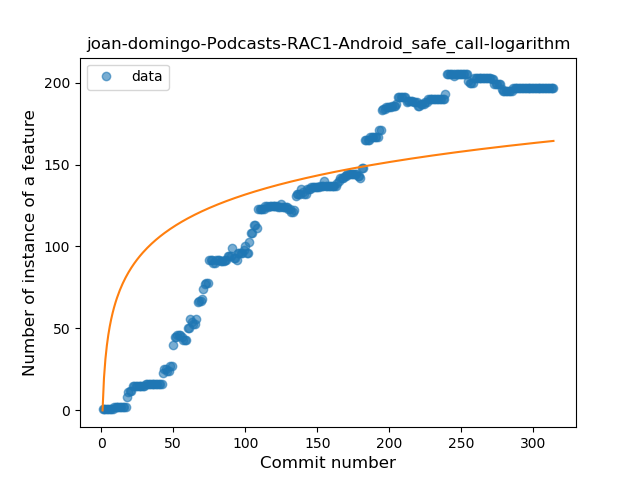
### <a name="when_expr">When expression</a>
----
#### Functions
* **Plateau Gradual Rise - Sigmoid:** 
    * **R_Squared:** 0.98657278
* **Constant Rise - Linear:** 
    * **R_Squared:** 0.85857584
* **Sudden Rise Plateau - Logarithm:** 
    * **R_Squared:** 0.7338772

**Plots** :chart_with_upwards_trend:
-----

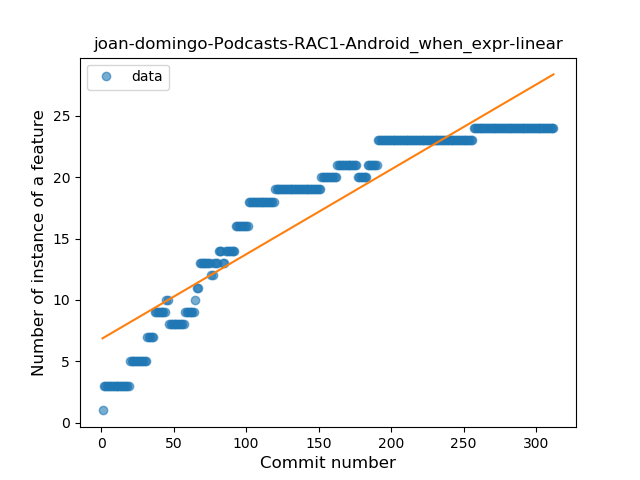
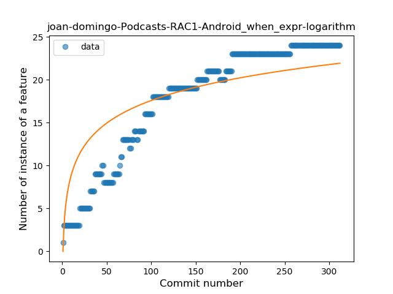
### <a name="companion_object">Companion Object</a>
----
#### Functions
* **Constant Rise - Linear:** 
    * **R_Squared:** 0.75941829
* **Sudden Rise Plateau - Logarithm:** 
    * **R_Squared:** 0.75640752

**Plots** :chart_with_upwards_trend:
-----

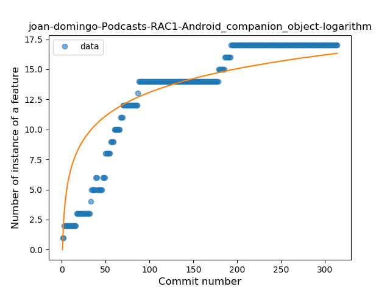
### <a name="unsafe_call">Unsafe Call</a>
----
#### Functions
* **Sudden Rise Plateau - Logarithm:** 
    * **R_Squared:** 0.48493864
* **Plateau Sudden Rise - Binary Sigmoid:** 
    * **R_Squared:** 0.35847327
* **Constant Rise - Linear:** 
    * **R_Squared:** 0.28049672

**Plots** :chart_with_upwards_trend:
-----

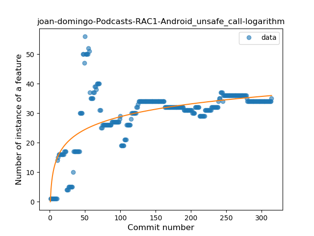
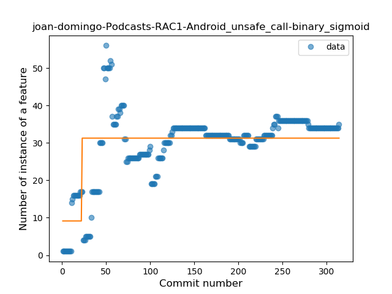
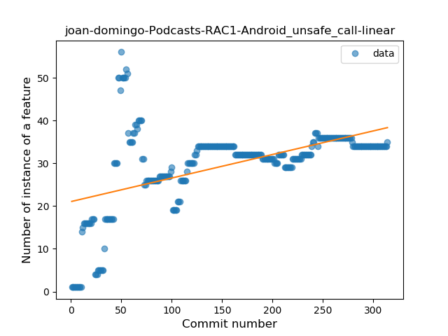
### <a name="string_template">String Template</a>
----
#### Functions
* **Plateau Gradual Rise - Sigmoid:** 
    * **R_Squared:** 0.96752369
* **Sudden Rise - Exponential:** 
    * **R_Squared:** 0.90157291
* **Constant Rise - Linear:** 
    * **R_Squared:** 0.61702718
* **Sudden Rise Plateau - Logarithm:** 
    * **R_Squared:** 0.17107641

**Plots** :chart_with_upwards_trend:
-----

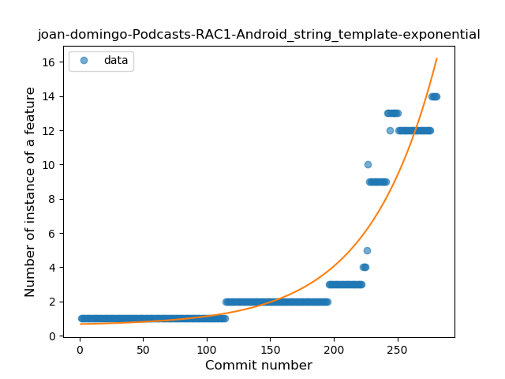
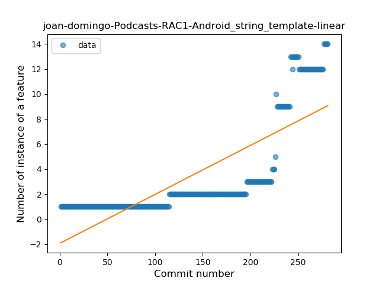
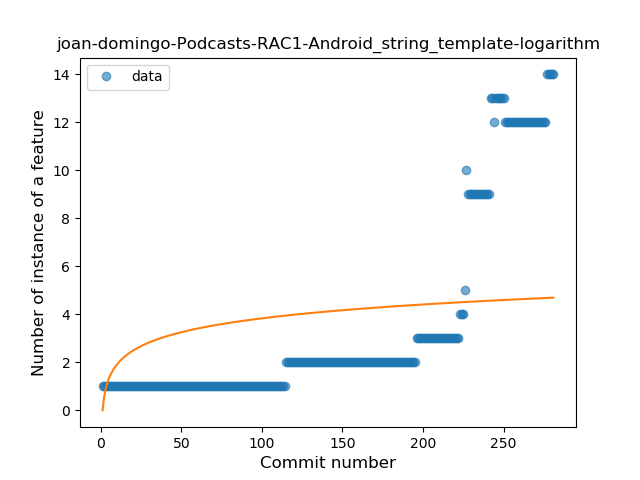
### <a name="func_with_default_value">Function with Default Value</a>
----
#### Functions
* **Plateau Gradual Rise - Sigmoid:** 
    * **R_Squared:** 0.97202283
* **Sudden Rise - Exponential:** 
    * **R_Squared:** 0.80373234
* **Constant Rise - Linear:** 
    * **R_Squared:** 0.64089125
* **Sudden Rise Plateau - Logarithm:** 
    * **R_Squared:** 0.23538439

**Plots** :chart_with_upwards_trend:
-----

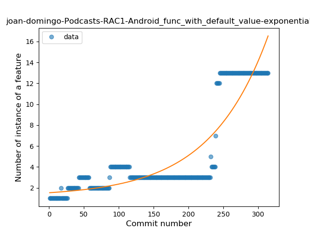
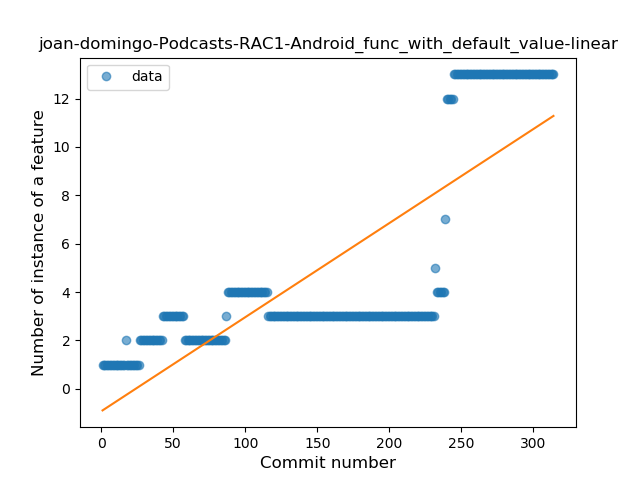
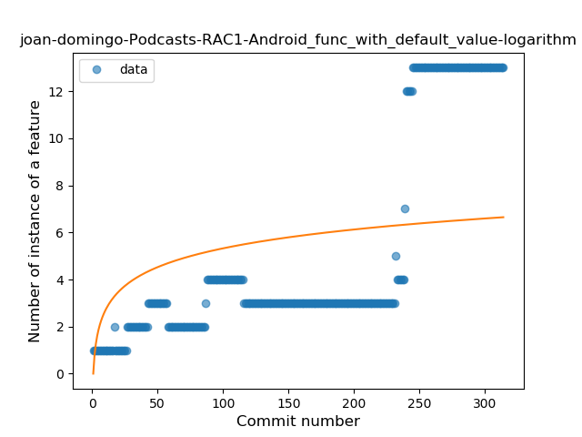
### <a name="singleton">Singleton</a>
----
#### Functions
* **Plateau Sudden Decline - Binary Sigmoid:** 
    * **R_Squared:** 1.0
* **Sudden Decline - Exponential:** 
    * **R_Squared:** 0.80772082
* **Constant Decline - Linear:** 
    * **R_Squared:** 0.12696078
* **Sudden Rise Plateau - Logarithm:** 
    * **R_Squared:** 0.0

**Plots** :chart_with_upwards_trend:
-----

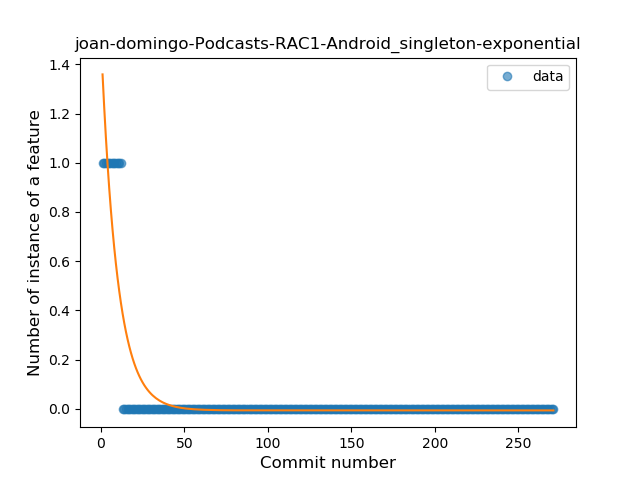
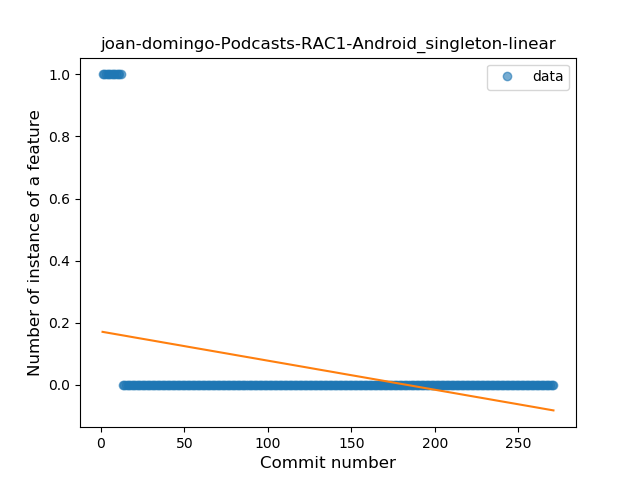
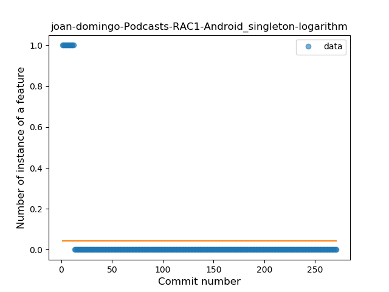
### <a name="smart_cast">Smart Cast</a>
----
#### Functions
* **Plateau Gradual Rise - Sigmoid:** 
    * **R_Squared:** 0.84095574
* **Constant Rise - Linear:** 
    * **R_Squared:** 0.61287989
* **Sudden Rise Plateau - Logarithm:** 
    * **R_Squared:** 0.59610176

**Plots** :chart_with_upwards_trend:
-----

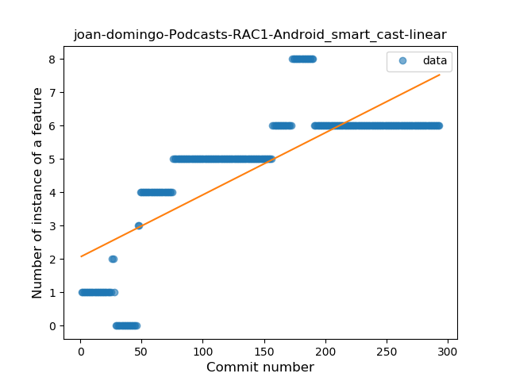
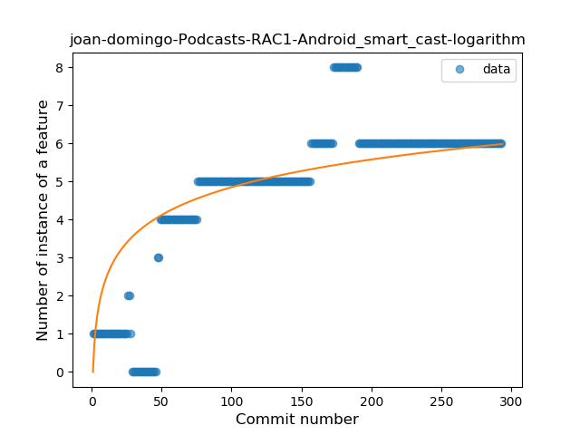
### <a name="data_class">Data Class</a>
----
#### Functions
* **Plateau Gradual Rise - Sigmoid:** 
    * **R_Squared:** 0.88296842
* **Constant Rise - Linear:** 
    * **R_Squared:** 0.75258051
* **Sudden Rise Plateau - Logarithm:** 
    * **R_Squared:** 0.42512725

**Plots** :chart_with_upwards_trend:
-----

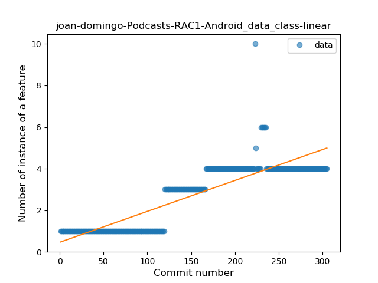
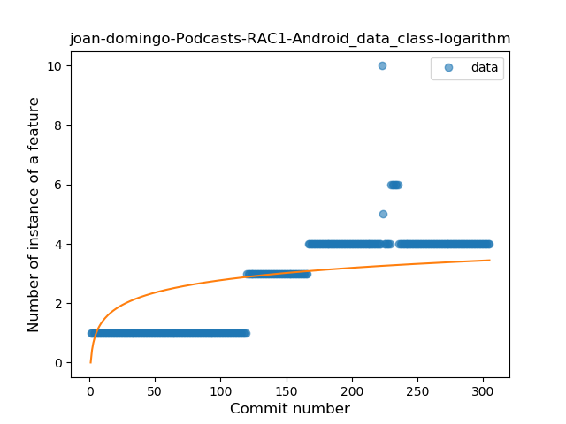
### <a name="property_delegation">Property Delegation</a>
----
#### Functions
* **Sudden Rise Plateau - Logarithm:** 
    * **R_Squared:** 0.60073696
* **Constant Rise - Linear:** 
    * **R_Squared:** 0.43304007

**Plots** :chart_with_upwards_trend:
-----

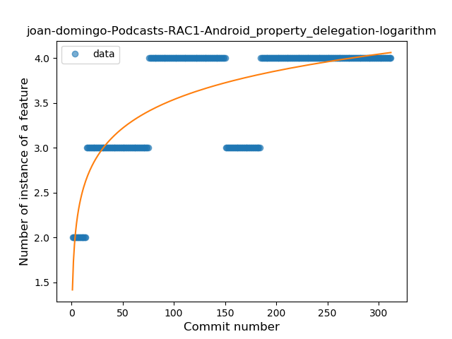
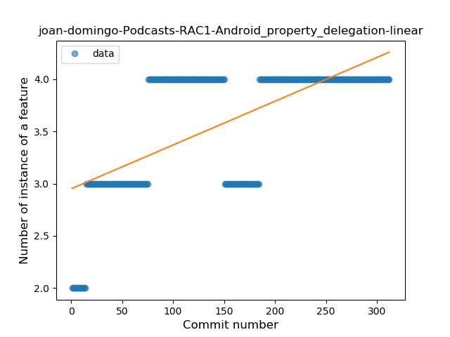
