## joaomneto-TitanCompanion
----
#### Metrics provided by Detekt
* Number of lines of code 11710
* Number of Kotlin files: 208
* Cyclomatic complexity: 1076
* Cyclomatic complexity by thousands of lines: 172 

----
**12** features analyzed

*	<a href="#type_inference">Type Inference</a> 
*	<a href="#lambda">Lambda</a> 
*	<a href="#safe_call">Safe Call</a> 
*	<a href="#when_expr">When expression</a> 
*	<a href="#companion_object">Companion Object</a> 
*	<a href="#unsafe_call">Unsafe Call</a> 
*	<a href="#string_template">String Template</a> 
*	<a href="#func_with_default_value">Function with Default Value</a> 
*	<a href="#singleton">Singleton</a> 
*	<a href="#range_expr">Range Expression</a> 
*	<a href="#func_call_with_named_arg">Function call with Named Argument</a> 
*	<a href="#inline_func">Inline Function</a> 

### <a name="type_inference">Type Inference</a>
----
#### Functions
* **Instability - Polinomial 3:** )
    * **R_Squared:** 0.89126611
* **Sudden Rise - Exponential:** 
    * **R_Squared:** 0.862608
* **Constant Rise - Linear:** 
    * **R_Squared:** 0.5873544
* **Plateau Sudden Rise - Binary Sigmoid:** 
    * **R_Squared:** 0.19713115
* **Sudden Rise Plateau - Logarithm:** 
    * **R_Squared:** 0.13194

**Plots** :chart_with_upwards_trend:
-----

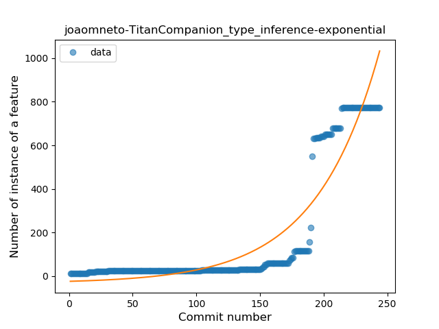
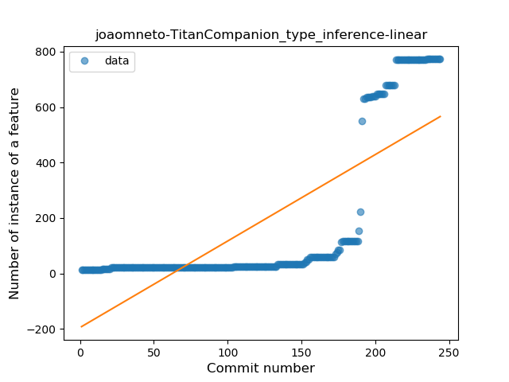
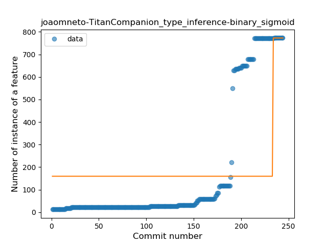
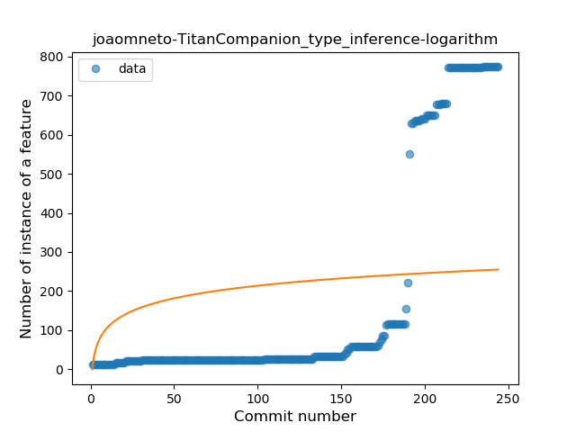
### <a name="lambda">Lambda</a>
----
#### Functions
* **Sudden Rise - Exponential:** 
    * **R_Squared:** 0.92347839
* **Constant Rise - Linear:** 
    * **R_Squared:** 0.66775535
* **Sudden Rise Plateau - Logarithm:** 
    * **R_Squared:** 0.20006696

**Plots** :chart_with_upwards_trend:
-----

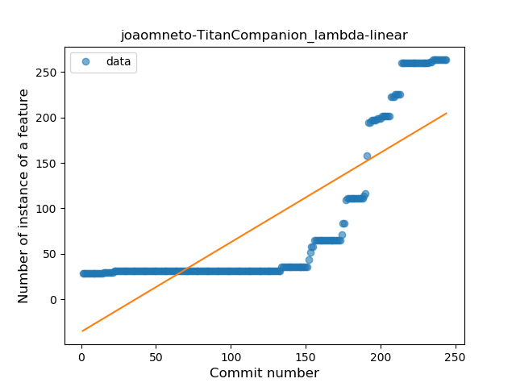
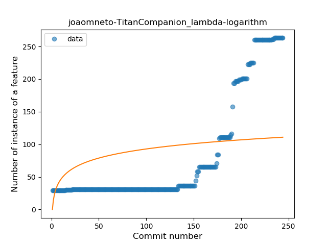
### <a name="safe_call">Safe Call</a>
----
#### Functions
* **Plateau Gradual Rise - Sigmoid:** 
    * **R_Squared:** 0.98455753
* **Sudden Rise - Exponential:** 
    * **R_Squared:** 0.85978902
* **Constant Rise - Linear:** 
    * **R_Squared:** 0.63545098
* **Sudden Rise Plateau - Logarithm:** 
    * **R_Squared:** 0.15694257

**Plots** :chart_with_upwards_trend:
-----

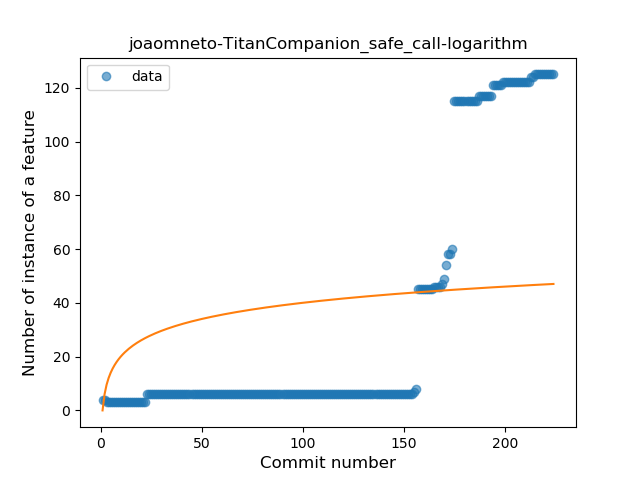
### <a name="when_expr">When expression</a>
----
#### Functions
* **Plateau Gradual Rise - Sigmoid:** 
    * **R_Squared:** 0.9733938
* **Instability - Polinomial 3:** )
    * **R_Squared:** 0.90873868
* **Constant Rise - Linear:** 
    * **R_Squared:** 0.82080281
* **Sudden Rise Plateau - Logarithm:** 
    * **R_Squared:** 0.46559862

**Plots** :chart_with_upwards_trend:
-----

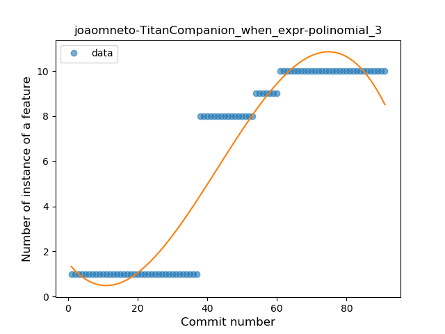
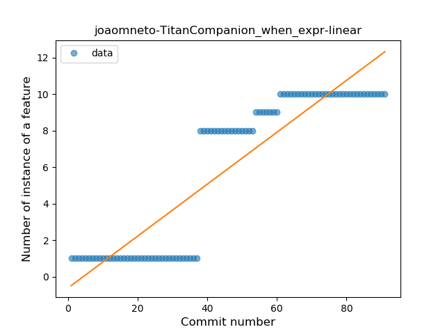
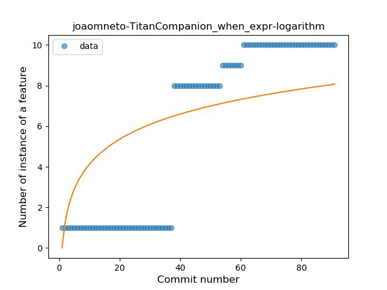
### <a name="companion_object">Companion Object</a>
----
#### Functions
* **Sudden Rise - Exponential:** 
    * **R_Squared:** 0.86365934
* **Constant Rise - Linear:** 
    * **R_Squared:** 0.61681483
* **Sudden Rise Plateau - Logarithm:** 
    * **R_Squared:** 0.1559949

**Plots** :chart_with_upwards_trend:
-----

### <a name="unsafe_call">Unsafe Call</a>
----
#### Functions
* **Instability - Polinomial 3:** )
    * **R_Squared:** 0.91730462
* **Sudden Rise - Exponential:** 
    * **R_Squared:** 0.88717637
* **Constant Rise - Linear:** 
    * **R_Squared:** 0.56431668
* **Sudden Rise Plateau - Logarithm:** 
    * **R_Squared:** 0.13765241
* **Plateau Sudden Rise - Binary Sigmoid:** 
    * **R_Squared:** 0.06569043

**Plots** :chart_with_upwards_trend:
-----

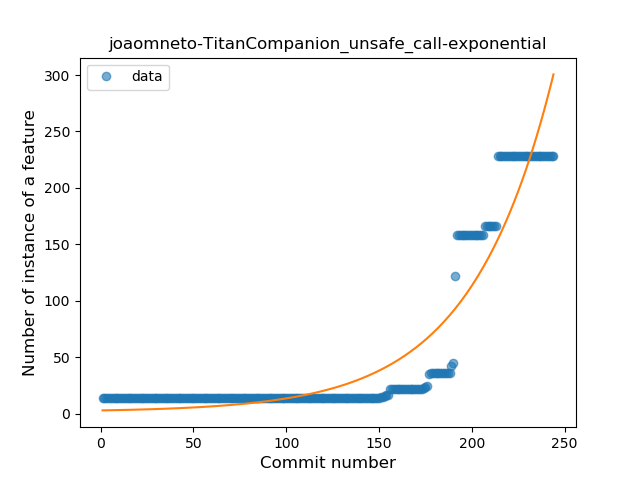
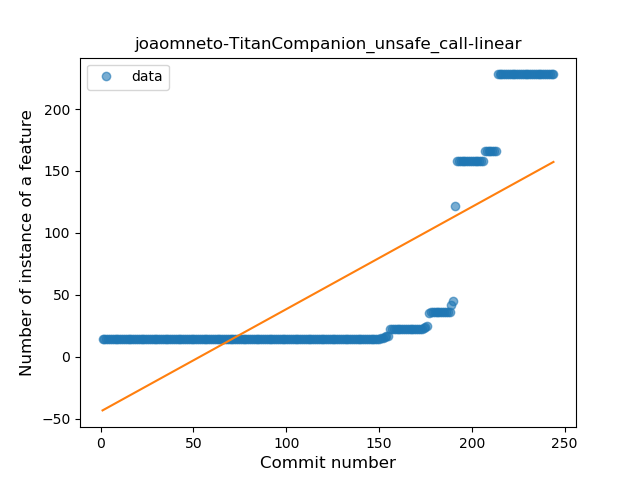
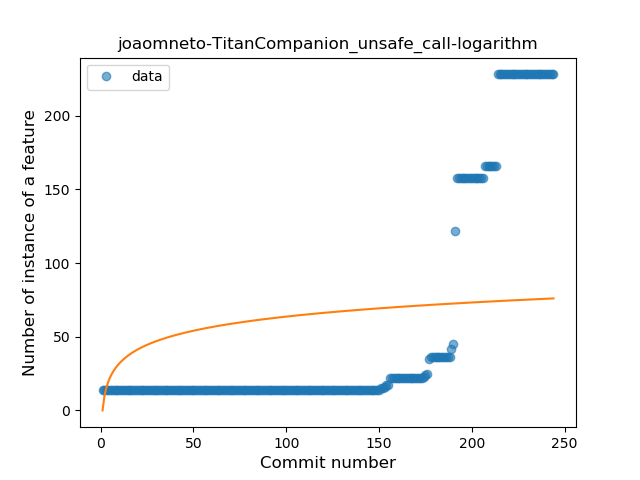
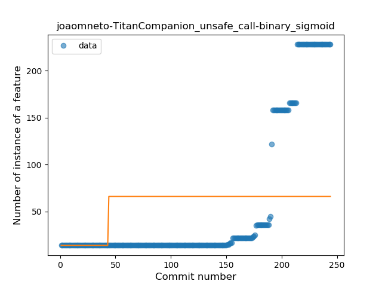
### <a name="string_template">String Template</a>
----
#### Functions
* **Constant Rise - Linear:** 
    * **R_Squared:** 0.93140541
* **Sudden Rise Plateau - Logarithm:** 
    * **R_Squared:** 0.58559961
* **Plateau Sudden Rise - Binary Sigmoid:** 
    * **R_Squared:** 0.13025285

**Plots** :chart_with_upwards_trend:
-----

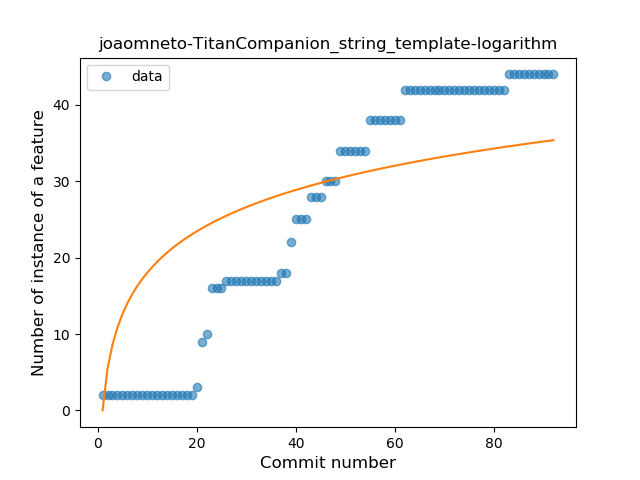
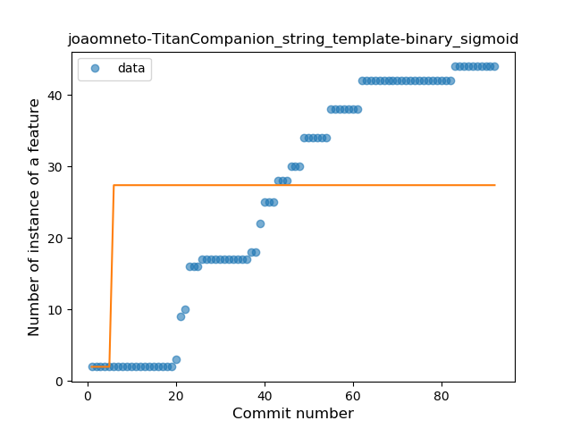
### <a name="func_with_default_value">Function with Default Value</a>
----
#### Functions
* **Plateau Gradual Rise - Sigmoid:** 
    * **R_Squared:** 0.91253196
* **Sudden Rise Plateau - Logarithm:** 
    * **R_Squared:** 0.84708438
* **Constant Rise - Linear:** 
    * **R_Squared:** 0.77663532

**Plots** :chart_with_upwards_trend:
-----

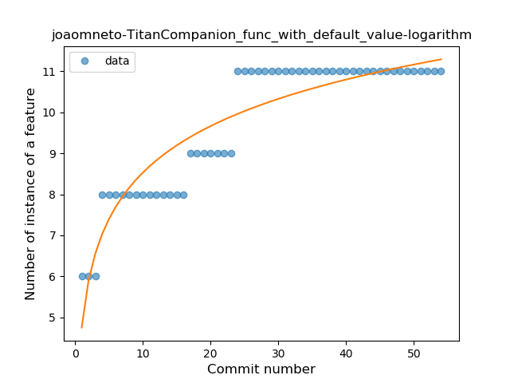
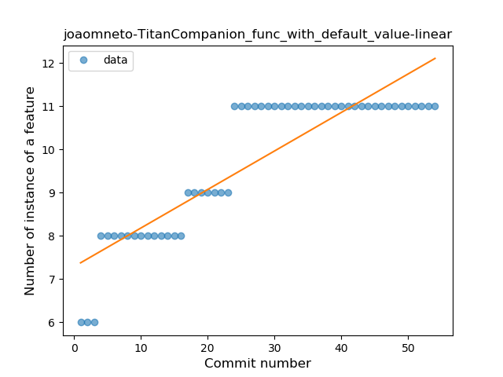
### <a name="singleton">Singleton</a>
----
#### Functions
* **Plateau Sudden Rise - Binary Sigmoid:** 
    * **R_Squared:** 1.0
* **Sudden Rise - Exponential:** 
    * **R_Squared:** 0.79193044
* **Constant Rise - Linear:** 
    * **R_Squared:** 0.33272865
* **Sudden Rise Plateau - Logarithm:** 
    * **R_Squared:** 0.13436776

**Plots** :chart_with_upwards_trend:
-----

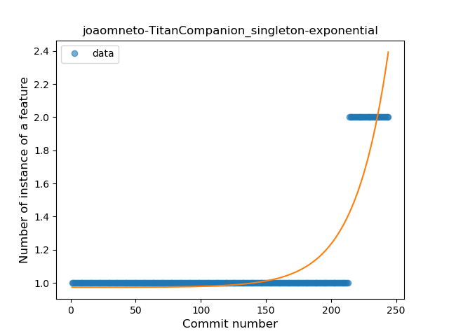
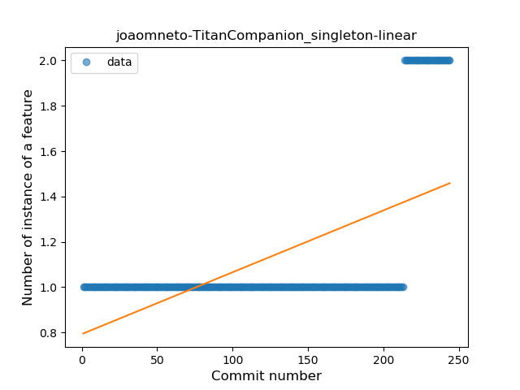
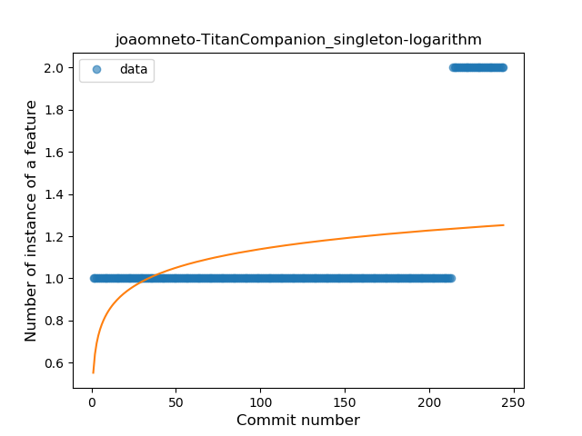
### <a name="range_expr">Range Expression</a>
----
#### Functions
* **Constant Decline - Linear:** 
    * **R_Squared:** 0.05357143
* **Sudden Rise Plateau - Logarithm:** 
    * **R_Squared:** -0.0

**Plots** :chart_with_upwards_trend:
-----

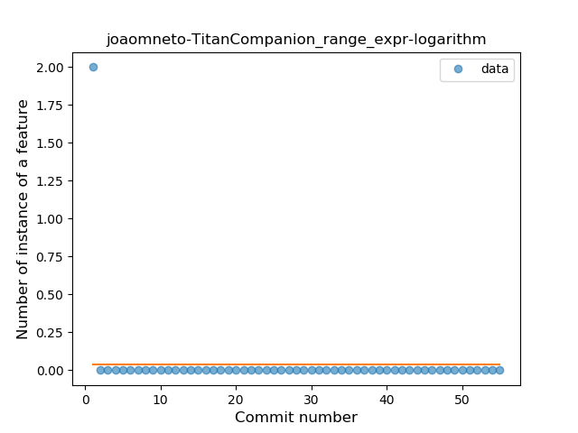
### <a name="func_call_with_named_arg">Function call with Named Argument</a>
----
#### Functions
* **Plateau Gradual Rise - Sigmoid:** 
    * **R_Squared:** 0.96906445
* **Instability - Polinomial 3:** )
    * **R_Squared:** 0.90634748
* **Constant Rise - Linear:** 
    * **R_Squared:** 0.79385689
* **Sudden Rise Plateau - Logarithm:** 
    * **R_Squared:** 0.62600874

**Plots** :chart_with_upwards_trend:
-----

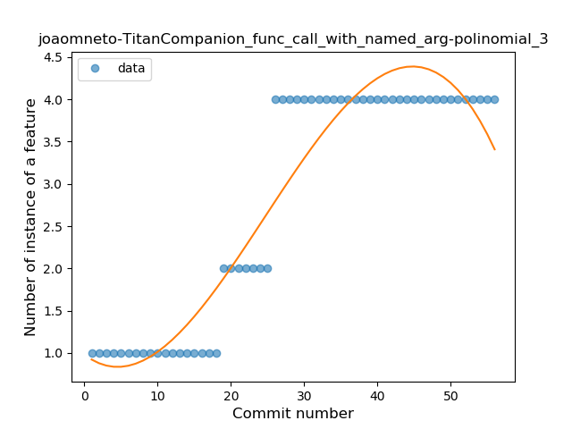
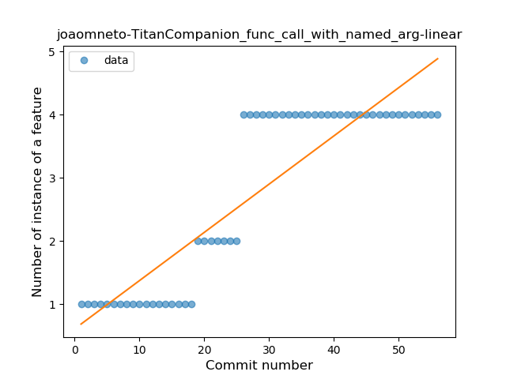
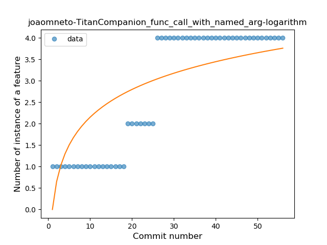
### <a name="inline_func">Inline Function</a>
----
#### Functions
* **Plateau Sudden Rise - Binary Sigmoid:** 
    * **R_Squared:** 1.0
* **Sudden Rise Plateau - Logarithm:** 
    * **R_Squared:** 0.68019936
* **Constant Rise - Linear:** 
    * **R_Squared:** 0.62572899

**Plots** :chart_with_upwards_trend:
-----

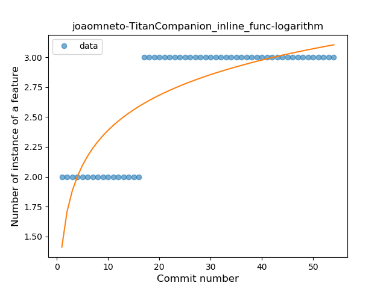
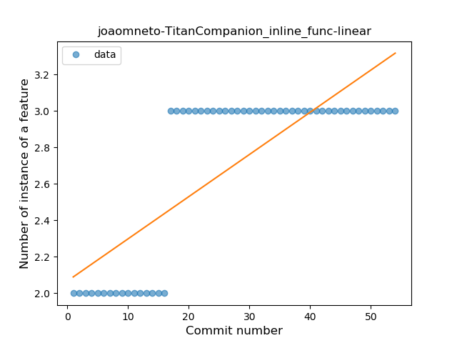
