## johnjohndoe-Umweltzone
----
#### Metrics provided by Detekt
* Number of lines of code 577
* Number of Kotlin files: 13
* Cyclomatic complexity: 53
* Cyclomatic complexity by thousands of lines: 250 

----
**8** features analyzed

*	<a href="#type_inference">Type Inference</a> 
*	<a href="#lambda">Lambda</a> 
*	<a href="#companion_object">Companion Object</a> 
*	<a href="#string_template">String Template</a> 
*	<a href="#singleton">Singleton</a> 
*	<a href="#func_call_with_named_arg">Function call with Named Argument</a> 
*	<a href="#data_class">Data Class</a> 
*	<a href="#extension_function">Extension Function</a> 

### <a name="type_inference">Type Inference</a>
----
#### Functions
* **Instability - Polinomial 3:** )
    * **R_Squared:** 0.8916166
* **Instability - Polinomial 4:** 
    * **R_Squared:** 0.89794289
* **Sudden Rise Plateau - Logarithm:** 
    * **R_Squared:** 0.70583455
* **Constant Rise - Linear:** 
    * **R_Squared:** 0.43464771

**Plots** :chart_with_upwards_trend:
-----

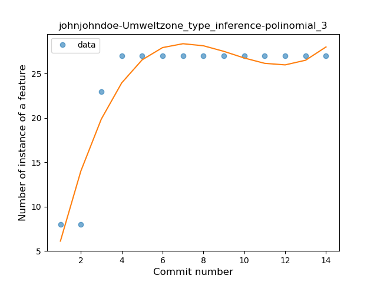

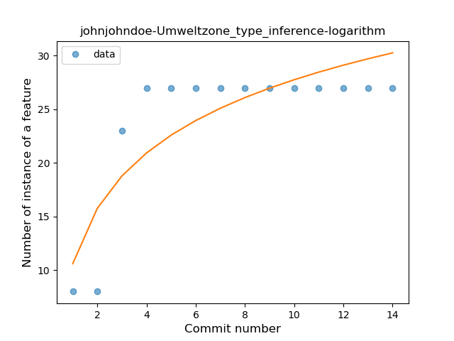
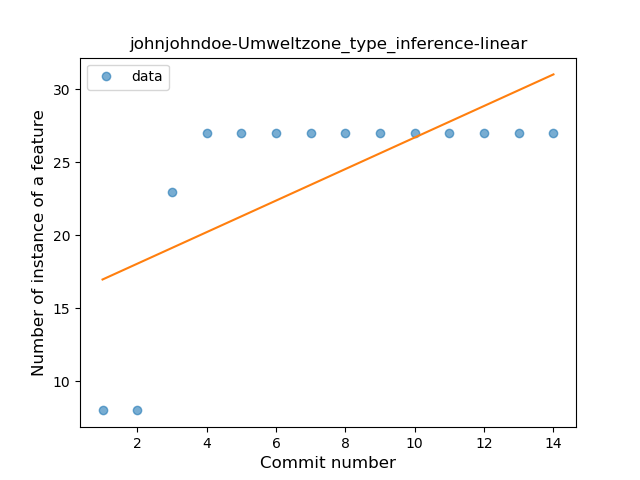
### <a name="lambda">Lambda</a>
----
#### Functions
* **Instability - Polinomial 3:** )
    * **R_Squared:** 0.88945694
* **Instability - Polinomial 4:** 
    * **R_Squared:** 0.89625571
* **Sudden Rise Plateau - Logarithm:** 
    * **R_Squared:** 0.70284477
* **Constant Rise - Linear:** 
    * **R_Squared:** 0.43172915

**Plots** :chart_with_upwards_trend:
-----

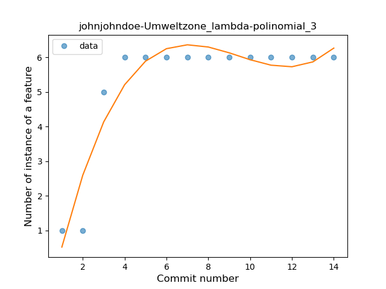
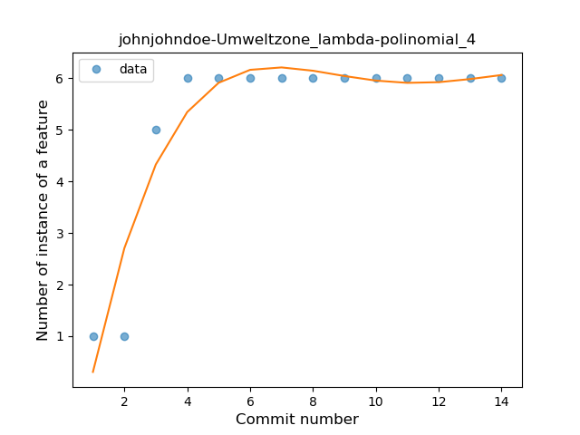
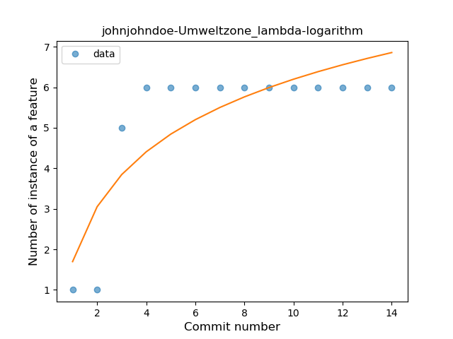
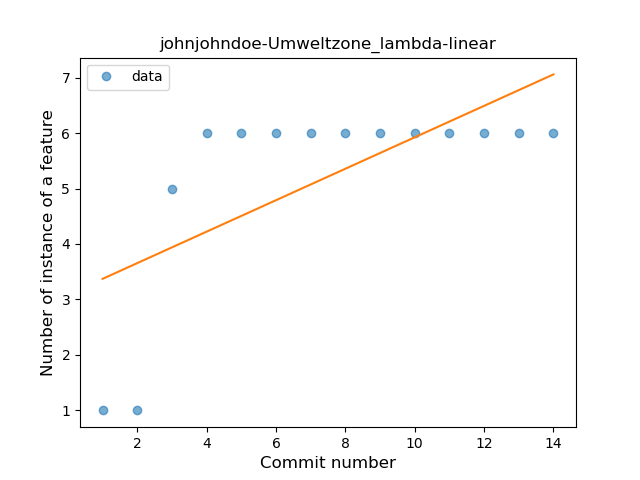
### <a name="companion_object">Companion Object</a>
----
#### Functions
* **Instability - Polinomial 4:** 
    * **R_Squared:** 0.88461538
* **Instability - Polinomial 3:** )
    * **R_Squared:** 0.73626374
* **Sudden Rise Plateau - Logarithm:** 
    * **R_Squared:** 0.48159519
* **Constant Rise - Linear:** 
    * **R_Squared:** 0.23076923

**Plots** :chart_with_upwards_trend:
-----

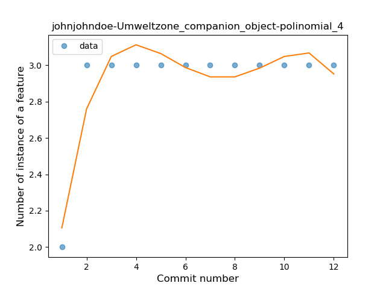
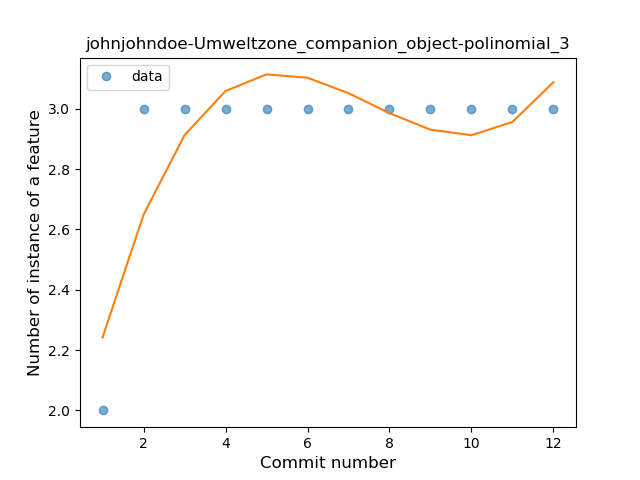
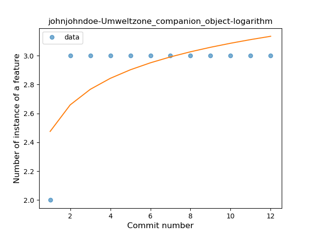
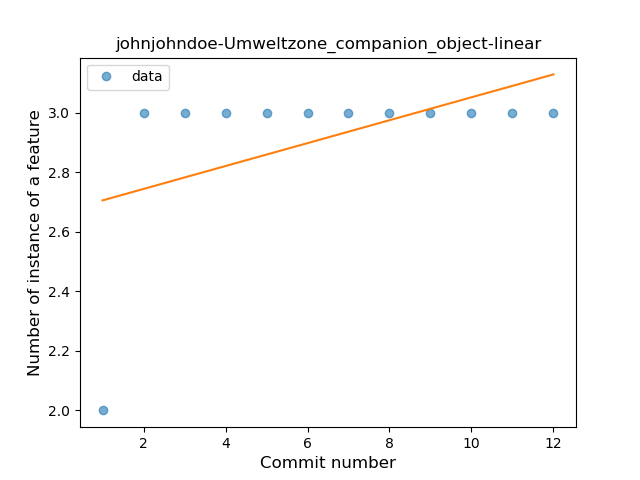
### <a name="string_template">String Template</a>
----
#### Functions
* **Instability - Polinomial 4:** 
    * **R_Squared:** 0.31246027
* **Sudden Decline - Exponential:** 
    * **R_Squared:** 0.19369448
* **Constant Decline - Linear:** 
    * **R_Squared:** 0.15448188
* **Sudden Rise Plateau - Logarithm:** 
    * **R_Squared:** -0.0

**Plots** :chart_with_upwards_trend:
-----

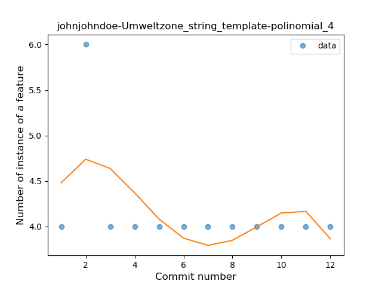
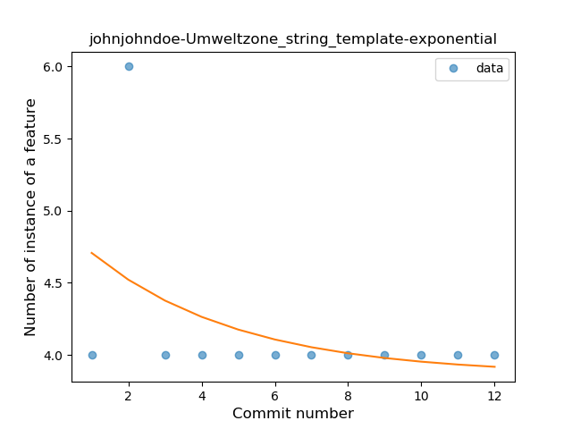
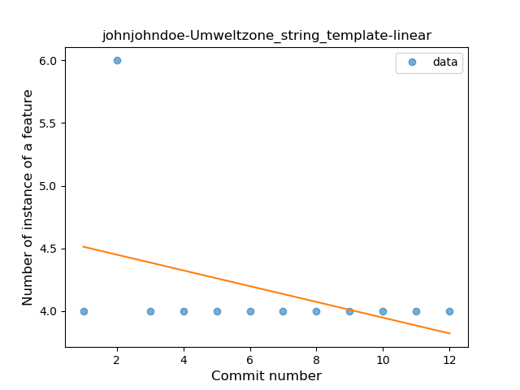
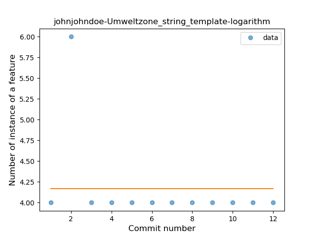
### <a name="singleton">Singleton</a>
----
#### Functions
* **Instability - Polinomial 4:** 
    * **R_Squared:** 0.88461538
* **Instability - Polinomial 3:** )
    * **R_Squared:** 0.73626374
* **Sudden Rise Plateau - Logarithm:** 
    * **R_Squared:** 0.48159519
* **Constant Rise - Linear:** 
    * **R_Squared:** 0.23076923

**Plots** :chart_with_upwards_trend:
-----

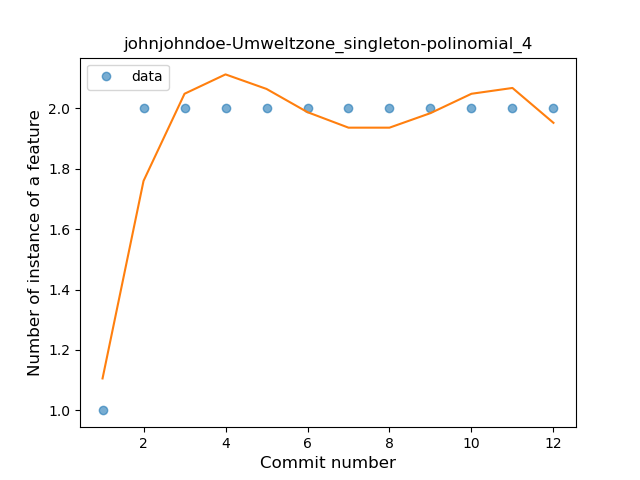
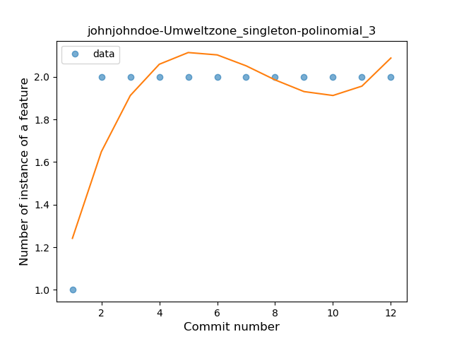
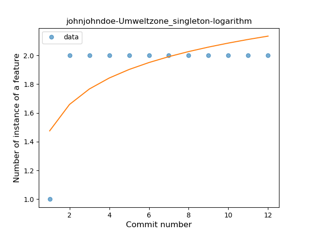
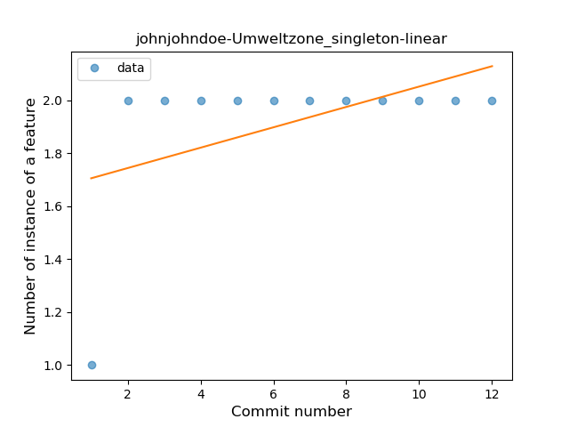
### <a name="func_call_with_named_arg">Function call with Named Argument</a>
----
#### Functions
* **Instability - Polinomial 4:** 
    * **R_Squared:** 0.88461538
* **Instability - Polinomial 3:** )
    * **R_Squared:** 0.73626374
* **Sudden Rise Plateau - Logarithm:** 
    * **R_Squared:** 0.48159519
* **Constant Rise - Linear:** 
    * **R_Squared:** 0.23076923

**Plots** :chart_with_upwards_trend:
-----

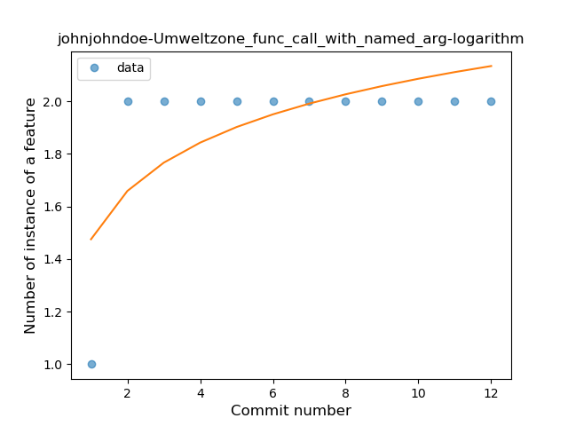
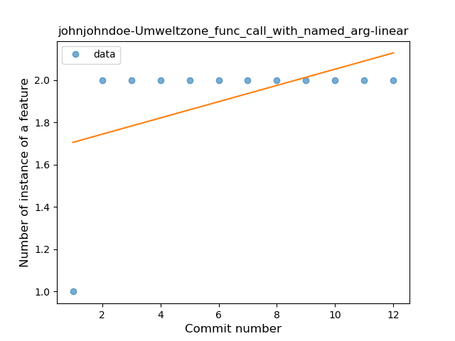
### <a name="data_class">Data Class</a>
----
#### Functions
* **Instability - Polinomial 4:** 
    * **R_Squared:** 0.88461538
* **Instability - Polinomial 3:** )
    * **R_Squared:** 0.73626374
* **Sudden Rise Plateau - Logarithm:** 
    * **R_Squared:** 0.48159519
* **Constant Rise - Linear:** 
    * **R_Squared:** 0.23076923

**Plots** :chart_with_upwards_trend:
-----

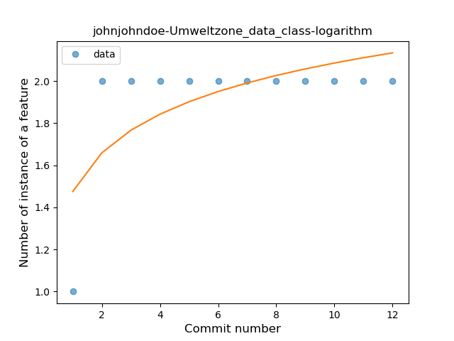

### <a name="extension_function">Extension Function</a>
----
#### Functions
* **Plateau Sudden Rise - Binary Sigmoid:** 
    * **R_Squared:** 1.0
* **Instability - Polinomial 3:** )
    * **R_Squared:** 0.84415584
* **Instability - Polinomial 4:** 
    * **R_Squared:** 0.84685315
* **Sudden Rise Plateau - Logarithm:** 
    * **R_Squared:** 0.6644626
* **Constant Rise - Linear:** 
    * **R_Squared:** 0.41958042

**Plots** :chart_with_upwards_trend:
-----

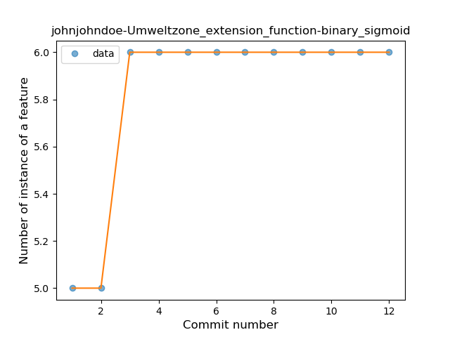

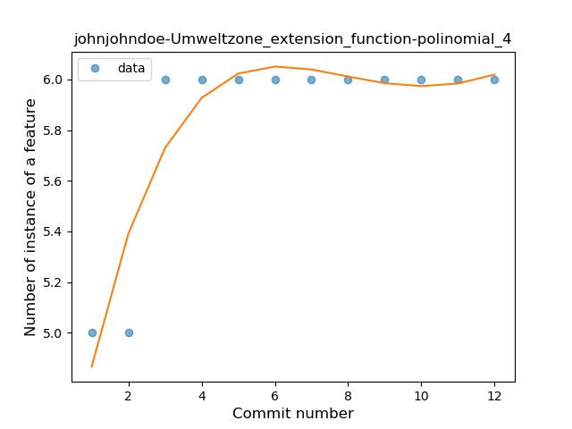
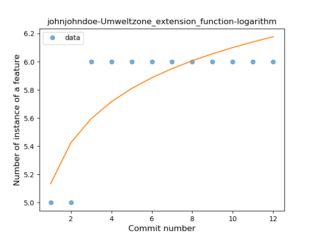
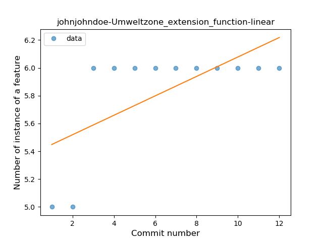
