## johnperry-math-Chinese-Remainder-Clock
----
#### Metrics provided by Detekt
* Number of lines of code 1217
* Number of Kotlin files: 5
* Cyclomatic complexity: 116
* Cyclomatic complexity by thousands of lines: 177 

----
**3** features analyzed

*	<a href="#type_inference">Type Inference</a> 
*	<a href="#when_expr">When expression</a> 
*	<a href="#unsafe_call">Unsafe Call</a> 

### <a name="type_inference">Type Inference</a>
----
#### Functions
* **Instability - Polinomial 4:** 
    * **R_Squared:** 0.98138839
* **Sudden Rise - Exponential:** 
    * **R_Squared:** 0.90900163
* **Constant Rise - Linear:** 
    * **R_Squared:** 0.7823866
* **Sudden Rise Plateau - Logarithm:** 
    * **R_Squared:** 0.62457613

**Plots** :chart_with_upwards_trend:
-----

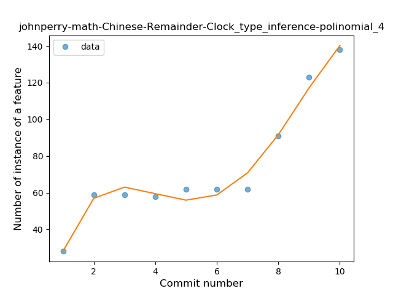
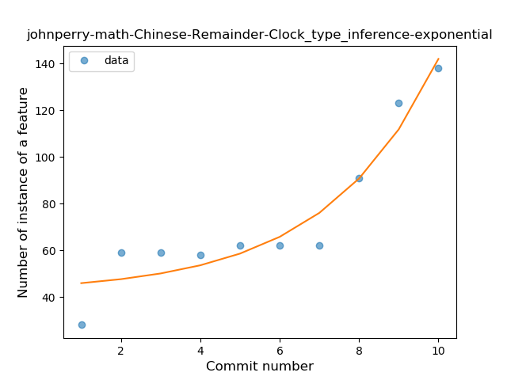
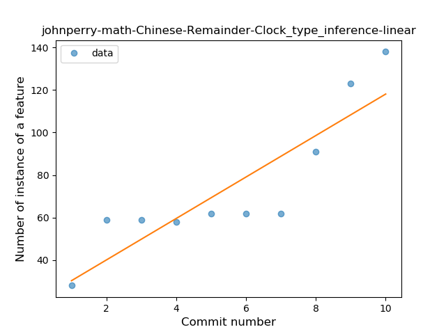

### <a name="when_expr">When expression</a>
----
#### Functions
* **Sudden Rise - Exponential:** 
    * **R_Squared:** 0.9594233
* **Instability - Polinomial 3:** )
    * **R_Squared:** 0.94529
* **Constant Rise - Linear:** 
    * **R_Squared:** 0.54224599
* **Sudden Rise Plateau - Logarithm:** 
    * **R_Squared:** 0.32095597

**Plots** :chart_with_upwards_trend:
-----

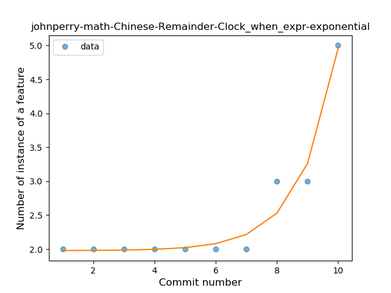
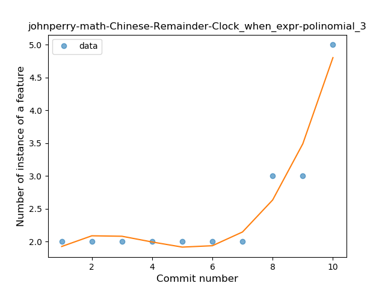
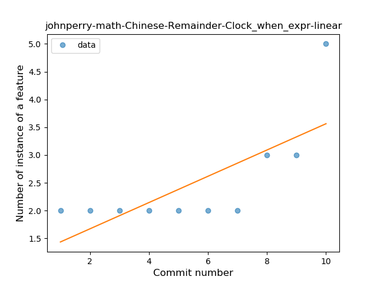
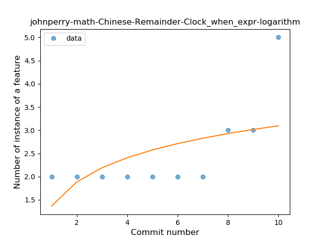
### <a name="unsafe_call">Unsafe Call</a>
----
#### Functions
* **Instability - Polinomial 4:** 
    * **R_Squared:** 0.97557407
* **Instability - Polinomial 3:** )
    * **R_Squared:** 0.61250806
* **Sudden Rise - Exponential:** 
    * **R_Squared:** 0.45299587
* **Constant Rise - Linear:** 
    * **R_Squared:** 0.20653342
* **Sudden Rise Plateau - Logarithm:** 
    * **R_Squared:** 0.13132223

**Plots** :chart_with_upwards_trend:
-----

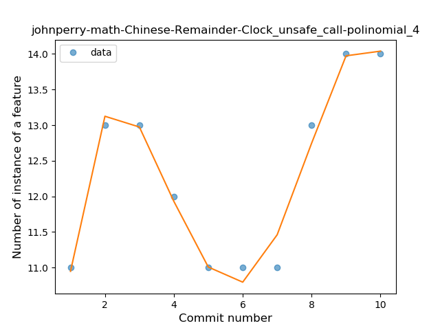
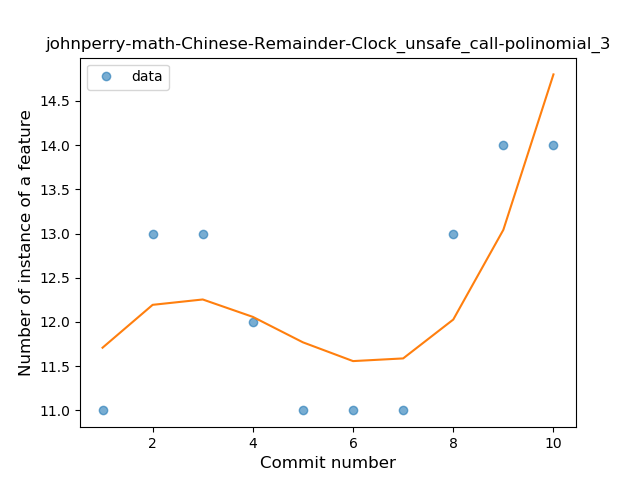
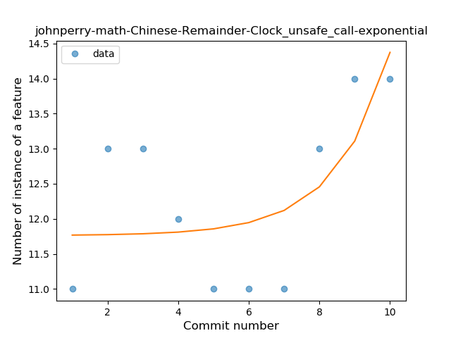
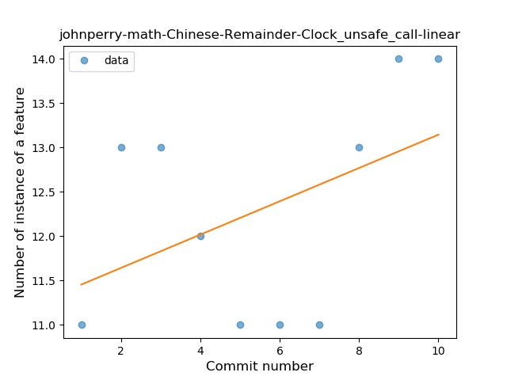
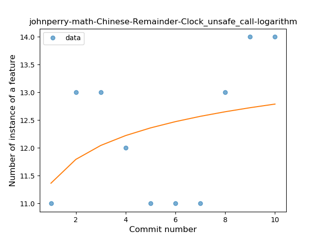
