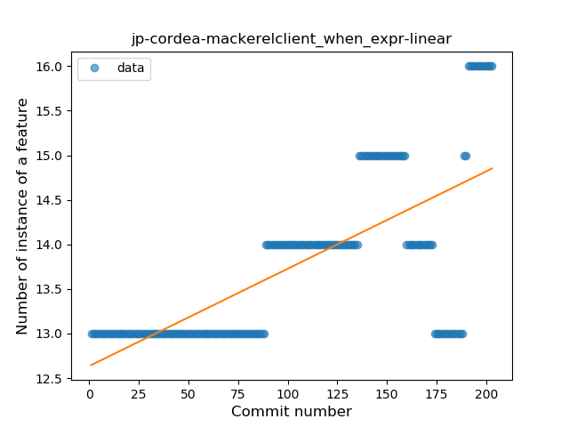
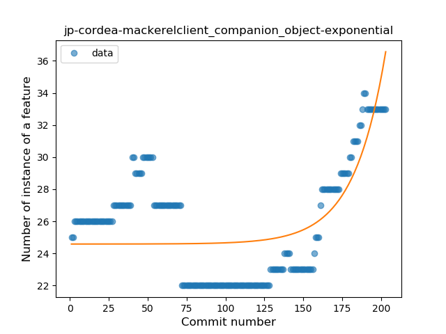
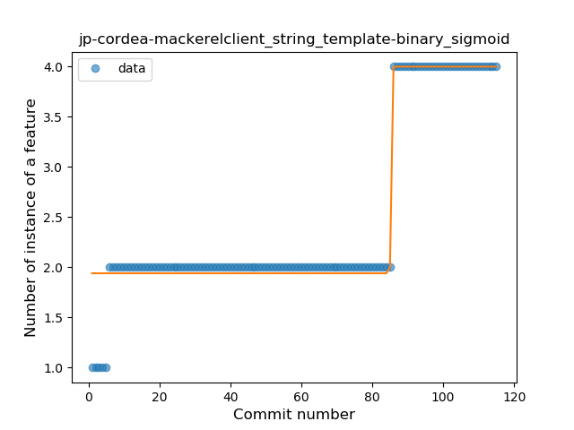
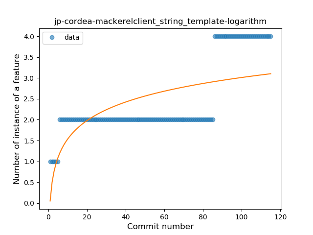
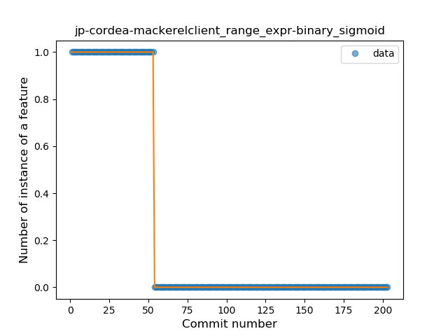

## jp-cordea-mackerelclient
----
#### Metrics provided by Detekt
* Number of lines of code 6747
* Number of Kotlin files: 138
* Cyclomatic complexity: 683
* Cyclomatic complexity by thousands of lines: 186 

----
**16** features analyzed

*	<a href="#type_inference">Type Inference</a> 
*	<a href="#lambda">Lambda</a> 
*	<a href="#safe_call">Safe Call</a> 
*	<a href="#when_expr">When expression</a> 
*	<a href="#unsafe_call">Unsafe Call</a> 
*	<a href="#companion_object">Companion Object</a> 
*	<a href="#string_template">String Template</a> 
*	<a href="#func_with_default_value">Function with Default Value</a> 
*	<a href="#singleton">Singleton</a> 
*	<a href="#range_expr">Range Expression</a> 
*	<a href="#smart_cast">Smart Cast</a> 
*	<a href="#func_call_with_named_arg">Function call with Named Argument</a> 
*	<a href="#extension_function">Extension Function</a> 
*	<a href="#property_delegation">Property Delegation</a> 
*	<a href="#destructuring_declaration">Destructuring Declaration</a> 
*	<a href="#sealed_class">Sealed Class</a> 

### <a name="type_inference">Type Inference</a>
----
#### Functions
* **Constant Rise - Linear:** 
    * **R_Squared:** 0.72157219
* **Sudden Rise Plateau - Logarithm:** 
    * **R_Squared:** 0.72019041

**Plots** :chart_with_upwards_trend:
-----

### <a name="lambda">Lambda</a>
----
#### Functions
* **Sudden Rise - Exponential:** 
    * **R_Squared:** 0.82268881
* **Constant Rise - Linear:** 
    * **R_Squared:** 0.77512825
* **Sudden Rise Plateau - Logarithm:** 
    * **R_Squared:** 0.53080508

**Plots** :chart_with_upwards_trend:
-----

### <a name="safe_call">Safe Call</a>
----
#### Functions
* **Constant Decline - Linear:** 
    * **R_Squared:** 0.49487951
* **Plateau Sudden Decline - Binary Sigmoid:** 
    * **R_Squared:** 0.47029809
* **Sudden Rise Plateau - Logarithm:** 
    * **R_Squared:** -0.0

**Plots** :chart_with_upwards_trend:
-----

### <a name="when_expr">When expression</a>
----
#### Functions
* **Constant Rise - Linear:** 
    * **R_Squared:** 0.49420634
* **Sudden Rise - Exponential:** 
    * **R_Squared:** 0.49760052
* **Sudden Rise Plateau - Logarithm:** 
    * **R_Squared:** 0.33193271

**Plots** :chart_with_upwards_trend:
-----

### <a name="unsafe_call">Unsafe Call</a>
----
#### Functions
* **Sudden Rise - Exponential:** 
    * **R_Squared:** 0.10475696
* **Constant Rise - Linear:** 
    * **R_Squared:** 0.00217004
* **Sudden Rise Plateau - Logarithm:** 
    * **R_Squared:** -0.0

**Plots** :chart_with_upwards_trend:
-----

### <a name="companion_object">Companion Object</a>
----
#### Functions
* **Sudden Rise - Exponential:** 
    * **R_Squared:** 0.49310667
* **Constant Rise - Linear:** 
    * **R_Squared:** 0.05388547
* **Sudden Rise Plateau - Logarithm:** 
    * **R_Squared:** 0.00252562
* **Plateau Gradual Decline - Sigmoid:** 
    * **R_Squared:** 0.00089621

**Plots** :chart_with_upwards_trend:
-----

### <a name="string_template">String Template</a>
----
#### Functions
* **Plateau Sudden Rise - Binary Sigmoid:** 
    * **R_Squared:** 0.95235473
* **Sudden Rise - Exponential:** 
    * **R_Squared:** 0.76619879
* **Constant Rise - Linear:** 
    * **R_Squared:** 0.63805696
* **Sudden Rise Plateau - Logarithm:** 
    * **R_Squared:** 0.41775462

**Plots** :chart_with_upwards_trend:
-----

### <a name="func_with_default_value">Function with Default Value</a>
----
#### Functions
* **Sudden Rise Plateau - Logarithm:** 
    * **R_Squared:** 0.15598702
* **Constant Rise - Linear:** 
    * **R_Squared:** 0.01895756

**Plots** :chart_with_upwards_trend:
-----

### <a name="singleton">Singleton</a>
----
#### Functions
* **Plateau Sudden Decline - Binary Sigmoid:** 
    * **R_Squared:** 0.55508742
* **Constant Decline - Linear:** 
    * **R_Squared:** 0.25161517
* **Sudden Decline - Exponential:** 
    * **R_Squared:** 0.25420131
* **Sudden Rise Plateau - Logarithm:** 
    * **R_Squared:** -0.0

**Plots** :chart_with_upwards_trend:
-----

### <a name="range_expr">Range Expression</a>
----
#### Functions
* **Plateau Sudden Decline - Binary Sigmoid:** 
    * **R_Squared:** 1.0
* **Sudden Decline - Exponential:** 
    * **R_Squared:** 0.76856241
* **Constant Decline - Linear:** 
    * **R_Squared:** 0.57877111
* **Sudden Rise Plateau - Logarithm:** 
    * **R_Squared:** -0.0

**Plots** :chart_with_upwards_trend:
-----

### <a name="smart_cast">Smart Cast</a>
----
#### Functions
* **Plateau Gradual Rise - Sigmoid:** 
    * **R_Squared:** 0.93032202
* **Sudden Rise - Exponential:** 
    * **R_Squared:** 0.87079473
* **Constant Rise - Linear:** 
    * **R_Squared:** 0.86034212
* **Sudden Rise Plateau - Logarithm:** 
    * **R_Squared:** 0.62430361

**Plots** :chart_with_upwards_trend:
-----

### <a name="func_call_with_named_arg">Function call with Named Argument</a>
----
#### Functions
* **Plateau Gradual Rise - Sigmoid:** 
    * **R_Squared:** 0.47923396
* **Sudden Rise Plateau - Logarithm:** 
    * **R_Squared:** 0.13990763
* **Constant Rise - Linear:** 
    * **R_Squared:** 0.00627804

**Plots** :chart_with_upwards_trend:
-----

### <a name="extension_function">Extension Function</a>
----
#### Functions
* **Plateau Gradual Rise - Sigmoid:** 
    * **R_Squared:** 0.88634421
* **Constant Rise - Linear:** 
    * **R_Squared:** 0.81540845
* **Sudden Rise Plateau - Logarithm:** 
    * **R_Squared:** 0.7508522

**Plots** :chart_with_upwards_trend:
-----

### <a name="property_delegation">Property Delegation</a>
----
#### Functions
* **Instability - Polinomial 3:** )
    * **R_Squared:** 0.8884687
* **Constant Decline - Linear:** 
    * **R_Squared:** 0.77993587
* **Plateau Sudden Decline - Binary Sigmoid:** 
    * **R_Squared:** 0.03245529
* **Sudden Rise - Exponential:** 
    * **R_Squared:** 0.0
* **Sudden Rise Plateau - Logarithm:** 
    * **R_Squared:** -0.0

**Plots** :chart_with_upwards_trend:
-----

### <a name="destructuring_declaration">Destructuring Declaration</a>
----
#### Functions
* **Plateau Sudden Decline - Binary Sigmoid:** 
    * **R_Squared:** 1.0
* **Constant Decline - Linear:** 
    * **R_Squared:** 0.50087362
* **Sudden Rise Plateau - Logarithm:** 
    * **R_Squared:** -0.0

**Plots** :chart_with_upwards_trend:
-----

### <a name="sealed_class">Sealed Class</a>
----
#### Functions
* **Instability - Polinomial 4:** 
    * **R_Squared:** 0.94834881
* **Instability - Polinomial 3:** )
    * **R_Squared:** 0.92506266
* **Sudden Rise Plateau - Logarithm:** 
    * **R_Squared:** 0.73926997
* **Constant Rise - Linear:** 
    * **R_Squared:** 0.42882353

**Plots** :chart_with_upwards_trend:
-----

