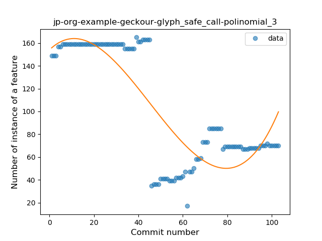
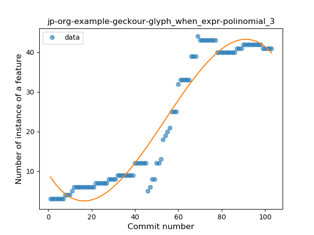
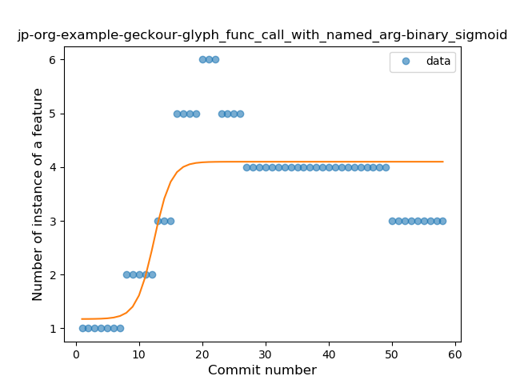

## jp-org-example-geckour-glyph
----
#### Metrics provided by Detekt
* Number of lines of code 4190
* Number of Kotlin files: 32
* Cyclomatic complexity: 625
* Cyclomatic complexity by thousands of lines: 223 

----
**16** features analyzed

*	<a href="#type_inference">Type Inference</a> 
*	<a href="#lambda">Lambda</a> 
*	<a href="#safe_call">Safe Call</a> 
*	<a href="#when_expr">When expression</a> 
*	<a href="#unsafe_call">Unsafe Call</a> 
*	<a href="#companion_object">Companion Object</a> 
*	<a href="#string_template">String Template</a> 
*	<a href="#func_with_default_value">Function with Default Value</a> 
*	<a href="#range_expr">Range Expression</a> 
*	<a href="#data_class">Data Class</a> 
*	<a href="#func_call_with_named_arg">Function call with Named Argument</a> 
*	<a href="#extension_function">Extension Function</a> 
*	<a href="#property_delegation">Property Delegation</a> 
*	<a href="#destructuring_declaration">Destructuring Declaration</a> 
*	<a href="#inline_func">Inline Function</a> 
*	<a href="#coroutine">Coroutine</a> 

### <a name="type_inference">Type Inference</a>
----
#### Functions
* **Instability - Polinomial 3:** )
    * **R_Squared:** 0.77044961
* **Sudden Decline - Exponential:** 
    * **R_Squared:** 0.67096345
* **Constant Decline - Linear:** 
    * **R_Squared:** 0.65782802
* **Sudden Rise Plateau - Logarithm:** 
    * **R_Squared:** -0.0

**Plots** :chart_with_upwards_trend:
-----

### <a name="lambda">Lambda</a>
----
#### Functions
* **Instability - Polinomial 3:** )
    * **R_Squared:** 0.95243889
* **Constant Rise - Linear:** 
    * **R_Squared:** 0.84478386
* **Sudden Rise - Exponential:** 
    * **R_Squared:** 0.85032248
* **Sudden Rise Plateau - Logarithm:** 
    * **R_Squared:** 0.35738712

**Plots** :chart_with_upwards_trend:
-----

### <a name="safe_call">Safe Call</a>
----
#### Functions
* **Instability - Polinomial 3:** )
    * **R_Squared:** 0.7015285
* **Constant Decline - Linear:** 
    * **R_Squared:** 0.56500524
* **Sudden Rise Plateau - Logarithm:** 
    * **R_Squared:** -0.0

**Plots** :chart_with_upwards_trend:
-----

### <a name="when_expr">When expression</a>
----
#### Functions
* **Instability - Polinomial 3:** )
    * **R_Squared:** 0.93787935
* **Constant Rise - Linear:** 
    * **R_Squared:** 0.87129437
* **Sudden Rise - Exponential:** 
    * **R_Squared:** 0.87339245
* **Plateau Sudden Rise - Binary Sigmoid:** 
    * **R_Squared:** 0.50034556
* **Sudden Rise Plateau - Logarithm:** 
    * **R_Squared:** 0.43765517

**Plots** :chart_with_upwards_trend:
-----

### <a name="unsafe_call">Unsafe Call</a>
----
#### Functions
* **Instability - Polinomial 3:** )
    * **R_Squared:** 0.85474723
* **Sudden Decline - Exponential:** 
    * **R_Squared:** 0.75380418
* **Constant Decline - Linear:** 
    * **R_Squared:** 0.74040765
* **Sudden Rise Plateau - Logarithm:** 
    * **R_Squared:** -0.0

**Plots** :chart_with_upwards_trend:
-----

### <a name="companion_object">Companion Object</a>
----
#### Functions
* **Instability - Polinomial 3:** )
    * **R_Squared:** 0.95268459
* **Sudden Rise - Exponential:** 
    * **R_Squared:** 0.88950728
* **Constant Rise - Linear:** 
    * **R_Squared:** 0.86208683
* **Sudden Rise Plateau - Logarithm:** 
    * **R_Squared:** 0.38169532

**Plots** :chart_with_upwards_trend:
-----

### <a name="string_template">String Template</a>
----
#### Functions
* **Instability - Polinomial 3:** )
    * **R_Squared:** 0.82804538
* **Constant Decline - Linear:** 
    * **R_Squared:** 0.74721411
* **Plateau Sudden Decline - Binary Sigmoid:** 
    * **R_Squared:** 0.43596449
* **Sudden Rise Plateau - Logarithm:** 
    * **R_Squared:** -0.0

**Plots** :chart_with_upwards_trend:
-----

### <a name="func_with_default_value">Function with Default Value</a>
----
#### Functions
* **Instability - Polinomial 3:** )
    * **R_Squared:** 0.84359537
* **Sudden Rise Plateau - Logarithm:** 
    * **R_Squared:** 0.77330505
* **Constant Rise - Linear:** 
    * **R_Squared:** 0.40531811

**Plots** :chart_with_upwards_trend:
-----

### <a name="range_expr">Range Expression</a>
----
#### Functions
* **Instability - Polinomial 3:** )
    * **R_Squared:** 0.46437193
* **Sudden Decline - Exponential:** 
    * **R_Squared:** 0.3977681
* **Constant Decline - Linear:** 
    * **R_Squared:** 0.34973833
* **Sudden Rise Plateau - Logarithm:** 
    * **R_Squared:** -0.0

**Plots** :chart_with_upwards_trend:
-----

### <a name="data_class">Data Class</a>
----
#### Functions
* **Plateau Gradual Rise - Sigmoid:** 
    * **R_Squared:** 0.92159922
* **Constant Rise - Linear:** 
    * **R_Squared:** 0.76047672
* **Sudden Rise Plateau - Logarithm:** 
    * **R_Squared:** 0.6766853

**Plots** :chart_with_upwards_trend:
-----

### <a name="func_call_with_named_arg">Function call with Named Argument</a>
----
#### Functions
* **Plateau Sudden Rise - Binary Sigmoid:** 
    * **R_Squared:** 0.68792568
* **Sudden Rise Plateau - Logarithm:** 
    * **R_Squared:** 0.35310032
* **Constant Rise - Linear:** 
    * **R_Squared:** 0.11717

**Plots** :chart_with_upwards_trend:
-----

### <a name="extension_function">Extension Function</a>
----
#### Functions
* **Sudden Rise Plateau - Logarithm:** 
    * **R_Squared:** 0.88287052
* **Constant Rise - Linear:** 
    * **R_Squared:** 0.80351892

**Plots** :chart_with_upwards_trend:
-----

### <a name="property_delegation">Property Delegation</a>
----
#### Functions
* **Instability - Polinomial 3:** )
    * **R_Squared:** 0.82781285
* **Plateau Gradual Rise - Sigmoid:** 
    * **R_Squared:** 0.67953388
* **Sudden Rise Plateau - Logarithm:** 
    * **R_Squared:** 0.39123861
* **Constant Rise - Linear:** 
    * **R_Squared:** 0.14553828

**Plots** :chart_with_upwards_trend:
-----

### <a name="destructuring_declaration">Destructuring Declaration</a>
----
#### Functions
* **Plateau Sudden Decline - Binary Sigmoid:** 
    * **R_Squared:** 0.64356188
* **Constant Decline - Linear:** 
    * **R_Squared:** 0.19364698
* **Sudden Rise Plateau - Logarithm:** 
    * **R_Squared:** -0.0

**Plots** :chart_with_upwards_trend:
-----

### <a name="inline_func">Inline Function</a>
----
#### Functions
* **Plateau Sudden Decline - Binary Sigmoid:** 
    * **R_Squared:** 1.0
* **Constant Decline - Linear:** 
    * **R_Squared:** 0.23639607
* **Sudden Rise Plateau - Logarithm:** 
    * **R_Squared:** -0.0

**Plots** :chart_with_upwards_trend:
-----

### <a name="coroutine">Coroutine</a>
----
#### Functions
* **Constant Rise - Linear:** 
    * **R_Squared:** 0.76898287
* **Sudden Rise - Exponential:** 
    * **R_Squared:** 0.77817495
* **Plateau Gradual Rise - Sigmoid:** 
    * **R_Squared:** 0.78277414
* **Sudden Rise Plateau - Logarithm:** 
    * **R_Squared:** 0.50795841

**Plots** :chart_with_upwards_trend:
-----

