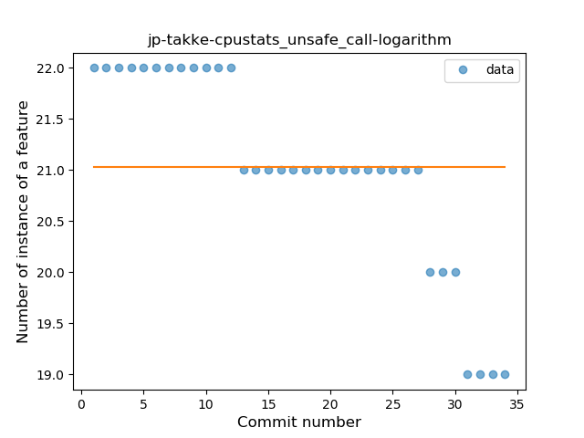

## jp-takke-cpustats
----
#### Metrics provided by Detekt
* Number of lines of code 2522
* Number of Kotlin files: 17
* Cyclomatic complexity: 399
* Cyclomatic complexity by thousands of lines: 364 

----
**5** features analyzed

*	<a href="#type_inference">Type Inference</a> 
*	<a href="#safe_call">Safe Call</a> 
*	<a href="#when_expr">When expression</a> 
*	<a href="#unsafe_call">Unsafe Call</a> 
*	<a href="#string_template">String Template</a> 

### <a name="type_inference">Type Inference</a>
----
#### Functions
* **Instability - Polinomial 3:** )
    * **R_Squared:** 0.89304444
* **Constant Rise - Linear:** 
    * **R_Squared:** 0.73243712
* **Sudden Rise Plateau - Logarithm:** 
    * **R_Squared:** 0.67301851

**Plots** :chart_with_upwards_trend:
-----

### <a name="safe_call">Safe Call</a>
----
#### Functions
* **Plateau Gradual Rise - Sigmoid:** 
    * **R_Squared:** 0.80143246
* **Sudden Rise - Exponential:** 
    * **R_Squared:** 0.75191656
* **Instability - Polinomial 3:** )
    * **R_Squared:** 0.7407357
* **Constant Rise - Linear:** 
    * **R_Squared:** 0.49395822
* **Sudden Rise Plateau - Logarithm:** 
    * **R_Squared:** 0.2753993

**Plots** :chart_with_upwards_trend:
-----

### <a name="when_expr">When expression</a>
----
#### Functions
* **Constant Rise - Linear:** 
    * **R_Squared:** 0.68571429
* **Sudden Rise Plateau - Logarithm:** 
    * **R_Squared:** 0.66975219

**Plots** :chart_with_upwards_trend:
-----

### <a name="unsafe_call">Unsafe Call</a>
----
#### Functions
* **Constant Decline - Linear:** 
    * **R_Squared:** 0.80987901
* **Sudden Rise Plateau - Logarithm:** 
    * **R_Squared:** -0.0

**Plots** :chart_with_upwards_trend:
-----

### <a name="string_template">String Template</a>
----
#### Functions
* **Constant Rise - Linear:** 
    * **R_Squared:** 0.71951046
* **Sudden Rise Plateau - Logarithm:** 
    * **R_Squared:** 0.68183717

**Plots** :chart_with_upwards_trend:
-----

