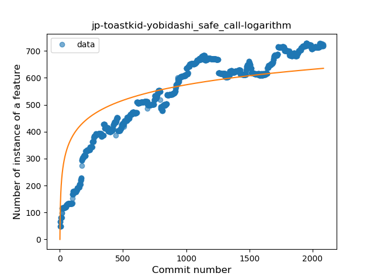
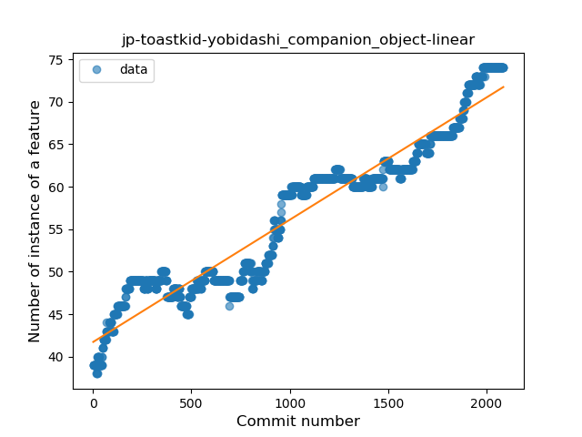
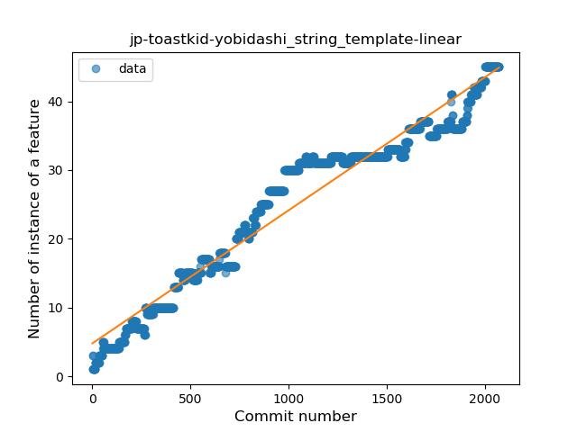
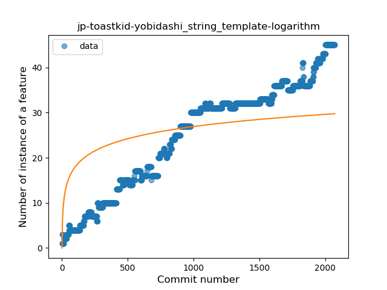
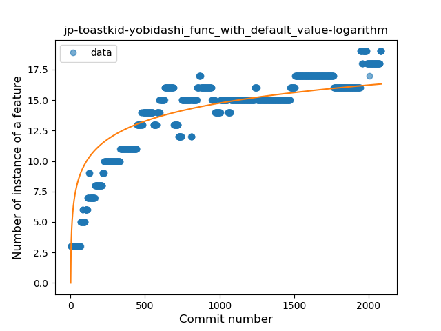
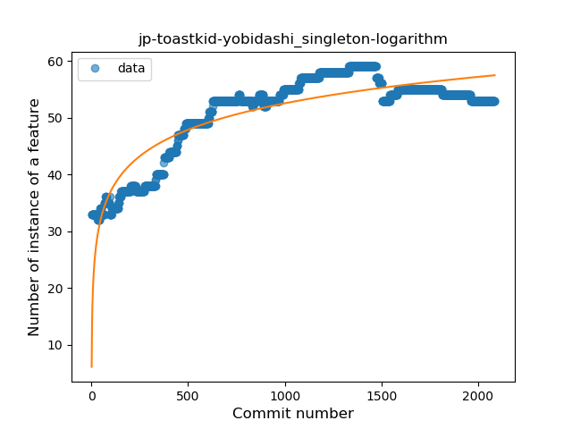
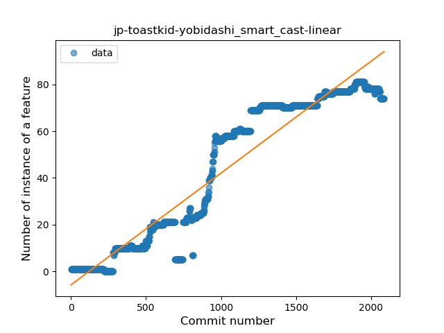
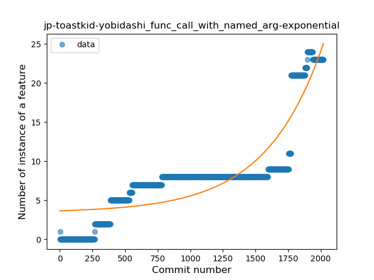

## jp-toastkid-yobidashi
----
#### Metrics provided by Detekt
* Number of lines of code 24361
* Number of Kotlin files: 279
* Cyclomatic complexity: 2420
* Cyclomatic complexity by thousands of lines: 237 

----
**16** features analyzed

*	<a href="#type_inference">Type Inference</a> 
*	<a href="#lambda">Lambda</a> 
*	<a href="#safe_call">Safe Call</a> 
*	<a href="#when_expr">When expression</a> 
*	<a href="#unsafe_call">Unsafe Call</a> 
*	<a href="#companion_object">Companion Object</a> 
*	<a href="#string_template">String Template</a> 
*	<a href="#func_with_default_value">Function with Default Value</a> 
*	<a href="#singleton">Singleton</a> 
*	<a href="#range_expr">Range Expression</a> 
*	<a href="#smart_cast">Smart Cast</a> 
*	<a href="#data_class">Data Class</a> 
*	<a href="#func_call_with_named_arg">Function call with Named Argument</a> 
*	<a href="#property_delegation">Property Delegation</a> 
*	<a href="#inline_func">Inline Function</a> 
*	<a href="#overloaded_op">Overloaded Operator</a> 

### <a name="type_inference">Type Inference</a>
----
#### Functions
* **Sudden Rise - Exponential:** 
    * **R_Squared:** 0.96346058
* **Constant Rise - Linear:** 
    * **R_Squared:** 0.93796636
* **Sudden Rise Plateau - Logarithm:** 
    * **R_Squared:** 0.64630511

**Plots** :chart_with_upwards_trend:
-----

### <a name="lambda">Lambda</a>
----
#### Functions
* **Constant Rise - Linear:** 
    * **R_Squared:** 0.92060655
* **Sudden Rise Plateau - Logarithm:** 
    * **R_Squared:** 0.6908709

**Plots** :chart_with_upwards_trend:
-----

### <a name="safe_call">Safe Call</a>
----
#### Functions
* **Constant Rise - Linear:** 
    * **R_Squared:** 0.81098363
* **Sudden Rise Plateau - Logarithm:** 
    * **R_Squared:** 0.71330755
* **Plateau Sudden Rise - Binary Sigmoid:** 
    * **R_Squared:** 0.37986477

**Plots** :chart_with_upwards_trend:
-----

### <a name="when_expr">When expression</a>
----
#### Functions
* **Constant Rise - Linear:** 
    * **R_Squared:** 0.92551497
* **Sudden Rise Plateau - Logarithm:** 
    * **R_Squared:** 0.6534193

**Plots** :chart_with_upwards_trend:
-----

### <a name="unsafe_call">Unsafe Call</a>
----
#### Functions
* **Sudden Decline - Exponential:** 
    * **R_Squared:** 0.94615514
* **Constant Decline - Linear:** 
    * **R_Squared:** 0.69314047
* **Sudden Rise Plateau - Logarithm:** 
    * **R_Squared:** -0.0

**Plots** :chart_with_upwards_trend:
-----

### <a name="companion_object">Companion Object</a>
----
#### Functions
* **Constant Rise - Linear:** 
    * **R_Squared:** 0.92509936
* **Sudden Rise - Exponential:** 
    * **R_Squared:** 0.93129118
* **Sudden Rise Plateau - Logarithm:** 
    * **R_Squared:** 0.68767748

**Plots** :chart_with_upwards_trend:
-----

### <a name="string_template">String Template</a>
----
#### Functions
* **Constant Rise - Linear:** 
    * **R_Squared:** 0.9492711
* **Sudden Rise Plateau - Logarithm:** 
    * **R_Squared:** 0.47226213
* **Plateau Sudden Rise - Binary Sigmoid:** 
    * **R_Squared:** 0.06490383

**Plots** :chart_with_upwards_trend:
-----

### <a name="func_with_default_value">Function with Default Value</a>
----
#### Functions
* **Sudden Rise Plateau - Logarithm:** 
    * **R_Squared:** 0.77004408
* **Constant Rise - Linear:** 
    * **R_Squared:** 0.69182845

**Plots** :chart_with_upwards_trend:
-----

### <a name="singleton">Singleton</a>
----
#### Functions
* **Sudden Rise Plateau - Logarithm:** 
    * **R_Squared:** 0.78561824
* **Constant Rise - Linear:** 
    * **R_Squared:** 0.58774556

**Plots** :chart_with_upwards_trend:
-----

### <a name="range_expr">Range Expression</a>
----
#### Functions
* **Sudden Rise - Exponential:** 
    * **R_Squared:** 0.30712712
* **Constant Rise - Linear:** 
    * **R_Squared:** 0.06897183
* **Sudden Rise Plateau - Logarithm:** 
    * **R_Squared:** 0.00078315

**Plots** :chart_with_upwards_trend:
-----

### <a name="smart_cast">Smart Cast</a>
----
#### Functions
* **Constant Rise - Linear:** 
    * **R_Squared:** 0.90623825
* **Sudden Rise Plateau - Logarithm:** 
    * **R_Squared:** 0.32262968
* **Plateau Sudden Rise - Binary Sigmoid:** 
    * **R_Squared:** 0.02669787

**Plots** :chart_with_upwards_trend:
-----

### <a name="data_class">Data Class</a>
----
#### Functions
* **Sudden Rise - Exponential:** 
    * **R_Squared:** 0.45570028
* **Constant Rise - Linear:** 
    * **R_Squared:** 0.00804566
* **Sudden Rise Plateau - Logarithm:** 
    * **R_Squared:** -0.0

**Plots** :chart_with_upwards_trend:
-----

### <a name="func_call_with_named_arg">Function call with Named Argument</a>
----
#### Functions
* **Sudden Rise - Exponential:** 
    * **R_Squared:** 0.79482405
* **Constant Rise - Linear:** 
    * **R_Squared:** 0.7074528
* **Sudden Rise Plateau - Logarithm:** 
    * **R_Squared:** 0.25064582

**Plots** :chart_with_upwards_trend:
-----

### <a name="property_delegation">Property Delegation</a>
----
#### Functions
* **Sudden Rise Plateau - Logarithm:** 
    * **R_Squared:** 0.69350012
* **Constant Rise - Linear:** 
    * **R_Squared:** 0.51433225

**Plots** :chart_with_upwards_trend:
-----

### <a name="inline_func">Inline Function</a>
----
#### Functions
* **Sudden Decline - Exponential:** 
    * **R_Squared:** 0.83396016
* **Constant Decline - Linear:** 
    * **R_Squared:** 0.81959291
* **Plateau Sudden Decline - Binary Sigmoid:** 
    * **R_Squared:** 0.06410052
* **Sudden Rise Plateau - Logarithm:** 
    * **R_Squared:** -0.0

**Plots** :chart_with_upwards_trend:
-----

### <a name="overloaded_op">Overloaded Operator</a>
----
#### Functions
* **Constant Rise - Linear:** 
    * **R_Squared:** 0.80886385
* **Sudden Rise Plateau - Logarithm:** 
    * **R_Squared:** 0.66346176

**Plots** :chart_with_upwards_trend:
-----

