## jpeddicord-speedofsound
----
#### Metrics provided by Detekt
* Number of lines of code 1940
* Number of Kotlin files: 13
* Cyclomatic complexity: 195
* Cyclomatic complexity by thousands of lines: 236 

----
**6** features analyzed

*	<a href="#type_inference">Type Inference</a> 
*	<a href="#lambda">Lambda</a> 
*	<a href="#safe_call">Safe Call</a> 
*	<a href="#when_expr">When expression</a> 
*	<a href="#unsafe_call">Unsafe Call</a> 
*	<a href="#string_template">String Template</a> 

### <a name="type_inference">Type Inference</a>
----
#### Functions
* **Instability - Polinomial 3:** )
    * **R_Squared:** 0.72510844
* **Instability - Polinomial 4:** 
    * **R_Squared:** 0.73097966
* **Sudden Decline - Exponential:** 
    * **R_Squared:** 0.6394039
* **Constant Decline - Linear:** 
    * **R_Squared:** 0.61270109
* **Sudden Rise Plateau - Logarithm:** 
    * **R_Squared:** -0.0

**Plots** :chart_with_upwards_trend:
-----

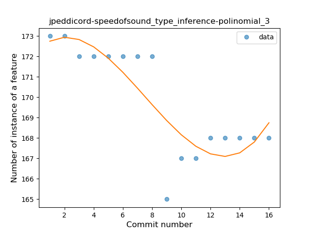
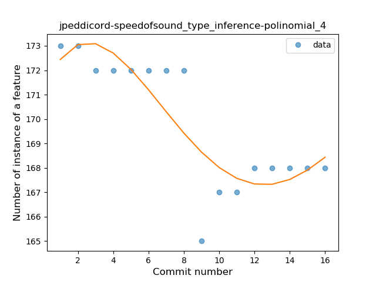
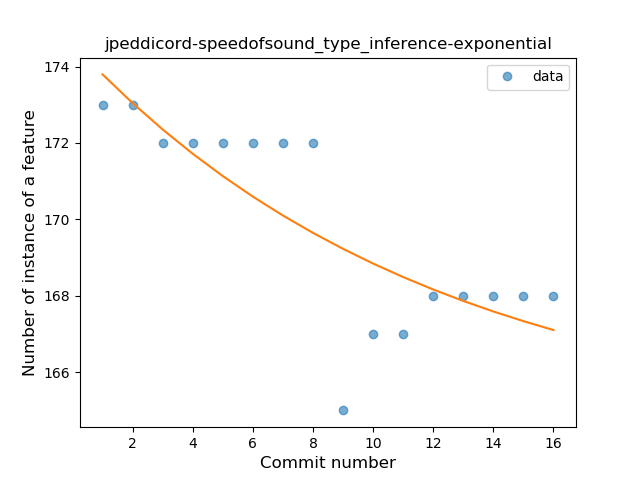
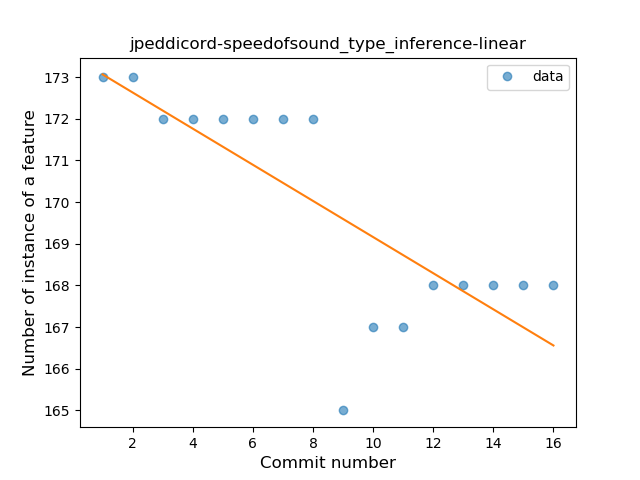
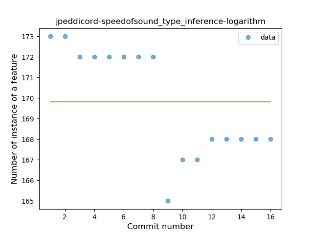
### <a name="lambda">Lambda</a>
----
#### Functions
* **Constant Rise - Linear:** 
    * **R_Squared:** 0.88970588
* **Sudden Rise Plateau - Logarithm:** 
    * **R_Squared:** 0.75210884

**Plots** :chart_with_upwards_trend:
-----

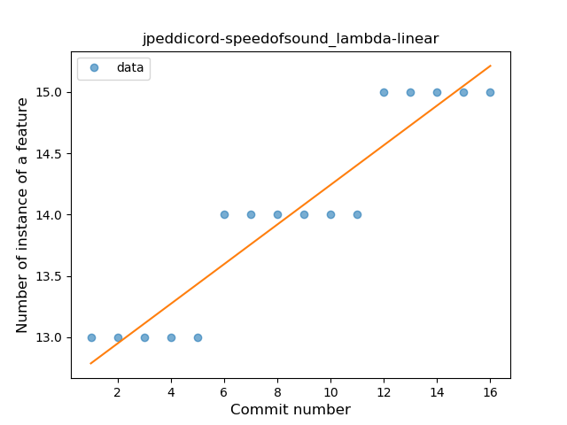
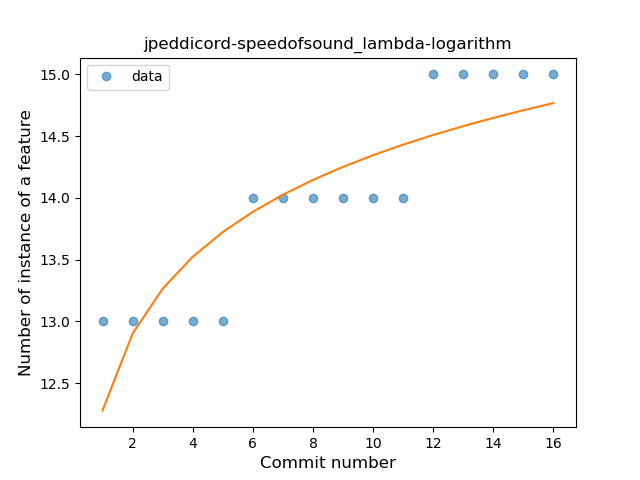
### <a name="safe_call">Safe Call</a>
----
#### Functions
* **Plateau Sudden Rise - Binary Sigmoid:** 
    * **R_Squared:** 1.0
* **Instability - Polinomial 4:** 
    * **R_Squared:** 0.8974359
* **Sudden Rise Plateau - Logarithm:** 
    * **R_Squared:** 0.71421526
* **Constant Rise - Linear:** 
    * **R_Squared:** 0.7

**Plots** :chart_with_upwards_trend:
-----

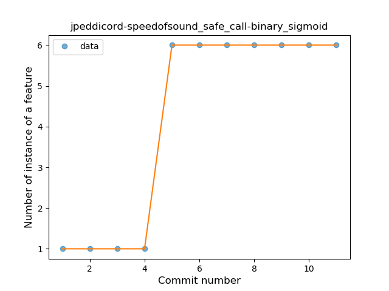
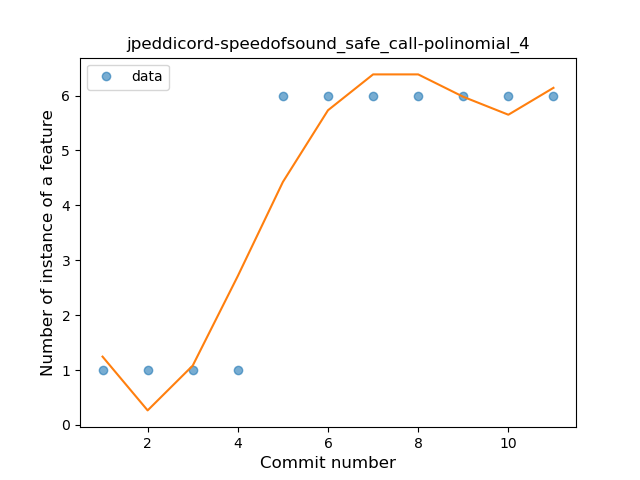
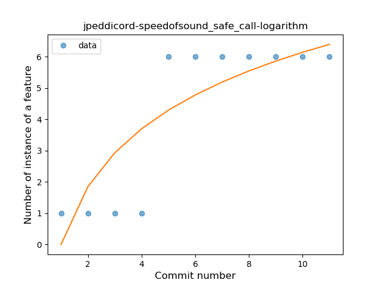

### <a name="when_expr">When expression</a>
----
#### Functions
* **Plateau Sudden Rise - Binary Sigmoid:** 
    * **R_Squared:** 1.0
* **Instability - Polinomial 4:** 
    * **R_Squared:** 0.87354132
* **Instability - Polinomial 3:** )
    * **R_Squared:** 0.85425101
* **Sudden Rise - Exponential:** 
    * **R_Squared:** 0.75445903
* **Constant Rise - Linear:** 
    * **R_Squared:** 0.74117647
* **Sudden Rise Plateau - Logarithm:** 
    * **R_Squared:** 0.53863187

**Plots** :chart_with_upwards_trend:
-----

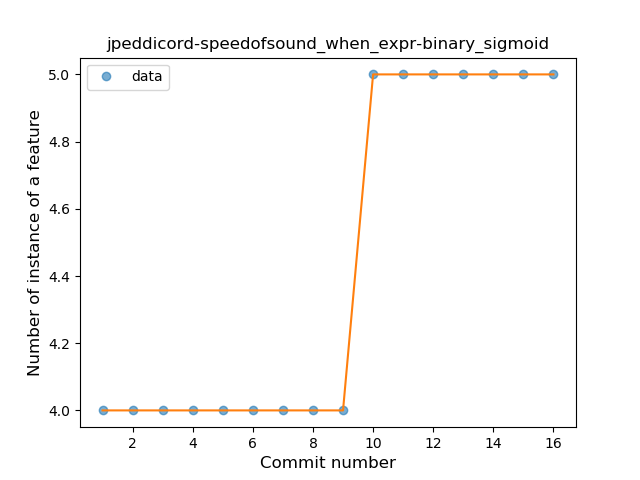
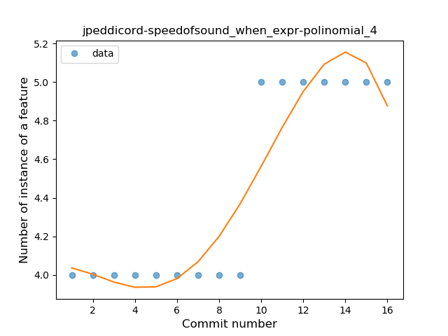
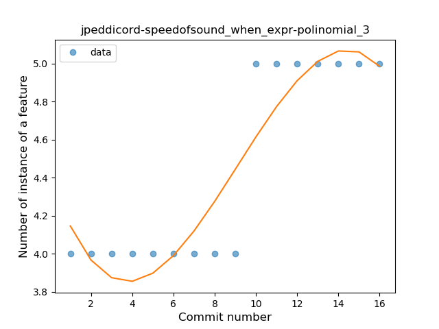
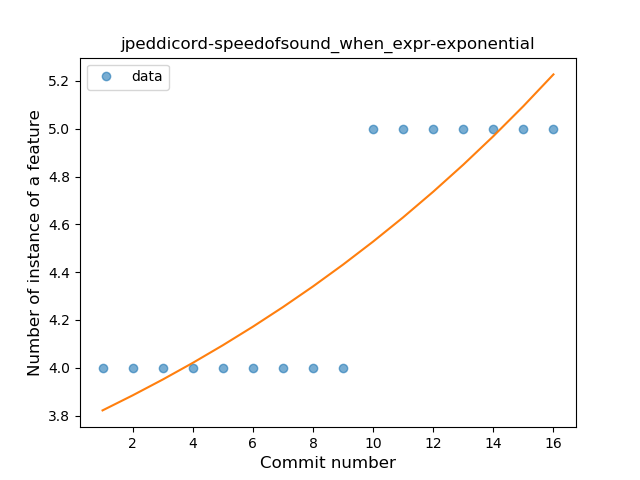
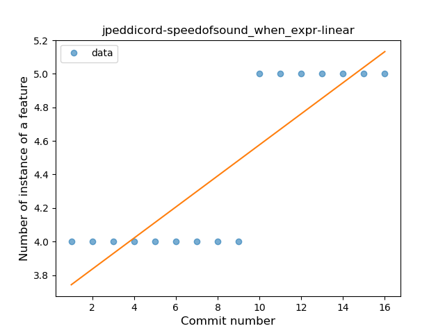
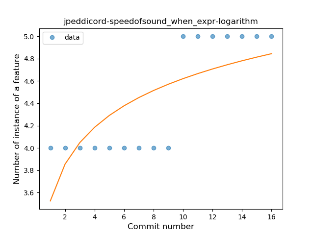
### <a name="unsafe_call">Unsafe Call</a>
----
#### Functions
* **Instability - Polinomial 4:** 
    * **R_Squared:** 0.92043278
* **Sudden Decline - Exponential:** 
    * **R_Squared:** 0.84112119
* **Constant Decline - Linear:** 
    * **R_Squared:** 0.77041989
* **Sudden Rise Plateau - Logarithm:** 
    * **R_Squared:** -0.0

**Plots** :chart_with_upwards_trend:
-----

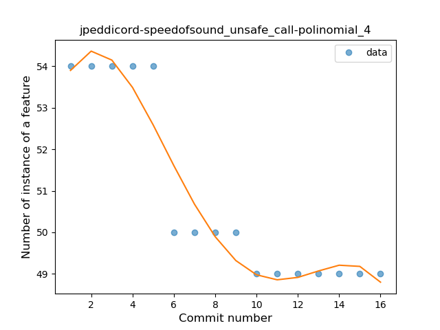
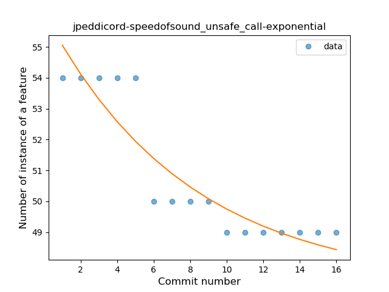
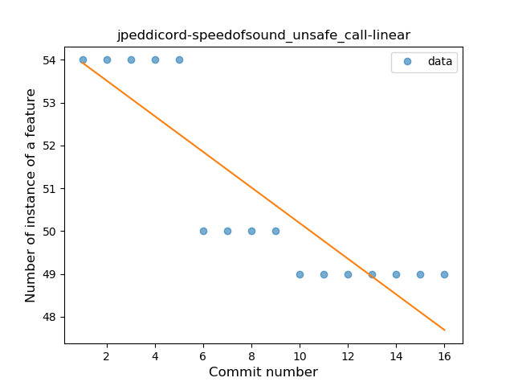
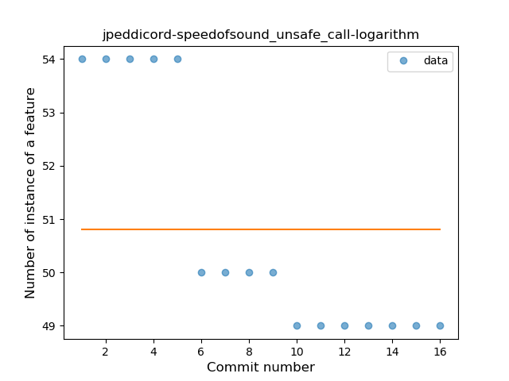
### <a name="string_template">String Template</a>
----
#### Functions
* **Instability - Polinomial 3:** )
    * **R_Squared:** 0.90066771
* **Instability - Polinomial 4:** 
    * **R_Squared:** 0.90966985
* **Constant Rise - Linear:** 
    * **R_Squared:** 0.78649237
* **Sudden Rise - Exponential:** 
    * **R_Squared:** 0.79267235
* **Sudden Rise Plateau - Logarithm:** 
    * **R_Squared:** 0.58955049

**Plots** :chart_with_upwards_trend:
-----

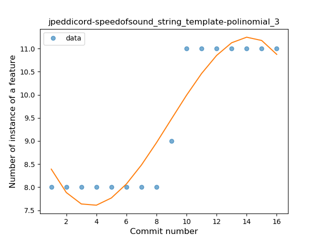

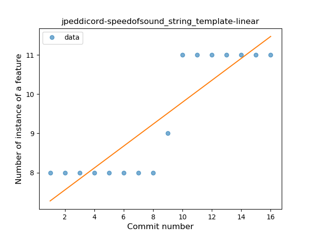
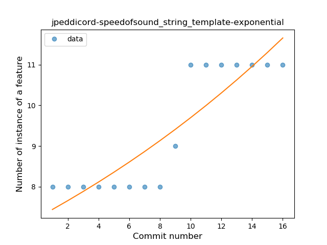
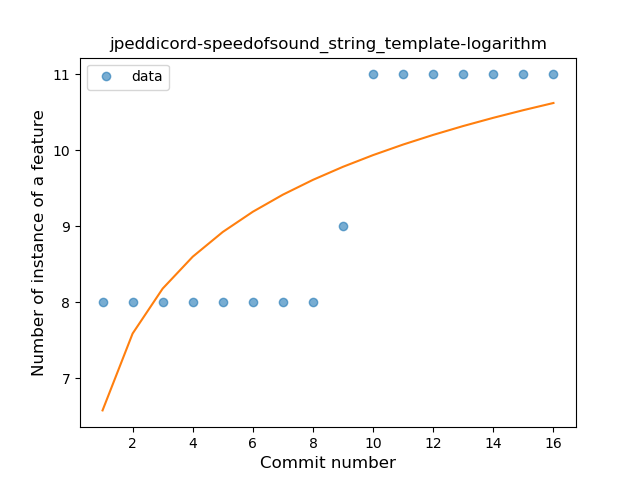
