## jqno-remindermail
----
#### Metrics provided by Detekt
* Number of lines of code 341
* Number of Kotlin files: 6
* Cyclomatic complexity: 56
* Cyclomatic complexity by thousands of lines: 309 

----
**6** features analyzed

*	<a href="#type_inference">Type Inference</a> 
*	<a href="#lambda">Lambda</a> 
*	<a href="#safe_call">Safe Call</a> 
*	<a href="#unsafe_call">Unsafe Call</a> 
*	<a href="#string_template">String Template</a> 
*	<a href="#property_delegation">Property Delegation</a> 

### <a name="type_inference">Type Inference</a>
----
#### Functions
* **Instability - Polinomial 4:** 
    * **R_Squared:** 0.98142973
* **Sudden Rise Plateau - Logarithm:** 
    * **R_Squared:** 0.86564893
* **Constant Rise - Linear:** 
    * **R_Squared:** 0.61684192

**Plots** :chart_with_upwards_trend:
-----

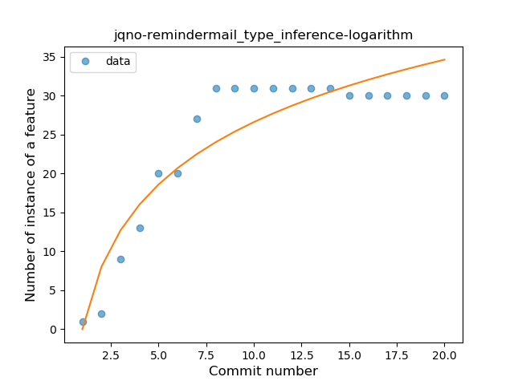
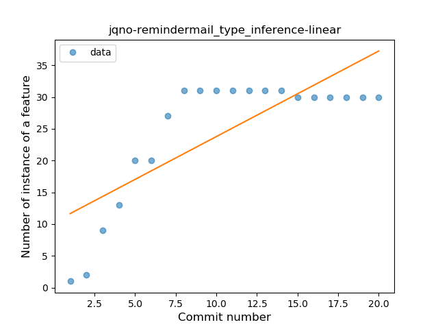
### <a name="lambda">Lambda</a>
----
#### Functions
* **Instability - Polinomial 3:** )
    * **R_Squared:** 0.97236725
* **Instability - Polinomial 4:** 
    * **R_Squared:** 0.9728593
* **Sudden Rise Plateau - Logarithm:** 
    * **R_Squared:** 0.85791368
* **Constant Rise - Linear:** 
    * **R_Squared:** 0.5917043

**Plots** :chart_with_upwards_trend:
-----

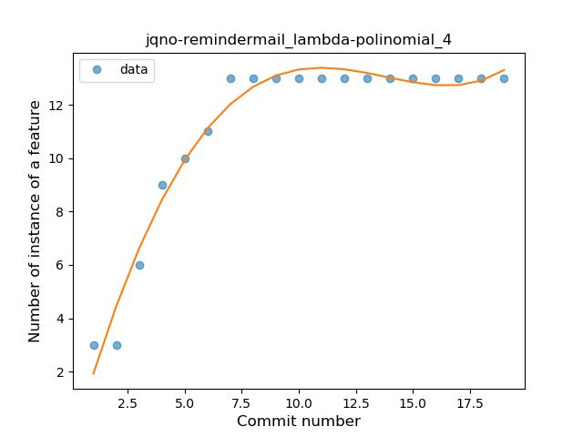
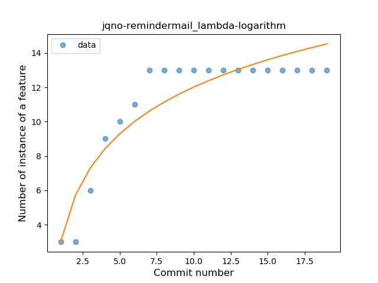
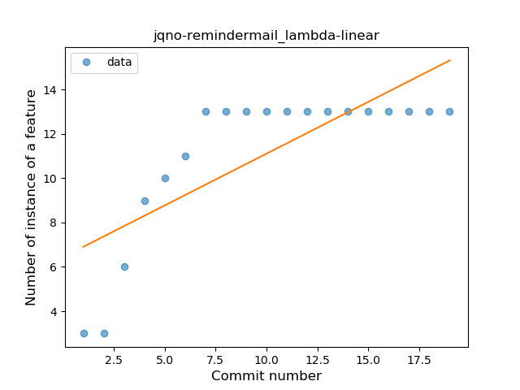
### <a name="safe_call">Safe Call</a>
----
#### Functions
* **Instability - Polinomial 4:** 
    * **R_Squared:** 0.98920184
* **Instability - Polinomial 3:** )
    * **R_Squared:** 0.93292721
* **Sudden Rise Plateau - Logarithm:** 
    * **R_Squared:** 0.71347357
* **Constant Rise - Linear:** 
    * **R_Squared:** 0.38569379

**Plots** :chart_with_upwards_trend:
-----

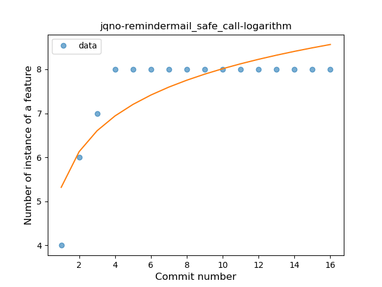
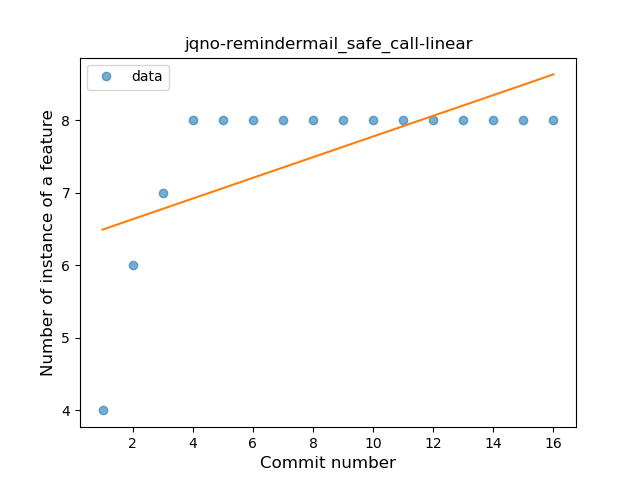
### <a name="unsafe_call">Unsafe Call</a>
----
#### Functions
* **Plateau Gradual Rise - Sigmoid:** 
    * **R_Squared:** 0.98512755
* **Instability - Polinomial 4:** 
    * **R_Squared:** 0.95543774
* **Instability - Polinomial 3:** )
    * **R_Squared:** 0.93509411
* **Sudden Rise Plateau - Logarithm:** 
    * **R_Squared:** 0.73798133
* **Constant Rise - Linear:** 
    * **R_Squared:** 0.4272856

**Plots** :chart_with_upwards_trend:
-----

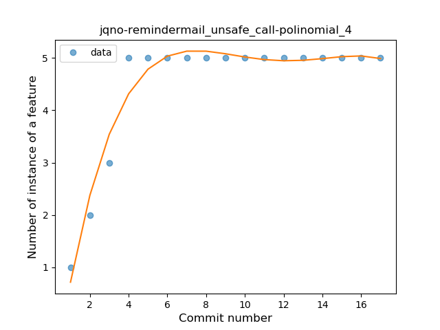
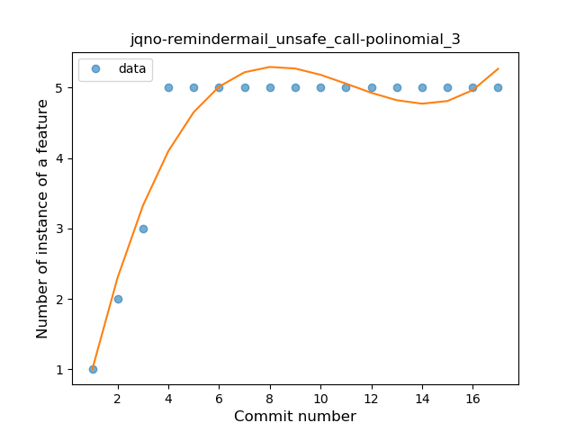

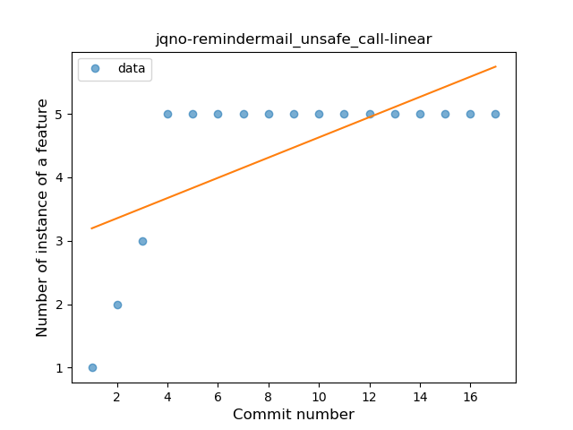
### <a name="string_template">String Template</a>
----
#### Functions
* **Plateau Sudden Rise - Binary Sigmoid:** 
    * **R_Squared:** 1.0
* **Instability - Polinomial 4:** 
    * **R_Squared:** 0.85242518
* **Instability - Polinomial 3:** )
    * **R_Squared:** 0.8121775
* **Sudden Rise Plateau - Logarithm:** 
    * **R_Squared:** 0.60343625
* **Constant Rise - Linear:** 
    * **R_Squared:** 0.32941176

**Plots** :chart_with_upwards_trend:
-----

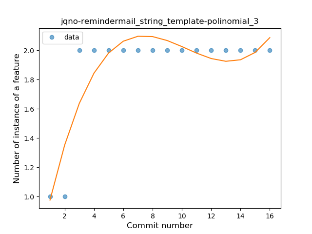
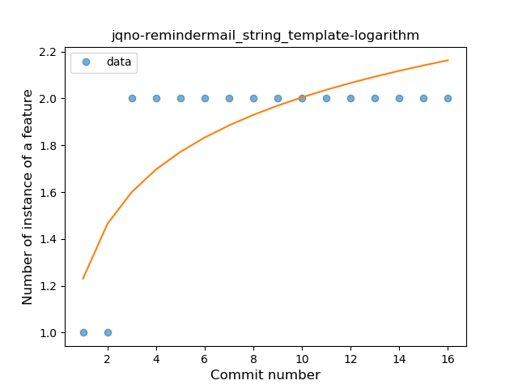
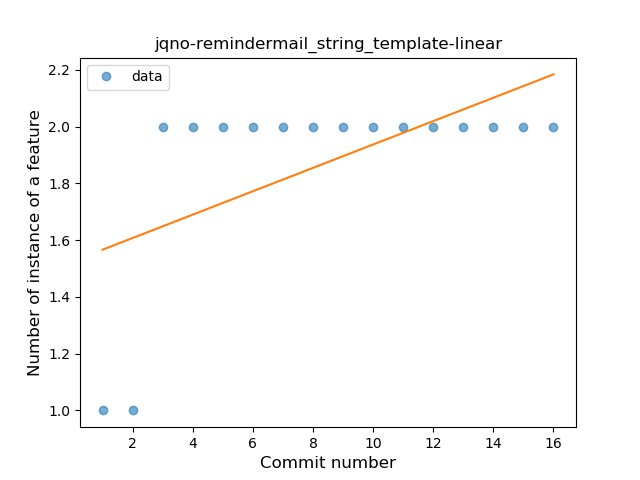
### <a name="property_delegation">Property Delegation</a>
----
#### Functions
* **Plateau Sudden Rise - Binary Sigmoid:** 
    * **R_Squared:** 1.0
* **Instability - Polinomial 3:** )
    * **R_Squared:** 0.82894737
* **Sudden Rise Plateau - Logarithm:** 
    * **R_Squared:** 0.67842628
* **Constant Rise - Linear:** 
    * **R_Squared:** 0.4375

**Plots** :chart_with_upwards_trend:
-----

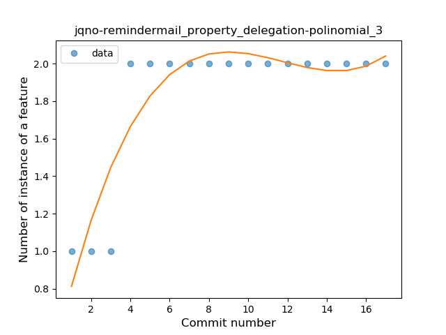
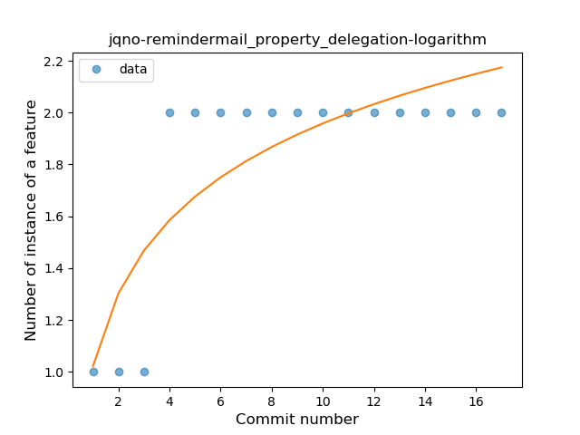
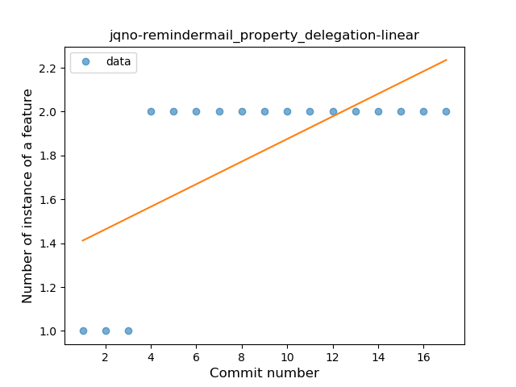
