## juha-h-baresip-studio
----
#### Metrics provided by Detekt
* Number of lines of code 4635
* Number of Kotlin files: 28
* Cyclomatic complexity: 920
* Cyclomatic complexity by thousands of lines: 293 

----
**10** features analyzed

*	<a href="#type_inference">Type Inference</a> 
*	<a href="#lambda">Lambda</a> 
*	<a href="#when_expr">When expression</a> 
*	<a href="#companion_object">Companion Object</a> 
*	<a href="#unsafe_call">Unsafe Call</a> 
*	<a href="#string_template">String Template</a> 
*	<a href="#func_with_default_value">Function with Default Value</a> 
*	<a href="#singleton">Singleton</a> 
*	<a href="#range_expr">Range Expression</a> 
*	<a href="#func_call_with_named_arg">Function call with Named Argument</a> 

### <a name="type_inference">Type Inference</a>
----
#### Functions
* **Constant Rise - Linear:** 
    * **R_Squared:** 0.94590682
* **Sudden Rise Plateau - Logarithm:** 
    * **R_Squared:** 0.72810583
* **Plateau Sudden Rise - Binary Sigmoid:** 
    * **R_Squared:** 0.57345104

**Plots** :chart_with_upwards_trend:
-----

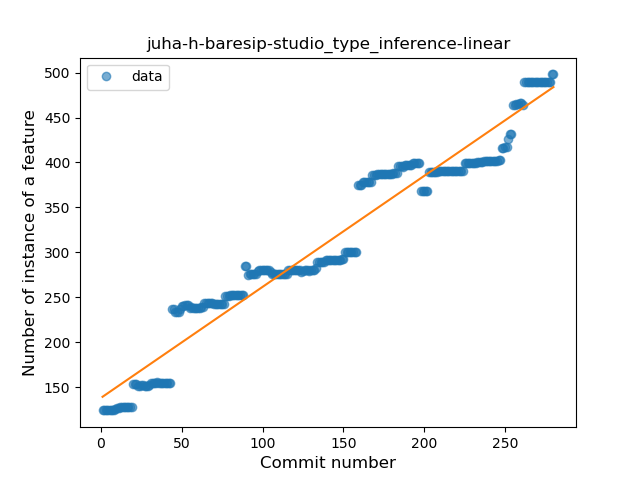
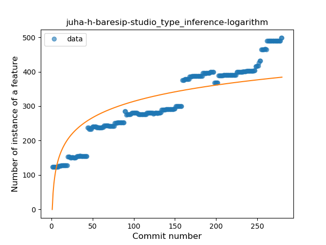
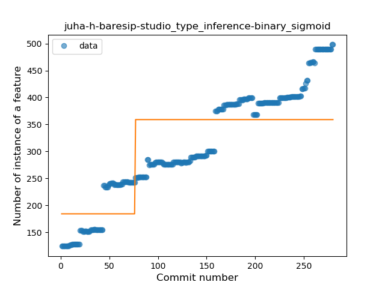
### <a name="lambda">Lambda</a>
----
#### Functions
* **Sudden Rise Plateau - Logarithm:** 
    * **R_Squared:** 0.70794313
* **Constant Rise - Linear:** 
    * **R_Squared:** 0.66179635

**Plots** :chart_with_upwards_trend:
-----

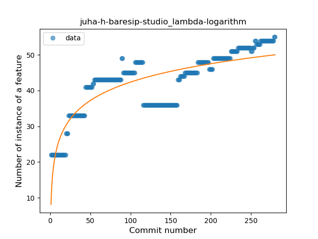
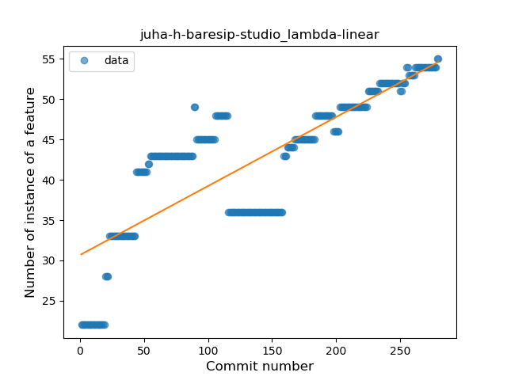
### <a name="when_expr">When expression</a>
----
#### Functions
* **Constant Rise - Linear:** 
    * **R_Squared:** 0.80971465
* **Sudden Rise Plateau - Logarithm:** 
    * **R_Squared:** 0.66217834

**Plots** :chart_with_upwards_trend:
-----

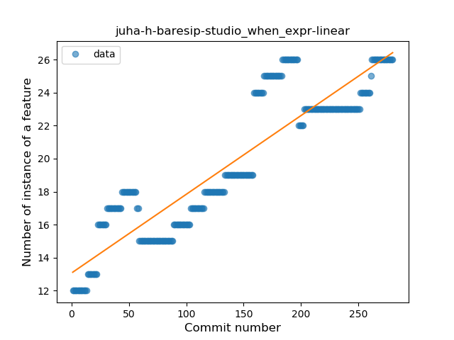
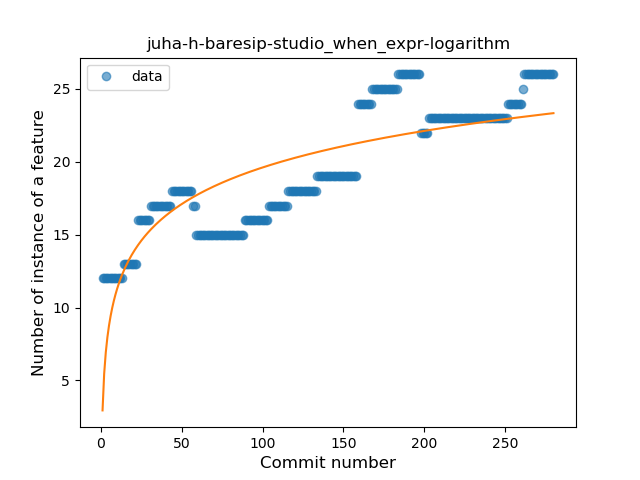
### <a name="companion_object">Companion Object</a>
----
#### Functions
* **Plateau Gradual Rise - Sigmoid:** 
    * **R_Squared:** 0.96128117
* **Constant Rise - Linear:** 
    * **R_Squared:** 0.85264397
* **Sudden Rise Plateau - Logarithm:** 
    * **R_Squared:** 0.79565654

**Plots** :chart_with_upwards_trend:
-----

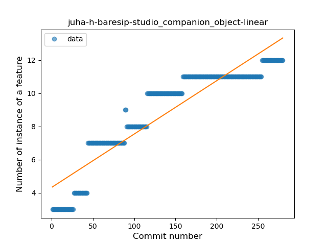
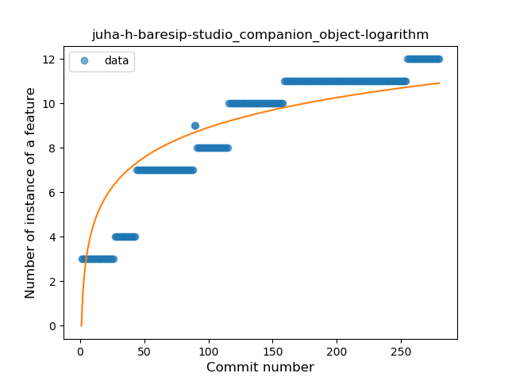
### <a name="unsafe_call">Unsafe Call</a>
----
#### Functions
* **Sudden Decline - Exponential:** 
    * **R_Squared:** 0.31120237
* **Constant Decline - Linear:** 
    * **R_Squared:** 0.08182033
* **Sudden Rise Plateau - Logarithm:** 
    * **R_Squared:** -0.0

**Plots** :chart_with_upwards_trend:
-----

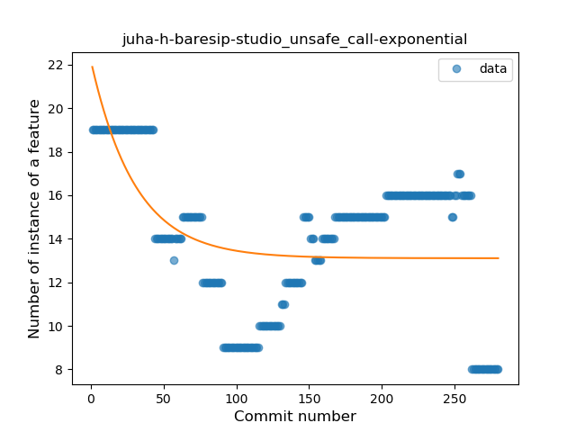

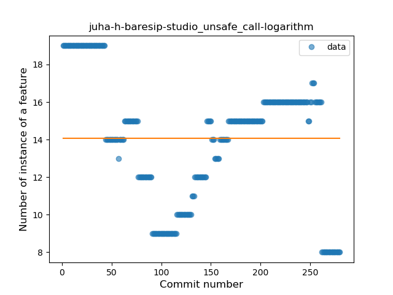
### <a name="string_template">String Template</a>
----
#### Functions
* **Constant Rise - Linear:** 
    * **R_Squared:** 0.76216435
* **Sudden Rise Plateau - Logarithm:** 
    * **R_Squared:** 0.70364486
* **Plateau Sudden Rise - Binary Sigmoid:** 
    * **R_Squared:** 0.65752013

**Plots** :chart_with_upwards_trend:
-----

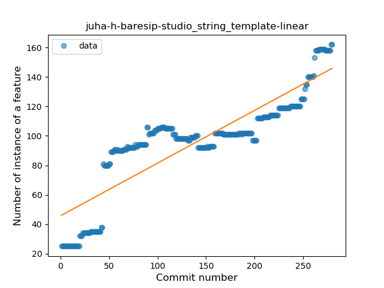
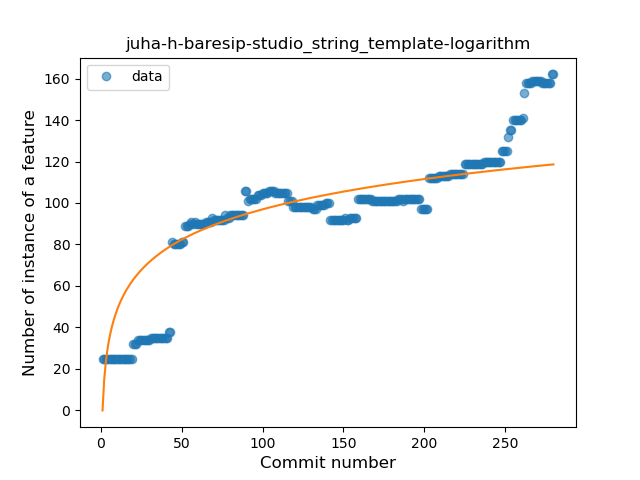
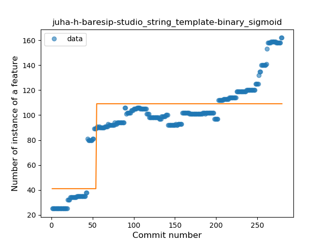
### <a name="func_with_default_value">Function with Default Value</a>
----
#### Functions
* **Plateau Sudden Decline - Binary Sigmoid:** 
    * **R_Squared:** 1.0
* **Instability - Polinomial 3:** )
    * **R_Squared:** 0.86146927
* **Constant Decline - Linear:** 
    * **R_Squared:** 0.75111111
* **Sudden Rise Plateau - Logarithm:** 
    * **R_Squared:** -0.0

**Plots** :chart_with_upwards_trend:
-----

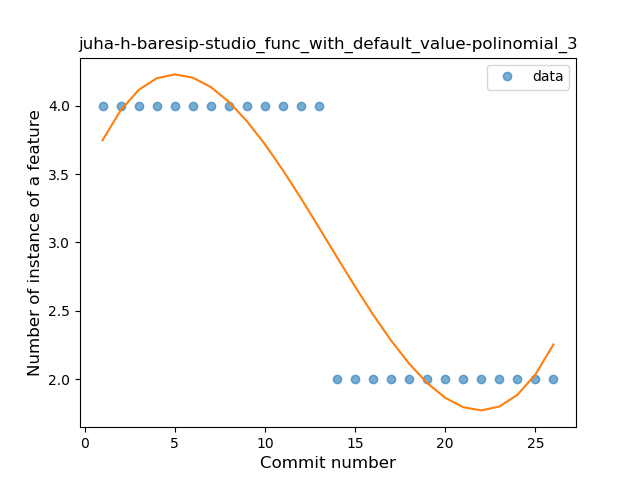
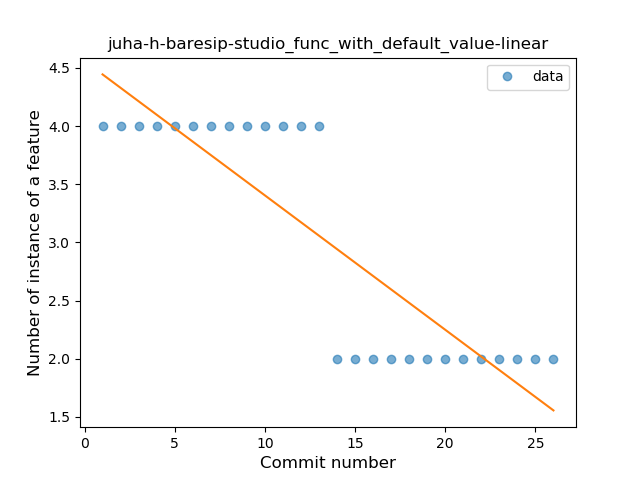
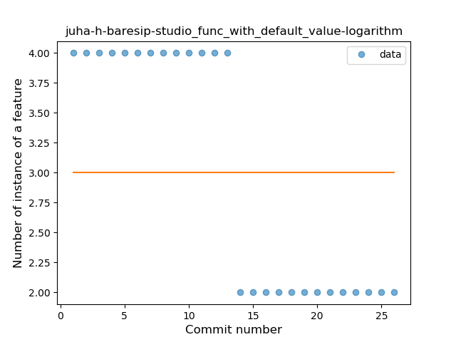
### <a name="singleton">Singleton</a>
----
#### Functions
* **Plateau Sudden Rise - Binary Sigmoid:** 
    * **R_Squared:** 1.0
* **Constant Rise - Linear:** 
    * **R_Squared:** 0.72609345
* **Sudden Rise Plateau - Logarithm:** 
    * **R_Squared:** 0.56810771

**Plots** :chart_with_upwards_trend:
-----

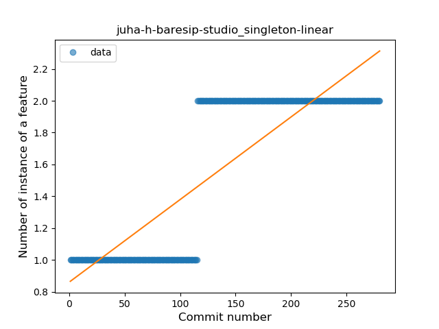
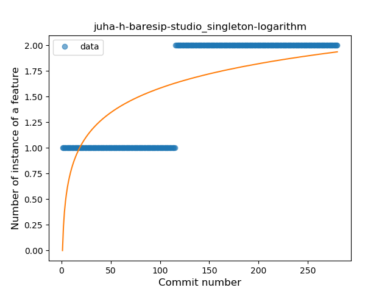
### <a name="range_expr">Range Expression</a>
----
#### Functions
* **Plateau Sudden Rise - Binary Sigmoid:** 
    * **R_Squared:** 0.19612591
* **Constant Decline - Linear:** 
    * **R_Squared:** 0.12103925
* **Sudden Rise Plateau - Logarithm:** 
    * **R_Squared:** 0.00027804

**Plots** :chart_with_upwards_trend:
-----

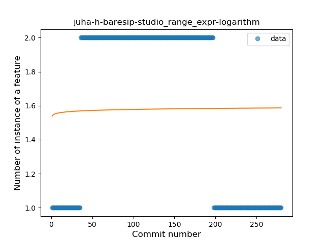
### <a name="func_call_with_named_arg">Function call with Named Argument</a>
----
#### Functions
* **Plateau Sudden Rise - Binary Sigmoid:** 
    * **R_Squared:** 1.0
* **Sudden Rise Plateau - Logarithm:** 
    * **R_Squared:** 0.42777014
* **Constant Rise - Linear:** 
    * **R_Squared:** 0.12541806

**Plots** :chart_with_upwards_trend:
-----

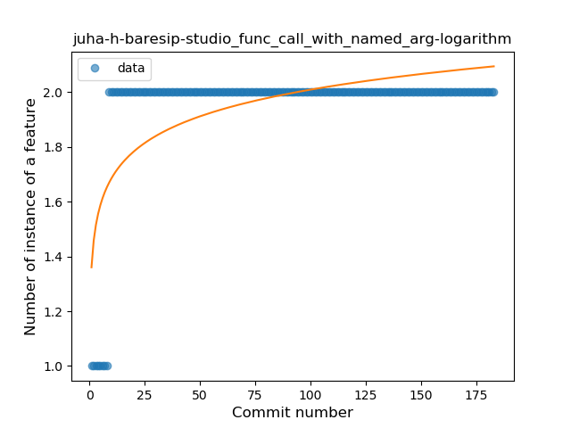
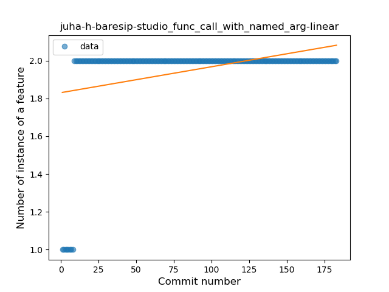
